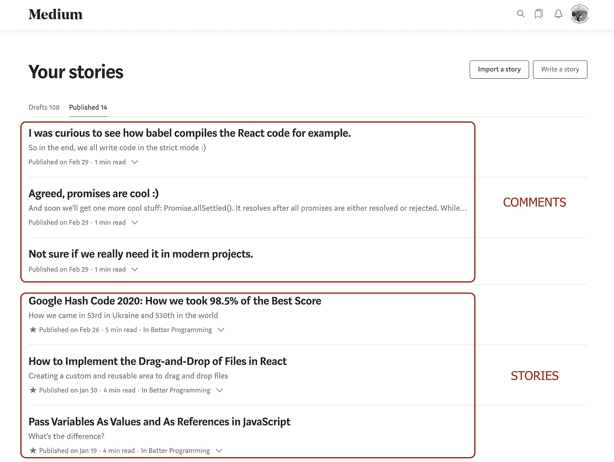
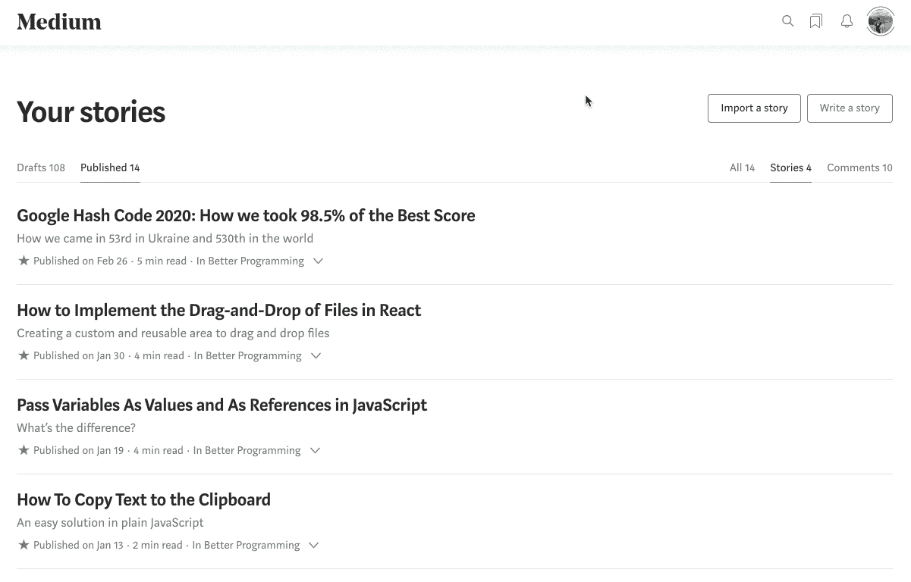

# 我如何构建一个 Chrome 扩展来解决 Medium 的“评论是一个故事”问题

> 原文：<https://betterprogramming.pub/how-i-resolved-comment-is-a-story-issue-on-medium-28ffb193bd90>

## 一个简单而优雅的解决方案，可以帮助很多媒体作者

西蒙·马辛格在 [Unsplash](https://unsplash.com?utm_source=medium&utm_medium=referral) 上拍摄的照片

# **什么是“评论是一个故事”？**

如果你曾经试图在媒体上写故事，你很可能知道这个问题。

你对某人故事的所有评论实际上都是故事本身。

从某种角度来说，这是有意义的，因为你的评论可以收集喜欢和看法，并可以作为自己的网页搜索引擎可见。

但是当你打开你的故事列表，看到你所有的评论都混在同一个有故事的列表里，又没有办法过滤的时候，就带来了很多不便。

# 我设法找到的解决方案

因为我是一名软件工程师，所以当我面临一个问题时，我会尝试使用信息技术来解决它。

这是我找到的解决这个问题的方法。我创建了一个 Chrome 扩展，它将在“你的故事”页面上添加额外的过滤器，允许选择要显示的项目:故事、评论或两者都有。

这是我的 [Chrome 扩展](https://chrome.google.com/webstore/detail/medium-stories/lokncfhfamceglahdpmlphafpejonebp)。

我知道这个解决方案有几个小问题:

*   它将确定一个项目是一个故事，只有当它被媒体策展人批准或添加到出版物中，因为我没有找到任何其他方法来区分它们。
*   该菜单将只显示可见项目的数量，因为我不能在它加载之前确定项目类型。

但这是我迄今为止实现的最好的一个。

希望我的扩展对你有用！