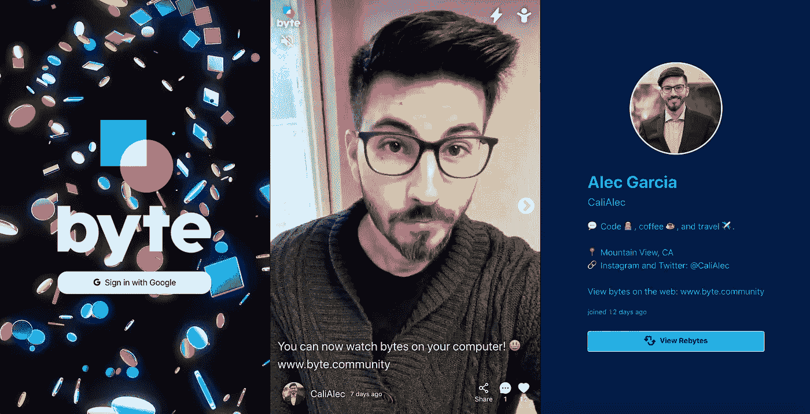
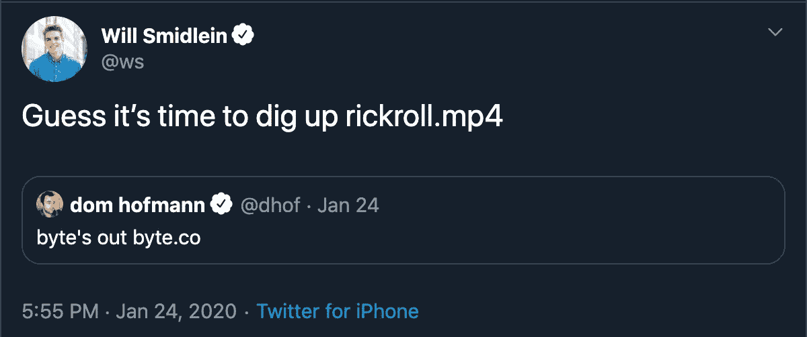
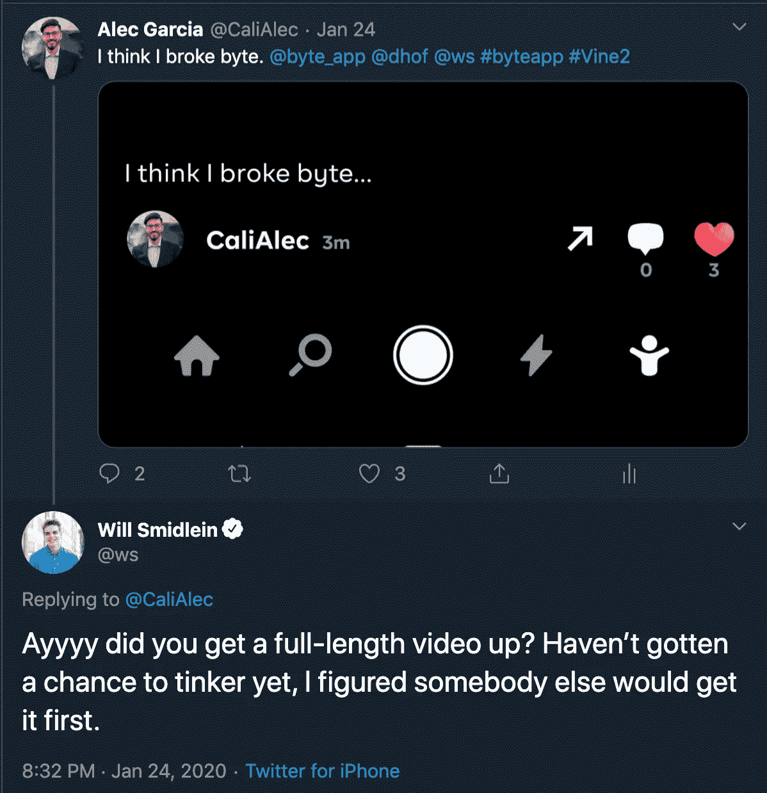
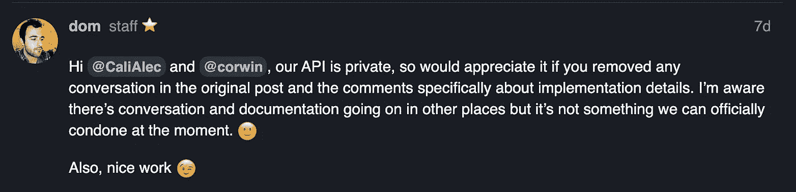
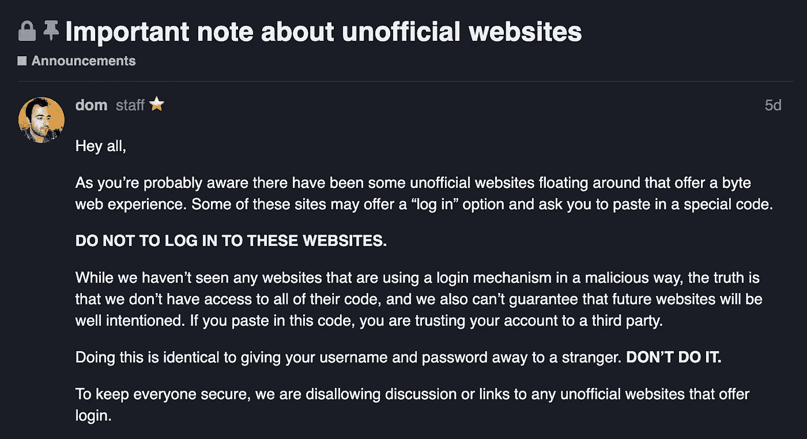
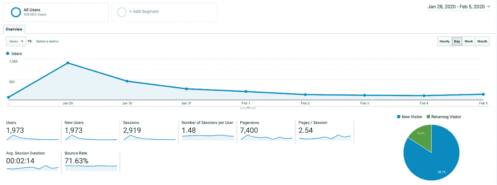
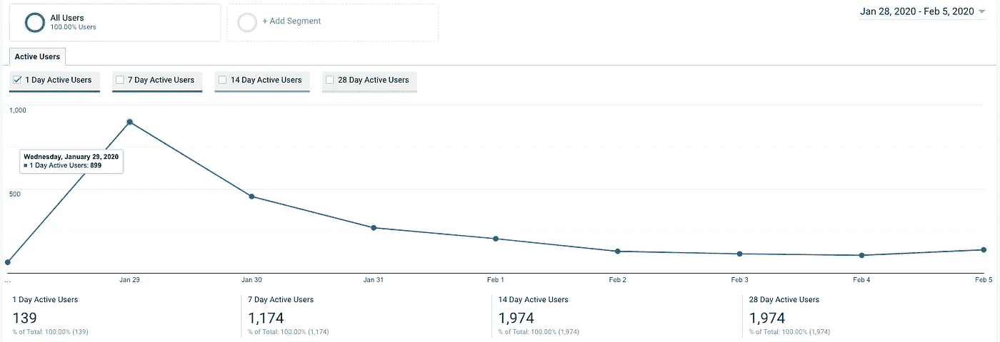

# 我如何对 Byte 进行逆向工程并创建了我自己的 Byte Web 应用程序

> 原文：<https://betterprogramming.pub/how-i-reverse-engineered-byte-and-created-my-own-byte-web-app-2828f5520b25>

## 当 Byte 发现后发生了什么

我创建的非官方网络应用上的[我的字节简介](https://www.byte.community/user/CaliAlec)的截图

来自 Vine 联合创始人 Dom Hofmann 的新应用 [Byte](https://byte.co/) ，已经在 Android 和 iOS 上发布。这是一个我如何对 Byte 进行逆向工程，将其移动应用功能移植到网络上，并非正式地实现其用户强烈要求的一个缺失功能的故事。

你可以在这里查看我建造的。

代码在 [GitHub](https://github.com/CaliAlec/Byte-Community) 上开源。

# 序言——维恩和抖音

还记得[藤蔓](https://en.wikipedia.org/wiki/Vine_(service))吗？你知道，那个叫*的应用是*许多标志性迷因[的开端](https://www.vulture.com/2016/10/best-and-funniest-vines.html)并挑战人们在六秒钟的限制内发挥创造力，通常是在有人大喊“为了藤蔓而做”之后

Vine 在 2013-2016 年的生命周期中，其峰值用户超过 2 亿。Twitter 最终在收购 Vine 后关闭了它，从那以后[抖音](https://www.tiktok.com/)基本上成了它的继任者。

抖音正在迅速成为当今最受欢迎的视频应用之一，它与 Vine 相似，都是由于病毒趋势而创造了无数的模因。抖音的天才特色之一是一个巨大的音乐目录，创作者可以在他们的视频中使用。抖音用户甚至可以从其他用户的视频中重新利用音频，并以自己的创造性方式进行混音。这些混搭变成了病毒式的趋势，让你探索不同视角的展示，这些展示都有相同的前提。

## Vine 的趋势与抖音的趋势

抖音的各种趋势都围绕着流行标签或音频。要浏览抖音的视频，你可以通过一个特定的标签——比如臭名昭著的# renegade dance——或者一个特定的声音字节来完美地描绘视频的氛围。

Vine 有不同的类别供用户在发布视频时选择，如动物、艺术、喜剧、体育等。这些类别允许用户进入特定类型的视频，并向下滚动无尽的相关内容，因为这些视频只有 6 秒或更短，很容易迷失在循环中，花费不健康的时间来消耗它们。

抖音一开始是——现在仍然是——一个简短的视频应用。最初的限制是 15 秒，但后来增加到 60 秒。这些短片的精彩之处在于，它们迎合了我们不断缩小的注意力范围，同时给我们带来了我们渴望的多巴胺。

## 抖音的增长战略:水印和分享链接

我认为抖音发展如此迅速的最大原因之一是他们视频上的水印。

在抖音允许复制视频链接之前，如果用户想分享视频，他们只能将视频下载/导出到其他平台。导出的视频将包含一个抖音动画标志的水印，它将在视频的角落里跳跃——这真正引起了人们对抖音品牌的注意。

在脸书和推特等其他社交平台上分享抖音视频的人，肯定会看到视频上的抖音水印，想知道这是什么，然后继续查找，甚至下载应用程序来检查。

最近，抖音创建了一个极简主义的网络应用程序，允许你探索抖音的热门视频和用户。网络应用的加入为用户提供了一种无需发送视频就能分享 TikToks 的方式。你可以将抖音的链接分享给朋友，如果他们安装了应用程序，它会在他们的应用程序中深度链接并播放视频(或者他们可以在抖音网络应用程序上观看视频，甚至不需要该应用程序)。

# Byte —藤蔓重生

输入[字节](https://byte.co/)。Vine 的联合创始人 Dom Hofmann，[于 2020 年 1 月 24 日推出了 Byte](https://twitter.com/dhof/status/1220864537437581312)—[Vine 首次发布](http://blog.twitter.com/en_us/a/2013/vine-a-new-way-to-share-video.html)整整七年后。在某种程度上，Byte 是 Vine 的重生，但这一次它的主要焦点是创作者以及如何为他们创作的内容提供补偿。Byte 和 Vine 有相同的六秒时间限制和分类系统来发现内容。

Byte 早在 2018 年初就已经开始开发，当时[被称为 V2](https://techcrunch.com/2018/01/23/how-vine-2-works/) (不是 Vine 2)。最近，它有了一个测试程序。在 Byte 公开发布后，用户抱怨该应用程序感觉有点过于简约，用户期待的许多功能都不见了，比如分享视频链接。

# 我对字节逆向工程的启发

当 Vine 首次在 Android 上发布时，一个名叫 Will Smidlein 的 16 岁男孩设法绕过了 6 秒钟的限制，将完整长度的 rickroll 视频上传到 Vine 。他发了一条[推文](https://twitter.com/ws/status/341685438983061505)说，“我想我弄断了藤蔓。”

当 Byte 出来的时候，我看到威尔[发了一条看起来像是笑话的推特——他将再次表演同样的特技，并将完整长度的 rickroll 视频上传到 Byte。所以我对自己说，“嗯，我想知道我是否也能做到。”所以我一下载了 Byte，就开始四处打探，看能不能找到什么可以玩的东西。](https://twitter.com/ws/status/1220887870505795585)

Will 的推文引用了他最初在 Vine 上发布的 rickroll 视频

# 我如何逆向工程和破解字节

我以前有过逆向工程应用程序的经验，事实上，我实际上逆向工程了另一个名为 [Peach](https://peach.cool/) 的应用程序，它是 Dom Hofmann 在 Vine 之后 Byte 之前创建的——所以没过多久我就在如何复制 Will 臭名昭著的 rickrolling 方面有了线索。

我从手机上传了一段测试视频给 Byte，通过使用[Charles](https://www.charlesproxy.com/)拦截网络请求，我能够弄清楚 Byte 是如何上传视频到他们的服务器的。

因为我已经捕获了网络请求的会话，所以我能够轻松地重复请求并更改参数。所以我把视频文件和 rickroll 的视频进行了交换，并试着上传，但是，令我沮丧的是，它不起作用。视频上传成功，但不知何故，Byte 的系统阻止了它的发布。

嗯，我们第一次并不总是做得很完美，所以我压缩了视频后又试了一次，瞧。完整长度的 rickroll 视频在 Byte 上发布和直播。在撰写本文时，rickroll 字节仍在运行，您可以在此处查看[。](https://byte.co/b/6blMOkVRW00)

我的推文是对威尔最初的推文[的回调:“我想我弄断了藤蔓。”](https://twitter.com/ws/status/341685438983061505)

当然，字节必须从过去吸取教训，并预测人们会试图滥用上传功能，对不对？嗯，他们可能已经采取了一些安全措施来应对这种情况，但他们有太多其他事情需要关注，而不是关注像我这样有太多空闲时间甚至没有时间尝试做任何事情的人的每一个边缘情况。

# 在我摇了 Byte 之后，还能做什么呢？

所以我玩得很开心，在威尔还没来得及上场之前，我就成功阻止了他以 2 比 0 领先，但我还能做什么呢？

正如我之前提到的，我对 Dom 之前的应用 Peach 进行了逆向工程。Peach 是一个社交网络，专注于分享给你的好友。它非常简约，允许你分享亲密的时刻，比如你的位置，你正在听的歌曲，你一天的步数，甚至你手机的电池百分比。

我[写了一篇文章](https://medium.com/@calialec/fame-and-the-giant-peach-how-to-become-peach-famous-overnight-a90ff2fe9714)关于我在 Peach 上运行的一个实验，该实验假设 Peach 用户更关心获得随机的陌生人作为关注者，而不是与他们最亲密的朋友联系和分享。我写了一个脚本，向尽可能多的 Peach 用户发送好友请求，大多数用户甚至不知道我是谁就接受了我的请求。我做这个实验是为了好玩，所以当 Peach 重设我的帐户，我失去了所有的追随者，我对此没意见。

我不想重复我在 Peach 上做的事情，并编写一个喜欢视频并在 Byte 上关注用户的机器人(尽管事实证明，许多其他人确实这样做了)，所以我思考我还可以做些什么来帮助 Byte 摆脱困境，而不是用垃圾邮件骚扰他们。经过一番思考，我意识到 Byte 没有像抖音那样让用户分享视频链接的方法。就在这个时候，我决定为 Byte 开发一个网络应用，给用户一个非官方的方式来分享他们 Byte 视频的链接。

当 Instagram Stories 第一次出现时，它只能在移动应用程序上使用，而不能在网络上使用，所以我[开发了一个 Chrome 扩展](https://medium.com/@calialec/chrome-ig-story-bribing-the-instagram-story-api-with-cookies-c813e6dff911)，可以在网络上观看 IG Stories。尽管 Chrome 扩展版[让我的个人脸书和 Instagram 账户因违反脸书的 ToS 而被封禁了六个月](https://blog.usejournal.com/the-story-of-how-my-fb-ig-story-side-projects-got-me-banned-from-facebook-and-instagram-112f29119bdb)，但对我来说它仍然是值得的，因为它拥有超过 100 万喜欢它的用户，而且对我个人来说，开发出这么多人喜欢的东西是值得的。

# 我如何创建我自己的字节网络应用程序

我看到一些 Byte 用户的评论，他们抱怨不能分享他们 Byte 的链接，而是必须导出并发送视频。

这些评论证实了我为 Byte 构建 web 体验的决定，我挑战自己，看看我能以多快的速度构建它。Byte 是在一个周五发布的，那个周末我在一个黑客马拉松式的喝咖啡的隔离环境中度过，用我那有毛病的 MacBook Pro 蝴蝶键尽可能快地编码。

## 前端

我使用 [Create React App](https://github.com/facebook/create-react-app) 引导我的 web 应用，并使用 [React Slick](https://github.com/akiran/react-slick) 等库来模拟 Byte/抖音用于视频馈送的滑动垂直转盘。

我反编译了 Byte Android 应用程序，并提取了一些资产，这样 web 应用程序看起来就像移动应用程序一样。由于 [CORS](https://developer.mozilla.org/en-US/docs/Web/HTTP/CORS) 政策，浏览器的获取 API 不能直接调用 Byte 的私有 API，所以我必须创建一个后端服务器来代理请求。

我创建了一个简单的 Express 服务器来代理 API 请求，因此我的 React 应用程序将对我的 Express 服务器的 API 进行 API 调用——该 API 又调用 Byte 的私有 API，将响应返回给我的 Express 服务器，并将响应返回给我的 React 应用程序。

## 后端

所有对 Byte 私有 API 的请求都需要授权。如果不首先传递有效的 auth 令牌，就不能发出任何请求。如果我要实现我的目标，让人们分享他们的字节链接，它必须在没有任何人登录的情况下工作。

因为我已经启动并运行了我的 Express 服务器，它是我的 React 应用程序和 Byte 的 API 之间的中间人，所以我意识到我可以在服务器上硬编码一些有效的 auth 令牌来代表我的 web 应用程序的用户验证 API 请求。

在创建了一个虚拟帐户并获得了它的 auth 令牌之后，我在 headers config 中为我的 Express 服务器向 Byte 的 API 发出的每个 [Axios](https://github.com/axios/axios) 请求硬编码了它。在撰写本文时，Byte 的 API 有一些相当宽松的速率限制，但也有一些限制。我意识到，如果我的 web 应用程序变得非常受欢迎，或者一些恶意用户决定创建一个直接调用我的代理 API 的脚本，那么为一切提供动力的用户帐户的速率限制将很快受到影响，并且每个人的应用程序都将崩溃。

## 负载平衡请求

我创建了一些额外的帐户，获得了它们的身份验证令牌，并最终实现了一种循环方法，为每个请求选择不同的身份验证令牌，以平衡 Byte 的 API 负载，从而降低达到速率限制的可能性。

我还在我的 Express 服务器上实现了我自己的速率限制，因此如果脚本不断调用我的代理 API，它们就不能很快耗尽我的 auth 令牌供应的速率限制。

## 使用开放图形标签处理链接共享的元数据

Express 服务器对于实现 [Open Graph](https://ogp.me/) 标签也很方便。如果用户要在社交媒体上分享他们的字节链接，就需要一些相关信息。否则，每个链接都会有相同的标题、描述和图像。

在我的 Express 服务器中，我为路由添加了处理程序，这样人们就可以共享/user/和/post/的链接。当这些路由被命中时，我的 Express 服务器调用 Byte 的 API 来检索相关信息，如用户名和个人资料图片或帖子的描述，它将从我的 React build 中读取静态的`index.html`文件，并用我从 Byte 的 API 中获得的信息动态替换`OG`标签。响应将返回带有更新后的`OG`标签的新的`index.html`。对于所有其他路线，我的快递服务器将只提供普通的`index.html`文件。

## 发布会

到周末的时候，我已经完成了大部分。它运行得很好，我想在周一早上的产品搜索上发布它，但它还没有完全完善，所以我忍住了。

在进行了一些跨设备测试后，我发现了一些我必须修复的错误，因此对于那些决定在移动网络上使用它而不是使用官方移动应用的人来说，web 应用将是一个很好的体验。我注册了域名`www.byte.community` 因为 Byte 的网站是`www.byte.co`，我终于[在周三(1 月 29 日)在产品搜索](https://www.producthunt.com/posts/byte-for-web-unofficial)上发布了它，在 Byte 公开发布五天后。

产品搜索的发布失败了，我只获得了五张赞成票，所以我在 Byte 上发布了一些视频。一些人开始了解它，我开始获得一些用户。一些字节跳动者实际上[创建了他们自己的](https://byte.co/b/3FOM254265a) [字节跳动广告，](https://byte.co/b/C5t0bimB0L3)和其他人开始按照我的意图使用它，[在官方字节跳动社区论坛](https://community.byte.co/t/so-shareable-links-work/47268)上分享他们字节跳动的链接。

一个官方的 Byte 社区论坛版主发布了我的非官方网络应用的链接，但无法判断它是否是 Byte 的官方产品

# 字节的响应

没过多久，我的用户开始越来越多，人们开始认为我的 web app 是 Byte 自己的官方产品。

我在字节论坛上注册了，然后[发布了一个主题](https://community.byte.co/t/byte-for-web-unofficial-explore-watch-and-share-bytes-on-the-web/47353)解释它是非官方的，我是创建它的人。一个用户回复了我一个关于技术实现细节的问题，不久之后，不是别人，正是 Byte 的创造者[Dom Hofmann 发布了一个回复](https://community.byte.co/t/byte-for-web-unofficial-explore-watch-and-share-bytes-on-the-web/47353/7)，要求我删除解释技术细节的回复。我很快照办并删除了我的回复，但有趣的是，多姆并没有要求我删除我的非官方网络应用，事实上，他还称赞我说:“还有，干得漂亮😉."

多姆·霍夫曼称赞了我的工作

我想，虽然我对 Byte 的私有 API 进行逆向工程不是 Dom 可以公开宽恕的事情，但也许他对我的非官方 web 应用保持开放有点“酷”,因为人们实际上正在使用它来共享他们的 Byte，这有助于 Byte 的增长，直到他们正式实现该功能。

当时，我的 web 应用程序没有登录支持，所以用户无法登录他们的字节帐户——他们只能探索和观看字节。由于我没有面临任何来自 Byte 的严格反弹来阻止我正在做的事情，我最终实现了登录支持，允许用户登录并查看他们的个性化主页，喜欢并评论视频，并关注用户。

在我添加了登录支持后，Dom [在官方社区论坛上发布了一个公告](https://community.byte.co/t/important-note-about-unofficial-websites/47684)，警告用户不要登录非官方的字节网站。

Dom Hofmann 的[公告](https://community.byte.co/t/important-note-about-unofficial-websites/47684)警告 Byte 用户不要登录像我这样的第三方 Byte 网站

在某种程度上，Dom 基本上是在说，虽然我的站点看起来没有恶意，但由于他没有完全访问代码的权限来审计和确认这一点，所以没有保证，他完全正确。虽然该项目的代码在 GitHub 上是[开源的，但是有几个方面是隐藏的，比如支持非官方 API 请求的硬编码 auth 令牌。](https://github.com/CaliAlec/Byte-Community)

## 使用您的帐户信任第三方网站的风险

我完全有可能在每个人登录时记录他们的身份验证令牌，这基本上给了我对他们帐户的完全访问权。如果我是恶意的，我可以通过命令帐户喜欢帖子或做其他违背他们意愿的行为来利用他们——甚至在他们不知道的情况下。我当然没有恶意，我也不会那么做。我希望人们能信任我，但就像 Dom 提到的，不能保证其他网站不是可疑的，不会窃取人们的字节账户。

我很高兴 Dom 发布了那个公告，因为用户有权知道他们不应该盲目信任第三方应用程序的帐户。我在我的 web 应用程序上添加了一个警告，声明这是一个第三方网站，我链接回 Dom 的公告。因此，这取决于用户决定是否值得冒险使用他们的帐户和我的网络应用程序。

看起来 Dom 意识到，由于 Byte 仍然是一家小公司，没有像脸书那样的资源去追踪和阻止每个建立在他们私有 API 上的人，最好的办法是通知人们非官方应用的存在，因为随着 Byte 的增长，越来越多的非官方应用将会继续出现。

# 验尸

我为 Byte 发布我的非官方网络应用的那天，我在网站上有大约 30 个并发用户。在撰写本文时，我总共有 1，973 个用户和 7，400 次页面浏览。在我上线的那天，活跃用户达到了 899 人的峰值，现在开始稳定在 100 人左右。

最近的字节更新增加了一个官方的方式来分享你的字节视频的链接，所以我最初的产品主张现在已经过时了；然而，目前你只能分享你的视频链接，而不是你的个人资料，所以人们仍然在使用我的非官方网络应用程序来分享他们在社交媒体上的 Byte 个人资料链接——例如，我看到一些人通过我的非官方网络应用程序在他们的 Instagram bio 中分享他们的 Byte 个人资料链接。

谷歌分析概览:1，973 名用户和 7，400 次页面浏览

谷歌分析活跃用户:约 100 名每日活跃用户

# 结论

总的来说，在过去的一周里，我很开心地完成了我最初设定的目标，那是我强加给自己的一个创造性挑战。我很感激 Dom 如何处理这种情况，并钦佩他对保持 Byte 社区安全的承诺，我祝愿 Byte 一切顺利。看看字节和抖音之间的决斗如何收场将会很有趣。

感谢你阅读我的故事。你可以在 Byte [@CaliAlec](https://www.byte.community/user/CaliAlec) 或者 Twitter [@CaliAlec](https://twitter.com/CaliAlec) 上关注我。

## GitHub 上的开源

好奇它到底是怎么运作的？请随意查看源代码:

 [## 卡利亚力克/字节社区

### 沉浸在字节世界中:Vine 创始人开发的一款令人兴奋的新循环视频应用。探索、观察和…

github.com](https://github.com/CaliAlec/Byte-Community)