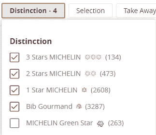
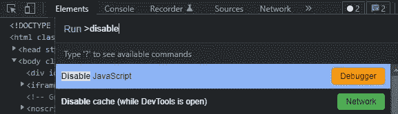

# 我是如何用 Golang Colly 废弃整个米其林指南的

> 原文：<https://betterprogramming.pub/how-i-scrapped-the-entire-michelin-guide-using-golang-colly-6034e01c8043>

## 我刮了米其林指南。以下是方法


[在](https://unsplash.com/@delightindee?utm_source=medium&utm_medium=referral) [Unsplash](https://unsplash.com?utm_source=medium&utm_medium=referral) 上的照片

在汽车时代的初期，[米其林](https://www.michelin.com/)，一家轮胎公司，创造了一本旅游指南，包括一本餐馆指南。多年来，米其林星级由于其高标准和非常严格的匿名测试员而变得非常有声望。米其林星级令人难以置信地垂涎。获得一个就能改变厨师的一生；然而，失去一个也能改变它。

受[这篇 Reddit 帖子](https://www.reddit.com/r/singapore/comments/pqnjd2/singapore_michelin_guide_2021_map/)的启发，我最初的意图是从官方[米其林指南](https://guide.michelin.com/en/restaurants)(CSV 文件格式)中收集餐厅数据，以便任何人都可以在[谷歌我的地图](https://mymaps.google.com/)上绘制世界各地米其林指南餐厅的地图(参见[示例](https://www.google.com/maps/d/edit?mid=1wSXxkPcNY50R78_T83tUZdZuYRk2L6jY))。

以下是我如何使用 Go with [Colly](http://go-colly.org/) 框架从《米其林指南》中收集所有餐厅细节的思考过程。最终数据集可在此免费下载[。](https://github.com/ngshiheng/michelin-my-maps/blob/main/generated/michelin_my_maps.csv)

## 概观

*   项目目标和规划
*   如何不损害网站
*   刮刀和[代码](https://github.com/ngshiheng/michelin-my-maps)预排

在我们开始之前，我只想指出，这不是一个关于如何使用 Colly 的完整教程。Colly 是难以置信的优雅，但易于使用，我强烈推荐你通过[官方文档开始](http://go-colly.org/docs/introduction/start/)。

既然已经解决了，我们开始吧！

# 项目目标

这里有两个主要目标—

1.  直接从官方米其林指南网站收集“高质量”数据
2.  给网站留下尽可能小的足迹

那么，“高质量”是什么意思呢？我希望任何人都能够直接使用数据，而不必执行任何形式的数据管理。因此，收集的数据必须是一致的、准确的和正确解析的。

## 我们在收集什么

在开始这个 web 抓取项目之前，我确保没有现有的 API 提供这些数据；至少在我写这篇文章的时候。

在浏览了主页面和几个餐馆的详细页面后，我最终满足于以下内容(即我的列标题):

*   `Name`
*   `Address`
*   `Location`
*   `MinPrice`
*   `MaxPrice`
*   `Currency`
*   `Longitude`
*   `Latitude`
*   `PhoneNumber`
*   `Url`(guide.michelin.com[上餐厅的链接](https://guide.michelin.com/))
*   `WebsiteUrl`(餐厅的网站)
*   `Award` (1 至 3 颗米其林星和 Bib Gourmand)

在这个场景中，我省略了餐馆描述([见“米其林指南观点”](https://guide.michelin.com/jp/en/osaka-region/osaka/restaurant/ajikitcho-horieten))，因为我觉得它们不是特别有用。话虽如此，如果你有兴趣，请随时提交一份简历！我非常乐意和你一起工作。

另一方面，在地图上标出餐馆的地址、经度和纬度尤其有用。

这是我们餐馆模式的一个例子:

[model/model.go](https://github.com/ngshiheng/michelin-my-maps/blob/main/model/model.go)

## 我们刮了多少页

让我们快速估算一下铲运机。首先，预计在我们的数据集中出现的餐馆总数是多少？



我们感兴趣的不同的米其林奖

看网站的数据，总共应该有 6502 家餐厅(排)。

每页包含 20 家餐馆，我们的刮刀将访问大约 325 页；每个类别的最后一页可能不包含 20 家餐馆。

# 合适的工具，适合合适的工作

今天，有一些工具、框架和库可以用于 web 抓取或数据提取。见鬼，市场上甚至有大量不需要任何代码的网络抓取 SaaS(例如 Octoparse)。

由于灵活性的原因，我更喜欢建造我的铲运机。最重要的是，使用 SaaS 通常伴随着第二个成本(通常不言而喻)——学习曲线！

## 开发者工具(DevTool)

为 web 抓取选择正确的库或框架的过程的一部分是在页面上执行开发工具。

打开 [DevTool](https://developer.chrome.com/docs/devtools/open/) 后，我通常采取的第一步是立即禁用 JavaScript 并快速刷新页面。这有助于我快速识别网站上的内容是如何呈现的。



打开 Chrome dev tool→Cmd/Ctrl+Shift+P→禁用 JavaScript

一般来说，网站内容的生成/呈现方式有两个主要区别:

1.  服务器端渲染
2.  JavaScript 渲染(即动态加载的内容)

对我们来说很容易，米其林指南网站内容是使用服务器端渲染加载的。

## 如果使用 JavaScript 呈现站点会怎样

暂时岔开话题——如果使用 JavaScript 呈现站点内容会怎么样？然后，我们将无法直接抓取所需的数据。相反，我们需要检查“Network”选项卡，看看它是否正在进行任何 HTTP API 调用来检索内容数据。

否则，我们将需要使用 JavaScript 渲染(无头)浏览器，如 [Splash](https://github.com/scrapinghub/splash) 或 [Selenium](https://www.selenium.dev/) 来抓取内容。

## 去 Colly vs. Scrapy vs .硒

我最初的想法是使用[Scrapy](https://scrapy.org/)——一个使用 Python 的功能丰富且可扩展的 web 抓取框架。然而，在这种情况下使用 Scrapy 对我来说似乎有些矫枉过正。目标相当简单，不需要任何复杂的特性，比如使用 JavaScript 渲染、中间件、数据管道等。

考虑到这一点，我决定使用 [Colly](https://github.com/gocolly/colly) ，这是一个用于 Golang 的快速而优雅的 web 抓取框架，因为它简单并且提供了出色的开发人员体验。

最后，我不喜欢 Selenium 或[puppet er](https://github.com/puppeteer/puppeteer)这样的网络抓取工具，因为它们相对“笨重”且速度快。但是，当您需要抓取不通过 HTTP API 获取数据的 JavaScript 渲染的网站时，它们是救命稻草。

# 最小化占地面积

网络抓取的第一条规则是不要损害网站。强烈推荐你[阅读 Colly 提供的这些刮痧小技巧](http://go-colly.org/articles/scraping_tips/)。本质上，这些技巧与工具无关。

## 总是缓存您的回答

在开发过程中，重试请求通常是不可避免的。Colly 为我们提供了轻松缓存响应的能力。借助缓存，我们可以:

*   大大减轻网站的负荷
*   拥有更好的开发体验，因为使用缓存重试速度更快

```
// app/app.go// ...cacheDir := filepath.Join(cachePath)c := colly.NewCollector(
 colly.CacheDir(cacheDir),
 colly.AllowedDomains(allowedDomain),
)
```

## 在请求之间添加延迟

当遍历多个页面时(在我们的例子中大约 325 页)，在请求之间增加延迟总是一个好主意。这使得网站能够处理我们的请求，而不会超载；我们希望避免对网站造成任何形式的破坏。

增加延迟也有助于减轻反刮擦措施，如知识产权禁止。

```
// app/app.go// ...c.Limit(&colly.LimitRule{
 Delay:       2 * time.Second,
 RandomDelay: 2 * time.Second,
})
```

# 刮刀

在这一节中，我将只介绍 scraper 代码的重要部分(和考虑事项)。

## 选择器

我更喜欢使用 [XPath](https://developer.mozilla.org/en-US/docs/Web/XPath) 来查询 HTML 页面的元素以提取数据。如果你对网页抓取感兴趣，我强烈推荐你[学习 XPath](https://www.scrapingbee.com/blog/practical-xpath-for-web-scraping/)；这会让你的生活轻松很多。这里是我最喜欢的使用 XPath 的[备忘单。](https://devhints.io/xpath)

为了避免主应用程序代码中冗长难看的 XPath 的混乱，我通常喜欢将它们放在一个单独的文件中。你当然可以使用 CSS 选择器来代替。

## 入口点

要开始构建我们的 scraper 应用程序，我们首先要确定我们的入口点，即起始 URL。在我们的例子中，我选择了 all-restaurants 主页”(根据奖励/荣誉类型过滤)作为起始 URL。

[app/const.go](https://github.com/ngshiheng/michelin-my-maps/blob/main/app/const.go)

为什么不干脆从 guide.michelin.com/en/restaurants 开始呢？

通过有意声明我的基于米其林奖类型的起始 URL，我就不需要从 HTML 中提取餐馆的米其林奖。相反，我可以直接根据我的起始网址填写奖励栏；少了一个需要维护的 XPath([耶](https://i.kym-cdn.com/entries/icons/mobile/000/034/772/Untitled-1.jpg))！

## 收集者

我们的刮刀应用程序由两个收集器组成—

1.  一个(`collector`)从主(起始)页面解析位置、经度和纬度等信息
2.  另一个(`detailCollector`)收集详细信息，如地址、价格、电话号码等。从每个餐馆。还将行中的数据写入我们的输出 CSV 文件。

## 如何在 Colly 收集器之间传递上下文

因为我们只在`detailCollector`级别写入 CSV 文件，所以我们需要将提取的数据从`collector`传递到`detailCollector`。我是这样做的:

如何在不同的 Colly 收集器之间传递上下文的代码示例

这样，位置、经度和纬度信息就可以通过上下文([引用](https://github.com/gocolly/colly/issues/287))传递给我们的`detailCollector`。

## 分析器

我已经编写了几个[实用解析器](https://github.com/ngshiheng/michelin-my-maps/blob/main/util/parser/parser.go)来从提取的原始字符串中提取特定的信息。由于它们相当简单，我就不一一赘述了。

最后，我们的整个 scraper 应用程序如下所示:

[app/app.go](https://github.com/ngshiheng/michelin-my-maps/blob/main/app/app.go)

请随意查看完整的源代码[这里](https://github.com/ngshiheng/michelin-my-maps)。

# 结束语

最初，我想通过 API 在 Google My Maps 上标出每一家米其林获奖餐厅。不幸的是，[我的地图不仅没有任何 API](https://support.google.com/maps/thread/22025555?hl=en&msgid=22027032) ，而且[最多只允许 2000 个数据点](https://support.google.com/maps/thread/11556127?hl=en&msgid=11556505)。要构建一个没有 API 的地图，你必须[手动导入我的地图上的 CSV](https://support.google.com/mymaps/answer/3024836) 。

作为一个美食家，这个项目非常有趣。对我来说，更大的收获是看到人们充分利用 Kaggle 上的数据集。

如果你碰巧画出了餐馆的地图，或者用数据集进行了任何形式的数据分析工作，请随时与我分享！在我们结束之前，如果您有任何问题，请随时联系我们。

今天到此为止，感谢您的阅读！

```
**Want to Connect?**This article was originally published at [jerrynsh.com](https://jerrynsh.com/how-i-scraped-michelin-guide-using-golang/)
```