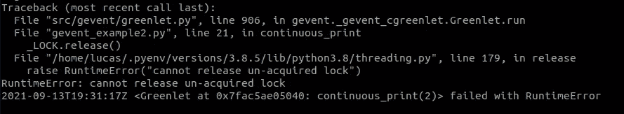
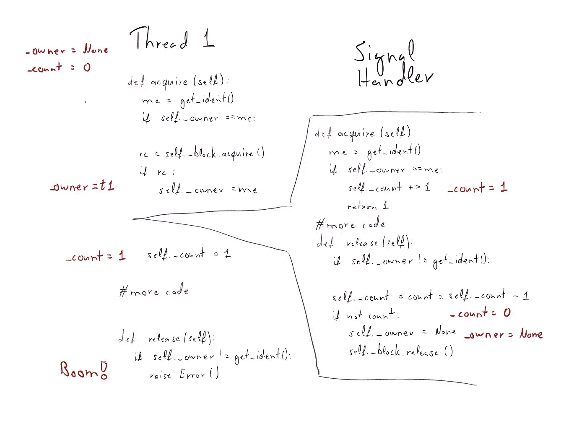

# 我是如何解决 Python 中一个具有挑战性的并发错误的

> 原文：<https://betterprogramming.pub/how-i-solved-a-challenging-concurrency-bug-in-python-cbf635d4bea9>

## 调查事件循环、信号和锁的基本原理和复杂性


照片由[艾米丽·莫特](https://unsplash.com/@emilymorter?utm_source=medium&utm_medium=referral)在 [Unsplash](https://unsplash.com?utm_source=medium&utm_medium=referral) 拍摄

假设您在生产环境中运行一个 Python 服务，并且它不时会崩溃并显示以下错误:

```
RuntimeError: cannot release un-acquired lock
```

这正是几年前我们团队的情况。起初，我们不知道发生了什么，也无法在本地重现该问题。我们甚至不知道它是在我们的代码中还是由库引起的。我们发现了一个所谓的 Heisenbug，一个只有在你不看的时候才会出现的 bug。

最终，我们找到并修复了这个错误。它涉及到一个确定性的事件循环框架 Gevent，重入锁，信号和一些思考。让我告诉你调查的经过和可能的解决方法。


漫画来自[geek-and-poke.com](https://geek-and-poke.com/geekandpoke/2009/7/8/the-art-of-bugfixing-chapter-2.html)，牌照 [CC-BY-3.0](https://creativecommons.org/licenses/by/3.0/)

# 调查

在本文中，我用一个最小的例子再现了这个 bug。该示例将其归结为几个无限期运行的 Gevent 线程，获取和释放一个可重入锁。

还有一个信号处理程序，它定期触发来获取和释放同一个锁。GitHub 上有代码[，任何人都可以使用。简化的示例如下所示:](https://github.com/lucas-sonnabend/signals-and-eventloops-gone-wrong)

它需要的主库是 Gevent，在我们调试这个问题之前，我们必须了解这个库是如何工作的。

# Gevent

[Gevent](http://www.gevent.org/intro.html) 是一个开源的 Python 库，它提供了一个确定性的事件循环。它类似于 [Python asyncio 库](https://docs.python.org/3/library/asyncio.html)，但是选择运行下一个协同例程的调度器是确定性的，并且是非抢占式的。

给定相同顺序的相同事件，两次不同的运行将产生完全相同的结果。这是决定性的部分。

非抢占意味着框架只在当前线程结束、显式让步或执行阻塞 I/O 调用时切换到不同的线程。它还提供了一个`monkey_patch`方法来修补常见的 I/O 操作，比如网络调用，以便与 Gevent 框架一起工作。

# 追溯

有了这些背景知识，我们就可以开始了。如果您在 GitHub 上运行这个例子，运气不好的话，您应该会得到下面的异常。



# 重入锁

第一个提示是堆栈跟踪，它指向 python[threading . py](https://github.com/python/cpython/blob/3.8/Lib/threading.py)源代码。更准确地说，它指向可重入锁的`release()`方法。

可重入锁是一个可以被同一个参与者多次获取的锁，对于防止[死锁](https://en.wikipedia.org/wiki/Deadlock)非常有用。想象一个线程获得一个锁，并且当它仍然持有所述锁时，调用一个再次获得它的函数。

正常的锁会阻塞，导致死锁。但是重入锁跟踪哪个线程获得了锁，并允许同一个线程多次获得锁。

我们现在知道异常可能有多种原因。要么是线程释放了一个它从未获得的锁，要么是它释放锁的次数比获得锁的次数多。但是在示例代码中，每个`acquire`调用后面都跟着`release`，并且在控制流中没有中断。Gevent 事件循环的不可抢占性决定了没有其他线程可以干涉。

但是即使他们可以，其他线程也不能`acquire`锁定，所以他们不可能释放它们。根据线程内和线程间的控制流，这种异常不应该发生。

# 信号

在我们的服务中，我们有另一种机制来改变控制流，即信号处理器。[信号](https://en.wikipedia.org/wiki/Signal_(IPC))是操作系统提供的异步消息系统。一个进程可以向另一个进程发送信号，您可以提供处理程序方法，当一个进程接收到信号时执行这些方法。最常见的信号是 SIGINT，您用`CTRL+C`将它发送到前台进程。对此的默认处理程序是终止进程。

在 Python 中，我们可以创建一个定制的信号处理程序，并注册它以便在特定的信号上调用。在我们的例子中，那就是`SIGALRM`。然后，您可以创建一个计时器，以便操作系统以指定的频率触发该信号:

```
signal(SIGALRM, signal_handler)setitimer(ITIMER_REAL, TIMER_FREQUENCY, TIMER_FREQUENCY)
```

当信号触发时，操作系统执行我们的信号处理程序，不管哪一行是先前执行的。处理程序返回后，执行从程序中进程被中断的相同位置继续。该处理程序也由先前运行的同一线程执行。

> "当你排除了不可能，剩下的，不管多么不可思议，一定是真相？"——阿瑟·柯南·道尔《四人组》中的夏洛克·福尔摩斯

# 真正的 Bug

在这里，我们改变了控制流！现在我们只需要弄清楚错误时刻的信号是如何导致可怕的异常的。首先，让我们提醒自己获取和释放可重入锁的代码:

来自 [/lib/threading.py](https://github.com/python/cpython/blob/3.8/Lib/threading.py) 的简化摘录

现在，您必须问自己:如果在某个时候，信号处理程序干涉并开始获取锁，会发生什么？

经过多次反复试验，我注意到如果一个信号处理器中断了第 15 行和第 16 行之间的`acquire`功能，它会将`self._owner`设置为`None`。在控制返回到线程之后，它最终调用`release`并触发启动该调查的异常。



在引发异常的正确时间调用信号处理程序时的控制流

# 修复

显而易见的解决方案是不要在信号处理程序中使用锁。这有点棘手，因为我们没有自己引入锁。它们在标准 Python [日志处理程序](https://github.com/python/cpython/blob/3.8/Lib/logging/__init__.py#L941)中使用。

我们最终为信号创建了一个单独的日志处理程序，它有自己单独的锁。信号处理器不再与主线程共享任何状态，这就解决了问题。

一个更简单的解决办法是使用`asyncio`而不是`gevent`。不幸的是，这对我们来说是不可能的。这将是一次大规模的重写，我们依赖于 Gevent 事件循环的确定性。

# 现实生活背景

这个示例调查是基于我遇到的一个实际的 bug。当然，我们的代码比这个例子复杂得多，我们有充分的理由使用 Gevent 库和信号。

我们使用 Gevent 是因为我们有一个可重玩的，[事件源](https://microservices.io/patterns/data/event-sourcing.html)系统。假设相同的消息进入系统，我们想要完全相同的行为。我们通过这种方式发现了一些错误。


漫画来自[geek-and-poke.com](https://geek-and-poke.com/geekandpoke/2014/7/3/simply-explained#)，牌照 [CC-BY-3.0](https://creativecommons.org/licenses/by/3.0/)

信号处理器有两个不同的目的。第一个是用于块检测。这将经常检查自事件循环调度程序运行以来已经过了多长时间。如果它在一定时间间隔(1 秒)内没有运行，它将发出警告。这表明我们在代码中引入了一些计算密集型部分，服务器不再响应。

第二个用例是对烟囱痕迹进行采样，以创建[火焰图](https://www.brendangregg.com/flamegraphs.html)。通常，您只会在开发或测试环境中这样做，因为收集这些分析信息会有一定的开销。但是我们认为我们已经在使用 Python，它不是最快的语言，与解释语言的开销相比，这是可以接受的。

我不知道问题是从什么时候开始出现的，但我记得我们做了什么:什么都没有！在最初的分类之后，很明显它很难调试，它出现的频率不到一个月一次。服务因此而崩溃，但会自动重启，只造成最小的服务中断。花费时间来修复它的成本高于停机时间本身的成本。

但是后来我们开始扩大我们的服务。服务数量加倍意味着出错的频率加倍。停机的成本仍然很低，但这是一个令人讨厌的警告。您最不希望看到的是一堆不可操作的警报，它们会干扰您的工作，并使您忽略可操作的警报。避免这种警惕性的盲目让我们最终解决了这个问题。

# 最后的想法

我希望你喜欢这次调查以及我们在现实生活中如何处理这个 bug。也许你也学到了一两件事。这绝对是我遇到的最难也是最有趣的 bug 之一。

一些悬而未决的问题仍然存在。您可能已经注意到，解释中没有明确提到 Gevent，但是我只成功地再现了运行多个 Gevent 线程时的异常。这个 bug 很可能涉及到另一层复杂性。

简化代码示例还产生了另外两个异常。它们被记录在 [GitHub 库](https://github.com/lucas-sonnabend/signals-and-eventloops-gone-wrong)中。他们每个人都有自己的故事和解释，他们都有待探索。

关于并发的另一个真实例子，请查看我的关于 Python 中异步的危险的文章:

[](/the-dangers-of-async-in-python-and-how-to-avoid-them-6e6f98f19f0e) [## Python 中异步的危险以及如何避免它们

### 通过一个非抢占式事件循环示例了解 Python 中的异步陷阱

better 编程. pub](/the-dangers-of-async-in-python-and-how-to-avoid-them-6e6f98f19f0e) 

# 资源

*   [Gevent](http://www.gevent.org/intro.html)
*   [Python asyncio](https://docs.python.org/3/library/asyncio.html)
*   [Python 信号文档](https://docs.python.org/3/library/signal.html)
*   [Python threading.py 源代码](https://github.com/python/cpython/blob/3.8/Lib/threading.py)
*   [火焰图](https://www.brendangregg.com/flamegraphs.html)