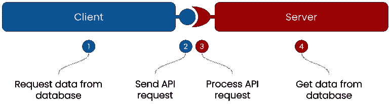
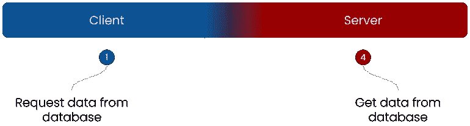

# 我如何通过不构建 API 来加速全栈开发

> 原文：<https://betterprogramming.pub/how-i-speed-up-full-stack-development-by-not-building-apis-7f768335bec6>

## 我通过自动化所有客户端-服务器通信来提高工作效率的旅程。


[Jexo](https://unsplash.com/ja/@jexo?utm_source=medium&utm_medium=referral) 在 [Unsplash](https://unsplash.com?utm_source=medium&utm_medium=referral) 上的照片

在过去的十年里，我构建了许多全栈应用。作为一名全栈开发人员，我一直在为前端和后端之间的通信以及与其他服务的通信编写 API。主要是使用下面的流程请求或存储一些数据。



对我来说，第二步和第三步总感觉开销很大。尤其是对于内部使用的 API。我一直在想，是否有一种方法可以自动完成这些步骤，只需在另一端调用一个函数，而不必为通信细节而烦恼。好像两端都像这样融在一起了。



幸运的是，在这方面我并不孤单，在过去的几年里，选择已经变得可行。

其中一个选择是元框架，将前端和后端框架捆绑在一起，创建一个灵活的全栈开发人员体验(像 [Remix](https://remix.run/) )。


组合和集成提供了一组强大的功能，并真正加快了开发速度。但是我注意到我在犹豫是否使用它们。当我还在从 AngularJS 转换到新 Angular 的过程中恢复的时候，我已经建立了对框架的恐惧。更不用说元框架了。当一个框架(版本)得不到维护时，我最不希望的就是重写前端、后端和所有的通信。我只想尽可能快地取代过时的东西，同时尽可能减少影响。

这让我想到了另一个选择，一个用胶水代码把两端绑在一起的中介(就像[惯性](https://inertiajs.com/))。


像元框架一样，中介负责与框架的所有交互。不同之处在于，中介本身不是框架，它只提供一个粘合层。像 Inertia 这样的解决方案为常用的前端和后端框架提供了适配器，提供了一些选择的自由。对我来说，这已经听起来好多了。但是仍然对中介和使用的适配器有很大的依赖性。随着中介器或框架的每一个发布，当引入突破性的变化时，适配器需要更新。只要维护是有效的，这是好的，但是四五年后呢？

这让我思考并得出结论，我在寻找一个幽灵。避免额外依赖的唯一方法是将两端绑定在一起，中间没有任何东西。寻找这样一个解决办法没有结果，所以我就随它去了。但这让我在内心深处很忙碌。直到突然冒出一个想法。让运行时处理它。


这是开发 Jitar 的导火索，Jitar 是 JavaScript 和类型脚本应用程序的分布式运行时。这是一个仅用于配置的解决方案，并不存在于代码中。服务器函数可以被导入并直接调用到客户端。

```
import { someFunction } from './server';
const answer = await someFunction();
```

这保持了代码的干净、简单和集中，因为中间没有任何东西。客户端不知道功能在另一端，也没必要知道。定义什么在什么终端上运行是一个配置问题。用什么框架并不重要。

在两端使用 JavaScript / TypeScript 限制了框架的选择，但是允许在客户机和服务器上运行相同的组件。它还支持创建非常好的开发人员体验，因为类型检查和智能感知在整个应用程序中都可用。这是其他选择还在努力的地方。

替换 Jitar 相当容易。只是停止使用运行时，使用其他东西进行通信。这很可能意味着构建您尚未构建的 API)

对我来说，Jitar 带来了我一直在寻找的解决方案。这是一个在 MIT 许可下发布的开源项目。并且目前正由越来越多的贡献者积极开发。请随意尝试一下。关于 Jitar 的更多信息可以在[文档](https://docs.jitar.dev/)和 [GitHub repo](https://github.com/MaskingTechnology/jitar) 中找到。

暂时就这样了。我希望你喜欢阅读这篇文章。你能理解我说的事情吗？你使用什么框架/工具？请在评论里告诉我！

[](/how-to-create-an-api-less-full-stack-application-with-react-and-jitar-602bcbabc66b) [## 如何用 React 和 Jitar 创建一个无 API 的全栈 App

### 了解如何使用 Jitar 来自动化全栈应用程序中的所有客户机-服务器通信

better 编程. pub](/how-to-create-an-api-less-full-stack-application-with-react-and-jitar-602bcbabc66b)