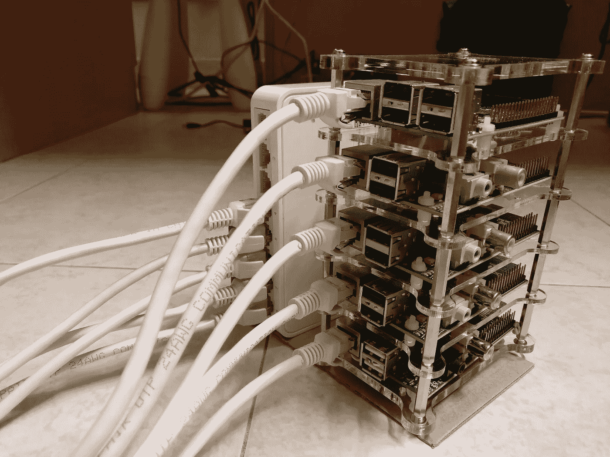
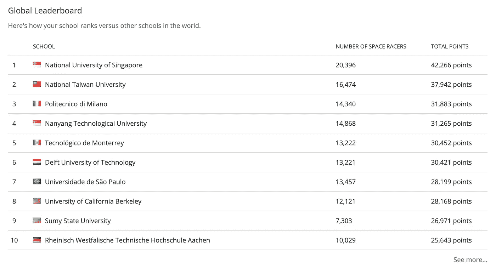
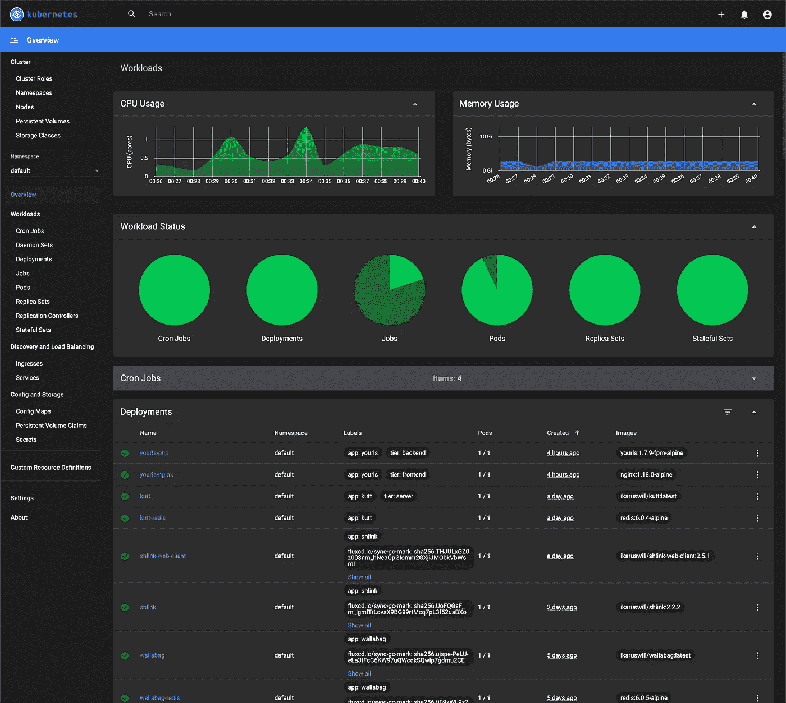
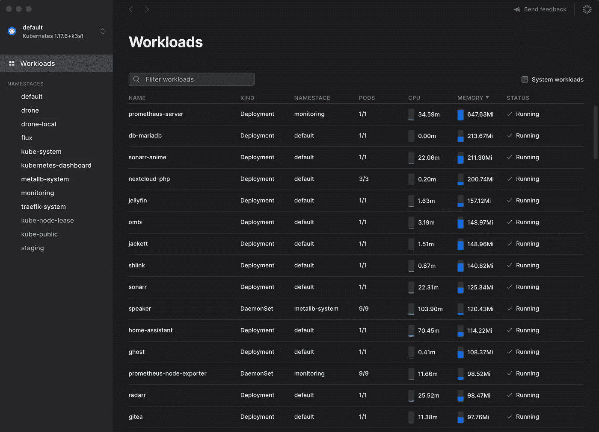
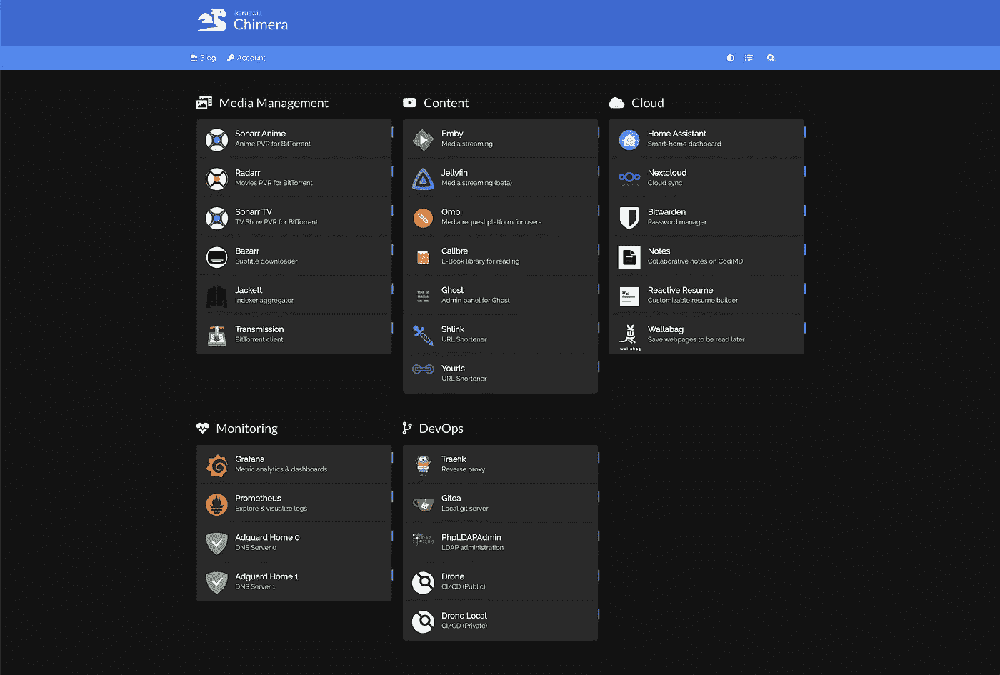

# 我是如何开始自主经营的

> 原文：<https://betterprogramming.pub/how-i-started-self-hosting-df17f0919d64>

## 我将我的个人云托管在一个由 10 个树莓 pi 组成的集群上


奇美拉星团(*原载于 2020 年 6 月 12 日*[*ikarus . SG*](https://ikarus.sg/how-i-started-self-hosting/)*)*

```
def main():
    print('Hello World!')
    print('This marks my first post on this blog!')

if __name__ == '__main__':
    main()
```

你好世界！

因为我最初是在我的[个人博客](https://ikarus.sg)上发布这篇文章的，所以我将以一篇关于我为什么以及如何踏上这段旅程的文章开始。

> ***自托管*** *是使用私有 web 服务器运行和维护网站的做法。(* [*)维基*](https://en.wikipedia.org/wiki/Self-hosting_(web_services)) *)*

我开始做自主持不是因为一开始就有宏大的愿景，其实是为了一个可笑的表面原因。

# 荒谬的起源

2017 年，在我大学的最后一年，学习计算机科学，我住在大学宿舍，有很多空闲时间。我是宿舍里最年长的学生，我想让我的房间在其他房间中脱颖而出。作为那个时候自恋的我，我想造一个既可笑又浮华，同时又叫着帅气又书呆子气的东西，一个叫着， ***我*** *的东西！*

*所以我买了五个便宜的二手树莓派 1b，把它们组装成一串*



看看这个漂亮的东西

我将在另一篇文章中详细介绍我的构建过程，现在让我们先看看它是什么。

事实证明，我从未真正发现集群的真正用途。几个月过去了，我一直给集群供电，但除了用 Raspbian 刷新 SD 卡之外什么也没做。这是一棵昂贵的圣诞树！

然后有一天，我想我应该试着为大便和笑声主持我自己的 Wordpress 站点。让 PHP 和 Nginx 在如此受限的硬件上工作真是一个痛苦的过程，但最终，经过一个月的修补，我让它工作了。

# 对空间的需求

这个巨大的成就提升了我的信心，我开始着手处理下一个问题。

我的 Dropbox 快没空间了。

我在 Dropbox 空间竞赛中获得的 25GB 免费空间已经在一年前过期了，从那时起，我就一直靠微薄的几千兆字节空间来存放我所有的学术文件。

# Dropbox 太空竞赛

对于外行人来说，Dropbox 空间竞赛是 2012 年摇滚大学最热门的营销活动，每个学校的学生集体贡献一定数量的推荐，根据他们学校在排行榜上的位置，他们每个人都被授予一定数量的免费空间，为期两年。



我唯一一次为我的大学感到骄傲([时光倒流机，2012 年 12 月](https://web.archive.org/web/20121212005041/https://www.dropbox.com/spacerace)

我的大学在麻省理工学院和加州大学伯克利分校中排名第一。它显示了云存储对我们有多重要(或者说我们都是 FOMO)。

你可能知道也可能不知道，但文件同步和云存储在那个时候对于像我这样竞争激烈的环境中的学生来说非常重要。考虑到学生们玩游戏的数量，笔记本电脑毫无征兆地消失也就不足为奇了。因此，能够在你的设备上备份和同步你过去几个学期的所有笔记和作业，可以让你成为 A-和 B+(或者 C+和 D，取决于你在钟形曲线上的位置)。

于是，我搜索 Dropbox 替代品，找到了 [Nextcloud](https://github.com/nextcloud/server) ，一款多平台 FOSS(免费开源软件)云存储/文件同步。它还可以作为照片备份解决方案，允许照片以全尺寸同步，而没有谷歌照片的粗略“高质量”压缩。

*巧合的是，它运行在 LAMP stack* (Linux，Apache，MySQL，PHP) *，和我已经熟悉的 Wordpress 的设置完全一样。*

然后，我花了两周时间对它进行修补，最终让它按照我想要的方式工作，调整了最大文件上传大小，应用了一些 MySQL InnoDB 技巧，等等。

# 痛点发现和补丁

有人说自主托管是一种瘾——尝试过一次之后，你会想再来一次。一开始我并没有意识到这一点，但是在写这篇文章的时候，我想我已经开始明白为什么会这样了。

在接下来的几年里，我逐渐发现了我日常工作流程中越来越多的痛点。我用一个独立的自由/开源软件替代付费软件来修补它们。例如，我意识到我需要一个密码管理器、一个媒体库管理器、一个在旅途中访问我的媒体的流媒体工具、一个跨平台的笔记/同步应用程序等等。

随着我对开源世界的深入研究，我发现了由一个充满活力的社区维护的伟大软件的整个世界。部署新的应用程序并测试它们成了我每周都期待的事情。

## 几个我一直最喜欢的自托管应用:

*   密码管理器: [Bitwarden_rs](https://github.com/dani-garcia/bitwarden_rs)
*   Github 替代: [Gitea](https://github.com/go-gitea/gitea)
*   书签收藏: [Wallabag](https://github.com/wallabag/wallabag)
*   全网广告拦截器: [AdGuardHome](https://github.com/AdguardTeam/AdGuardHome)



我的 Kubernetes 仪表板的快照

不知不觉中，我的集群已经从在裸机操作系统上运行应用程序的六节点 Raspberry Pi 1B 增长到在 Kubernetes 上运行 56 个容器化工作负载的由 *armv7* 和*arm 64*SBC 组成的 10 节点混合集群。



我的一些 Kubernetes 工作负载(专长。[基础应用](https://infra.app/)

我是这样一种人，当我向那些大公司伸出手指，用很少的成本实现他们产品的功能时，我会感到很兴奋。这么说吧，我是介绍自托管的最差的人。

# 我过得怎么样？



我的单点登录控制台和我的自托管应用程序(feat。[荷马](https://github.com/bastienwirtz/homer)

到目前为止，这是我的集群的一次令人难以置信的收获之旅，一路上，我学到了从 Linux、Docker、Docker Swarm 和 Kubernetes 到 DNS、TLS 和网络拓扑的广泛知识。处于自由/开源软件的前沿，我能够发现和报告错误，并提交 pull 请求。我现在已经开始了自己的小项目。

如果没有自我托管作为我的动力，我就会屈服于拖延症，永远不会完成我已经完成的所有事情。

总而言之，这是独一无二的体验。

这就把我们带到了下一个问题。

# 该不该自主持？

在决定是否自承载您的应用程序时，有许多因素需要考虑。

## 如果出现以下情况，您应该自己主持:

1.  此时你还在耐心的阅读。
2.  你喜欢摆弄东西，对微小的细节大惊小怪，在最微小的问题上花费数小时甚至数天。
3.  你是一个多面手，想学习任何关于计算机的知识。
4.  你喜欢那种廉价的刺激感，因为你能够以很少甚至零成本完成大公司用他们的产品做的所有事情。
5.  你想拥有你的数据和网络服务。

我将数据的所有权作为最后一点，因为我认为在当今高度互联的世界中，完全拥有您的数据是一个遥不可及的目标。由于这个原因，它应该是自我托管的最后一个动机。

我再怎么强调第二点也不为过。在过去三年的自主托管中，我遇到了无数的问题，花了很多天调试一个问题，却发现这个问题是配置中的一个打字错误，或者更糟，是我试图托管的自由/开源软件的一个尚未发现的错误。让我举个例子来说明这一点。

## 一个你永远不会发现的令人痛苦的错别字

就在四周前，我试图部署`OpenLDAP`，这是一种用于访问目录服务的轻量级客户端-服务器协议，通常用于存储凭证和用户元数据。这本来是我的 SSO 服务的核心，用户只需使用一个用户名和密码就可以访问我的所有服务。看看我为`[osixia/openldap-backup](https://github.com/osixia/docker-openldap-backup)`所做的 Kubernetes env 配置，这是 OpenLDAP 的一个 dockerized 实现。

```
 containers:
      - name: openldap
        image: osixia/openldap-backup:1.3.0
        env:
        - name: LDAP_ORGANIZATION
          value: ikarus
        - name: LDAP_DOMAIN
          value: ikarus.sg
        - name: LDAP_BASE_DN
          value: 'dc=ikarus,dc=sg'
        - name: LDAP_ADMIN_PASSWORD
          valueFrom:
            secretKeyRef:
              name: openldap
              key: admin_password
        - name: LDAP_READONLY_USER
          value: 'true'
```

你永远不会发现这个错误！我们能称之为错误吗？

我纠结了两天，为什么`OpenLDAP`没有从环境变量中获取`LDAP_ORGANIZATION`值——删除、重新部署和改变变量的顺序。只有当我真正钻研代码时，我才发现这个错误是多么微不足道:

```
slapd slapd/internal/generated_adminpw password ${LDAP_ADMIN_PASSWORD}
slapd slapd/internal/adminpw password ${LDAP_ADMIN_PASSWORD}
slapd slapd/password2 password ${LDAP_ADMIN_PASSWORD}
slapd slapd/password1 password ${LDAP_ADMIN_PASSWORD}
slapd slapd/dump_database_destdir string /var/backups/slapd-VERSION
slapd slapd/domain string ${LDAP_DOMAIN}
slapd shared/organization string ${LDAP_ORGANISATION} ## THIS LINE 
slapd slapd/backend string ${LDAP_BACKEND^^}
```

我怎么会错过呢？！

*变量名应该是* `*LDAP_ORGANISATION*` *而不是* `*LDAP_ORGANIZATION*` *。*

回头看看文档，我简直不敢相信我错过了它。

以下仅是新 LDAP 服务器所必需和使用的:

*   `LDAP_ORGANISATION`:机构名称。默认为`Example Inc`。
*   `LDAP_DOMAIN` : Ldap 域。默认为`example.org`。
*   `LDAP_BASE_DN` : Ldap 基本 DN。如果为空，则从 LDAP_DOMAIN 值中自动设置。默认为`(empty)`。
*   `LDAP_ADMIN_PASSWORD` **:** Ldap 管理员密码。默认为`admin`。
*   `LDAP_CONFIG_PASSWORD` **:** Ldap 配置密码。默认为`config`。

原来维护 OpenLDAP Docker 映像的组织 osixia 位于法国南特——这可能是他们用英式英语而不是美式英语编写变量名的原因。

如果你刚刚读到的让你深感恐惧，我建议你重新考虑一下！

## 在以下情况下，您应该*而不是*自主持:

*   您认为服务的便利性和可靠性高于一切。
*   你讨厌被困在毫无意义的问题上。
*   你一点也不关心你的数据和网络服务的所有权。

# 离别赠言

对于那些看完这篇文章后决定自己托管的人，我要告诉你，自己托管服务的可靠性远远不是你花钱买一个同等服务所能得到的。不管你有多少经验，在你的旅程中的某个时刻，你一定会遇到可靠性问题。

如果你还能接受，那就去吧！

## 这个系列的下一步是什么？

在接下来的文章中，我将展示我的网络图，详细介绍我的集群的构建过程和发展，并分享我学到的一些东西，这样您也可以从您的 Raspberry Pi/SBC 中获得更多。

在我的下一篇文章中阅读我是如何构建我的第一个树莓 Pi 集群的。

*原载于 2020 年 6 月 12 日*[*ikarus . SG*](https://ikarus.sg/how-i-started-self-hosting/)*。*