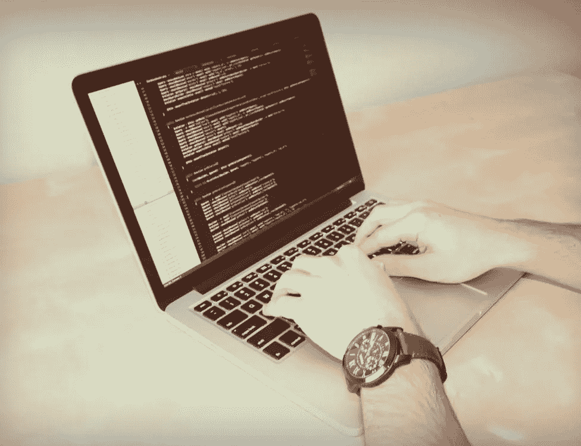

# 我是如何停止学习编码并开始编码的

> 原文：<https://betterprogramming.pub/how-i-stopped-learning-to-code-and-started-e32614bccfd8>

## *一个初级开发者的下一步报告*

**

*四年前，我决定真正投入精力学习如何编码。我买了一本巨大的 C++书和崭新的钢笔。我彻底重新布置了我的房间，有策略地摆放了三台电脑显示器，用来学习而不是玩游戏。那些日子已经过去了。我现在是一名程序员。*

*在接下来的六个月里，我每天晚上花三到六个小时来完成我的 C++学习计划。我真的认为我做得很好。任何我不懂的题目，我只是一遍又一遍地复习。我以为我的耐心和决心会帮我度过难关。我完成了我的第一本 C++书。我为自己感到骄傲。回想起来，我真的很惊讶我坚持了下来，因为我实际上不知道它意味着什么。但是我在前进，从我进入的这个陌生的新世界中，我充满了希望和惊奇。*

*我又花了 100 美元买了一本更大的高级 C++书，还买了更多的笔。那天晚上，我开始了我认为又是六个月缓慢而坚定的进步。第一章花了一个小时后，我很快意识到这种先进的材料对我来说太难了。我回到了最初的学习材料，认为我需要更新一些关键概念，比如二叉树和类继承。我发现我真的什么都不懂。我没有写过一行代码不是从那本书上一字不差地复制过来的。我没学过那本书。我复制了一份。*

*接下来的一年，我从 JavaScript 跳到了 Java，然后是 Python，之后我看到了一本很棒的书，叫做*艰难地学习 C 语言*。这本书完全是从零开始的，我发现这是一种更好的学习方法。我实际上可以看到文件和文件夹在哪里，它们在做什么，以及它们如何与内存和处理器交互。太棒了。我向所有程序员强烈推荐这本书。*

*到达终点后，我尝试应用我学到的知识，使用自定义数据结构编写自己的排序算法。我做不到。我看懂了，但是不看材料做不出来。我什么都不记得了。这让我很生气。我很努力才走到这一步！我什么时候才能写代码？但是事情是这样的:我试图编写自己的排序算法的唯一原因是书中有一章是关于这个的。我试图从我的记忆中记住现有的代码，而不是用我所学的知识来自己解决问题。我还没有迈出这一步。*

**

*马库斯·斯皮斯克在 [Unsplash](https://unsplash.com?utm_source=medium&utm_medium=referral) 上拍摄的照片。*

*因此，我又一次陷入了僵局。也许我不应该成为一名程序员。我是说，我已经能弹得很好了。为什么不坚持下去，开心点呢？在接下来的几个月里，我一直关注着编码世界，但是我不再主动学习了。我几乎整晚都在狂看网飞，玩电子游戏。*

*有一天，我在看 Quora 上一个问题的回复。另一个关于如何成为一名伟大的程序员的问题。通常的答案是:学习，努力，网络资源。我知道代价是什么。太难了。但是后来我看到了我听过的关于编码的最棒的建议。就一句话:“你必须真正开始编码。”我想到了我写的所有试图解决 HackerRank 和 Codewars 问题的片段。我在大多数情况下做得很好。那是编码，对吗？*

*我觉得用 Python 最舒服，所以我用 Python 3.5、Notepad++和 Windows 10 Bash 终端武装自己，我开始“实际开始编码”。那天晚上，我写了一个程序，与 YouTube 的 API 进行交互，使用自定义标准来搜索地下金属乐队，然后根据某些词是否出现在前 100 条评论中来返回结果，这些词包括“不可思议”、“惊人”、“杰作”结果保存在 SQL 数据库中，以便于访问。我在上面花了大约八个小时。我遇到了各种各样的问题，但是很有效。那天晚上，我真的发现了一些我以前从未听过的惊人的新音乐，只是因为我写了一个程序来为我演奏。这很酷。*

*从那以后，我实现了微框架 Flask，这样我就可以使用 Python 来托管网站。我已经能够将我的命令行程序转换成一个可以在浏览器中运行的程序，该程序可以返回嵌入的视频。很快，我将在 Heroku 上部署我的应用程序。我从开发这个小程序时所犯的错误中学到的比我从书上学到的还要多。对你自己的程序进行故障诊断和发现你自己的错误是“好了，我已经学会了所有这些东西…现在做什么？”和“实际上我觉得我可以称自己为程序员。”*

*我过去常常被任何懂编程的人吓倒。我一直以为我会说一些我一无所知的蠢话。但现在不是了。我真的觉得我可以称自己为程序员。和其他人一样，我还有很多东西要学。这很好。实际上很神奇！所以，如果你觉得你的进度已经慢了很多，或者你只是在庞大的编码社区中迷失了，深呼吸，开始编码吧。*