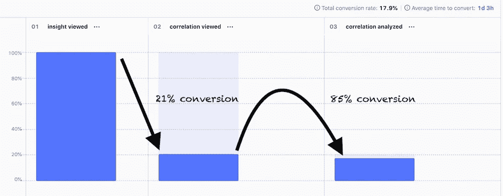

# 作为一名软件工程师，我如何掌控项目

> 原文：<https://betterprogramming.pub/how-i-take-ownership-of-projects-as-a-software-engineer-b25916aaaacb>

## 和 5 个步骤让你开始

在 [Unsplash](https://unsplash.com?utm_source=medium&utm_medium=referral) 上拍摄的 [ThisisEngineering RAEng](https://unsplash.com/@thisisengineering?utm_source=medium&utm_medium=referral)

当你接手一个项目时，有些事情会发生变化。你要对项目中发生的一切负责。

事情出了差错？那是你的责任。客户不高兴？那是你的责任。你运了不能解决问题的东西？那是你的责任。

理想情况下，你有一个减少事情出错的方法。

大约八个月前，我开始在[博客](https://posthog.com/?utm_source=neilkakkar)工作。从那以后，我有幸拥有了两个大项目。我远没有足够的经验来谈论处方，但这不是重点。快速成长的很大一部分是理解你在做什么以及你为什么要这么做。所以，这篇文章是我如何拥有和制造新产品的模型。

当你拥有全部筹码时，神奇的事情就会发生。从与客户交谈，到决定构建什么，到决定谁将构建什么，到最终获得反馈，然后重复这个循环。您可以看到整个流程，这让您更好地了解该做什么。有时候，软件不是解决问题的方法。

大体上，我注意到了五个步骤。每一个背后的目标都是增加你成功的机会。我将解释它们，并跟进这些步骤后面的 metas。最后，由于 PostHog 是开源的，我将链接到我所谈论的真实世界的精确例子。

# 收集上下文

在你理解问题之前试图找到解决方案会让你在原地打转。首先，理解问题。这从理解用例开始。

我最近做的一个有趣的项目是实验。如果你从你应该构建什么的角度来考虑，那就是:“构建一个 A/B 测试平台。”这个问题严重缺乏背景。当你考虑做什么的时候，你会忘记用户真正想要的是什么。

这也使得确定优先次序和弄清楚要建造什么变得更加困难。例如，假设你刚刚开始这个项目。你在 MVP 中包括了什么？你需要快速测试的有风险的东西有哪些？你不能回答这些问题，因为它们超出了问题的范围。

当你从用例的角度考虑时，事情就不同了。首先:“人们在 A/B 测试中遇到困难，因为他们缺少仪器，他们得到的结果很难理解。”这告诉你你需要做什么:(1)使仪器简单，(2)使结果容易理解。

达到这一点很难，这也是构建成功产品的第一个障碍。为了理解用例，你需要和用户交谈。提问。深入他们所说的。下面是 PostHog 是如何做到的。

一旦您理解了用例，您就可以判断哪些问题与您自己的相关，以及现有的解决方案是否有效。在一个以前已经解决过类似问题的世界里，不理解别人是如何解决这些问题的将是一种耻辱。

花点时间看看其他人是如何用 A/B 测试平台解决这些问题的。野生环境中有成百上千只！帮助我更好地领导这个项目的是了解这些 A/B 测试平台是如何工作的，它们专注于解决哪些问题，然后从中获得灵感。

例如，我意识到大多数 A/B 测试平台都是独立的:它们是不捆绑的，所以测试和决定目标指标发生在其他地方(比如说，你的分析套件)，你来这里对结果进行分析。因为 PostHog 已经有了用于工具的特性标志，并且它的主要工作实际上是一个分析套件，所以这里有一个真正的捆绑机会。[这就是我们对这一特性的看法。](https://github.com/PostHog/posthog/issues/7418#issuecomment-982618472)

寻找解决方案也能让你更好地理解你可能承担的风险。通过实验，由于我们的目标是使结果易于理解，并减少用户运行一个好的 A/B 测试必须知道的事情的数量，我们决定测试贝叶斯分析路线。这排除了像 p 值、统计显著性、置信区间这样的概念，并专注于一个奇异值:你的变体优于对照的概率。[具体细节，请看这里。](https://github.com/PostHog/posthog/issues/7418#issuecomment-984616174)

# 想出解决办法

一旦你有了背景，你就可以开始考虑解决方案了。

我发现自己陷入的一个陷阱是过多地从现有的解决方案中获取灵感。如果你重复他们犯过的同样的错误，你怎么能构建一个更好的版本？

另一个陷阱是只考虑技术上的可能性。这尤其是工程师的问题。你知道这个系统是如何运作的，你知道你所做的妥协，所以你限制了符合这些现有约束的可能解决方案的范围。这是一个问题，因为它经常低估了可能性。

我避开这两个陷阱的方法是从理想的解决方案开始。什么解决方案可以完全解决这个用例？这样做可以让我[梳理出首要原则](https://neilkakkar.com/A-framework-for-First-Principles-Thinking.html)。“理想的解决方案是什么让它变得理想？解决问题的症结是什么？”

例如，通过实验，我从理想的解决方案中得出三个首要原则:

1.  数字必须 100%准确。没有估计，没有粗略的计算，没有影响 A & B 测试桶的基础设施。在桶 A 中的人不能在两天后移动到桶 B。
2.  结果应该很容易理解。

*   这里有更多的回旋余地。很好地理解这一点意味着回到你的用户身边并寻求反馈。

3.人们应该能够在启动 A/B 测试之前测试他们的更改。

*   如果两个 A & B 变体在不应该显示的时候显示了同样的东西，这个实验就无效了。

工程师拥有产品非常酷的一点是你可以和自己对话。一方面是技术上的限制:给定我们现在拥有的，什么是可能的？另一边是用例:不考虑所有的技术约束，理想的解决方案是什么样的？

当技术约束与理想发生冲突时，我可以回到最初的原则。现在，假设我想保留这些原则，我该如何解决这个问题呢？

上面的问题迫使我去想我能拉的杠杆。我经常相信我唯一的杠杆是技术约束:我能做什么聪明的优化来使这成为可能？

但这不是真的。我还有另一个强有力的杠杆:用不同的方式解决问题。实际上，这意味着在保留基本原则的同时改变 UX。

例如，我在实验中遇到了一个[硬技术约束](https://github.com/PostHog/posthog/issues/7462#issuecomment-987868293)。这不是解决不了的问题，但是这样做需要太多的工程资源。相反，我选择改变 UX。我们仍然尊重三个首要原则，只是创作流程与我期望的理想流程不同。

这里值得再次注意的是实验的三个原则。虽然(1)是技术性的，但(2)和(3)有更大的灵活性。当你遇到无法克服的技术限制时，UX 杠杆会变得更加有力。我就是这么做的。原则(3)没有规定任何关于现有特征标志的事情。因此，为了克服技术约束，我们添加了一个新的 UX 约束:人们不能重用现有的功能标志。

注意:下次我领导一个项目时，我应该把原则讲清楚。它们大部分时间都留在我的脑海里，但是让团队也知道它们应该是有帮助的:这是帮助每个人做决定的有价值的背景。

# 建设

由于我们正在解决的用例，我们现在已经找到了原则，并且心中有了解决方案。我想在建筑时移动最快。

作为所有者，我在这里最大的责任是设定优先级。优先级帮助每个人快速行动并完成任务。Scott Berkun 关于[让事情发生的帖子对我影响很大。](https://scottberkun.com/2012/how-to-make-things-happen/)

这意味着创建一个有序的任务列表，需要完成这些任务来实现你的目标。对于大型项目，我可能会使用看板，但对于较小的项目，一个 GitHub 问题似乎是理想的。例如，这里有一个我为了实验而创造的。

在大多数情况下，我会先拿到 MVP。选择哪些部分是重要的，需要设置正确的优先级。它是否需要合适的用户界面？它能处理模拟数据吗？我们基本原则的最小工作表达式是什么？

我领导的第一个项目，在建设时，我面临着这种任务旋风:有这么多他妈的事情要做——一些人需要我的帮助，搞清楚设计，做公关审查，等等。等。实施几天后，我就在所有这些东西之间变来变去。我搬了很多地方，却没做多少事。我意识到，核心问题是我会扑向掉在我盘子里的任何东西。

如果我正在编写一些东西，有一个 PR 请求进来——因为没有其他人会审查这个请求，而我是所有者——我希望快速解除对其他人的阻止，这样他们就可以继续快速前进。我会放下手头的工作，先做回顾，然后继续做我放下的事情。像一个堆栈，一切都是后进先出。

这是可怕的优先顺序。不久前，我读了斯科特的博客文章，但发自内心的感受让它打动了我:我需要理清我的优先事项，并坚持到底。这更好地解决了问题。我通过使用更好的调度算法摆脱了[颠簸问题](https://en.wikipedia.org/wiki/Thrashing_(computer_science))。不管接下来会发生什么，最重要的事情首先被完成。

这又回到了前两步的重要性。如果您在构建之前跳过它们，您的目标将只是“构建一个 A/B 测试平台”你会很难分清主次，因为你缺乏背景，不知道你不能妥协的原则。

在这里，高效还意味着让人们保持一致，并确保他们能够高效工作。如果有很多人，我想这可能会很难。我只领导过非常小的团队(1-3 人)，所以到目前为止一切都很顺利。

我也更加欣赏我的经理的工作了。我需要思考每个人做什么，以及他们是如何工作的。鉴于五大人格测试在五个维度上准确地代表了人们，我假设大多数人都是可归类的。它们只有几个维度。

就像傅立叶变换一样，与其在这五个维度上工作，不如在工作中更容易测量的维度上工作更有效。我还没有完全搞清楚这些(与人打交道的经验太少)，但有几个方面很突出:

1.  如果他们被困住了，他们会寻求帮助吗？
2.  为了提高工作效率，他们需要我(a)只是设定背景还是(b)微观管理。
3.  他们的优势是什么？
4.  它们是齿轮驱动的还是行为驱动的？

我非常 gearsy——这意味着当我提出 UX 设计时，我倾向于“透明内部”的方法。正如我所看到的，这几乎总是错误的做法。大多数用户不关心他们的问题是如何解决的，只关心有一个按钮可以解决问题。

我认为，让小公司的管理变得更容易的是，大多数人在这些方面都差不多，因为面试过程会选择这些方面。比如在 PostHog，一旦设定了语境，你就可以[让人们去做他们觉得最重要的事情。](https://posthog.com/handbook/company/values#step-on-toes)

我很感激我在管理方面是个十足的菜鸟。但话说回来，我不认为仅仅增加年龄就能让我做得更好。就像我在简介里说的，如果我不明白自己在做什么，为什么要做，我就无法快速提高。因此，我对管理的假设。

希望你足够有效，你和你的队友能获得 MVP。下一步是收集反馈。

# 收集反馈

到目前为止，我发现最好的方法是做用户访谈。没有什么能比得上高保真的一对一反馈，在那里你可以深入了解他们所说的一切。

收集反馈时，您要测试两件重要的事情:

1.  你得出的原则是否真的是首要原则。

很容易误解用户真正想要的是什么。有了具体的 MVP，你可以问一些假设性的问题，比如:“如果这个特性不存在，你会怎么做？”。您需要确认您在第一步中收集的信息仍然有效。

例如，通过实验，我会深入了解用户所说的结果易于理解是什么意思。我们是在告诉他们 A 有 85%的机会击败 B 吗？他们需要更多信息吗？为什么？

2.你的解决方案是否是这些首要原则的合理表达。

不要只是确认你在正确的轨道上，要确保你确实解决了问题。PostHog 的产品经理 Paolo 通过给用户挑战来做到这一点。例如，“假设你想创建一个新的实验。你会怎么做？”。我经常会问一些问题，比如“你认为这个图表是什么意思？”或者“你为什么会收到这样的警告？”

在这些挑战之后，询问总体反馈是一个好主意:缺少什么？你喜欢什么？这解决了你的问题吗？

最后你想出来两点:(1)用户爱不爱这个？(2)如果没有，缺少什么？你需要什么？

# 根据反馈调整指标

仅仅在反馈电话中有快乐的用户是不够的。我总是需要确保指标与用户所说的一致。

我喜欢经历两个周期的`Gather context -> Figure out solution -> build -> gather feedback`。在这一点上，事情通常是好的。如果我做得对，第二个周期要快得多:它增加了我们在 MVP 中跳过的功能，所以收集上下文和找出解决方案的步骤大部分可以跳过。

在这个阶段，我将添加分析支持(即，开始发送关于用户如何使用产品的事件)，开始向世界的%发布，然后看看事情如何发展。你应该能够回答这样的问题:“有多少人在使用它？”“在使用它的人中，有多少人认为它有价值？”，以及任何其他相关的产品问题。

我为我工作过的每一个产品建立了一个度量仪表板，并且每周五检查它。这在你发布后的最初几周是很重要的，因为它会告诉你事件捕获是否有问题，以及你是否能回答所有关于产品的问题。如果我不知道这个产品的哪个部分最受欢迎，我可能缺乏事件工具。我应该尽快补充那些遗漏的事件。否则，我就是瞎飞。

通常，模式需要更长的时间才能在指标中显示出来。此时，我将把项目置于后台模式，等待用户模式出现，然后决定我想对它做什么。

例如，在我的第一个项目“相关性分析”中，我们今天的使用漏斗看起来像这样:

人们非常喜欢相关性分析，第二步 85%的转化率就证明了这一点。问题是发现:大多数人不知道它的存在。所以，每当我下一次回到这个话题，我想解决的问题是让它更容易被发现。

# Meta:创建反馈循环

我想强调的所有步骤的一个共同主题是反馈循环。为了快速工作并确保你做的事情是正确的，你需要几个反馈循环。长期和短期都有。

上面的每一步都有自己的快速反馈循环，你可以在几个小时内得到反馈。

例如，在收集上下文时，不要在竖井中进行。和你的队友(尤其是产品负责人)一起做。一起探索竞争对手的产品。让线程开放，这样公司里的每个人都可以看到并为之做出贡献。听取同事的意见是很有价值的，因为他们可能有更多的背景，因为他们是内部人员。

在构建阶段，快速的反馈循环意味着小的拉动式请求和快速的评审！想象一下，当你有小的 PRs 可以很快被评审，而 500 行的修改需要很长时间才能被评审时，你完成事情的速度有多快，你的代码看起来有多好。

除了这些快速反馈循环之外，在连续的步骤之间还有更慢但仍然重要的反馈循环。舞台输出不是一成不变的。会有一些你之前没有想到的事情出现。

在实现解决方案时，可能会出现新的技术限制，这迫使您回到“找出解决方案”阶段。不要和你最初的想法结婚。离婚很难。

在进行实验时，我们决定允许重用现有的特性标志来进行实验。这是有意义的，因为人们会创建特性标志，测试 A & B 版本看起来不错，然后在实验中使用相同的特性标志，而不必做任何代码更改。

然而，在实施过程中，我意识到这与其中一个原则相冲突。这样做意味着结果不会 100%准确。

因此，正如我上面提到的，我们提出了不重用特性标志的额外约束，并生成代码片段来解释如何用这个新的特性标志进行测试。

最后，随着时间的推移，最长的反馈循环也随之而来。这意味着正确地跟踪您的指标。最后一步，“根据反馈调整度量”正是这样:一个长的反馈循环，它消除了噪音，并准确地向您显示用户是如何使用该产品的。

其主旨是总是创造反馈回路。

# Meta:管理你的情绪

当我领导我的第一个项目时，事情发生了变化。我第一次感觉到自己有责任把事情做完——我没有其他人可以依靠。这让我变得更加“兴奋”我发现下班后很难停下来。我担心我是否达到了自己设定的最后期限，担心我们尚未解决的技术挑战，以及我是否会成功。

我喜欢下班后关掉。这对我的心理健康非常好，让我可以自由地享受工作之外的其他爱好。所以，我知道拥有这样一个让我一直兴奋的项目是不可行的。

这都是我的责任:我不习惯领导项目，这让我付出了代价。

下一次，事情稳定多了。我不知道发生了什么变化，但我觉得自己更有掌控力了。我认为对过程的熟悉帮助我更好地面对这种焦虑。不足为奇的是，我曾经面对过类似这样的事情 [每次](https://medium.com/swlh/how-to-learn-anything-quickly-leverage-the-vocabulary-c6e23ff7c56) [我都在尝试新的东西](https://neilkakkar.com/quickreps.html)。我已经开始接受这种感觉。

我注意到的另一件事是，在项目接近尾声时，焦虑情绪急剧上升。MVP 感觉很简单:不需要打磨；只是概念而已。把它拿出来，你就没事了。尽管这个项目还没有完成 MVP。最后，您实际上需要整理所有的细节并润色 UI。我越接近完成，就越担心。

我认为这很大一部分是因为我以前从未构建过漂亮的前端(我以前构建的每个前端看起来都像狗屎)。这是一个未知的东西，我之前并不关心，因为我知道至少有一些人在 PostHog 非常有经验地建造漂亮的东西。我自己解决这个未知问题非常有用:它帮助我面对我的“恐惧”，并在我不熟悉的领域获得信心。

因为我是项目负责人，所以把这项工作交给其他人也很容易。但是注意到我在做什么以及我为什么这么做帮助我做出更好的决定。

在如何对待情绪方面，我没有太多的建议。他们来了，改变你的方向，然后飞走了。我发现注意这些情绪是有帮助的。注意你的感觉以及你为什么会有这种感觉。它给了我清晰的思路，仅仅这样做就足以做出更好的决定。

# 结论

上述五个步骤中的每一个都至关重要。他们带来了一些重要的东西，我怀疑这是每一个成功产品所必需的。

我发现软件工程最难的部分是构建东西。但现在，也许它在想该造什么。知道要建造什么似乎更少。这让我很惊讶，因为你不需要知道如何编码来决定构建什么。

可能还有更微妙的事情我做错了(也做对了)，我还没有注意到。但是这篇文章是我的剧本:我注意到的新事物被插入到这些步骤中，警告被添加，我一直变得越来越好。

这里包含的是第三个要素:要快速提高，你需要知道你在做什么，为什么要做。

1.  我很难相信每个人都是独一无二的等等。等。大多数人似乎都有相似的生活和相同的问题。
2.  有点过于概括，这在很大程度上取决于背景/行业/解决方案。但由于我太过于呆板，这样措辞能确保我认真对待它。
3.  不是因为特征标志已经被使用，而是因为特征标志的类型。[真实细节在此](https://github.com/PostHog/posthog/issues/7462#issuecomment-987868293)。