# 我如何使用 CSS Grid 和 Flexbox 创建一个单页网站——第 2 部分

> 原文：<https://betterprogramming.pub/how-i-use-css-grid-and-flexbox-to-create-a-one-page-website-part-2-e575edb422fe>

## 借助第 1 部分中的入门模板

从头开始创建一个网站可能很耗时。然而，考虑到许多网站有一个标准的外观，我们可以通过创建自己的模板来减少开发时间，我们可以在需要的时候拿出来修改。

在本文中，我将修改我的一个模板来创建一个单页网站。下面是我将要浏览的网站截图:

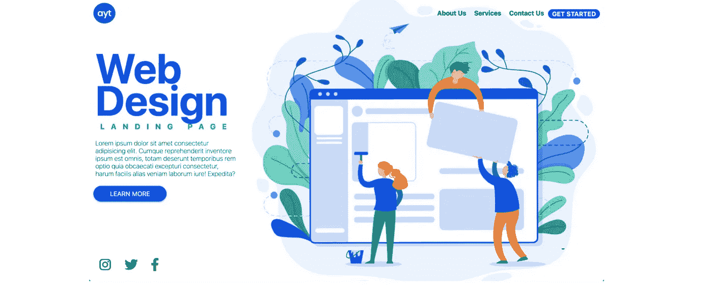

该设计大致基于以下几点:

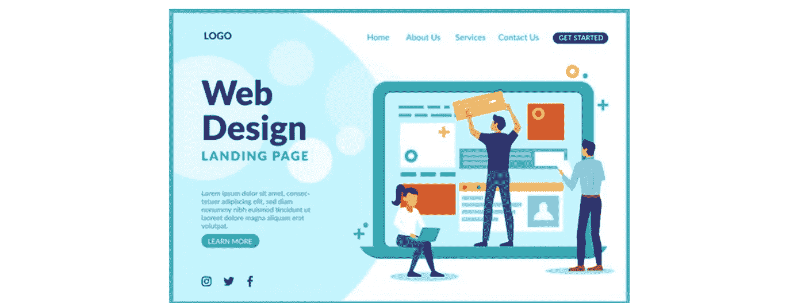

由 [Freepik](http://www.freepik.com) 设计

# 设置

我正在使用的模板来自我上一篇关于如何使用 CSS Grid 和 Flexbox 创建一个单页网站的文章。

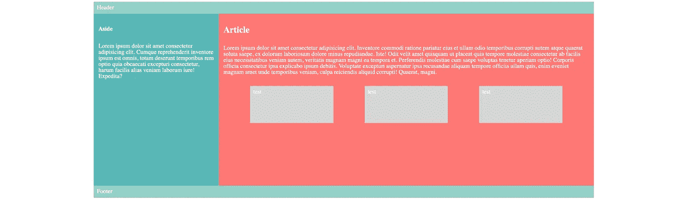

# 第一步。编码前的规划

我需要调整模板，因为它不完全符合我心目中的网站设计。以下是我计划做出的改变:

`header`

*   在右上角添加导航包装和导航链接。
*   将导航更改为 flex-container，这样导航链接将在大屏幕上显示为一行，在小屏幕上显示为一列。
*   在左上角添加一个标志。

`aside`

*   为我的特色内容保留`aside`。
*   添加大写文本的副标题。
*   换成 flex-container，这样我就可以使用 flex-grow 来填充空间

`article`

*   把`article`改成`div`来保存我的特色图片。
*   使用`background-image`属性添加图像，因为我希望它根据屏幕大小调整大小。
*   删除所有内容。

`footer`

*   添加三个图标，并在左侧对齐。

# 第二步。修改 HTML 和 CSS

记住上面的变化，让我们看看我是如何修改我的 HTML 和 CSS 的。

## 超文本标记语言

下面的屏幕截图显示了更新后的 HTML，带有徽标、导航链接、特色帖子和社交媒体图标。

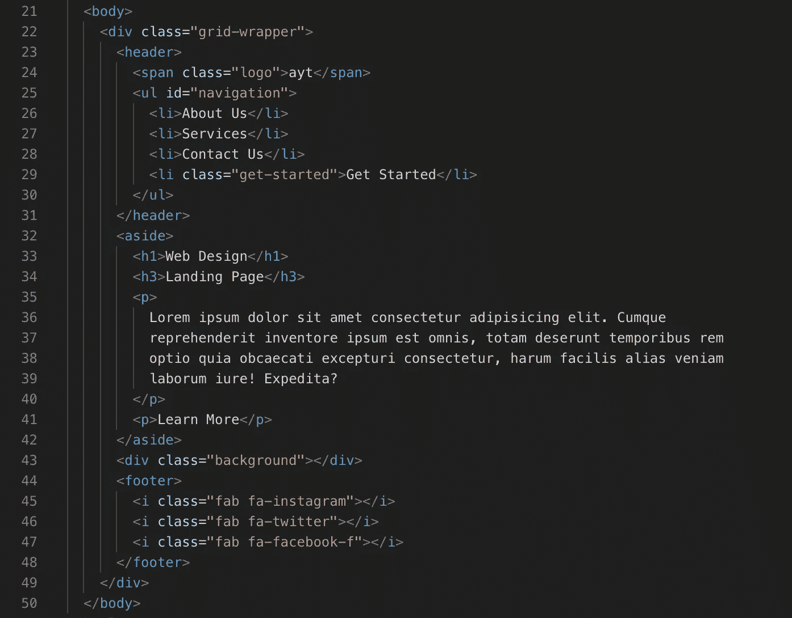

添加了两个`link`标签到 [Google Font](https://fonts.google.com/) 和 [Font Awesome](https://fontawesome.com/?from=io) ，这样我就可以使用我在 Google Font 中选择的字体和 Font Awesome 中的图标。

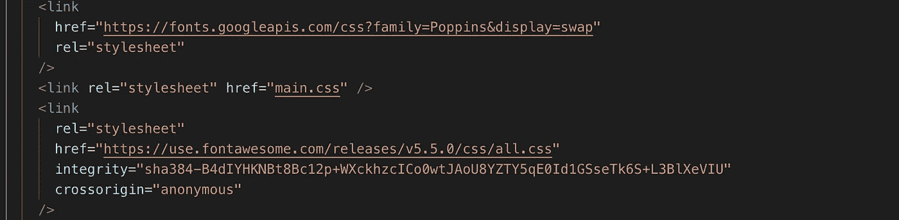

## 半铸钢ˌ钢性铸铁(Cast Semi-Steel)

接下来，我开始从上到下修改样式。

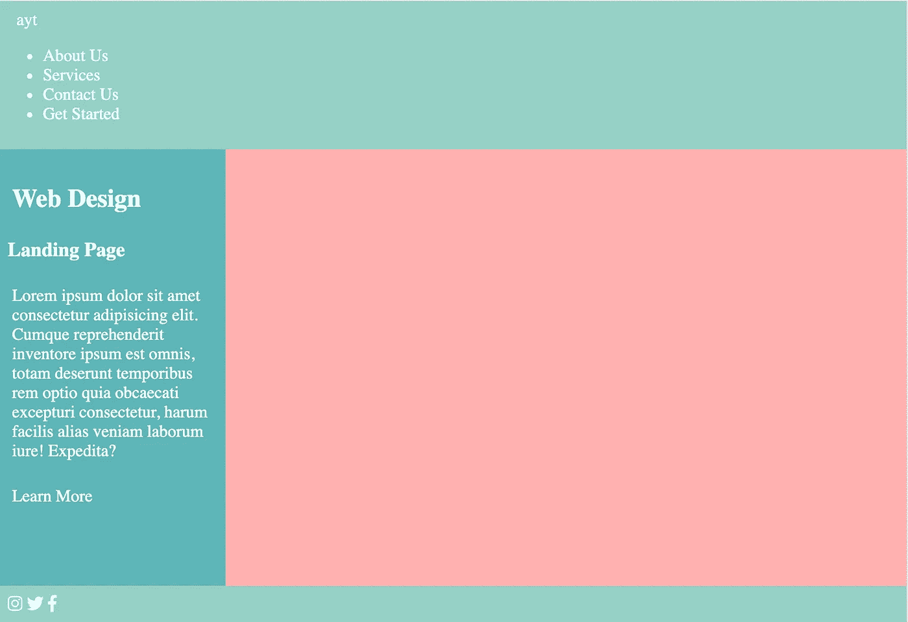

`body`

比起在浏览器中使用默认字体，我更喜欢系统字体的外观，我可以通过声明以下内容来使用它:

```
font-family: -apple-system, BlinkMacSystemFont, “Segoe UI”, Roboto, Oxygen, Ubuntu, Cantarell, “Open Sans”, “Helvetica Neue”, sans-serif;
```

在身体选择器上。由于字体属性是继承的属性，这将在整个网页中应用指定的字体，除非我覆盖它。

`header`

*   在左上角添加一个徽标。

在 HTML 的 header 标签中添加了我的徽标和导航菜单之后，为了创建一个布局，我希望这两个元素放在相对的两端，我将我的 header 转换为一个 grid-container。

```
header {
 display: grid;
 grid-template-columns: 1fr 1fr;
}
```

标题、徽标和导航链接中的元素现在是网格项。

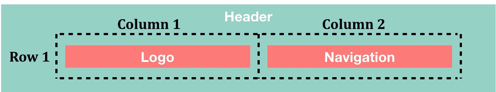

*   将导航更改为 flex-container，这样导航链接将在大屏幕上显示为一行，在小屏幕上显示为一列。

接下来，我通过在导航 ID 为的`ul`上声明`display: flex`，将它更改为一个 flex 容器。

*   在右上角添加导航包装和导航链接。

我添加了`justify-content: flex-end`来将导航链接推到行尾。

*   式样

我删除了带有声明`list-style-type:none`的导航链接上的列表样式。

`aside`

*   添加大写文本的副标题。

对于副标题，我声明`text-transform: uppercase`将文本改为大写。虽然我可以在 HTML 文件中直接输入大写的文本，但这不是我们使用 CSS 样式化内容的正确方式。

*   式样

我增加了标题和副标题的默认字体大小，使它们在页面上更加突出。

在颜色方面，我将特色图片中的深色重新用于字体颜色，以保持调色板的一致性。

我通过更改`grid-column`属性扩展了`aside`的位置，使其与 header 重叠。这是为了上移内容，否则布局会显得不平衡。

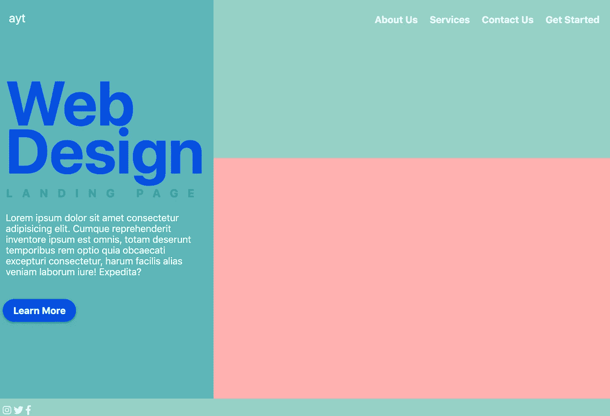

`.background`

*   将`article`更改为`div`以保存我的特色图片。

我用`.background`选择器替换了`article`选择器，因为我已经用`div`标签更改了文章的 HTML 标签。

*   使用`background-image` 属性添加图像，因为我希望它根据屏幕大小调整大小。

我已经为这个网站选择了一个背景图片。


由[弗里皮克](http://www.freepik.com)设计

我添加上面的图片作为`background-image`属性的值。

```
.background {
  background-image: url("/background2.png");
  background-size: cover;
  background-position: left center;
  background-repeat: no-repeat;
}
```

`background-size`的值`cover`在不拉伸图像的情况下缩放图像。然后，在我决定使用`background-position: left center`之前，我会调整图像的位置。

*   式样

我改变了新的`.background`选择器在网格中的位置，使图像与`header`和`footer`重叠。

`footer`

*   添加三个图标，并在左侧对齐。

默认情况下，在 HTML 中添加图标后，它们被排列在页面的左侧。

我只需要增加图标之间的空白来隔开它们。

```
.fab {
font-size: 1.5rem;
margin: 10px;
}
```

# 回顾

基于目前为止的变化，这里有一个网站的预览。在我下班之前，还有更多的工作要做。

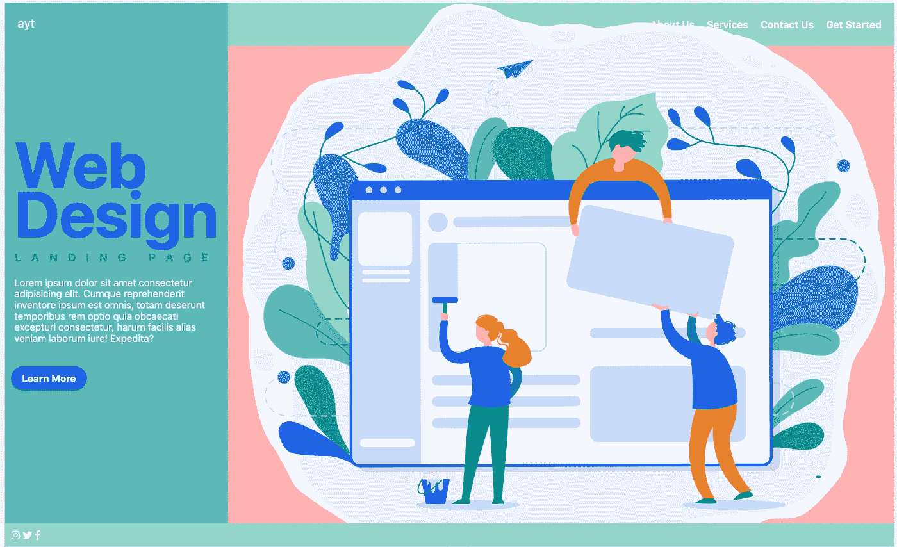

网站审查

`color`和`background-color`属性。让我们删除原始模板中的背景颜色，并通过在 body 选择器上声明 `color: black`将字体颜色改为黑色。

同样，我依赖于继承的属性，其中字体颜色将由 body 元素的子元素(以及孙子和曾孙等)继承。

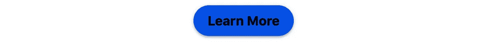

样式像按钮的链接

在上一步中，回想一下我将颜色属性更改为黑色。这改变了我的假按钮的颜色。因此，我必须给它加上`color: white`。

我为*入门*的导航链接添加了类似的样式。

我还为我的徽标添加了高度和宽度，并使用`border-radius`属性将它变成一个圆形。

只要高度和宽度的长度相等，并且 border-radius 的值为 50%及以上，元素将从正方形转换为圆形。所有这些工作都是为了创建一个标志，看起来像我有一个媒体。

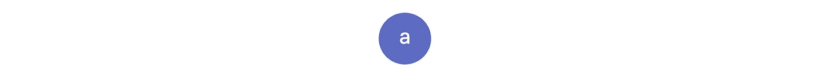

我的徽标

`z-index`属性

从显示网站评论的屏幕截图来看，特色图片与导航链接重叠。我需要更改标题的`z-index`属性的值，该属性同时设置其子项(即导航链接)的 z 索引。

因为具有较大 z 索引的重叠元素覆盖了具有较小 z 索引的重叠元素，所以我给它一个值 1，这样它就高于图像的值。

这是我的桌面视图的最终产品。耶…

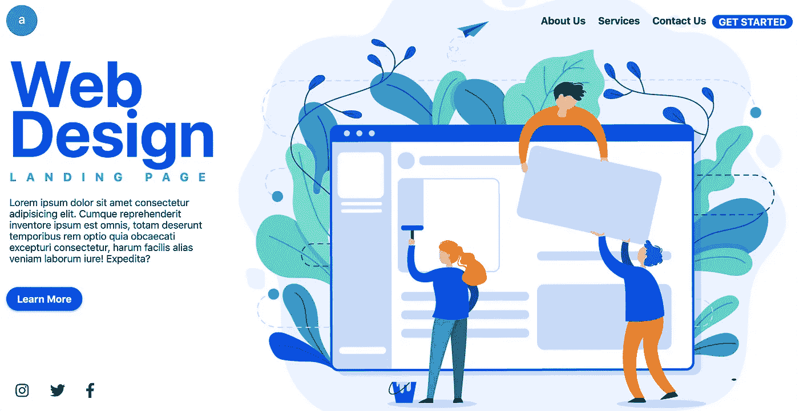

我只剩下了移动视图。这就是现在的样子。


# 移动视图

注意到特色图片在移动视图中消失了吗？

这是因为当页面显示在小屏幕上时，我删除了网格，包含图像的 div 现在的高度为 0，因为我没有声明高度，也没有放入任何内容。

与其给它增加一些高度，我更喜欢重新设计移动视图。

我使用`.grid-wrapper`选择器的`background-image`属性添加图像，并将导航布局从行改为列。

请注意，我使用了另一个没有去除边缘的图像。由于我将使用的`background-blend-mode`属性，先前的图像无法使用。

```
.grid-wrapper {
  background-image: url(“/background.jpg”);
  background-size: cover;
  background-position: center;
  background-color: lightgray;
  background-blend-mode: screen;
}
```

现在，由于颜色的冲突，文本不容易对照图像阅读。因此，简单的方法是淡出背景图像的颜色。我不能使用`opacity`属性，因为它也会使文本褪色。因此，我不得不使用我刚刚学会的另一种方法:

给背景图片添加一个更亮的背景色，通过应用`background-blend-mode: screen`声明将两者混合。

还是在文本上，我减小了副标题“登陆页”的字母间距，这样它就可以显示在一行中。

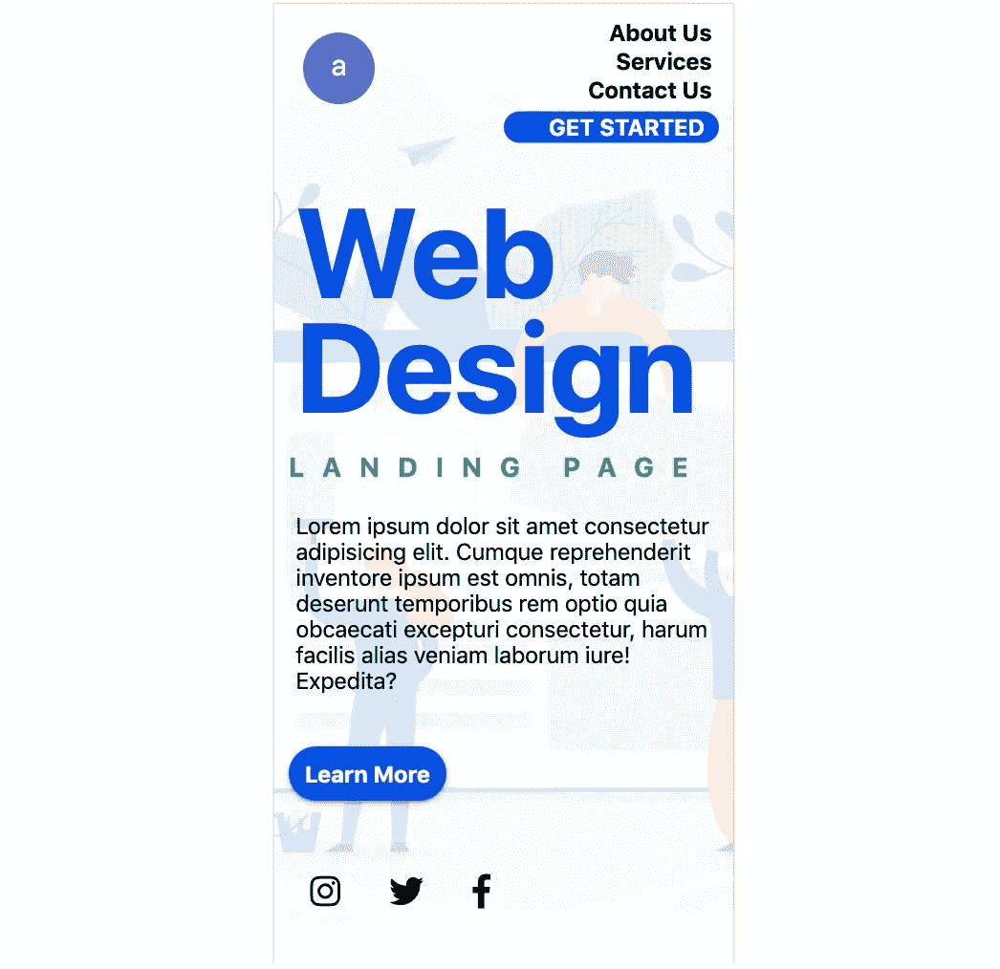

# 第二次审查

接下来，我通过使用 Chrome [DevTools](https://developers.google.com/web/tools/chrome-devtools) 检查不同的屏幕尺寸来检查其他断点。

织补…我的页脚不再固定在页面的底部，当我在移动视图上移除网格后。看起来不错，但是我有点挑剔。

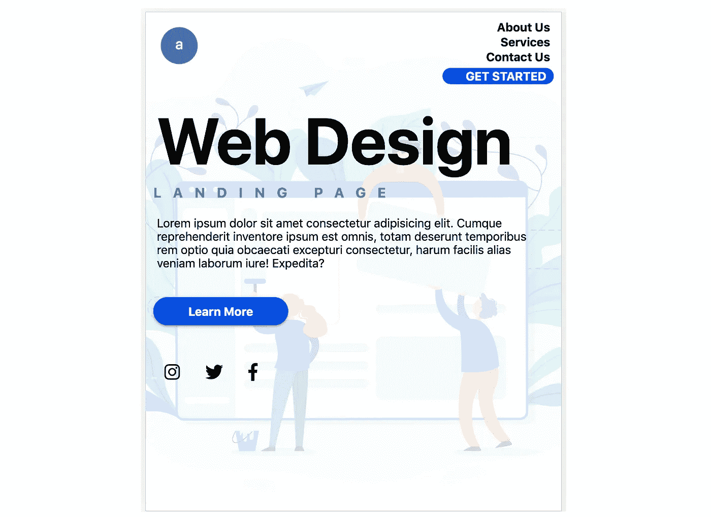

为了解决这个问题，我将`.grid-wrapper`改为一个 flex-container，并为`aside`添加一个 flex-grow 来将页脚推回到底部。

```
.grid-wrapper {
  display: flex;
  flex-direction: column;
}aside {
  flex-grow: 1;
}
```

最后一次检查…是的…如果你想查看实际的网站，你可以查看[我的网站](http://aliceyt.com/medium_articles/gridflex-demo/)。

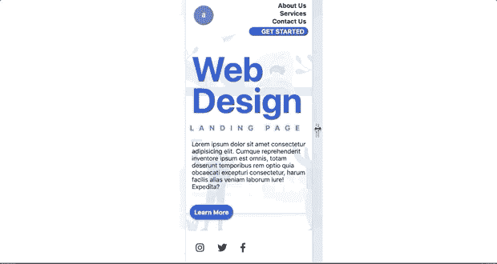

# 结论

创建一个网站比写关于创建它的文章要容易得多。然而，这是一个很好的练习，因为我可以准确地写出我想要达到的目标以及如何去实现它。我希望这篇文章对其他人有用。

如果你想使用这个网站设计，请随意从我的 GitHub 库中获取[。请务必按照我根据本文的流程对 CSS 文件中的样式规则进行排序。](https://github.com/tiffam/medium_articles/tree/master/gridflex-demo)

否则，你可以享受创建自己网站的乐趣。不管你采取什么方法，一旦你完成了它，你会有一种巨大的成就感。

# 资源

*   [我的 Github 知识库，包含本文的代码](https://github.com/tiffam/medium_articles/tree/master/gridflex-demo)
*   [我如何使用 CSS Grid 和 Flexbox 创建一个单页网站(第一部分)](https://medium.com/swlh/how-i-use-css-grid-and-flexbox-to-create-a-one-page-website-262aeea3592a)