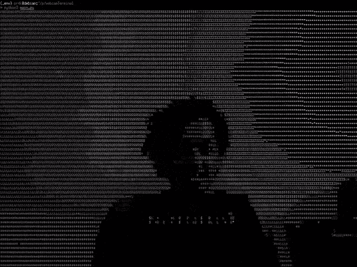
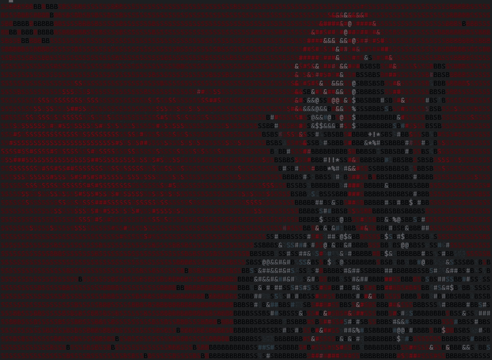

# 我如何将终端用作网络摄像头

> 原文：<https://betterprogramming.pub/how-i-use-my-terminal-as-a-webcam-b706ccc9d216>

## TE-WE 项目

首先，演示一下

Te-We 是一个专注于通过终端使用网络摄像头的项目。我们将从网络摄像头创建一个由 Python 驱动的终端流。

有一天，我在我的系统中寻找一个网络摄像头应用程序，但是找不到，因为我用的是 Debian Linux，而且我已经手动添加了每一个软件。我从来没有为网络摄像头下载过任何东西。

所以我想，“为什么不为此做一个带终端的东西呢？”我遇到了一个项目，是一个图像到 ASCII 的项目，我想，“为什么不把视频流和一个类似的项目结合起来呢？”因此 TE-WE 被开发出来。

这整个事情是从网络摄像头的视频流的 ASCII 艺术。

如果你觉得有趣，你可以在下面找到它的完整的无脚本编程视频。

回到代码部分，让我们从它开始。

# 第一步

使用实际图像创建一个 ASCII 图像。

# 第二步

将 ASCII 图像替换为视频流帧，并将它们一个接一个地打印出来，以获得连续帧的效果。

搞定了。

让我们详细讨论每件事。我们的第一个目标是转换以下图像:

死侍(图片来源:[walpaperist](https://www.walpaperlist.com/2020/01/wallpaper-deadpool.html)

转换成如下所示的 ASCII 图像。

死池(图片来源:作者终端)

一旦完成，剩下的就是创建一个视频流作为程序帧的来源。

先看代码。

我来解释一下这里的一切。现在，忽略第 10-12 行。剩下的部分很简单:将整个 RGB 图像转换为黑白图像，这样我们就可以实际获得每个像素的强度。

然后，根据每个像素的强度，我们将为每个像素找到一个合适的字符，并创建一个图像。

但问题是它仍然是黑白的，所以下一步将得到每个像素的近似 ANSI 颜色，因此我们将找到打印的彩色图像。

让我们看看将 RGB 转换为 ANSI 的代码。它取自图书馆[托里克拉斯/图像转 ansi](https://github.com/torrycrass/image-to-ansi) 。

这样，我们将从 RGB 获得 ANSI 颜色代码，然后我们只需要获得每个像素的 ANSI 颜色。

这是第 10-12 行开始发挥作用的地方。我们使用每个像素的 RGB 值，并在将图像转换为黑白之前单独保存 ANSI 颜色代码。

完成了——我们的第一部分完成了。

# 第二步

添加视频流很简单，在任何地方都可以找到，因为它只是使用`opencv`从视频中获取帧并将它们打印在屏幕上。

所以我们在这里，完成了。

# 反馈

一定要留下对项目的反馈。如果你想查看源代码，它在 GitHub 的 [pr4k/Te-We](https://github.com/pr4k/Te-We) 上。