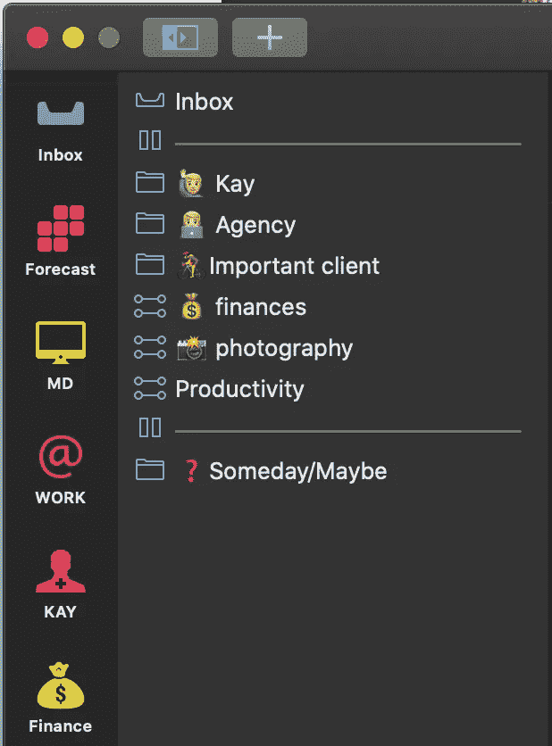
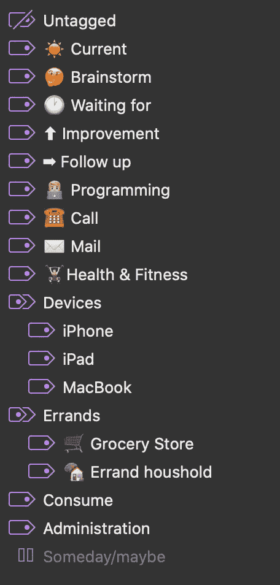

# 我如何使用 OmniFocus 来保持我个人和专业的工作效率

> 原文：<https://betterprogramming.pub/how-i-use-omnifocus-to-keep-me-personally-and-professionally-productive-4c13c6b4d21a>

## 软件开发人员和技术人员的理想任务管理应用

马库斯·斯皮斯克在 [Unsplash](https://unsplash.com?utm_source=medium&utm_medium=referral) 上的照片

[OmniFocus](https://en.wikipedia.org/wiki/OmniFocus) 是我用过的最强大的任务管理器之一。

我喜欢轻松的事情或 Todoist，用 Trello 来管理我的生活，也尝试过苹果笔记或更老派的实体笔记。所有这些对我来说都失败了，让我被清单上的大量事情淹没了。个人事务妨碍了职业事务，到期的任务被不太重要的事情压得喘不过气来。

因此，最大的问题是:我如何在职业和个人层面上进行管理，区分任务的优先次序，并在不需要的时候推迟任务，这一切都又快又容易？

# **为什么要有任务管理器？**

作为一名开发人员，非常重要的一点是，我可以利用结构化的时间进行开发，因为我知道所有未完成的任务都得到了很好的处理，并且没有分心的任务在我的脑海中流动。信任一个系统是很重要的，所以我可以在需要的时候集中注意力，并且知道什么时候有人对我有所期待。

我经常做很多事情，从寄发票到报税，到服用维生素，再到确保记录我在某些项目上的时间。如果这是我应该每天记住的事情，它会给我带来很大的压力。

我 80%的工作流程来自大卫·艾伦的书《把事情做好》简而言之:把你的大脑投入到一个系统中。确保你的大脑用于积极思考，而不是记忆任何东西。如果一项任务需要两分钟的时间，现在就去做——否则就推迟、归档或委派。

# 我的系统的基础

我已经和 OmniFocus 合作了三年多，但并不总是像现在这样顺利。以前，我有复杂的系统，有大量的标签和数百个项目。我当前系统中的一个关键概念是尽可能保持简单。在花太多时间之前，在你意识到之前，你会试着在你的大脑中再次记住一些东西。这是你想要避免的。

我尽量把我的项目保持在最少，尽可能列出单个行动的清单，只有在有明显好处的情况下才单独做一个项目。

有了标签，我真的很严格。在添加一个之前，我真的需要在好处上推销自己。

我经常推迟项目。在我的晨间回顾之后，我的盘子里没有我今天不想做的任务。如果列表是干净的，现在是下午 3:00，我可以跳到“下一个”透视图，以便查看所有其他被推迟的剩余项目。

到期日是承诺。我不会把虚构的截止日期放在我的任务上。当有一个到期日时，它必须在那一天发生。通常，这是对客户的承诺，或是报税或支付发票的截止日期。

# 收件箱

我的收件箱是我倾倒所有我需要做的事情的地方。我在 OmniFocus 里有一个收件箱，这是我想存放所有东西的地方。但是在路上，在会议期间，或者在其他情况下，这不是最简单的方法。我使用 iPhone 应用程序草稿捕捉我的所有想法，使用 Siri(将需要记住的事情添加到列表中，并自动同步到 OmniFocus)，在我的笔记应用程序(Apple notes)中写点东西，或者在会后做物理笔记。

会议结束后，我总是先处理笔记，将笔记放在正确的文件夹中，然后在 OmniFocus 中处理会议的待办事项。

我会尽可能地清理我的收件箱，无论是在开会前我有五分钟的时间，还是在我下班前。

当一个任务有一个项目和一个附加到它的标签时，该任务被处理。

# 项目

我的项目是我不经常使用的概述(视角)，而是将任务分组在一起的东西。如果一个任务有多个活动项，我会为它创建一个单独的项目。我将项目组织在一个简单的文件夹中。

*   凯(T1)(就是我)——这些都是我的私人物品。下面，我为任何与人相关的东西制定了名为“个人”的项目:维生素、健康相关、个人发展，或者为孩子或妻子制定的项目。一个家庭和花园项目有所有与家庭相关的差事:每两周修剪一次草坪，我需要收拾的东西或为房子规划的东西，或者我们寻找一个新的家来购买。
*   **代理**——下面是我为自己的网络代理服务的项目的客户文件夹。每个客户要么有一个包含多个项目的文件夹，要么在该文件夹下有一个项目。
*   **重要客户**——出于演示的目的，我很快给它重新命名，但我有一个自由职业客户，我 50%以上的工作都是为他做的，因此我在这里花了很多时间。对于这个客户，我处理这个文件夹下的三个不同的项目。
*   财务——比如我需要支付的发票、我需要申报的税款，或者会计师需要回答的问题，都在这里。
*   摄影**—我也是一名专业的体育摄影师，主要拍摄足球(荷甲联赛、欧洲联赛和欧洲冠军联赛)，这带来了编辑图像、向杂志发送肖像以及发送发票等任务。**
*   **生产率 —我读过很多关于提高生产率的文章。我想跟进或处理的想法都放在这个项目里。**
*   ****有一天/也许**——这是最大的文件夹，但我花的时间最少。这个文件夹包含阅读列表、电影列表、要看的电视剧、要读的有趣文章、给孩子和妻子的建议、愿望列表、我想听的播客、写作想法等等。**

# **标签**

**组合任务的另一种方式是任务类型，为此我使用了标签。发送电子邮件时，立即关注与发送电子邮件相关的其他任务通常是富有成效的。同样的道理也适用于跑腿，跟进事情，或者仅仅是告诉系统今天有些事情很重要。**

****

*   ****当前**——这是我主要在早上使用的标签。当我回顾我的一天时，我把这个标签分配给今天需要我注意的事情。这些通常是我第一件要拿的东西。**
*   **头脑风暴——例如，这是我用来搭建项目的标签。通常我知道我需要为一个特定的项目考虑可行的项目，但是我不想马上花时间。我会做一个标记为头脑风暴的任务，这样我就知道这是我应该尽快做的事情。**
*   ****等待** —此标签用于非常重要的任务。通常有一些任务是你在等待一个问题的回答。这是我想要的，这样我就不会忘记任何事情。**

**其余的标签仅仅是工作的类别，基本上不言自明。**

# **观点**

**视角是 OmniFocus 中的视图。这些可以由过滤器和设置组合而成，是管理你生活的强大仪表板。**

*   ****收件箱**——如前所述，这是一个大脑垃圾场，以确保我的大脑尽可能地空着。**
*   ****预测** —这是我开始一天的事情:哪些项目已经过期，哪些项目今天或明天到期，以及我有哪些会议。在今天早上的回顾中，我知道是否有任务需要延期、委派或推迟，或者今天是否有更多的时间来完成更多的任务。**
*   ****机构** —我有一个机构视角，向我展示与我的机构相关的所有可用项目，我需要做些什么来保持它的运行或为客户做些什么。**
*   ****重要** **客户** —重要的客户有自己的观点。这是非常理想的，因为在那些工作时间，我只需要在收件箱和透视图之间切换，就可以为这个客户专注于我盘子里的所有东西。**
*   **下一个——我也有一个视角叫做下一个。这是一个包含所有可用任务的透视图。如果我还有时间，我总是可以打开这本书，给自己当天可以做什么的灵感。**

# **每周和每月评论**

**每周五我都以每周回顾来结束。我会看到哪些任务仍未完成，以及我是否需要推迟任何事情或通知任何人潜在的延迟。此外，我试着清空收件箱，头脑风暴任务，这样周一将是新的一周开始。**

**在我的月度回顾中，我会检查每个项目，看看还有什么剩下的。我经常清理不再需要的任务，评估新的优先事项，看看是否有什么事情失控了，或者下个月可以改进。当回顾没有花费很多时间时，我也会回顾我的将来某一天/也许清单。但并不总是如此。**

**想保持联系，有问题，或者评论？
**在** [**推特**](https://twitter.com/kayintveen) 上加入对话**