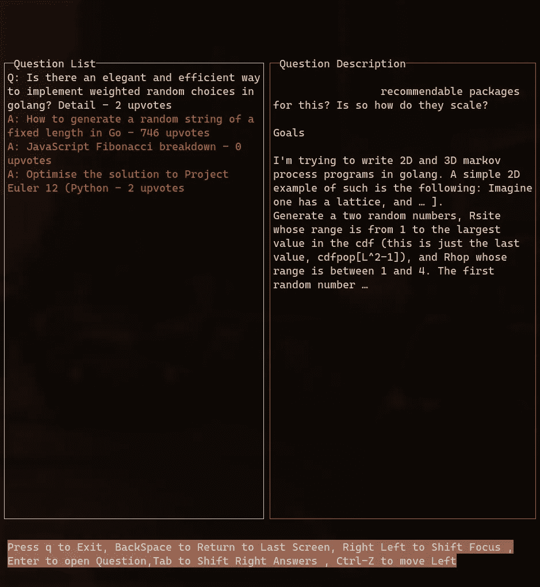
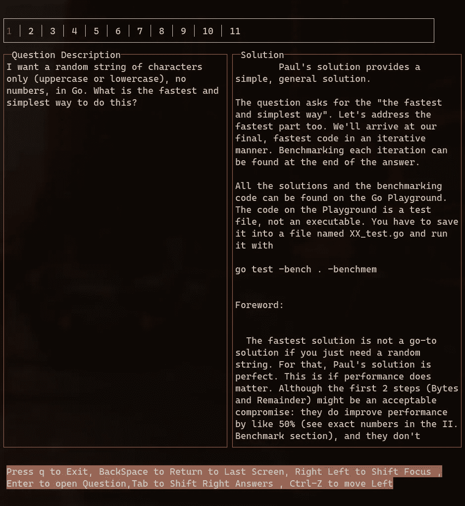

# 如何在 Go 中使用 StackOverflow 和我的终端

> 原文：<https://betterprogramming.pub/how-i-use-stackoverflow-with-just-a-terminal-go-17548716ab61>

## 不用离开终端就能得到我的编程问题的答案


使用 Canva 制作

大约一个月前，我遇到了一个用 Python 创建的项目， [*howdoi*](https://github.com/gleitz/howdoi) 。老实说，这太神奇了，不用打开浏览器就能找到基本问题的解决方案是一个救命稻草，所以我想为自己创建一个。我的主要目标之一是速度，所以我选择了 Golang。

因此，今天，让我向您展示如何仅使用终端来使用堆栈溢出。

# 创造一个良好的环境

关于如何安装 go 或者目录结构应该是什么样子，我就不赘述了。你可以在官方页面和文档中找到一切。

# 我们需要什么

*   使用搜索查询获取帖子的刮刀。
*   获取每个问题内容的刮刀。
*   显示解决方案的用户界面。

# 获取搜索查询的结果

一般的堆栈溢出搜索 URL 如下所示:

```
[https://stackoverflow.com/search?q=how+to+add+2+numbers](https://stackoverflow.com/search?q=how+to+add+2+numbers)
```

这使得我们很容易得到结果，因为我们每次需要改变的只是`search?q=` *之后的部分。*

获取页面内容后，我们的下一项工作是从正确的元素中获取内容，如标题、描述、帖子链接和 up-votes。为此，首先我们需要创建一个结构来存储这些数据。

为了获取页面的内容，我们将使用 [goquery](https://github.com/PuerkitoBio/goquery) 库。

从搜索中获取数据的代码片段是:

在检查源代码时，我发现这个问题存储在一个带有类`question-summary`的 div 中。因此，我们将用这个类迭代每个元素，并从 div 中获取所需的细节。

的类别:

*   帖子链接是`.result-link`。
*   问题描述为`.excerpt`。
*   票数最多的是`.vote-count-post`。
*   标题和链接标签是一样的，我们所需要的是获取标签的文本。

获得所有内容后，我们将把数据存储在一个 post 结构列表中。

获取数据的最终源代码如下所示:

在这之后，我们就完成了获取搜索页面的内容并将其存储在我们的数组中。下一部分将获取每个问题的内容，并将其存储在另一个数组中。

# 获取每个帖子的内容

我们在前面的数组中存储了每篇文章的 URL，我们下一步的工作是访问每个链接，从该页面获取内容，并将其存储在另一个数组中。

答案的堆栈溢出页面有两个部分，一个问题部分和一个解决方案列表。

我们将获得每个解决方案，并将其存储在另一个数组中，然后将答案与接受的答案一起返回。这将与前一部分相同。我们将为这部分使用的结构是:

```
type solution struct {
	description string
	upvotes     string
}
```

因此，问题的类别是`.question`，而被接受的答案的类别是`accepted-answer`。

在此之后，将使用相对 div 从接受的答案 div 中刮出剩余的答案。

获取问题内容的代码是:

```
var answers []solution
	question := res.Find(".question").Find(".post-layout")
	answers = append(answers, solution{strings.Trim(question.Find(".post-text").Text(), "\n"), question.Find(".js-vote-count").Text()})
```

获得可接受答案的代码是:

```
acceptedContainer := res.Find(".accepted-answer").Find(".post-layout")
	acceptedAnswer := solution{strings.Trim(acceptedContainer.Find(".post-text").Text(), "\n"), acceptedContainer.Find(".js-vote-count").Text()}
```

最后，为了得到剩下的答案:

所以，综合所有因素后，我们会得到:

我们有我们需要的一切，从搜索页面的问题列表，然后每个帖子的解决方案。

现在我们需要在 UI 中显示内容。我们将试图获得两部分，一部分是问题，另一部分是问题的描述。大概是这样的:



我们将使用的图书馆是 [termui](https://github.com/gizak/termui) 。我们的 UI 将有三个部分，一个是问题列表，另一个是问题描述，最后一个是可能的解决方案。

我们将一次显示两个部分。我不会涵盖整个图书馆，因为我们只需要它的一部分。

为了创建一个包含段落的框，我们已经在库中提供了一个小部件，但它的问题是我们不能滚动它，因此，我们将创建自己的段落小部件。

小部件的源代码如下。

对于结构:

剩下的代码库:

现在，解释整个代码将是另一篇文章，但为了给你一个要点，它基本上采取我们指定的样式并创建单元格，然后它采取整个文本并将其分成行。

然后，它遍历每一行，将它绘制到我们上面指定的单元格中，并将其放置在正确的位置。

重要的是:

这部分处理内容滚动，我们提供两个值，一个是开始，另一个是结束。

然后，它使用这些值来分割数组，这样我们在屏幕上只绘制了整个内容的一部分。这个开始和结束值将在每次按键时改变，因此内容看起来像是在滚动。

这一部分的其余部分非常简单，我们将使用这个新创建的小部件并创建三个包含不同内容的框。

我不会在这里显示这部分的代码，因为它会使文章不必要的长，相反，我会解释流程。所以，我们将首先创建三个段落。

示例代码:

然后唯一的任务就是在正确的按键上呈现正确的框。所以，termui 提供了一些功能，像*渲染、*渲染一个特定的元素和一个完整的键盘绑定来引用每个键。示例代码:

因此，如果有人按下 *q* 或 *CTRL + c* ，这将处理 UI 的关闭，我们可以添加其他情况来呈现按键上的正确框。

最后一件事大概是这样的:


你可以在 GitHub 上找到完整的[源代码。](https://github.com/pr4k/howto)

编码快乐！