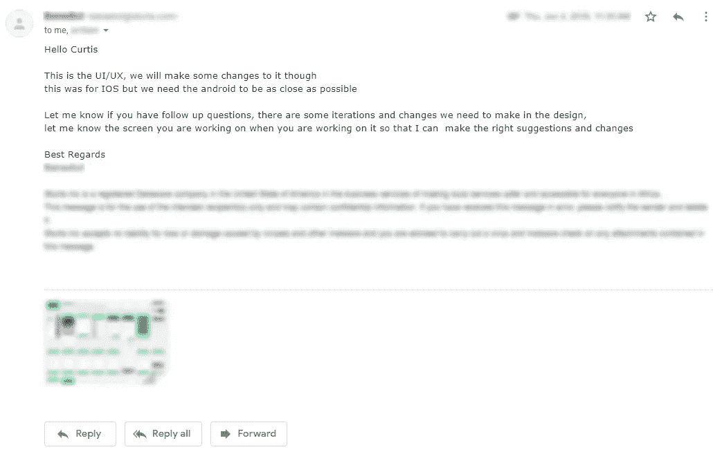
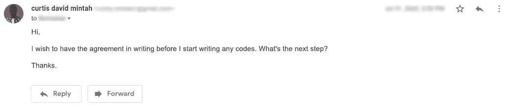
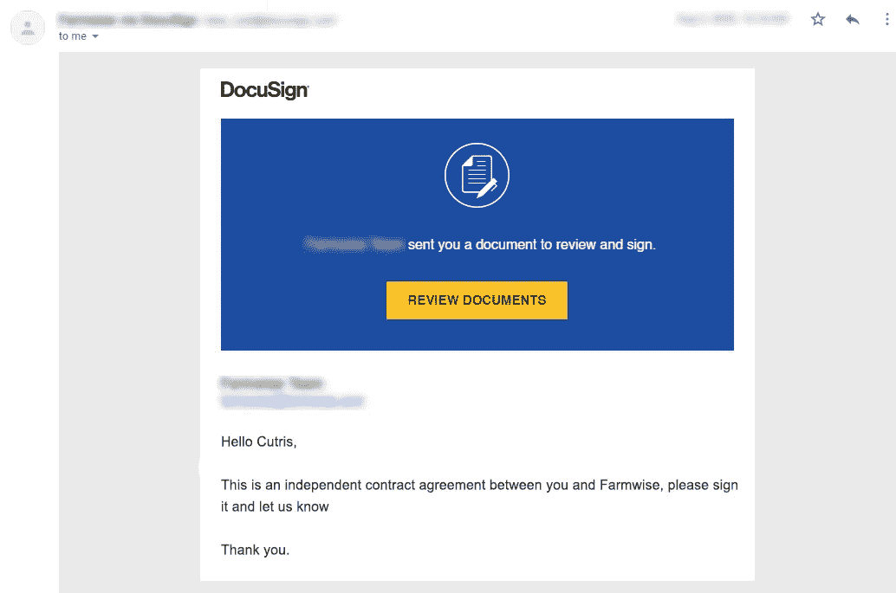
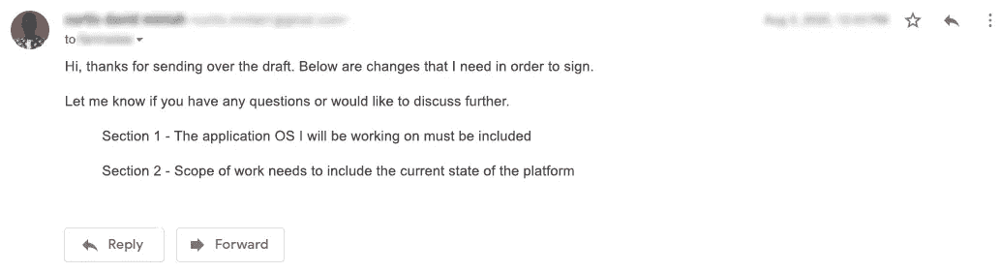
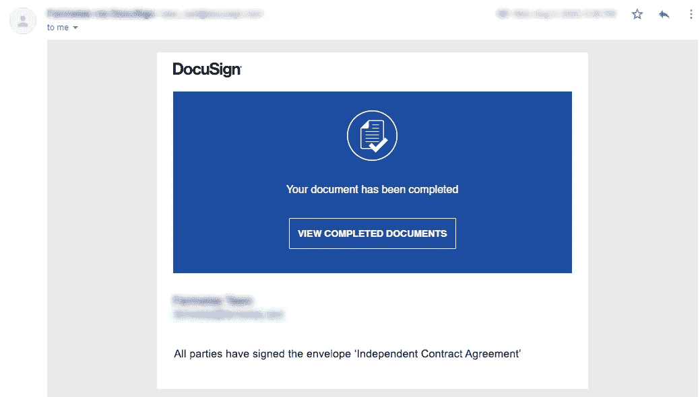
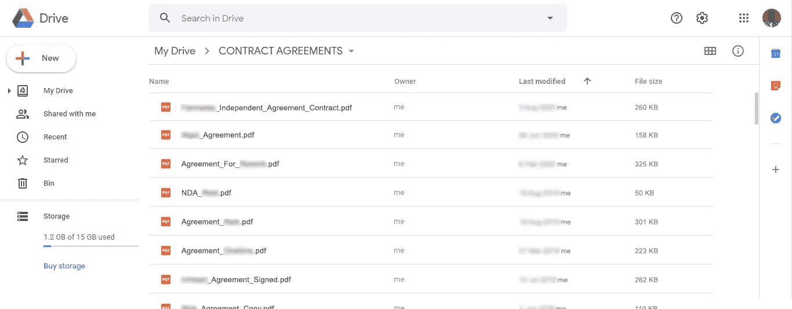

# 我如何在工作中使用书面协议来保护自己

> 原文：<https://betterprogramming.pub/how-i-use-written-agreements-to-protect-myself-at-work-43da5c8a5173>

## 在为他人工作时，通过使用书面协议来保护我的薪酬和职责条款

[Cytonn 摄影](https://unsplash.com/@cytonn_photography?utm_source=medium&utm_medium=referral)在 [Unsplash](https://unsplash.com?utm_source=medium&utm_medium=referral) 上拍摄。

听过有人说“协议就是协议”吗？直到我开始为人们开发应用程序，我才看到这句话的用处。虽然我知道合同很重要，但我并没有把它们当回事——至少在我与那些没有按照承诺给我报酬的初创公司合作之前没有。

大约 21 岁时，我自学了如何为 Android 平台开发应用程序。因为我渴望在我的简历上有很多东西，我申请了每一个软件开发的工作，并且对我碰巧参与的每一个项目都答应了，无论是本地的还是远程的。基本上，在我职业生涯的早期，我和任何愿意雇佣我的人一起工作。

这就是创业公司的创始人联系我时发生的事情。我们之前曾在不同的项目上合作过，所以我毫不犹豫地答应了。要求和补偿很简单。我会在一个月的时间内开发一个应用程序，在开始后的两周内收到一半的付款，另一半在另外两周内。接下来，我收到了设计的电子邮件，我开始工作。

作者截图。

快进到时间线的两周，我已经暂停了所有其他项目，只为开发这个应用程序。我白天有工作，所以我唯一能编码的时间是深夜。但是每天早上，我仍然会发送一个更新版本的应用程序测试版。

现在，就在第一笔付款的两个星期快到了的时候，他们告诉我，赞助商推迟了他们的资助。一个月后，当完整的应用程序准备好的时候，我仍然没有收到任何付款。这一次，他们告诉我，整个项目已经被搁置，因为组织者希望对它进行一些修改。直到今天，我还没有听到他们关于应用程序或付款的消息。我仍然有密码，但那些不眠之夜都是徒劳的。

虽然我过去也有过类似的经历，但这是我的巅峰之作。我得到了教训，从那以后，我承诺自己再也不为没有书面协议的人工作了。

几周前，我申请了一份 Android 开发人员的工作，并被接受参与这个项目。两天前，当我收到我刚刚与他们签署的协议的最后一封电子邮件时，我想起了我过去常常为协议争吵的那些时光。所以我坐在我的办公桌前写这篇指南来告诉你我现在是怎么做的。这是我使用的过程，但是你也可以用它来省去那些麻烦。我把这个过程分成了以下几个步骤:

*   对自己充满信心。
*   要求一份书面协议。
*   审阅文档。
*   做出改变。
*   签署文件。
*   保存副本。

# 对自己充满信心

在我的创业经历之后，我做了很多思考，想知道为什么会发生在我身上。我发现我只是把我得到的软件开发工作看作是在我的简历上增加一项内容的机会。结果，我总是害怕如果我提起书面协议之类的东西，我会被别人抛弃。

每当我接到为任何人工作的电话或电子邮件时，我都觉得他们刚刚帮了我一个大忙，我不会因为坚持要把我们的协议写在纸上来吓跑他们而毁了它。毕竟，他们本可以联系其他软件开发人员，但他们给我打了电话。我觉得如果我不和他们一起工作，我会错过机会，以后会后悔的。

解决办法是消除这种恐惧。但是尝试了一段时间后，我意识到我做不到。我对自己作为程序员的技能还没有信心。是的，我可以创建应用程序，但是我仍然需要学习很多东西。所以我在想，我能做些什么来增强我对 Android 编程技能的信心。

这些是我问自己的问题:

*   我真的掌握了技巧吗？
*   为了做到这一点，我需要什么？

我根本没有掌握 Android 编程。在我需要掌握的其他技术中，我确定了像科特林、人工智能和区块链这样的东西。这些都是大多数 Android 开发者懒得去学的东西。

从那时起，我开始阅读和观看更多关于这些主题的课程，甚至有更多的不眠之夜是在编码上度过的。渐渐地，通过这样建立自己，我发现我的自信水平上升了。现在，每当我有机会参与任何项目，我都会告诉自己，我是这项工作的最佳人选。我告诉自己，我是帮助别人的人，而不是相反。

这里的挑战是，我没有太多的项目，而且在没有协议和合同的情况下得到一份软件开发工作已经很难了。但是随着时间的推移，我参与的项目越来越多，这开始为我说话。如果你发现很难向别人展示你的价值，关键是要把你的技能提高到你的工作开始说话的程度。

# 要求书面协议

由于我的自信程度很高，没有书面协议，我不会为任何人工作。我带你看一下我刚刚签的那份。当我被接受参与这个项目时，我知道这也不例外。

你看，我工作的大多数软件项目都是远程的，团队成员在世界的不同地方。这对我来说更为严重，因为我不一定会亲自见到和我一起工作的人。因此，在为任何人编写一行软件代码之前，我需要将达成一致的内容写下来，以备将来参考。

首先，我们讨论了这个应用程序将做什么，以及我将照常获得多少报酬。在那些电子邮件和 Skype 电话之后，我开始写下我对这个项目的所有期望。当我确信我明白了一切，我发了一封电子邮件，要求将协议写成书面形式。我收到一封电子邮件，说他们正在努力。

作者截图

其他项目并不总是如此顺利。问题是，有时我会遇到一些人，他们根本不想与书面协议有任何关系。一开始这很有挑战性，但是现在我试着不再和这样的人一起工作。

如果我提出将我们的协议写入一份具有法律约束力的文件，而另一方开始找借口，我会问自己，这些协议是不是真的。几乎在所有情况下，这个问题的答案都是否定的。如果他们不能用墨水写下他们所说的同样的事情，我怎么能相信他们所说的呢？所以根据经验，我避免和这样的人一起工作。也尽量避免它们。安全总比后悔好。

# 审阅文档

在收到他们正在处理协议的消息后，第二天我就收到了一封电子邮件，里面有该文档的链接。

作者截图。

我打开链接，开始检查写了些什么。这样做的时候，我会注意文档中的每一个细节。我一点都不急这一步。我不想遇到错过了什么，发现太晚的情况。

基本上，我会花时间仔细检查协议的每一部分。在我刚刚签署的那个案例中，我只花了几个小时就完成了。对于其他人，我会花一两天时间浏览协议中的信息。如果我喜欢我看到的一切，我会继续前进。如果没有，我会停下来，在某个地方记下来。我一直这样做，直到文档结束。

审查合同的挑战是，措辞有时可能太专业，我没有律师或律师朋友帮我检查。但是现在，我至少能够浏览文件并理解正在发生的事情。然而，我总是对自己说，如果我需要聘请律师来处理这些事情，我会很乐意这样做。如果你也发现有必要这样做，不要犹豫，找有资格的人来帮忙。

# 做出改变

当我看完这份文件时，你瞧，里面有许多错误。需要改变的事情。

我在网上账户和电子邮件中使用大卫·柯蒂斯·明塔。然而，对于法律文件，我更喜欢使用大卫·C·明塔。现在在文件中，我的全名被用来代替我的法定姓名。尽管如此，“柯蒂斯”还是被拼错成了“卡特里斯”真的吗？这不好笑。

我注意到在书面协议中要求修改的一些事情。这向对方表明你已经真正地浏览了文档。

合法的名字不是我唯一需要改变的。我还发现文档中的一些行过于含糊不清。一个恰当的例子是文件中的一行，上面写着:“开发者将为公司提供开发移动软件应用的服务。”它一点也不具体，需要是:“开发者将为公司执行，为 Android OS 设备开发移动软件应用程序的服务。”强调 *Android OS 设备*。

然后，我发了一封电子邮件，要求做出这些改变。

作者截图。

几个小时后，我收到了更新的文档。

在某些情况下，其他文件不需要修改。这很好，实际上向我表明他们和我一样注重细节。

正如我提到的，要求修改书面协议表明你真的花了时间仔细阅读了文件。但更重要的是，任何不愿意对文章进行修改的人都是一个危险信号，可能会让我难以共事。如果你也遇到这样的人，小心对待他们，因为我就是这样做的。

# 签署文件

既然我已经做了所有必要的编辑，并且对协议感到满意，现在是我签名的时候了。这才是有效的。

在签署文件之前，我需要注意几件事。首先，我要确保确实有一个空间让我签名。接下来，我确定对方的名字和签名已经在那里了。最后，我要确保日期在那里，而且准确无误。如果这些东西不存在，我拒绝这个文件，并要求在我签字之前更正它。没有这些，一开始就没有必要为我写书面协议。

对于发给我的文件，所有这些东西都在，所以我签了字。底部是公司名称和签名，后面是我的名字和一个供我签名的地方。

作者截图。

因为它是一个数字文档，所以有许多签名选项，包括绘制签名、键入签名和上传签名的图片。但正如我通常所做的，我选择了上传我的签名照片的选项。我更喜欢这样，因为我已经在我的笔记本电脑上有了我的签名的副本，我所要做的就是在必要时将它上传到任何文件的签名空间。我是通过在一张白纸上签名，扫描，然后裁剪成小尺寸得到它的。

你不必担心你的签名每次看起来都一样。一开始，我很担心这个。但后来，我发现重要的是它是独一无二的——而不是每次签名都是精确的。因此，在我们得到一个使用我们的 DNA 或其他奇特的东西来签署文件的系统之前，我建议对你的数字文件也使用扫描签名。

# 保存副本

签字后，协议的 PDF 副本立即发送到我的电子邮件中。因为对方的签名已经存在于文档中，所以该过程结束。我剩下要做的唯一一件事就是把文件放在安全的地方。

一开始，我在笔记本电脑上创建了一个文件夹，用来存放如此重要的文件。但是在换了两次笔记本电脑后，我意识到这不是一个好方法。我决定把它们放在网上。这是我的谷歌硬盘的用途之一。

作者截图。

我在 Google Drive 上创建了一个文件夹，保存我签署的每一份协议。这很重要，因为一旦它被保存在网上，我就可以随时访问它，以供将来参考。Google Drive 也可以免费使用，何乐而不为呢？

我不只对数字文档这样做。我也用同样的方法保存纸质文件。我把它们扫描成 PDF 文档，然后上传到同一个 Google Drive 文件夹。

如果你要在网上保存重要的文件，确保你是唯一可以访问它们的人。如果任何人得到了你的登录信息，他们可以对你的文档做任何他们想做的事情。

# 概括起来

说你已经和某人达成协议是一回事，实际上把它写下来并签字确认是另一回事。我在职业生涯的早期并不知道这一点，所以最后做了很多工作却一无所获。这些天来，我不允许这种事再发生在我身上了。

我这样做的简单方法是，确保达成的任何协议都以书面形式记录下来，然后在一个安全的地方为自己保留一份副本。

有时候，实践我在这里提到的所有建议很有挑战性——即使对我来说也是如此。这让我开始问自己为什么要经历这些麻烦。但后来我记得我对自己许下的承诺，不允许任何人认为我的工作是理所当然的，我遵循了这个过程。