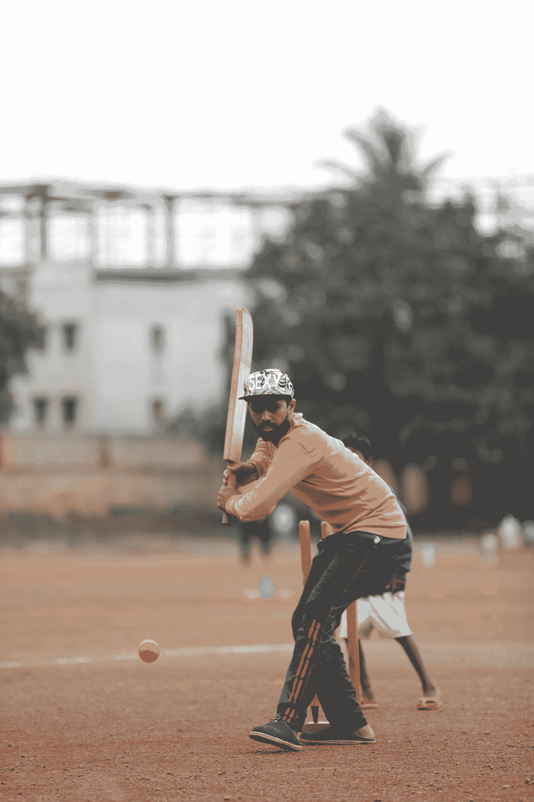
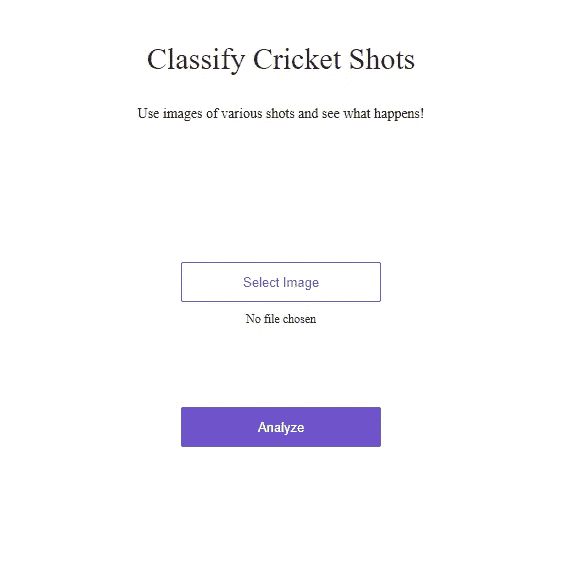
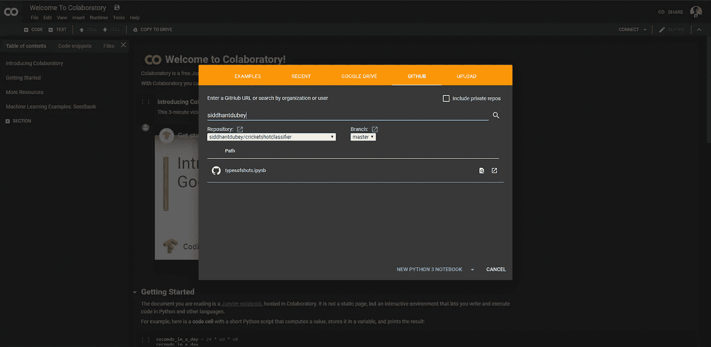
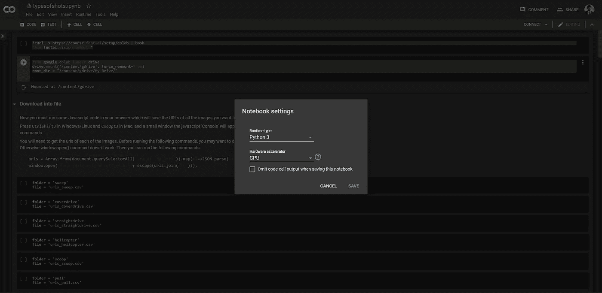

# 我如何使用卷积神经网络对板球击球进行分类

> 原文：<https://betterprogramming.pub/how-i-used-a-convolutional-neural-network-to-classify-cricket-shots-d44197e79aff>



照片由[苏珊·库尔卡尼](https://unsplash.com/@sushanthkulkarni07?utm_source=medium&utm_medium=referral)在 [Unsplash](https://unsplash.com?utm_source=medium&utm_medium=referral) 拍摄

我最近深入研究了深度学习的世界；更具体地说，图像分类。

在完成了 fast.ai MOOC 的第一堂课后，我决定去他们的图书馆玩一会儿。这让我制作了一个模型，可以对不同类型的板球击球进行分类。

在[尝试分类板球击球](https://types-of-cricket-shots.onrender.com/)。模型并不完美，但确实有 96%的准确率。



我的图像分类器网络应用！

# 设置先决条件

对于这个模型，我使用 Google [Colab](https://colab.research.google.com/) 来托管我的笔记本。

这个过程的第一步是去[https://colab.research.google.com/](https://colab.research.google.com/notebooks/welcome.ipynb#recent=true)用你的谷歌账户登录。

您应该会看到一个类似如下的屏幕:


Google Colab 欢迎屏幕

如果您想继续学习本教程，您应该按照下面的步骤在 Colab 中打开我的 GitHub 存储库中的笔记本。

要从我的 GitHub 存储库中打开笔记本，请点击 GitHub 选项卡，并输入: *siddhantdubey* 。



这是弹出的屏幕

接下来，点击`typesofshots.ipynb`文件。不要担心笔记本中弹出的错误消息，我们会处理好的。

为了确保您的笔记本将使用 GPU 加速器，请单击顶部选项卡上的`runtime`，然后单击下拉菜单中的`change runtime type`。

您应该会在屏幕上看到:



笔记本设置

选择 GPU 作为您的硬件加速器，我们就万事俱备了。

# 编写代码

本教程中的大部分代码将获取和清理数据。此外，我将更多地关注如何让它工作，而不是为什么它会工作。

第一步是导入我们需要的库。

```
!curl -s https://course.fast.ai/setup/colab | bash
from fastai.vision import * 
```

运行笔记本中的代码块，下载并导入 fast.ai 视觉库。

下一步是确保笔记本电脑将必要的数据保存到您的驱动器上，并且能够导入数据。

为此，请运行以下代码块:

```
from google.colab import drive
drive.mount('/content/gdrive', force_remount=True)
root_dir = "/content/gdrive/My Drive/"
```

这将确保您的数据是好的和可用的。

现在是真正下载数据的时候了！

我们将获得六种板球击球的图像:

*   清扫。
*   封面驱动。
*   直道行驶。
*   直升机开枪了。
*   独家新闻。
*   拉拍。

还有更多的类型，在完成本教程后，您肯定也可以尝试这些类型。

键入您想要的搜索查询，在这种情况下是“板球扫描镜头”)，用您想要的每种板球镜头替换“扫描镜头”。

然后在 Windows/Linux 下按`Ctrl+Shift+J`，在 Mac 下按`Cmd+Opt+J`，就会出现一个小窗口(JavaScript 的‘控制台’)。

这是您粘贴 JavaScript 命令的地方:

```
urls = Array.from(document.querySelectorAll('.rg_di .rg_meta')).map(el=>JSON.parse(el.textContent).ou);
window.open('data:text/csv;charset=utf-8,' + escape(urls.join('\n')));
```

复制并粘贴到控制台，它应该开始下载图像。

将下载文件重命名为`urls_sweep.csv`，其中“sweep”是任何照片的名称，没有空格或大写字母。

接下来，在你的 google drive 中创建一个名为`data`的文件夹，并在这个文件夹中创建另一个名为`shots`的文件夹。

将获得的所有 CSV 文件上传到`shots`文件夹。

**接下来的步骤必须严格按照这个顺序进行！**

1.  运行这个代码块。

```
folder = 'sweep'
file = 'urls_sweep.csv'
```

2.运行这个代码块。

```
path = Path(root_dir + 'data/shots')
dest = path/folder
dest.mkdir(parents=True, exist_ok=True)
```

3.运行这个代码块。

```
classes = ['sweep', 'coverdrive', 'straightdrive', 'helicopter', 'scoop', 'pull']
```

4.运行这个代码块。

`download_images(path/file, dest, max_pics=1000)`

对每个文件夹的文件块重复这四个步骤，总共六次。

接下来，运行以下代码块:

```
for c in classes:
    print(c)
    verify_images(path/c, delete=True, max_size=500)
#This deletes all the images that it cannot open
```

我们刚刚做的是为每一个不同类型的镜头创建文件夹，然后我们将图像从 CSV 文件下载到所述文件夹中。

# 创建数据集

现在我们必须创建数据集本身。

为此，请运行以下代码块:

```
np.random.seed(42)
data = ImageDataBunch.from_folder(path, train=".", valid_pct=0.2,
        ds_tfms=get_transforms(), size=224, num_workers=4).normalize(imagenet_stats)
```

这从我们的路径`data/shots`创建了一个数据集，它将所有的图片转换成一个 224x224 的图像。

为什么是 224x224？这使得模型更容易阅读，我们也更容易编码。

运行以下两个代码块将向我们展示我们的类(标签)和数据集中的一些图像。

```
data.classesdata.show_batch(rows=3, figsize=(7,8))
```

接下来，运行此代码块以获得更多关于数据集大小的信息:

```
data.classes, data.c, len(data.train_ds), len(data.valid_ds)
```

# 训练模型

我们终于准备好训练我们的模型了！

就代码而言，这是该过程中最短的一步，但就时间而言，它有可能是最长的一步。不是因为它很难编码，而是因为它需要多大的处理能力。

如果你试图在你的电脑上而不是像 Google Colab 这样的外部主机上做这件事，它会花更长的时间。

首先，运行下面的代码块:

```
learn = cnn_learner(data, models.resnet50, metrics=error_rate)
```

这使用 ResNet-50 模型创建了一个卷积神经网络。ResNet-50 是目前最好的图像识别模型之一。

接下来，运行这段代码来训练网络。

```
learn.fit_one_cycle(5)
```

这将训练五个“时期”的模型，并向您显示每个周期的错误率。

运行下面的代码块来保存模型，并了解什么时候最有效。

```
learn.save('stage-1')
learn.unfreeze()
learn.lr_find()
learn.recorder.plot()
```

这将保存模型，解冻它以进行进一步的训练，并绘制出训练的效率。

```
learn.fit_one_cycle(2, max_lr=slice(3e-5,3e-4))
```

通过运行上面的代码块，我们提高了模型的准确性，并有可能通过为更多的时期(如五个时期，而不是当前的两个时期)训练它，使其超过 96%的准确性。这取决于你。

要再次保存模型，请运行以下代码块:

```
learn.save('stage-2')
```

# 解读数据

首先，我们需要加载模型，看看它有多好。

```
learn.load('stage-2');
```

在一个时期内再训练一次。

```
learn.fit(1)
```

要获得模型有效性的解释，请运行以下代码块:

```
interp = ClassificationInterpretation.from_learner(learn)
```

要显示混淆矩阵，它向您显示每个类别中的图像与正确标签匹配的次数，请运行以下代码块。

```
interp.plot_confusion_matrix()
```

从左上角到右下角的对角线展示了每张图像被正确识别的频率。

要查看哪些图像最容易混淆(我个人最喜欢的统计数据)，请运行以下代码块:

```
interp.most_confused()
```

要绘制最大的损失——模型最有把握的图像，但无论如何都出错了——运行以下代码块:

```
interp.plot_top_losses(9, figsize=(15,11))
```

我们完了。如果您希望将您的生产模型导出为 web 应用程序并进一步测试它，请继续阅读。

# 导出您的模型

运行以下代码行:

```
learn.export()
defaults.device = torch.device('cpu')
learn = load_learner(path)
```

这会将一个`export.pkl`文件保存到您的 Google Drive 的 data/shots 目录中。

完成此操作后，不要再次训练您的模型，否则它会将`shots`作为要训练的职业之一。

要把这个模型变成一个网络应用程序，请跟随[这篇非常简短简单的教程](https://course.fast.ai/deployment_render.html)。这将有助于你将你的模型(希望不是这个)发布为一个 web 应用程序，就像我的一样。大约需要 10 分钟，非常简单。

如果你喜欢这篇文章，可以考虑订阅我的简讯:【https://mailchi.mp/35c069691d2c/newsletter-signup。

# **资源:**

[FastAI 课程](https://course.fast.ai/)

[我的板球射门分类器 github 储存库](https://github.com/siddhantdubey/cricketshotclassifier)

[如何将您的模型部署到 web 上。](https://course.fast.ai/deployment_render.html)