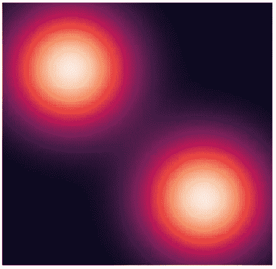

# 我如何使用 Python 创作我的第一件 NFT 作品

> 原文：<https://betterprogramming.pub/how-i-used-python-to-create-my-first-nft-artwork-ea5951dce599>

## 在过去的几个月里，我听说了 NFT，并试图制作自己的数码艺术品


我不会画画，但我想在 NFT 世界创造自己的天地。由于我非常擅长 Python 编程语言和数学，以下是我如何使用 Python 创建我的第一个加密作品。

# 什么是 NFT？

NFT 的意思是不可替代的代币。它是一种证明资产属性的数字证书。不是资产本身，而是给谁拥有谁一些权利的凭证。NFT 的所有权由区块链证明。最常用的区块链是以太坊的区块链，你也可以在便宜的区块链上找到 NFT(比如多边形)。

# 如何使用 NFT？

NFTs 可以用来表示几乎任何可能的资产，并被艺术家广泛用于出售他们的艺术作品的一些权利。你也可以创建一个音频和视频的 NFT，但是 NFTs 最常见的用途与视觉艺术有关

由于 NFT 是代币，因此可以在创建它们的区块链中进行交换。给某物冠上 NFT 是一种叫做“铸造”的操作。NFT 从一个所有者转移到另一个所有者可以免费完成，也可以通过支付加密货币的价格来完成。这就产生了一个非森林产品市场。每卖出一部 NFT，原作者就能赚到一些版税(一般高达 10%)。这就是为什么这种数字资产在过去的几个月里变得越来越受欢迎。

# 我的项目

由于我不擅长画画，所以我决定创建一个 Python 程序，根据一些数学公式为我画一些东西。出售合成 NFT 艺术品并不罕见。一些艺术家使用电脑程序来创作他们的艺术品，我也想这样做。

我很擅长数学，所以我想用这种技能来制作美丽的图片。

# 让数学为你画画

这个想法是在网格值(图像的像素)上使用 2D 函数。根据特定的颜色渐变，每个点的颜色与该函数的值相关。

我需要创建一个数学函数。我决定使用多元高斯分布。特别是，我将两个高斯分布相加，创作了一幅名为“高斯之爱”的作品。

多元高斯分布包含在 scipy 库中，而绘图本身是使用 seaborn heatmap 执行的。

想法是创建一个数值网格(我用一个从-3 到 3 的正方形来表示 x 和 y)，在这个网格上映射函数，然后绘制结果。

# Python 中的代码

首先，让我们导入一些有用的库。

```
import numpy as np
from scipy.stats import multivariate_normal
import seaborn as sns
import matplotlib.pyplot as plt
import itertools
```

现在，让我们考虑[-3，3]区间，创建一个 100x100 像素的网格。

```
x = np.linspace(-3,3,100)
y = np.linspace(-3,3,100)
xy = list(itertools.product(x,y))
```

现在让我们定义两个要求和的函数。它们是两个二元正态分布。第一个分布的平均值为(-1.5，-1.5)，第二个分布的平均值为(1.5，1.5)。两种分布都是球对称的，方差等于 1。

```
f1 = multivariate_normal(mean=[-1.5,-1.5],cov=1)
f2 = multivariate_normal(mean=[1.5,1.5],cov=1)
```

我们现在可以创建一个*内核*函数来计算两个分布的和。

```
kernel = lambda x:f1.pdf(x) + f2.pdf(x)
```

最后，可以计算并存储像素上的这种函数值。

```
z = [kernel([a,b]) for (a,b) in xy]
```

我们可以很容易地用 seaborn 绘制结果。

```
plt.rcParams["figure.figsize"] = [7.00, 7]ax = sns.heatmap(np.array(z).reshape(len(x),len(y)),
yticklabels=False, xticklabels=False, cbar=False)
```

这是结果。



# 后续步骤

这个想法似乎很有趣，所以我创建了一个用这种方式制作的 Opensea 绘画集。我称之为[神奇的数学](https://opensea.io/collection/amazing-math)。我随机化了一些参数和函数，以创建不同的图像。

例如，我已经随机化了所使用的高斯分布的数量、它们的中心、协方差矩阵以及具有非对称高斯函数的概率。最后，我根据我认为最合适的颜色选择了合适的调色板。调整这种软件的参数和选择最好的调色板是我的创造力和审美工作的重点。

# 结论

我认为秘密艺术是一种非常好的方式来表达我们自己，用我们的创造力赚钱。如果我们不会画画，但我们擅长数学和编程，我们可以很容易地开发软件，为我们画一些画。

你可以在这里找到我的 NFTs:【https://opensea.io/collection/amazing-math 