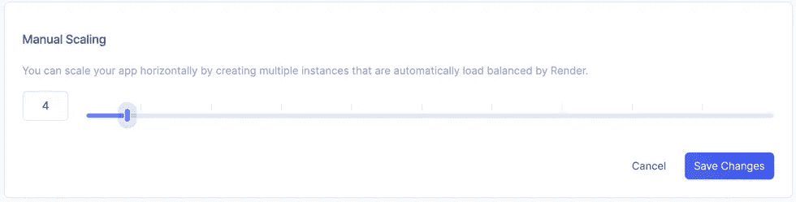
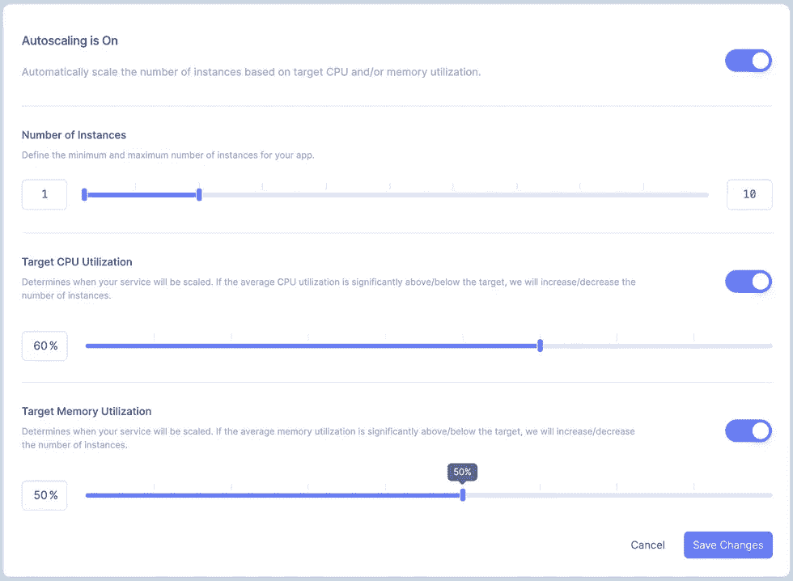
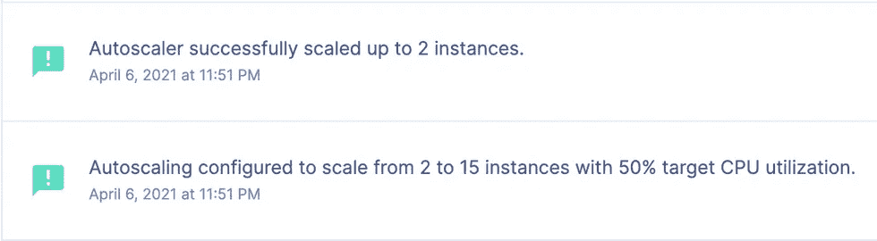
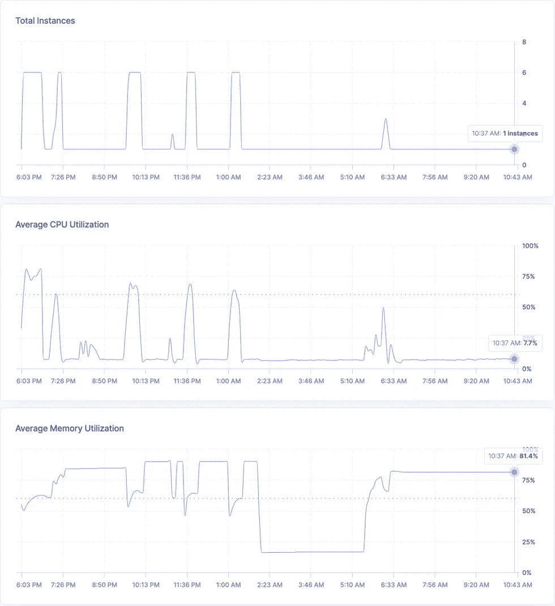

# 我如何使用 Render 轻松扩展我的微服务应用

> 原文：<https://betterprogramming.pub/how-i-used-render-to-scale-my-microservices-app-with-ease-1e8962f66b53>

## 当需要扩大/缩小规模时，时间就是金钱。了解使用 Render 扩展您的应用和服务有多简单

照片由 [imgix](https://unsplash.com/@imgix?utm_source=medium&utm_medium=referral) 在 [Unsplash](https://unsplash.com?utm_source=medium&utm_medium=referral) 上拍摄

作为一名软件主管和特性开发人员，我见证了一个团队学到了关于资源扩展和云的重要一课。剧透:教训是，如果你不小心，扩展可能会变得昂贵！

团队认为他们别无选择，只能在高负载下不断增加给定服务的实例数量。当他们完成纵向扩展时，实例的数量比默认配置的实例数量多几倍。他们当时没有意识到——尽管负载恢复到正常状态——他们的额外实例仍然存在。

每个人似乎都接受这种“按需扩展”的方法……直到他们收到云提供商的下一张发票。

这种情况让我想到了 [Render](https://render.com/) ，一个我越来越多地在我的一些项目中采用的平台。这让我想知道使用 Render 在基于云的应用程序和服务中实现扩展有多容易。另一个剧透:很简单。

# 基于云的扩展概念

您的应用程序或服务的消费者有一个共同的期望:他们的所有请求都应该在合理的时间内得到处理。

与此同时，解决方案所有者也有期望，包括:

*   确保满足客户的期望
*   将成本控制在计划预算内
*   最大限度地减少停机和停机，尤其是与性能相关的停机和停机

当需求水平低于用于处理每个请求的技术的最大能力时，所有这些期望都很容易满足。当需求开始超过这些水平时，事情就变得有趣了。

挑战在于找到一个既能满足预期又能保持成本合理的最佳点。这就是基于云的扩展概念发挥作用的地方。对于基于云的扩展，重点是扩大服务实例的数量以满足当前需求，但当需求减弱时，再缩小规模。

# 三种场景

我们将讨论自动缩放的三种使用情形:

1.  手动缩放
2.  自动扩展
3.  自动缩小

让我们通过一个场景示例来探究每个用例。

# 手动缩放

手动伸缩的概念适用于对其应用程序或服务的需求有深刻理解的团队。

例如，考虑一个与所得税相关的服务，它在客户填写纳税申报表时回答客户的问题。支持此服务的团队可能有几十年的使用模式信息，这使他们能够确定全年需要多少服务实例。

有了这些信息，手动缩放方法将会满足消费者，因为团队总是知道应该有多少实例可用。解决方案所有者很高兴，因为他们的每月支出完全在预算之内。

当然，这些信息不考虑预期使用模式的重大变化。例如，关于服务的新闻稿可能会突然对需求产生积极或消极的影响。

# 自动扩展

自动扩展方法将实例数量置于由服务所有者创建但由云提供商强制实施的预定义阈值之下。当超过这些阈值时，实例的数量将会增加，直到需求下降到预期水平。大多数提供者允许用户设置最大实例数来限制可以产生的实例数。

虽然对每月预算的影响存在一些不确定性，但解决方案所有者可能会使用这样的理由:对其服务需求的增加通常与新的或升级的订阅有关，这会带来额外的收入。

这就是“你必须花钱才能赚钱”这个概念发挥作用的地方。

当实现自动向上扩展策略时，我总是建议对自动向下扩展也这样做。

# 自动缩小

自动向下扩展的方法类似于自动向上扩展，只是服务数量会随着需求的减少而减少。虽然自动扩大功能可以很快引入新实例，但自动缩小通常会延迟，以避免过早缩小。

回想一下我在引言中提到的团队，如果他们为我提到的服务采用了自动缩减，他们就不会遇到在高峰需求消退后让所有这些实例正常运行的巨大冲击。

提供自动扩展的云提供商现在将自动扩展与自动缩减相结合，因为这是该功能更常见的实现方式。

# 渲染时缩放

今年我已经写了几次关于渲染平台的文章。以下是我关于这个主题的一些其他出版物的链接:

*   [第一次使用 Render and Go](https://medium.com/better-programming/how-to-create-a-web-service-using-render-and-go-75d211421a00)
*   [遮光罩下:渲染统一云](https://medium.com/better-programming/render-unified-cloud-under-the-hood-940d097cede8)
*   [目的驱动的微服务设计](https://medium.com/better-programming/purpose-driven-microservice-design-c25fa2a3ad0e)
*   [在一天内启动你的创业想法](https://medium.com/better-programming/launch-your-startup-idea-in-a-day-using-the-render-platform-e28b736e7535)

我了解到他们非常重视零债务的承诺。正如所料，使用 Render 进行缩放很容易，并且由一个简单的用户界面驱动。

对于在启动计划(或更高计划)下运行的服务，手动缩放实例数量的能力就像在渲染面板的缩放菜单中滑动到所需级别一样简单:

作者的所有剩余图像

如果您对在渲染中使用自动缩放感兴趣，请启用自动缩放，然后:

*   选择实例的数量
*   启用并设置目标 CPU 利用率
*   启用并设置目标内存利用率

请记住，可以将自动伸缩限制为仅依赖于 CPU 或内存利用率(而不是两者)。

实现自动缩放后，渲染面板会在运行的实例数量发生变化时进行通信:

此外，还提供了一些指标来证明自动扩展实施的合理性:

从计费的角度来看，对成本结构的更改是基于新实例在给定月份中就位的时间。这意味着，如果您在计费周期的某一天的七个小时内将实例数量翻倍，那么该计费周期的成本不会翻倍；相反，它只会在实例数量翻倍的那七个小时内翻倍。

# 其他可用的集成

使用 Render 部署的服务还可以与以下解决方案集成:

*   [Datadog](https://www.datadoghq.com/) —向 Datadog 观测平台提供 Postgres 指标和日志流。
*   [Scout APM](https://scoutapm.com/) —为 Ruby、PHP、Python、Node.js 和基于 Elixir 的服务提供应用性能监控(APM)。

这些集成提供了见解，有助于运行在渲染平台上的大型企业级应用程序和解决方案。

# 结论

工作不到 13 年的技术专家很幸运，不用担心全球经济衰退的副作用。当代经济学家认为，下一次衰退将很快开始，一些经济指标已经证实了这种说法。

这意味着企业可能会更保守地支出，以保持他们的底线。企业审查的一个领域是云支出。

我仍然相信基于云的产品和服务可以大大超过在专用数据中心内支持和维护类似配置的成本。也就是说，某些方面会显著影响与基于云的技术相关的周期性成本:

*   很好地理解每一项发生的成本
*   了解如何以及何时扩展应用和服务以满足需求

对于那些使用亚马逊、谷歌或微软云服务的人来说，像 CleanSlate 技术集团这样的公司提供服务来帮助你解决这些问题。

自 2021 年以来，我一直试图按照以下使命宣言生活，我觉得这可以适用于任何技术专业人士:

> “将您的时间集中在提供扩展您知识产权价值的特性/功能上。将框架、产品和服务用于其他一切。”— *J. Vester*

在我为自己的应用和服务使用 Render 的这段时间里，我能够专注于提供强大的功能，因为它的零 DevOps 模型。对于那些希望简化其云架构的人来说，Render 提供了任务关键型可扩展性，而无需成为其竞争对手所采用技术的专家。

祝你今天过得愉快！