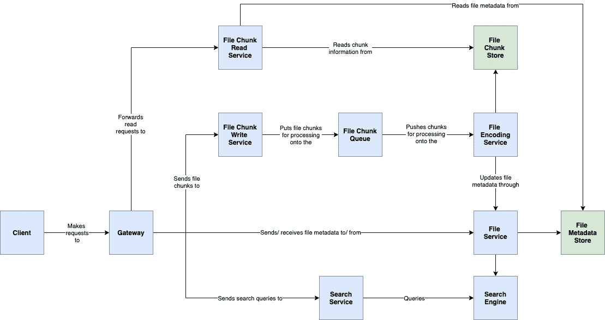
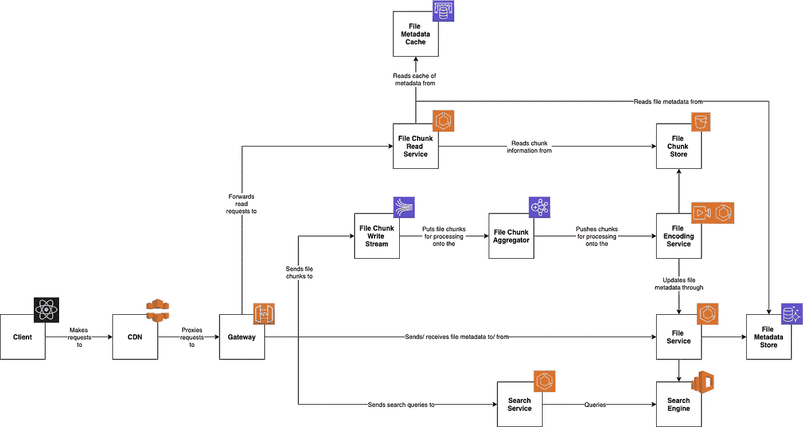

# 我会如何设计… YouTube 或网飞！

> 原文：<https://betterprogramming.pub/how-i-would-design-youtube-or-netflix-42a513b712fb>

## 系统设计演示


在 [Unsplash](https://unsplash.com?utm_source=medium&utm_medium=referral) 上由 [Thibault Penin](https://unsplash.com/@thibaultpenin?utm_source=medium&utm_medium=referral) 拍摄的照片

# 观众

这篇文章是我如何设计流行应用程序系列的下一篇。推荐(尽管不是完全必要)阅读我已经整理成列表[的前几篇文章。](https://jc1175.medium.com/list/how-i-would-design-7c3a2267386b)

我们希望对架构原则和 AWS 有一个基本的了解，但是希望这篇文章对大多数工程师来说是容易理解的。

# 争吵

首先，让我们看看我们的问题陈述。

## 要设计的系统

我们希望设计一个视频点播平台，如 [YouTube](https://www.youtube.com/) 或[网飞](https://www.netflix.com/gb/)。你不可能没有遇到过它们，但如果你没有遇到过，前提是用户可以在线上传或观看视频。确切的要求是:

1.  我们应该可以上传视频。
2.  我们应该可以观看视频。
3.  我们应该能够根据视频标题进行搜索。

我们会忽略一个事实，即你不能上传视频到网飞，除非你是一个制作工作室。假设你是昆汀·塔伦蒂诺。

## 方法

我们有一个标准的系统设计方法，在本文[中有更详细的解释。但是，这些步骤总结如下:](https://jc1175.medium.com/how-i-would-design-a-url-shortener-a4c8d4ec8889)

1.  **需求澄清:**确保我们在开始之前有所有的信息。这可能包括我们预期有多少请求或用户。
2.  **包络估计的背面:**进行一些快速计算，以评估必要的系统性能。例如，我们需要多少存储或带宽？
3.  **系统界面设计:**我们的系统从外面看会是什么样子，人们会如何与之交互？通常这是 API 合同。
4.  **数据模型设计:**我们的数据存储起来会是什么样子。在这一点上，我们可以考虑关系模型和非关系模型。
5.  逻辑设计:把它组合成一个粗略的系统！在这一点上，我在思考“我该如何向一个对技术一无所知的人解释我的想法？”
6.  物理设计:现在我们开始担心服务器、编程语言和实现细节。我们可以将这些叠加在逻辑设计之上。
7.  **识别并解决瓶颈:**在这个阶段，我们将拥有一个可运行的系统！我们现在改进设计。

说完了，我们开始吧！

## 需求澄清

我们来想一些初始问题。最初，我想知道一个视频的最大和平均大小是多少。然后我会考虑用户数量和他们的读/写/搜索比率。

此外，客户端使用什么设备/连接速度？基于此，我们可能需要优化我们的文件格式和大小。

## 包络估计的背面

假设我们有 1 亿用户(实际上可能更多！)，阅读和写作达到每天 100:1 的比例。对于 HD，平均文件大小为 1GB，最大文件大小为 50GB(不管这些大小有多精确)。

这意味着我们将有大约`100,000,000 * 1GB = 100PB/d`的上传容量！在给定平均视频长度的情况下，我们可以用每秒请求数来计算，但可以肯定地说，我们正在处理大量数据！

这也是一个全球系统，因此我们可以假设我们将在一系列网络上使用许多不同的设备，从移动设备到嵌入式设备，因此我们需要为此进行防御性设计。

## 系统界面设计

对我们的系统有了更多的了解后，我们可以决定如何与它互动。交互主要有三点。

1.  上传视频
2.  下载视频
3.  搜索

上传视频将通过 HTTP 完成。我们需要注意的一件事是文件的大小。在不同的场景中，我们可能会使用 [FTP](https://en.wikipedia.org/wiki/File_Transfer_Protocol) ，但是考虑到我们在互联网上有随机的用户，这在这里并没有什么意义。

我建议创建一个初始表单来提交与文件相关的元数据(标题、标签、任何不是视频本身的东西)，它将返回一个与文件相关联的 GGUID。

从那里，我们可以使用 JavaScript [文件](https://developer.mozilla.org/en-US/docs/Web/API/File)和[Blob](https://developer.mozilla.org/en-US/docs/Web/API/Blob)API 来[剪切视频文件并发送部分请求](https://api.video/blog/tutorials/uploading-large-files-with-javascript)，其中 [Content-Range](https://developer.mozilla.org/en-US/docs/Web/HTTP/Headers/Content-Range) 头表示该请求所代表的字节范围。我们的内容类型是`application/octet-stream`,服务器负责重组这些部分。

这意味着我们需要一个端点来创建一个文件，在端点`/file`处的`POST`用元数据创建一个新的文件对象，然后在`POST`处的另一个端点`file/{id}/chunk`允许用户发布一个块。

我们还可以考虑在客户机上对文件进行散列，然后在服务器上重组文件后比较散列，以确保它匹配。

下载可以利用 [HTTP 范围请求](https://developer.mozilla.org/en-US/docs/Web/HTTP/Range_requests)。这允许我们一次请求视频的一部分(返回一个`206`)，这意味着我们可以在需要时动态地请求视频片段。使用带有内容范围标题的`GET file/{id}/chunk`可能是一种解决方案。

幸运的是，搜索稍微简单一些，我们可以`GET`到`/search?title=<search title>`并接收通常的响应代码。

## 数据模型设计

现在我们有了如何与系统交互的想法，让我们考虑一下我们想要存储的数据类型。其中一些将基于视频字节，一些将基于元数据。

最初，让我们考虑一个文件。一个文件可以存储一系列信息:标题、创建日期、上传者、点击次数等等。

**文件**

```
id               BIGINT    PRIMARY KEY 
title            VARCHAR
```

我们现在需要考虑我们的文件块。请记住，我们需要为大量网络和设备提供服务！这意味着我们希望以多种不同的质量和文件格式来存储数据块。随着像 AWS S3 这样的对象存储的出现，我们可以引用我们的文件在 S3 的位置。

**组块**

```
id           BIGINT    PRIMARY KEY 
file_id      BIGINT    FOREIGN KEY REFERENCES file(id)
format       VARCHAR
quality      BIGINT
order        BIGINT    
location     VARCHAR
```

使用上面的内容，我们可以识别块属于哪个文件，块的格式，块的大小以及它代表文件的哪个位。

这构成了我们数据模型的核心。让我们进入逻辑设计！

## 逻辑设计



基本的逻辑设计

我们可以通过逻辑设计将各种组件组合在一起。当用户想要上传文件时，他们向文件服务发送请求以创建新的文件元数据。然后，他们的浏览器将文件分成块，并上传到文件块写服务。

该文件分块服务负责将来自客户端的分块组装成单个文件，对其进行验证，并将其拆分成媒体播放器更容易使用的不同分块。

从这里开始，我们坚持使用一个队列，以便在文件编码服务关闭的情况下为我们提供一个弹性层。现在可以向用户返回接受消息，我们已经有了文件，只需要处理它。

文件编码服务获取文件的块，并将其转换为不同的格式和质量以用于不同的服务。值得注意的一点是，编码和代码转换是有区别的。

*   **转码**:创建不同大小的文件。
*   **编码**:将文件重新编码成不同的格式。

编码包括代码转换，这就是我们在这里使用这个术语的原因。

该服务负责将我们的块写入存储，并使用它们的位置更新我们的文件元数据。

读取请求也通过 API 网关，但如果他们请求视频流，则被重定向到我们的文件块读取服务，如果他们寻找元数据，则被重定向到我们的文件服务。

客户端将负责确定他们需要文件的哪些块，并发出必要的请求以加载下一部分。

搜索功能应该相当简单。文件服务会将文件元数据添加到搜索引擎中，因此搜索服务负责将 URL 查询转换为搜索引擎可以使用的内容，然后编组响应。

## 结构设计

现在我们已经讨论了如何构建我们的平台的大致想法，让我们在现实世界中将其具体化。


幼稚的物理设计

甚至在我写这篇文章的时候，我就发现了这个设计的一些问题。但是，让我们探索一下，我们可以在下一节中对其进行改进。

最初，我们所有的静态服务都使用 [AWS ECS](https://aws.amazon.com/ecs/) 。有一种观点认为我们可以完全没有服务器，但我的感觉是我们不想担心冷启动时间。我们的网关是一个 [AWS API 网关](https://aws.amazon.com/api-gateway/)，我们的队列使用 [SQS](https://aws.amazon.com/sqs/) 。

我们将块存储在 [S3](https://aws.amazon.com/s3/) 中，并使用[AWS Elemental media convert](https://aws.amazon.com/mediaconvert/)进行编码。搜索引擎本身就是[亚马逊 OpenSearch](https://aws.amazon.com/pm/opensearch/) 。

## 识别和解决瓶颈



修改后的图表

我们提到我们可以进行一些性能改进。最初，我专注于我们接收的数据量。我们需要一个能够实时处理大量信息的弹性系统。这听起来像是流媒体的工作。

从图中你可以看到我们的 API 网关现在写入到一个 [Kinesis 流](https://aws.amazon.com/kinesis/data-streams/)，它反过来推送到 [AWS EMR](https://aws.amazon.com/emr/) (可能有 Spark 流)来处理和重新分块我们的文件。

因为我们的文件元数据很少会改变，所以我们还可以向我们的读取服务添加一个缓存层。

我们还可以实现[自适应比特率流](https://bitmovin.com/adaptive-streaming/)，这在链接文章中有很好的介绍。在我们的编码器中，我们制作了不同质量的相同文件的块。使用这种技术，我们可以根据 streamer 连接的当前状态被动地发送不同质量的数据块。

优化的最后一部分是添加 CDN。由于我们的用户遍布世界各地，我们不希望他们都试图从英国的服务器上访问他们的视频。尝试将我们的内容分发到离它们更近的地方是有意义的。注意，网飞其实对这个问题有自己的解决方案叫做 [Open Connect](https://openconnect.netflix.com/en_gb/) ，值得一看！

# 结论

总之，我们已经讨论了如何设计一个 YouTube 或网飞风格的平台。值得注意的是，网飞为这个问题专门开发了[多种工具。](https://spring.io/projects/spring-cloud-netflix)

一些例子包括:

*   [Zuul](https://github.com/Netflix/zuul) :一个应用网关。
*   [Hystrix](https://github.com/Netflix/Hystrix) (已弃用):一个断路器。
*   [尤里卡](https://github.com/Netflix/eureka):服务发现。
*   [假装](https://github.com/OpenFeign/feign) : HTTP 客户端绑定器。

看看他们！