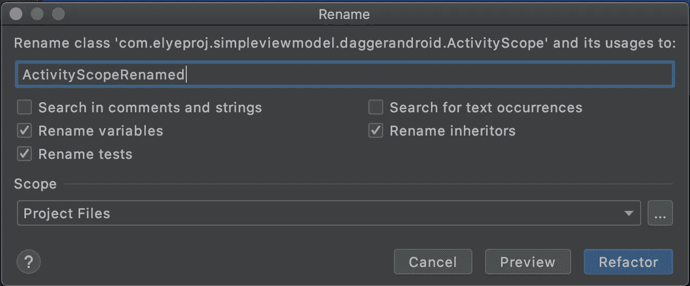
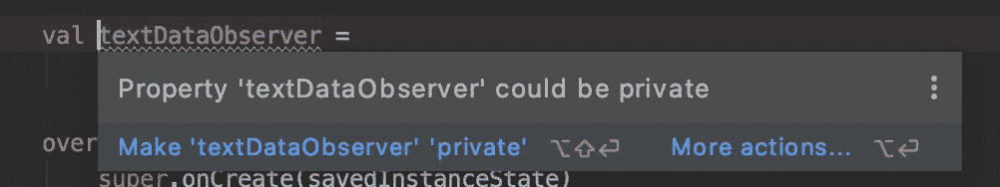
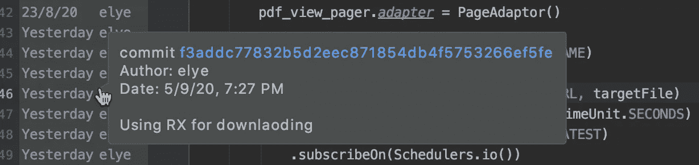
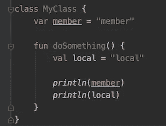
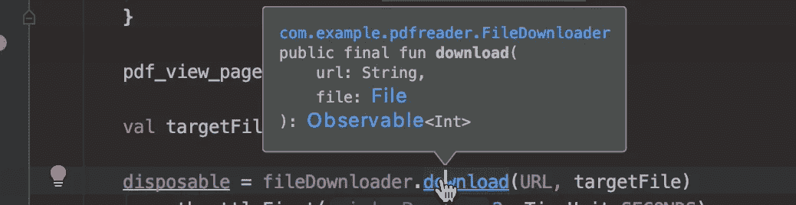
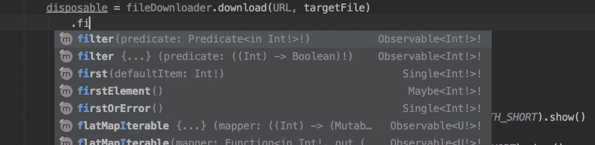
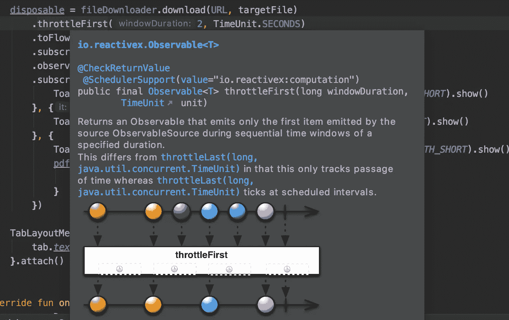
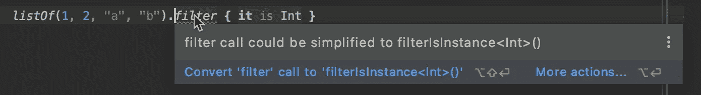

# 我的 IDE 如何影响我的编码

> 原文：<https://betterprogramming.pub/how-ide-influences-my-coding-9130d1c18e34>

## 让工具帮助你，放弃旧的编码思维

由[凯特琳·贝克](https://unsplash.com/@kaitlynbaker?utm_source=medium&utm_medium=referral)在 [Unsplash](https://unsplash.com?utm_source=medium&utm_medium=referral) 拍摄的照片

不是每个人都同意我们编码的方式应该受到 IDE 的影响。我可以理解这是从哪里来的，并且同意完全依赖特定的工具来完成工作是不理想的。尽管如此，我不能否认工具是如何影响我的编码方式的，就像 [Vim](https://www.vim.org/) 和 [Emacs](https://opensource.com/resources/what-emacs) 对其他人的影响一样。

# 开始时不需要完美的代码组织

我记得在我们开始一个项目之前的那些日子:一个接一个的会议和一个接一个的文档来讨论一个新项目的理想代码组织应该是什么样的。预测项目将如何发展。这都是因为我们希望避免将来对代码库的更改，因为以后更改它会很困难。

有了 IDE，我们可以轻松地移动类并重命名它们，代码将一起自动重构，对于开发人员来说，搜索和手动更改代码没有什么麻烦。

示例:可以更改文件类名的 IDE 功能，所有内容都可以一起更改

有了更容易进行更改的能力，我们现在可以不用太担心我们的初始结构不理想，名称不够好等等。也不要担心它是否经得起未来的考验，因为没有人知道未来。后来的变化不再是一项令人生畏的任务。

话虽如此，我不得不声明，为了使代码结构合理，名称尽可能有意义，需要进行一些尽职调查。没有任何借口可以忽视这一点。只是现在我们可以避免对初始设计的偏执，这样我们就可以更快地交付产品。

# 编码评审关注语义而不是语法

当我第一次在软件公司工作的时候，我们在一个房间里做代码评审。我们将代码打印出来并阅读，根据编码指南找出代码的错误。我通常会寻找未使用的导入、错误的`{`起点、使用空格而不是制表符等等。(未对齐缩进)。

换句话说，比起代码的含义，我更关注代码的结构。这在当时很重要，因为它有助于提高代码的可读性。

如今，我很少再关注这些领域，而是更多地关注代码的业务逻辑(例如，变量是否可以为空)。原因很简单:工具帮助我们识别了一些基本的代码问题，并改进了那些结构。

例如，自动推荐以下变量的工具可以是`private`。

不良结构和命名约定的可能性可以通过自动化帮助很容易地纠正。

# 比起全面的代码，更喜欢简洁的代码

在过去，代码必须尽可能全面，以确保其可维护性。这里的*综合*的意思是，乍一看，代码应该给出尽可能多的信息。例如:

*   对于复杂或特殊的情况，编码注释应该是可用的。
*   应该有一个预先考虑的命名约定来显示类型，例如`mMemberVariable`。
*   应该有参数命名，如`download(url = URL, file = targetFile)`。

这是过去的惯例，那时代码是在工具中评审的，团队中的每个人都没有相同的 IDE。但是如果每个人都共享相同的工具集，那么我们可以专注于更简洁的编码，而不是显式地、仪式化地写下所有东西。

## 不太需要显式代码注释

人们可以很容易地提取 Git 提交消息并找到相关的提交消息。这将更好地反映代码的变化。最棒的是，如果做了进一步的修改，我们不再担心注释与代码不同步。

## 不需要太多基于文本的命名约定

您可以基于文本区分变量类型，因为默认情况下，所有 IDE 源代码查看器中都提供语法着色。

## 不需要显式参数命名

在 IDE 中，我们只需指向并获取所有的函数类型，这样就能清楚地说明函数参数。

我不再需要编码`download(url = URL, file = targetFile)`。

注意:这假设整个团队中处理代码的每个人都使用相同的工具集(例如，IDE ),并且有能力相应地审查它。

无论如何，我相信简洁的编码是未来。

# 边编码边学习

从历史上看，我们必须研究哪些 API 是可用的，以确保我们使用正确的 API。虽然这仍然是千真万确的，但是 ide 今天也帮助了我的学习。

## 显示可用的 API

有了自动完成特性，我只需要输入并四处搜索，就能找到那个特定对象可用的 API。

## 学习新的 API

我不仅可以看到可用的 API，还可以轻松访问 API 的文档。下面是一个用图表提供描述的例子。

throttleFirst 函数的描述

## 更好的编码或 API 使用建议

下面是一个我用`filter { it is Int }`的例子，最好用`filterIsInsance<Int>()`代替。IDE 推荐给我的。

以上是 IDE 如何在日常编程工作中为我提供巨大帮助的几个例子，除了 IDE 一直在做的基本编码、编译和调试之外。它使我们能够进行更快的开发，并且在采用新的开发方式的同时放弃一些旧的关注方式。