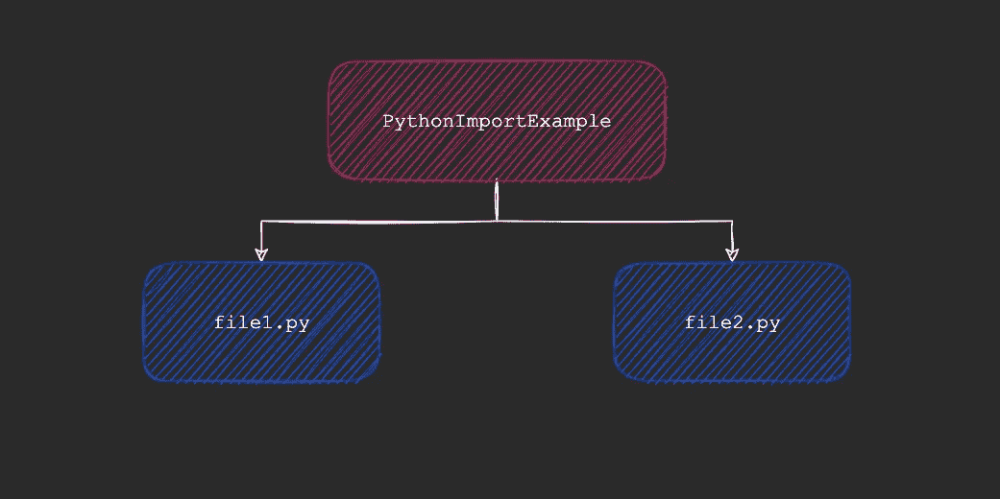
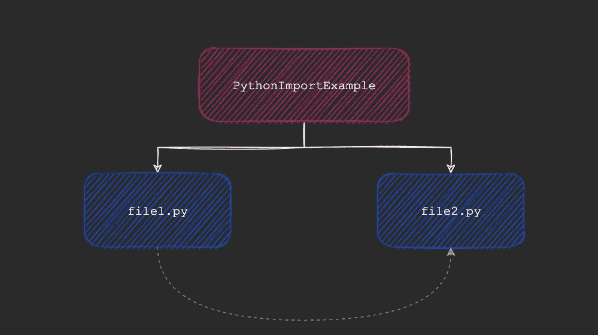
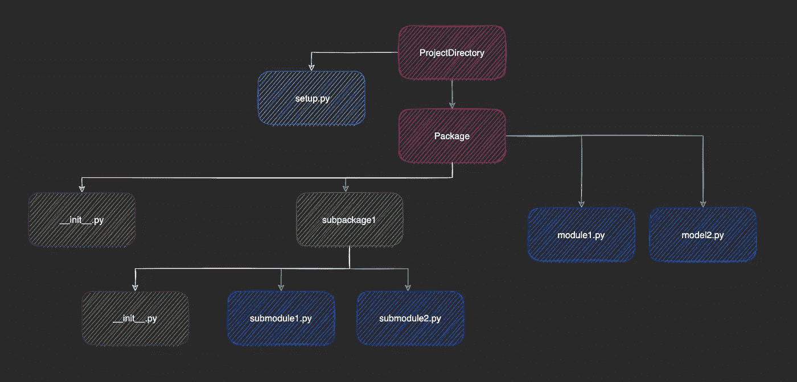
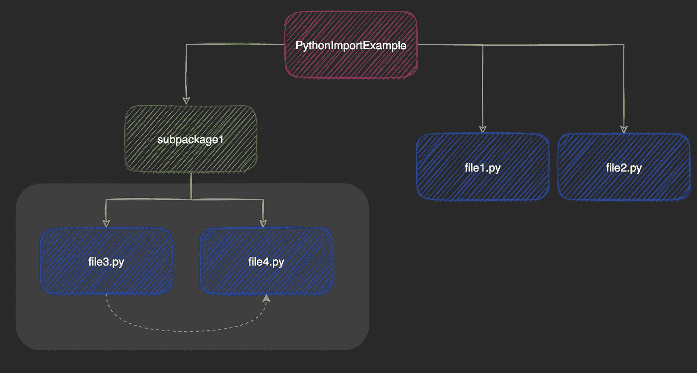
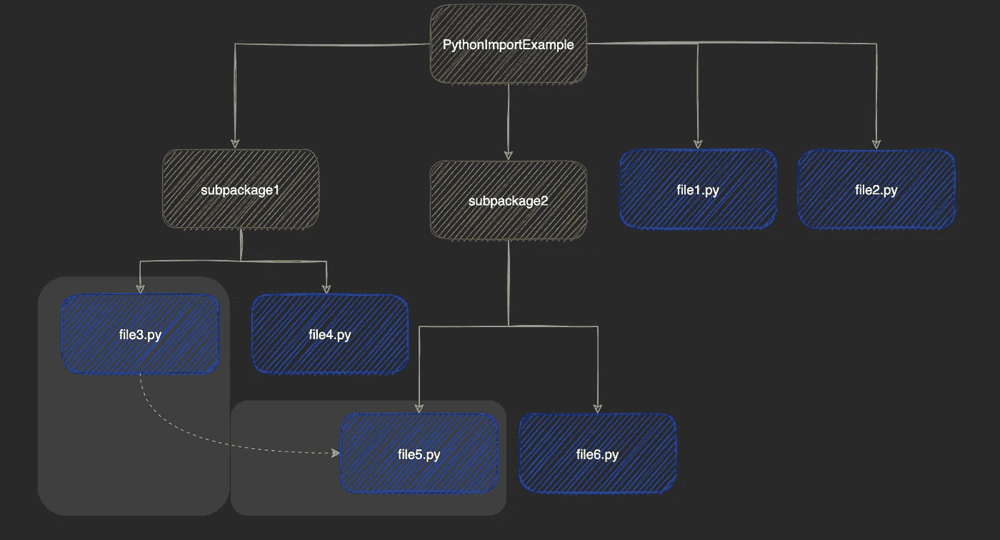
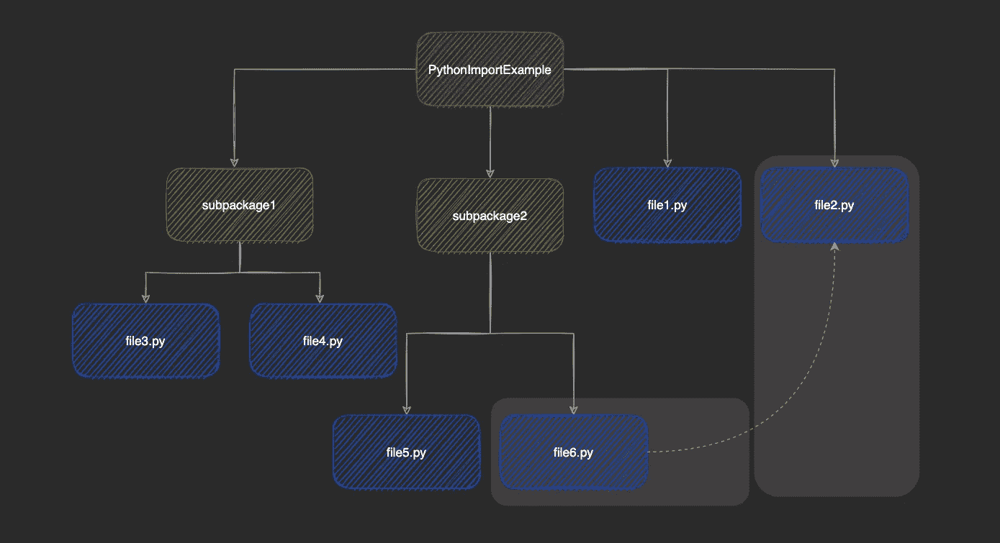
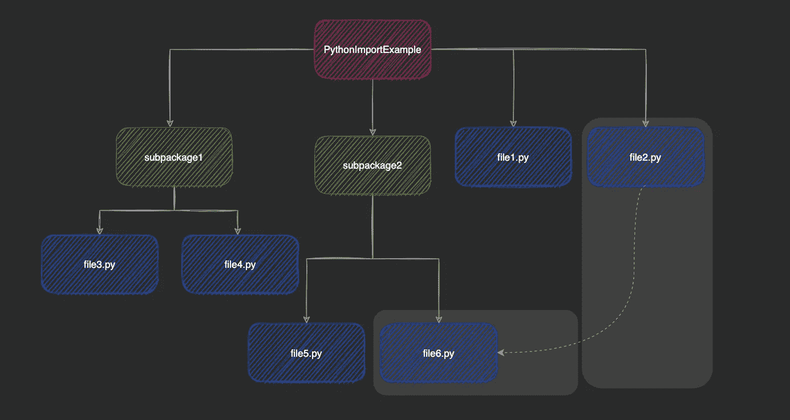
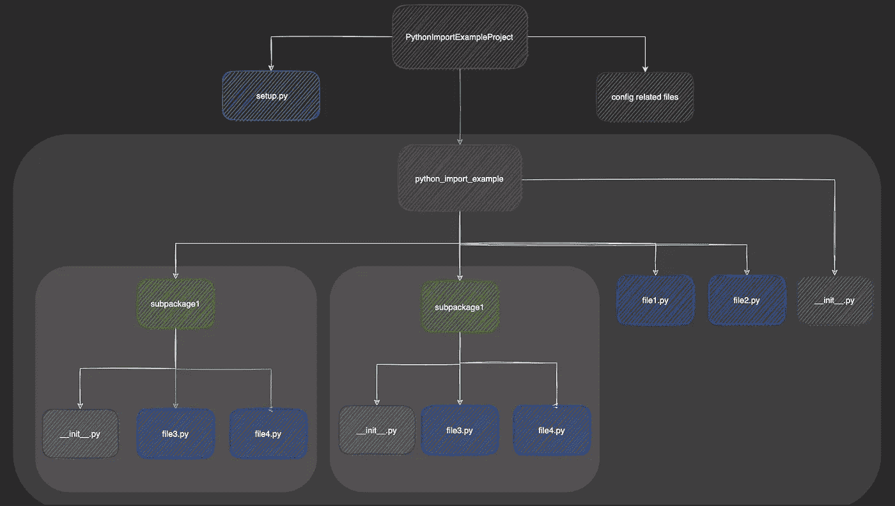
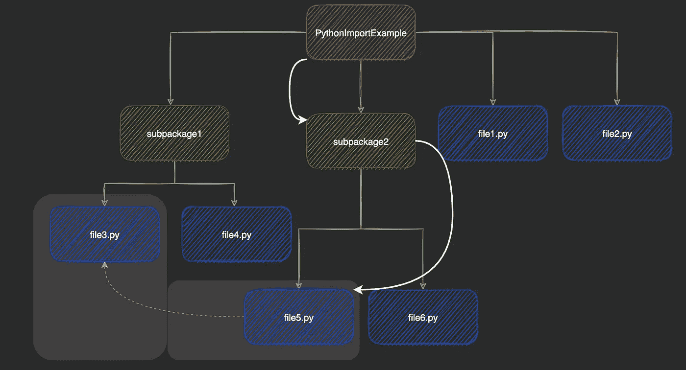
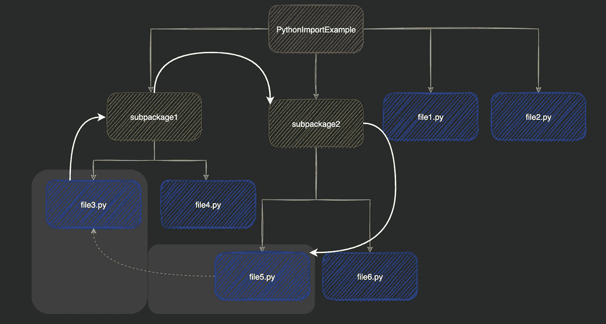

# 导入如何在 Python 中工作

> 原文：<https://betterprogramming.pub/how-imports-work-in-python-59c2943d87dc>

## 关于包裹


照片由 [Blanca Paloma Sánchez](https://unsplash.com/@blancaplum?utm_source=medium&utm_medium=referral) 在 [Unsplash](https://unsplash.com?utm_source=medium&utm_medium=referral) 上拍摄

Python 导入系统非常简单...在某种程度上。导入存在于您正在处理的同一目录中的代码与在存在于多个目录中的多个文件之间进行导入有很大不同。通过这篇文章，我分析了使用导入时经常遇到的一些场景，希望能让您更容易创建自己的包。

# 目录

```
[**An Example**](#36b9)[**What Happens When You Import a Python File?**](#d70d)[**Terminology**](#037f)[**Import Scenarios**](#3e54)[**Analysis**](#d440)[**Building a Package**](#2591)[**The Syntax of Your Import Statement**](#6939)[**Notes and Resources**](#94a3)
```

# 一个例子

我们将从一个简单的例子开始，并在整篇文章中建立起来。假设我们在一个名为`PythonImportExample`的目录中有两个简单的 Python 文件。



我们的例子——作者使用 [draw.io](https://app.diagrams.net/)

```
PythonImportExample/ file1.py
    file2.py
```

假设`file1.py`包含以下内容:

```
print("This is file1.py")
```

`file2.py`进口`file1.py`。

```
import file1print("This is file2.py")
```

导入类似于以下内容:



文件 1.py 导入到文件 2 . py-作者使用 [draw.io](https://app.diagrams.net/)

# 导入 Python 文件时会发生什么？

当 Python 文件被导入时，它被执行，然后被添加到导入它的文件的命名空间中。

例如:执行`file2.py`时，得到如下输出:

```
$ cd PythonImportExample
$ python file2.pyThis is file1.py
This is file2.py
```

导入的文件在其导入前立即执行。因此，如果我们将`file2.py`中的导入语句放在打印语句下面，如下所示:

```
print("This is file2.py")import file1
```

我们最终得到了交换的输出:

```
This is file2.py
This is file1.py
```

当然，导入 Python 模块(甚至是包，我们会用到)的整个过程要复杂一些。**对模块的搜索如下:**

1.  Python 标准库中的内置模块。
2.  `sys.path`目录和文件。

3.`PYTHONPATH`目录。

4.不属于标准库的模块和包

**一旦找到模块或包**就执行。如果是一个模块，该模块将运行。如果是包，则运行该包的`__init__.py`文件。

**然后，导入的项目被添加到该模块的名称空间中，**允许您导入它并使用它的属性。

`sys.path`的第一个元素有微小的区别。如果我们交互式地启动解释器，第一个元素是`''`。它表示解释器启动的当前目录。

如果我们要运行一个脚本，`sys.path`将包含脚本的目录作为它的第一个元素，而不是`''`。

让我们先来看一点术语。

# 术语

一个基本的 Python 包可以包含子包、模块、初始化文件和一个`setup.py`文件。基本的包结构可能如下所示:



一个基本的包结构，展示了所有必要的组件——作者使用 [draw.io](https://app.diagrams.net/)

## 组件

Python 文档对模块做了如下描述:

> 模块是包含 Python 定义和语句的文件。文件名是模块名加上后缀`.py`。

模块是鼓励模块化代码的对象。一个模块可以包含变量、函数和类，这些组件是该模块定义的命名空间的一部分。

由于这个事实，命名问题不是一个问题，因为两个不同的模块可以有相同名称的变量、函数和类。

## 包裹

包是模块和包的层次结构。就像一个模块如何定义一个名称空间以便变量、函数和类可以在两个不同的模块中有相同的名称一样，一个包对它的组成包和模块也是如此。

主包中的模块和包可以通过点符号来访问。

## __init__。巴拉圭

`__init__.py`是放在包和子包中的文件。在 Python 3.3 之前，这个文件必须出现在每个包和子包中，尽管现在不再是这样了。

当一个包被导入时，它的`__init__.py`文件，如果存在的话，被执行。这个事实可以用于很多事情，比如导入特定的包。

## setup.py

该文件位于您的包所在的主目录中。它包含配置信息，如所需的依赖项、脚本和子程序包。您还可以指定关于您的包的元数据，比如包的名称、作者、描述等等。

这个文件是 pip (Python 的标准包管理器)用来安装包的。它位于项目的主目录中，与您的包代码放在一起。

```
ProjectDir
   **setup.py**
   package/
       ..
       .
```

## sys.path

`sys.path`是字符串形式的路径列表。当解释器看到导入语句时，它会在`sys.path`中的路径中寻找要导入的模块或包。

正如我们已经讨论过的,`sys.path`列表的第一个元素是:

*   `''`如果我们交互运行解释器
*   脚本的路径，如果我们运行它。

文件表明`sys.path`是:

> " I 由环境变量`[PYTHONPATH](https://docs.python.org/3/using/cmdline.html#envvar-PYTHONPATH)`初始化，加上一个依赖于安装的默认值."

**某些属性**

*   `sys.path`不依赖于我们当前的目录，只是我们正在运行的脚本的路径。
*   它不会在导入的模块之间改变。如果一个模块导入另一个模块，后者又导入另一个模块，那么第一个模块的`sys.path`就是解释器搜索第二个导入语句的地方。

# 导入方案

让我们考虑一下在构建目录中的导入时可能会遇到的一些场景。在每个场景中，我们将从一个基本的案例开始，如果它没有给我们预期的结果，就对它进行改进。

我们将讨论:

*   在同一子包中导入
*   在同一包中但在不同的子包中导入
*   在项目层次结构的不同级别之间导入

## 在同一子包中导入

让我们在主目录中添加一个名为`subpackage1`的子目录。请注意，我们没有调用这些包和子包，因为此时它们只是目录。

我们来添加两个子模块`file3.py`和`file4.py`。同样，`file4.py` imports `file3.py.`我们以下面的结构结束:

```
PythonImportExample/ file1.py
    file2.py subpackage1/
        file3.py
        file4.py
```

这两个文件如下所示:

`**file3.py**`

```
print("This is file3.py")
```

`**file4.py**`

```
import file3print("This is file4.py")
```



场景#1:在同一个子包中导入。将 file3.py 导入 file4.py

现在，当我们运行`file4.py`时，解释器寻找`file3.py`。由于它们出现在同一个目录中，`file3.py`很容易找到，因为模块的目录是`sys.path`中的第一个条目。

创建一个包在这里不是必须的，但是我们将在后面看到如何做。

## 在同一包但不同的子包中导入

假设我们向我们的项目添加了另一个子包。我们将它命名为`subpackage2`，在它里面，我们将有`file5.py`和`file6.py`。现在，如果其中一个文件导入了另一个文件，我们在执行时不会有任何问题，因为这基本上就是前面的场景。

但是如果我们想要导入一个不同子包中的文件，比如说，`file5.py`导入`file3.py`，该怎么办呢？



场景#2:在同一个包但不同的子包中导入。file3.py 被导入 file 5 . py——作者使用 [draw.io](https://app.diagrams.net/)

我们项目的结构目前是这样的:

```
PythonImportExample/ file1.py
    file2.py subpackage1/
        **file3.py**
        file4.py subpackage2/
        **file5.py**
        file6.py
```

`**file5.py**`

```
import subpackage1.file3print("This is file5.py")
```

如果`file5.py`直接导入`file3.py`，我们最终会得到什么？很明显这将是一辆 T8。`file5.py`的 sys.path 将包含其目录——即`subpackage2`——当导入时，将找不到`subpackage1`,从而给出错误。

将我们所有的代码放入一个包中可以解决这个问题，但是还有其他方法吗？

当您思考最初是什么导致了导入错误时，这是显而易见的:`sys.path`。因此，如果我们可以动态地改变这一点，从技术上来说，从任何地方运行一个导入文件的脚本都是可能的。

`**file5.py**`

```
import sysprint(sys.path)sys.path.insert(1, "/Users/test_user/Documents/PythonImportExample/subpackage1")print(sys.path)import file3print("This is file5.py")
```

运行`file5.py`现在工作正常。输出如下所示:

```
['/Users/test_user/Documents/PythonImportExample/subpackage2', ...['/Users/test_user/Documents/PythonImportExample/subpackage2', **'/Users/test_user/Documents/PythonImportExample/subpackage1'**,....This is file3.py
This is file5.py
```

可以看到上面`sys.path`加了`subpackage1`。

## 在项目层次结构的不同级别之间导入

让我们再看看我们目前的结构。

```
PythonImportExample/ file1.py
    **file2.py** subpackage1/
        file3.py
        file4.py subpackage2/
        file5.py
        **file6.py**
```

我们将在这里看两个场景:

*   `file2.py`导入`file6.py`
*   反之亦然(`file6.py`导入`file2.py`)

**案例一:** `**file2.py**` **导入** `**file6.py**`



场景 3 案例 1:将更深的模块导入到更高的模块中。file6.py 被导入到 file2.py 中

让我们修改`file2.py`以便它导入`file6.py`。现在看起来是这样的。

`**file2.py**`

```
import file1print("This is file2.py")# added code **import subpackage2.file6**
```

输出如下所示:

```
This is file1.py
This is file2.py
**This is file6.py**
```

输出符合预期。`file1.py`和以前一样导入成功。到了第二个导入语句，解释器在`sys.path`中寻找`subpackage2`。它会被立即找到，因为`subpackage2`与我们的脚本`file2.py`位于同一个目录中，所以相应的条目已经存在于`sys.path`中。很简单。

**案例二:** `**file6.py**` **导入** `**file2.py**`



场景#3 案例 2:将较高级别的模块导入到较深的模块中。file2.py 被导入到 file6.py 中

这与前一种情况正好相反。像我们在**案例 1** 中那样的直接导入是行不通的，因为`file2.py`不在`file6.py`的`sys.path`上。我们要么为此创建一个包，要么在运行时自己修改`sys.path`，就像我们在前面的场景中所做的那样。

**注意**:这是 Python 导入系统的一个问题。如果不修改`sys.path`或`PYTHONPATH`，就无法导入当前脚本父目录中的模块。

# 分析这些情景

在尝试解决遇到的导入错误时，我们做了一些决定。我们的决定通常是关于动态修改`sys.path`。创建一个包也是一个建议。

## 有必要建包吗？

难道仅仅创建一个目录和模块的层次结构不行吗？

不完全是。

一些简单的情况可能不需要创建包就可以工作，但是更复杂的情况会很快遇到类似于我们在上面场景中讨论的问题。

**创建包有几个好处:**

*   更好的结构和组织
*   导入错误和命名冲突等问题减少
*   更容易共享代码。

# 将我们的项目变成一个包

我们将按照下面的步骤来制作一个非常基本的包。

1.  将我们当前的项目移动到一个目录中，这个目录将作为我们的主包。
2.  在每个包和子包中添加空白`__init__.py`并修复导入
3.  添加一个`setup.py`文件。我们稍后会讨论这个问题。

## 修改我们的项目结构并添加 __init__。py 文件

这一步很简单。我们将我们的`python_import_example`包移动到另一个目录`PythonImportExampleProject`中，该目录将包含配置相关信息，如`.gitignore`、`LICENCE`、`setup.py`等，以及我们的包。

我们还在每个包和子包中添加了`__init__.py`文件。因为我们有一个主包(`python_import_example`)和两个子包，**，我们最终有三个初始化文件**。

下一步，我们将讨论我们的包的安装文件。我将它包含在下面的树中，以了解`setup.py`的确切走向。

```
PythonImportExampleProject/
    **setup.py

    config related files (gitignore, LICENCE, etc.)** pythonimportexample/
       ** __init__.py** file1.py
        file2.py subpackage1/
            **__init__.py** file3.py
            file4.py subpackage2/
            **__init__.py** file5.py
            file6.py
```

在图表中会是这样的。



我们的项目，被构造成一个包——作者使用 [draw.io](https://app.diagrams.net/)

## 添加安装文件

让我们添加一个简单的安装文件。我们现在只设置名称，尽管您可以做更多的工作。

```
**from** setuptools **import** find_packages, setup setup( name='pythonimportexample',
    packages=find_packages(),)
```

**`**find_packages**`**函数返回我们项目中所有的包和子包。这很有用，因为我们不必自己列出它们。****

# **导入语句的语法**

**有几种不同的方法可以组织您的导入。一些例子:**

*   **`import abc.def.xyz`**
*   **`from abc.def import xyz`**
*   **`from ..abc import pqr`**
*   **`import abc.def as mymodule`**

**让我们回到我们的例子。我们来看看`file5.py`和`file3.py`。**

```
PythonImportExample/ file1.py
    file2.py subpackage1/
        **file3.py**
        file4.py subpackage2/
     **   file5.py**
        file6.py
```

## ****绝对进口****

**绝对导入允许您指定要导入的包、模块或对象的完整路径。**

**如果您想将`file5.py`导入到`file3.py`中，您可以使用以下语句:**

```
import PythonImportExample.subpackage2.file5
```

**或者**

```
from PythonImportExample.subpackage2 import file5
```

****

**绝对导入明确地指定了模块的路径——由作者使用 [draw.io](https://app.diagrams.net/)**

****优点****

*   ****绝对导入提高可读性。**看上面的语句，很明显`file5.py`驻留在`PythonImportExample`的`subpackage2`中。**
*   **不管你的脚本在哪里，它们都可以工作。即使上述导入语句被放入`file1.py`，它位于主包中。**

****缺点****

*   ****绝对进口变长，变快。**想象一下从嵌套的四层子包系列中导入一个类。`from package.subpackage1.subpackage2.subpackage3.... import TestClass`**

## **相对进口**

**相对导入相对于您要导入的脚本起作用。它使用点“.”符号。**

**在我们的示例中，使用相对方法的 import 语句看起来类似于:**

```
import ..subpackage2.file5
```

**或者**

```
from ..subpackage2 import file5
```

****

**相对进口是..良好的..相对于您的脚本—作者使用 [draw.io](https://app.diagrams.net/)**

****优点****

*   ****它们简洁，不像绝对进口那么长。由于我们不需要指定导入内容的完整路径，所以在我们的包层次结构中的文件之间获取内容更加简单。****

****缺点****

*   **当执行脚本的位置改变时，它们将不起作用。由于该语句是关于我们的执行脚本的，所以我们文件位置的任何变化都会破坏我们的代码，因为它相对于我们想要导入的文件的位置发生了变化。**

# **注释和资源**

## **注意#1:是一个 __init__。py 文件有必要吗？如果是的话，你在里面放了什么？**

****关于第一部分**，嗯是……也不是。从 Python3.3 开始，有两种包:常规的和隐式的名称空间包。前一种需要`__init__.py`文件，后一种不需要。**

**但是对于几乎所有的用例，只需要常规类型的包。名称空间包在真正特殊的情况下会很方便，比如当不同位置的多个包向您的包提供模块时。**

**此外，无论如何包含 init 文件是个好主意，因为测试像`pytest`这样的库可能会产生意想不到的结果。**

**进入问题的第二部分，让你的`init`文件为空完全没问题。但是对于更高级的情况，您可以在那里指定 import 语句和代码，这样更容易使用您的包。**

## **注意# 2:pip install-e 做什么？**

**这个命令让你在`development mode.`中构建和安装你的包，这意味着如果你对你的包做了修改，你不需要重新构建你的包来反映这些修改。**

**要使用它，只需执行:**

```
pip install -e <path to your package>
```

## **注意# 3:python file . py vs python-m file . py？**

**模块既可以作为脚本运行，也可以作为导入的模块运行。当我们指定一个模块的路径时，我们把它作为一个脚本来运行。**

**在我们的例子中，**

```
PythonImportExample/ file1.py
    **file2.py** subpackage1/
        file3.py
        file4.py subpackage2/
        file5.py
        **file6.py**
```

**如果我们将`file6.py`导入到`file2.py`中，并将其执行为:**

```
$ python subpackage2/file6.py
```

**我们将`file6.py`作为脚本执行，将`file2.py`作为导入的模块执行。简单地说，要将模块作为脚本执行，我们需要指定该模块的完整路径。如果我们想在包的深处执行一些东西，这可能会很棘手。**

**相反，我们可以使用`-m`标志运行一个模块。如果我们把我们的例子作为一个包，**

```
PythonImportExample/
    python_import_example/ file1.py
        **file2.py** subpackage1/
            file3.py
            file4.py subpackage2/
            file5.py
            **file6.py**
```

**我们可以像这样运行`file6.py`:**

```
$ python -m python_import_example.subpackage2.file6
```

**请注意，因为我们是将文件作为模块运行的，所以我们不会在最后指定`.py`文件扩展名。**

# **代码**

**你会发现我们在 GitHub 上创建的整个包。**

**[](https://github.com/Polaris000/BlogCode/tree/main/PythonImportExample) [## Polaris 000/blog code/python import 示例

### 本文中创建的示例包可以在这里找到。

github.com](https://github.com/Polaris000/BlogCode/tree/main/PythonImportExample)** 

# **结论**

**包是使用 Python 的重要组成部分。无论您是使用别人的代码还是共享自己的代码，理解导入和包是如何工作的都是关键。**

**我希望这篇文章能帮助你避免将来的导入错误**

**它应该帮助您避免那些烦人的导入错误，更重要的是，让您成为更好的 Python 开发人员。**