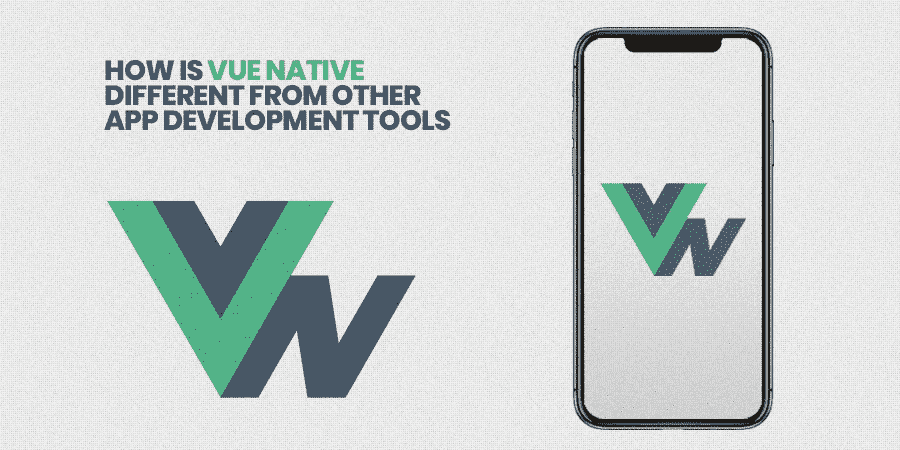
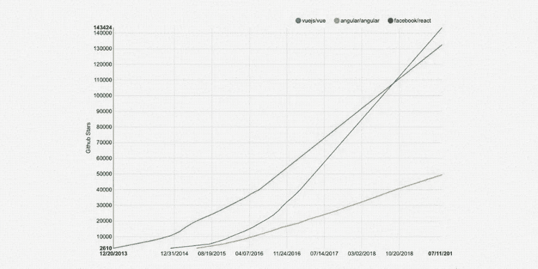
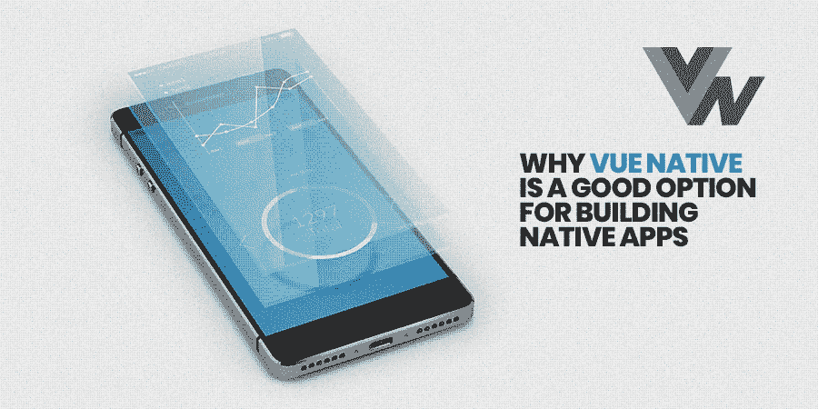

# Vue Native 与其他 App 开发工具有何不同？

> 原文：<https://betterprogramming.pub/how-is-vue-native-different-from-other-app-development-tools-e2f3da38b2cf>

## Vue Native 的功能概述

IT 行业一直在发展，我们全年都可以看到巨大的变化。为了跟上最新的变化，您需要确定正确的技术趋势，并相应地进行调整。

移动应用程序开发人员知道这一点，这就是为什么他们总是寻求通过使用新技术来创建移动应用程序，以节省他们的时间和成本。

脸书的 React Native 是移动应用程序开发领域的一个重大转变。它是第一款帮助应用开发者创建经济高效的混合移动应用的应用开发工具。

[Vue.js](https://vuejs.org/) 是另一款在移动应用开发者中广受欢迎的伟大工具，用于创建本地和 [**跨平台应用**](https://www.xicom.ae/services/cross-platform-app-development/) **。**

这种基于 JS 的移动应用程序开发框架广受欢迎，尤其是在新开发人员和初创公司中，原因有很多。

> 看看 [Tim Qian](https://star-history.t9t.io/#vuejs/vue&angular/angular&facebook/react) 描绘 Vue.js 受欢迎程度的统计数据:

# Vue 原生到底是什么？

**Vue 原生**

简单来说，Vue Native 是一个基于 JavaScript 的移动框架，它有助于使用 Vue.js 创建移动应用程序。

框架中的 Vue.js 有一系列好处。一个主要的好处是框架组织了 UI 开发。此外，它侧重于视图层，这使得它很容易理解。

通过使用 Vue.js 用 JavaScript 创建原生移动应用程序已经成为最流行的 [**移动应用程序开发解决方案之一**](https://www.xicom.ae/services/mobile-app-development/) ，这是由于该工具的简单学习曲线。

如果你习惯了基于组件的工作流和 props，你会发现对 Vue 非常熟悉的东西。对 React 或 Angular 有丰富经验的移动应用程序开发人员会发现对这个框架中的指令很熟悉。

Vue Native 允许[移动应用开发者](http://bit.ly/2F4UdnT)花更多的时间去创造而不是写样板源代码。它被创建为 JS 的现代移动应用程序开发框架，您可以快速上手。

这是一个轻量级、灵活且不复杂的移动应用程序开发框架。Vue 被创造性地设计成一个适应性很强的框架，也很容易与其他各种库集成。

Vue.js 是一个基于 js 的渐进式框架，用于构建 100%访问 API 的应用程序，而无需依赖插件。这也使您能够为 Android 和 [**iOS 应用开发**](https://www.xicom.ae/services/iphone-app-development/) 创建移动应用。Vue Native 允许你使用带有 CSS 作用域样式的 CSS 来创建你需要的设计。

这个新的基于 JavaScript 的[移动应用开发框架](https://en.wikipedia.org/wiki/Mobile_development_framework)是由前谷歌员工 Ivan Yu 在 2014 年支持和创建的。这是由于提取了 Angular 的最佳部分，使其更加轻便，而没有任何额外的概念。

该框架使您能够与其他开发人员共享源代码。许多知名公司都在他们的移动应用程序开发项目中使用原生脚本。

这些公司的淤泥包括三星、德勤数码、奥迪、Sign、高通、ADP、富达和沃尔沃。Vue.js 已经被下载了至少 280 万次，在 GitHub 上有超过 5000 颗星。

# 为什么 Vue Native 是构建原生应用的好选择？

**Vue 原生应用**

> 像构建原生应用程序的真正好的解决方案一样，Vue.js 有一系列你应该知道的好处:

*   所做的任何更改都可以非常快速地同步，甚至有更多特定的工具可以更快地创建您的 Vue 应用程序(例如， [Bit 的](https://bit.dev/)开源移动应用程序开发平台、 [Storybook](https://storybook.js.org/) 或 [Vue Loader](https://vue-loader.vuejs.org/guide/) 和 [Vue CLI](https://cli.vuejs.org/) )。
*   Vue.js 是一个被广泛接受的软件，尤其是如果你已经熟悉 CSS、JavaScript 或 HTML 的话。如果你知道所有这些语言，那么你可以立即开始创建一个跨平台的移动应用程序。
*   Vue 与 React 类似，因为它使用虚拟文档对象模型(DOM)和编译成 React 本机代码的 Vue 代码。对于快速移动应用程序开发来说，这是一个很好的选择。

Vue 通过自动更新 DOM 和跟踪变化来实现反应。Vue 的一个主要优点是速度快，每秒钟可以更新和提供数千个 DOM 元素。

## 总的来说，Vue 有许多优势，包括:

> 轻量级。
> 
> 容易上手。
> 
> 优秀的文档。
> 
> 渐进的，它可以作为 jQuery 的替代。
> 
> 轻松支持 JSX。

> 为您的企业提供原生[移动应用](https://www.xicom.ae/services/mobile-app-development/)的优势:

在发现 Vue Native 的好处后，您可能会想知道，如果您已经有了一个 web 应用程序，您是否真的需要一个本地应用程序。

## 您的企业可以通过多种方式从选择本机应用中获益:

*   Vue 真正推动了巨大的可扩展性，因此企业不必担心多个用户使用他们的移动应用程序的问题。
*   您可以使用 Vue Native 来简化用户界面开发，从而大大简化开发过程。
*   使用 Vue Native，你不用担心版权问题，因为它是在麻省理工学院的许可下。
*   Vue Native 很容易定制，因此您可以很容易地将其集成到大型项目中进行前端开发。
*   他们能够快速有效地引起客户的兴趣。本地应用程序将允许您推出新产品、服务、折扣、促销和功能。
*   企业主可以通过获得人口统计、地理位置和购物相关行为等信息，更好地了解他们的目标受众。

它有利于所有的数据营销活动，也让你创造更好的策略。原生移动应用程序通过品牌识别和通知，帮助您与潜在客户或受众建立更多关系。应用程序导致许多销售。

> 当然，你也可以在公司的网站上购物。然而，事情是这样的:

网站产生知名度，应用程序推动销售。为什么？可能是因为应用程序是交互式的、快速的，并且允许简单的导航。

网站导航通常更复杂，所以需要更长的时间来销售。应用程序是吸引客户注意力的好方法，因为不是所有的公司都有应用程序。

为您的企业开发一个原生移动应用程序将为 it 提供更大的可见性，因为使用移动设备旅行时会有许多搜索。

# Vue Native 的特性

**Vue 土人特征**

Vue 的许多特性使其成为应用程序的完美选择。有许多 [**移动应用程序开发公司**](https://www.xicom.ae/services/mobile-app-development/) 正在使用这项技术进行功能丰富的应用程序开发。

## **1。数据绑定**

数据绑定是一种帮助操作或分配 HTML 属性值的属性。

除此之外，它还有助于改变样式，以及使用绑定指令来分配类。Vue.js 也提供绑定指令，称为 v-bind。

## **2。虚拟 DOM**

Vue.js 使用与 React 和 [Ember](https://emberjs.com/) 等相同的虚拟 DOM。副本实际上是由 DOM 组成的，而不是对虚拟 DOM 进行某些更改。

当对数据结构进行更改时，会将其与原始数据结构进行比较。最后，所有这些变化都反映在最终用户可以很容易看到的实际 DOM 中。

## **3。组件**

组件是一个重要的特性，用于创建可在 HTML 中重用的定制元素。

## **4。动画/过渡**

使用 Vue.js 时，您可以在虚拟 DOM 中添加、删除或更新 HTML 元素时轻松应用过渡。可以通过添加第三方动画库来增加交互性。

## **5。事件处理**

Vue.js 中的事件可以通过使用`V-On`属性来监听。

## **6。说明**

Vue.js 中内置了一些指令，包括`v-on`、`v-show`、`v-bind`、`v-else`、`v-model`和`v-if`。这些指令执行不同的任务。

## **7。计算属性**

这可以说是计算属性的最重要的特性之一，即监听用户界面元素的更改所需的计算。

## **8。布线**

v-router 允许在页面之间导航。

## **9。Vue CLI**

您可以使用 Vue 命令行界面(CLI)在命令行中轻松安装 Vue.js。Vue CLI 允许您轻松创建项目。

## 10。预言家

一个守望者被应用于改变它的数据。对于任何数据更改，观察器允许更快和更干净的代码。

# 如何用 Vue Native 做更好的开发

这个框架是开源的。要开始使用 Vue Native，首先安装 React Native 是至关重要的。之后，您将安装 Vue Native CLI。Vue.js 与状态管理模式和库以及用于其移动应用程序的 [Vuex](https://vuex.vuejs.org/) 一起工作。

中央存储包括移动应用程序的所有组件。然而，如果你正在创建一个本地移动应用程序，你可能会发现 Vuex 是不必要的。

Vuex 更适合大中型单页应用程序(SPA)。如果您需要更好地处理 Vue 组件外部的位置，请选择 Vuex 作为下一步。

由于 Vuex 的存在，您的移动应用中的关键组件无需依赖 [MobX](https://mobx.js.org/) 或 [React 路由器](https://reacttraining.com/react-router/)。Vue 灵活地处理数据绑定，将移动应用开发者从 DOM 的微观管理中解放出来。Vue 对此的回答是数据绑定的双向反应系统。

# 结论

毫无疑问，Vue.js 旨在毫不费力地为移动应用程序添加更高级别的交互性。对你的企业来说，这意味着迅速为移动应用程序带来新的酷功能，这总是受到你的潜在客户或用户的赞赏。

此外，如果你 [**雇佣移动应用程序开发人员**](https://www.xicom.ae/services/mobile-app-developers/)**他们也会喜欢用 Vue 开发移动应用程序，因为它是 JavaScript 框架的现代组合，以及来自他们所有人的想法，他们加快了应用程序开发过程。**