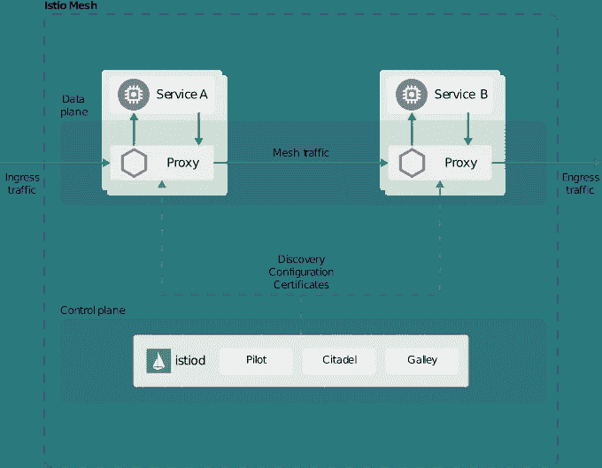

# Istio 如何在 Kubernetes 的幕后工作

> 原文：<https://betterprogramming.pub/how-istio-works-behind-the-scenes-on-kubernetes-aeb8003f2cb5>

## 洞察 Istio 架构及其各种移动部件如何管理 Kubernetes 中的微服务

阿里夫·瓦希德在 [Unsplash](https://unsplash.com/s/photos/data?utm_source=unsplash&utm_medium=referral&utm_content=creditCopyText) 上的照片

如果你在 [Kubernetes](https://kubernetes.io) 上做[微服务](https://en.wikipedia.org/wiki/Microservices)，那么像 [Istio](https://istio.io/) 这样的[服务网](https://en.wikipedia.org/wiki/Service_mesh)可以为你创造奇迹。本文是“[如何使用 Istio](https://medium.com/better-programming/how-to-manage-microservices-on-kubernetes-with-istio-c25e97a60a59) 管理 Kubernetes 上的微服务”的后续文章今天，我们来讨论一下 Istio 建筑。

Istio 通过两个主要组件帮助您管理微服务:

*   **数据平面。这些是 sidecar [Envoy](https://envoyproxy.github.io/envoy/) 代理 Istio 注入到你的微服务中。它们在您的服务之间进行实际的路由，并收集遥测数据。**
*   **控制平面。**这是告知数据平面如何路由流量的组件。它还存储和管理配置，并帮助管理员与 sidecar 代理交互和控制 Istio 服务网格。控制平面是 Istio 的大脑。

同样，两种类型的流量流经 Istio:数据平面流量(与业务相关的流量)和控制平面流量(由 Istio 组件之间的消息和交互组成，用于控制网格行为)。

# 控制平面组件

在目前的 Istio 版本(Istio v1.5 及以上)中，控制平面作为单个二进制 *Istiod* 发货，由三部分组成:*飞行员*、*城堡*和*厨房*。

[Istio 建筑公司](https://istio.io/docs/ops/deployment/architecture/arch.svg)

## 飞行员

飞行员是服务网格的中央控制器，负责使用[特使 API](https://www.envoyproxy.io/docs/envoy/latest/api/api) 与特使边车通信。它们解析 Istio 清单中定义的高级规则，并将其转换为特使配置。

它促进了服务发现、流量管理和智能路由，允许您进行 A/B 测试、蓝绿部署、金丝雀部署等等。它们还通过配置 sidecars 来提供超时、重试和断路功能，从而帮助在您的网格中提供弹性。

它们负责提供 Istio 配置和运行 Istio 的底层基础设施之间的松散耦合。因此，你可以在 Kubernetes，Nomad 或者[consult](https://www.consul.io/)上运行 Istio，但是你与 Istio 交互的方式是相似的。

飞行员知道它运行在什么平台上，并确保流量管理是相同的，不管平台如何。

Pilot 托管流量管理 API，该 API 有助于定义配置，并为您的服务网格内的流量管理提供更精细的控制。

## 城堡

您的服务之间的身份和访问管理是 Istio 的核心特性。它有助于您在 Kubernetes pods 之间实现安全通信。这意味着，虽然您的开发人员已经使用不安全的 TCP 设计了组件，但 Envoy 代理将确保 pod 之间的通信是加密的。

我们可以通过为每个 Pod 配置一个证书来实现相互 TLS。但是，如果您有一个相当大的微服务应用程序，您最终会管理数百个证书。Istio 通过提供一个名为 Citadel 的身份和访问管理器以及证书存储来抽象这一点。

Citadel 帮助您管理哪些服务可以与哪些服务对话，以及它们如何相互识别和验证。

Citadel 提供用户认证、凭证管理、证书管理和流量加密。如果任何 pod 需要验证凭证，citadel 会提供。

## 活版盘

厨房负责为您的服务网格提供配置验证、摄取、处理和分发。它是底层 API 的接口，Istio 控制平面与之交互。

例如，如果您应用了一个新策略，galley 会接收它、验证它、处理它，并将其推送到服务网格的正确组件。

# 数据平面组件

数据平面组件包括特使代理。Istio 促进了基于这些代理的服务发现。

这些是第 7 层代理，允许根据接收到的消息内容做出关键决策。唯一与业务流量交互的组件是特使代理。

它们有助于提供以下内容:

*   动态服务发现。
*   负载平衡。
*   TLS 终止。
*   采用基于百分比的指标的阶段性推广。
*   故障注入。
*   健康检查。
*   断路。
*   收集遥测数据。

由于所有流量都通过这些特使代理，它们有助于收集有关您的业务流量的重要数据。这让你能够收集洞察力，这将是规划你未来的关键。

Istio 提供了开箱即用的[普罗米修斯](https://prometheus.io/)和[格拉法纳](https://grafana.com/)来监控和可视化这些数据。也可以将数据发送到日志分析工具，作为 [Elastic Logstash Kibana (ELK)堆栈](https://www.elastic.co/elastic-stack)，以了解趋势并对这些指标进行机器学习。

由于 Istio 使用 sidecars 工作，因此无需重新设计运行在 Kubernetes 上的微服务应用程序。

它是您的开发、安全和运营团队之间的优秀解耦器。开发人员可以像以前一样开发他们的代码，而不必担心操作和安全方面的问题。

安全和运营团队可以使用 Istio 在应用程序中注入 sidecars，这有助于他们在其上挂钩管理和安全策略。

特使代理有助于提供大多数 Istio 功能，例如:

*   **流量控制**:它们帮助控制流量如何通过您的服务网格，例如为 HTTP、TCP、Websocket 和 gRPC 流量提供路由规则。
*   **安全和认证** —他们对 pod 实施身份和访问管理，以便只有正确的 pod 才能与其他 pod 交互。他们还实现了相互 TLS 和流量加密，以防止中间人攻击。它们提供速率限制，防止成本失控和拒绝服务攻击。
*   **网络弹性** —它们有助于提供网络弹性功能，如重试、故障转移、断路和故障注入。

它还提供了一种使用 web assembly extensions 模型插入自定义策略实施和遥测数据收集的方法。

# 组件之间如何交互

Istio 所做的一切都是通过特使代理。让我们来看看任何通过 Istio 的数据包会采用的典型流。

图片来自 [Istio](https://istio.io/docs/concepts/security/arch-sec.svg)

你看上图，有一个`Ingress`，两个微服务，一个`Egress`。服务 A 和服务 B 是运行在容器上的微服务，它们与 Envoy 代理共享同一个 Pod。

Istio 在部署时自动将特使代理注入 Pod。服务 A 是前端服务，服务 B 是后端服务，这是一个典型的实现。

流量数据包按照以下步骤在您的服务网格中移动。

## 进入

流量通过`Ingress`资源到达您的服务网格。Ingress 只是一组一个或多个特使代理，它们一部署就由 Pilot 配置。

飞行员使用 Kubernetes 服务端点来配置`Ingress`代理，而`Ingress`代理知道它的后端。

因此，如果收到数据包，Ingress 会知道将数据包发送到哪里，它会进行健康检查和负载平衡，并根据负载、数据包、配额和流量平衡等定义的指标做出发送消息的智能决策。

## 服务 A

一旦`Ingress`路由到第一个 pod，它就命中服务 A pod 的代理，而不是容器。

由于 sidecar 构成了与微服务容器相同的 pod 的一部分，所以它们共享相同的网络名称空间，并且存在于相同的节点中。

两个容器具有相同的 IP 地址，并共享相同的 IP 表规则。这使得代理可以完全控制 pod，并处理通过它的所有流量。

特使代理与 Citadel 交互，以了解是否有任何策略需要执行。它还检查是否需要加密通过链的流量，并与后端 pod 建立 TLS。

## 服务 B

服务 A 将加密的数据包发送给服务 B，后者遵循与服务 A 相同的步骤。

它还识别分组的发送者，并与源代理进行 TLS 握手。

一旦他们建立了信任，它就接受数据包并将其转发给服务 B 容器，然后链就移动到`Egress`层。

## 出口

所有流出网状网络的流量都会利用`Egress`资源。

`Egress`层定义了哪些流量可以离开网格，并使用`Pilot`，其配置与`Ingress`层相似。

使用`Egress`资源，您可以编写策略来限制出站流量，只允许所需的服务将数据包发送到网格之外。

## 遥测数据收集

在上述所有步骤中，当流量通过代理时，它可以收集遥测数据并将其发送给 Prometheus。

数据可以在 Grafana 中可视化，或者发送到 ELK 等外部工具，以进行进一步的分析和度量的机器学习。

# 结论

感谢阅读！我希望你喜欢这篇文章。

在下一篇文章"[Kubernetes 上的 Istio 入门](https://medium.com/better-programming/getting-started-with-istio-on-kubernetes-e582800121ea)"中，我将讨论如何安装 Istio，并且我们将使用一个示例应用程序进行实际操作演示——下一部分再见！