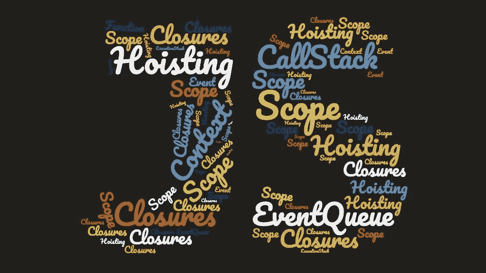
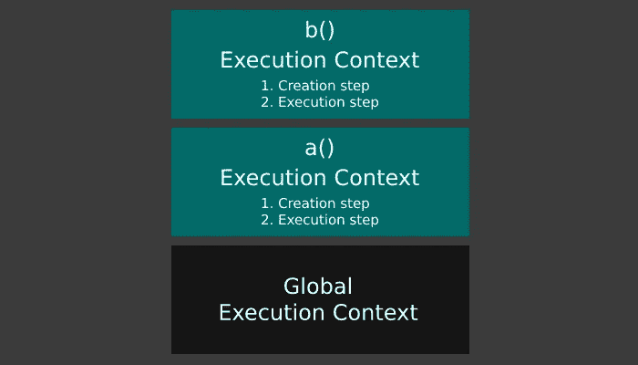
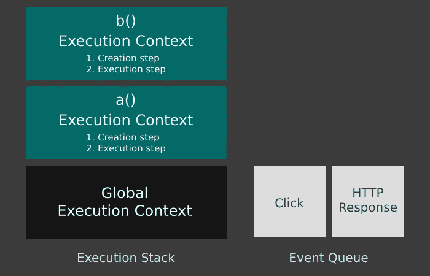

# JavaScript 如何工作

> 原文：<https://betterprogramming.pub/how-javascript-works-1706b9b66c4d>

## 为什么理解基本面是无价的

你可能想知道为什么有人会在 2019 年写一篇关于核心 JavaScript 的长文。

这是因为我相信，如果没有对基础知识的扎实理解，现在很容易迷失在 JS 生态系统中，并且几乎不可能探索更高级的主题。

理解 JavaScript 的工作原理会使阅读和编写代码变得更容易，更容易，并且让您专注于应用程序的逻辑，而不是与语言的语法斗争。

# 它是如何工作的？

计算机不理解 JavaScript，但浏览器理解。

除了处理网络请求、监听鼠标点击、解释 HTML 和 CSS 以在屏幕上绘制像素，浏览器还内置了 JavaScript 引擎。

JavaScript 引擎是一个程序，用比如说 C++编写，它遍历所有的 JavaScript 代码，一个字符一个字符地，把它“转换”成计算机的 CPU 可以理解和执行的东西——[机器码](https://en.wikipedia.org/wiki/Machine_code)。

这是同步发生的，意味着一次一行，按顺序进行。

他们这样做是因为机器码很难，也因为机器码指令在 CPU 制造商之间是不同的。

因此，他们将所有这些麻烦从 JavaScript 开发人员那里抽象出来，否则，web 开发将会更加困难，更加不受欢迎，我们也不会有像 Medium 这样的东西来编写像这样的文章(我现在可能正在睡觉)。

JavaScript 引擎可以盲目地一遍又一遍地遍历 JavaScript 的每一行(参见[解释器](https://en.wikipedia.org/wiki/Interpreter_(computing)))，或者它可以变得更聪明，检测经常被调用并总是产生相同结果的函数。

然后，它可以将这些编译成机器码一次，这样下次遇到它时，它就会运行已经编译好的代码，这样会快得多(参见[即时编译](https://en.wikipedia.org/wiki/Just-in-time_compilation))。

或者，它可以提前将整个东西编译成机器码并执行它(参见[编译器](https://en.wikipedia.org/wiki/Compiler))。

V8 就是这样一个 JavaScript 引擎，谷歌在 2008 年开源了这个引擎。2009 年，一个叫 Ryan Dahl 的人有了用 V8 创建 [Node.js](https://en.wikipedia.org/wiki/Node.js) 的想法，这是一个浏览器外的 JavaScript 运行时环境，这意味着该语言也可以用于服务器端应用。

# 函数执行上下文

像任何其他语言一样，JavaScript 对于函数、变量、数据类型以及这些数据类型可以存储的确切值、它们在代码中的可访问位置和不可访问位置等都有自己的规则。

这些规则由一个名为 [Ecma International](https://www.ecma-international.org/) 的标准组织定义，它们共同构成了语言规范文档(你可以在这里找到最新版本[)。](https://www.ecma-international.org/publications/standards/Ecma-262.htm)

因此，当引擎将 JavaScript 代码转换为机器代码时，它需要考虑规范。

如果代码包含非法赋值，或者试图访问一个变量，而根据语言规范，该变量不应该从代码的特定部分访问，该怎么办？

每次调用一个函数时，它都需要解决所有这些问题。它通过创建一个名为*执行上下文*的包装器来实现这一点。

为了更具体并避免将来混淆，我将把这个*函数执行上下文称为*，因为每次调用一个函数都会创建一个。不要被这个术语吓倒，现在也不要想太多，稍后会详细说明。

只要记住它决定了一些事情，比如:“在那个特定的函数中哪些变量是可访问的，在它里面`this`的值是什么，在它里面声明了哪些变量和函数？”

# 全局执行上下文

但是，并不是所有的 JavaScript 代码都在函数内部(尽管大部分都在函数内部)。

任何函数之外也可以有全局级别的代码，因此 JavaScript 引擎首先要做的事情之一就是创建一个*全局执行上下文。*

这就像一个函数执行上下文，在全局级别上服务于相同的目的，但是它有一些特殊性。

例如，只有一个全局执行上下文，在执行开始时创建，所有 JavaScript 代码都在其中运行。

即使没有要执行的代码，全局执行上下文也会创建两个特定于它的东西:

*   一个全局对象。当 JavaScript 在浏览器中运行时，这个对象就是`window`对象。当它在它之外运行时，就像 Node.js 的情况一样，它将类似于`global`。不过为了简单起见，我将在本文中使用`window`。
*   一个叫做`this`的特殊变量。

在全局执行上下文中，并且只有在那里，`this`实际上等于全局对象`window`。基本上是参考了`window`。

全局执行上下文和函数执行上下文之间的另一个微妙区别是，在全局级别声明的任何变量或函数(在任何函数之外)，都作为属性自动附加到`window`对象，并隐式附加到特殊变量`this`。

尽管函数也有特殊变量`this`，但这不会发生在函数执行上下文中。

因此，如果我们有一个在全局级别声明的全局变量`foo`，下面的三个语句实际上都指向它。这同样适用于函数。

所有的 JavaScript 内置变量和函数都附加在全局的`window`对象上:`setTimeout()`、`localStorage`、`scrollTo()`、`Math`、`fetch()`等。这就是为什么在代码中的任何地方都可以访问它们。

# 执行堆栈

我们知道，每次调用函数时，都会创建一个函数执行上下文。

因为即使是最简单的 JavaScript 程序也有相当多的函数调用，所以所有这些函数执行上下文都需要以某种方式进行管理。

看看下面的例子:

当遇到函数`a()`的调用时，如上所述创建函数执行上下文，并执行函数内的代码。

当代码执行完成时(到达函数的`return`语句或封装`}`，函数`a()`的函数执行上下文被销毁。

然后，遇到对`b()`的调用，并对函数`b()`重复相同的过程。

但是这种情况很少发生，即使在非常简单的 JavaScript 程序中也是如此。大多数情况下，会有一些函数在其他函数中被调用:

在这种情况下，为`a()`创建了一个函数执行上下文，但是在`a()`执行的中途，遇到了`b()`的调用。

为`b()`创建了一个全新的函数执行上下文，但是没有破坏`a()`的执行上下文，因为它的代码没有被完全执行。

这意味着同时存在许多函数执行上下文。然而，在任何给定的时间，它们中只有一个真正在运行。

为了跟踪哪一个当前正在运行，使用了一个堆栈，其中当前运行的函数执行上下文位于堆栈的顶部。

一旦它完成执行，它将从堆栈中弹出，下一个执行上下文的执行将继续，等等，直到执行堆栈为空。

这个堆栈被称为*执行堆栈*，如下图所示。

JavaScript 执行堆栈

当执行堆栈为空时，我们之前讨论过的并且永远不会被销毁的全局执行上下文就变成了当前正在运行的执行上下文。

# 事件队列

还记得我说过 JavaScript 引擎只是浏览器的一个组件，与渲染引擎或网络层并列吗？

这些组件有内置的钩子，引擎用它来发起网络请求，在屏幕上画像素，或者监听鼠标点击。

当您在 JavaScript 中使用类似于`fetch`的东西来执行 HTTP 请求时，引擎实际上会将它传递给网络层。每当请求的响应到来时，网络层都会将其传递回 JavaScript 引擎。

但是这可能需要几秒钟的时间，那么在请求过程中 JavaScript 引擎会做什么呢？

简单地停止执行任何代码，直到响应到来？继续执行剩下的代码，每当响应到来时，停止一切并执行回调？当回调结束时，从它停止的地方继续执行？

以上都不是，尽管第一个可以通过使用 [await](https://developer.mozilla.org/en-US/docs/Web/JavaScript/Reference/Operators/await) 来实现。

在多线程语言中，这可以通过让一个线程在当前运行的执行上下文中执行代码，另一个线程执行事件的回调来处理。但是这对于 JavaScript 是不可能的，因为它是单线程的。

为了理解这实际上是如何工作的，让我们考虑一下我们之前看到的`a()`和`b()`函数，但是添加了一个点击处理程序和一个 HTTP 请求处理程序。

JavaScript 引擎从浏览器的其他组件接收到的任何事件，比如鼠标点击或网络响应，都不会被立即处理。

JavaScript 引擎此时可能正忙于执行代码，所以它会将事件放入一个队列中，称为*事件队列*。

JavaScript 事件队列

我们已经讨论了执行堆栈，以及一旦相应函数中的代码执行完毕，当前运行的函数执行上下文是如何从堆栈中弹出的。

然后，下一个执行上下文继续执行，直到它结束，以此类推，直到堆栈为空，全局执行上下文成为当前运行的执行上下文。

当有代码要在执行堆栈上执行时，事件队列中的事件会被忽略，因为引擎正忙于执行堆栈上的代码。

只有当它完成，并且执行堆栈为空时，JavaScript 引擎才会处理事件队列中的下一个事件(当然，如果有事件队列的话)，并调用它的处理程序。

由于这个处理程序是一个 JavaScript 函数，它将像处理`a()`和`b()`一样被处理，这意味着一个函数执行上下文被创建并被推送到执行堆栈上。

如果该处理程序依次调用另一个函数，则另一个函数执行上下文被创建并被推到堆栈顶部，依此类推。

只有当执行堆栈再次为空时，JavaScript 引擎才会再次检查事件队列中的新事件。

这同样适用于键盘和鼠标事件。当鼠标被单击时，JavaScript 引擎将获得一个 click 事件，将其放入事件队列，并且仅在执行堆栈为空时执行其处理程序。

通过将以下代码复制粘贴到浏览器控制台中，您可以很容易地看到这一点:

`while`循环只是让引擎忙碌五秒钟，不用太担心。在这五秒钟内开始单击文档上的任何地方，您将看到控制台上没有记录任何内容。

当五秒钟过后，执行堆栈为空，第一次单击的处理程序被调用。

因为这是一个函数，所以函数执行上下文被创建、推送到堆栈、执行并从堆栈中弹出。然后，调用第二次单击的处理程序，依此类推。

实际上，`setTimeout()`(和`setInterval()`)也是如此。您提供给`setTimeout()`的处理程序实际上被放在事件队列中。

这意味着，如果您将超时设置为`0`，但是在执行堆栈上有代码要执行，那么`setTimeout()`的处理程序将仅在堆栈为空时被调用，这可能是许多毫秒之后。

这也是`setTimeout()`和`setInterval()`不是真正精确的原因之一。如果你不相信我的话，把下一个要点复制粘贴到你的浏览器控制台上。

注意:放入事件队列的代码被称为*异步*。这是不是一个好的术语是一个不同的话题，但人们就是这么称呼它的，所以我想你必须习惯它。

# 函数执行上下文步骤

现在我们已经熟悉了 JavaScript 程序的执行生命周期，让我们更深入地了解一下函数执行上下文是如何创建的。

它分两步进行:创建步骤和执行步骤。

创建步骤“设置东西”以便代码可以被执行，而执行步骤实际上执行它。

在创作阶段，有两件事非常重要:

*   范围确定了。
*   确定了`this`的值(我假设您已经熟悉 JavaScript 中的`this`关键字)。

在接下来的两个相应部分中，将详细介绍其中的每一项。

# 范围和范围链

作用域由给定函数中可访问的变量和函数组成，即使它们没有在函数本身中声明。

JavaScript 有*词法作用域*，这意味着作用域是根据代码中声明函数的位置来确定的。

当到达上面的`console.log(foo)`时，JavaScript 引擎将首先检查在`b()`的执行上下文的范围内是否有变量`foo`。

由于没有声明，它将转到“父”执行上下文，也就是`a()`的执行上下文，因为`b()`是在`a()`中声明的。在这个执行上下文的作用域上，它找到`foo`，并打印它的值。

如果我们在`a()`外提取`b()`，像这样:

会抛出一个`ReferenceError`，即使两者唯一的区别是声明`b()`的地方。

`b()`的“父”作用域现在是全局执行上下文的作用域，因为它是在全局级别声明的，在任何函数之外，并且那里没有变量`foo`。

我明白为什么这可能会令人困惑，因为如果你看看执行堆栈，它看起来像这样:

JavaScript 执行堆栈

因此，很容易假设“父”执行上下文是堆栈中的下一个，在当前上下文之下。然而，事实并非如此。

在第一个例子中，`a()`的执行上下文实际上是`b()`的“父”执行上下文。不是因为`a()`恰好是执行堆栈中的下一项，就在`b()`的下面，而是因为`b()`是在`a()`内部声明的。

在第二个例子中，执行堆栈看起来是一样的，但是这次`b()`的“父”执行上下文是全局执行上下文，因为`b()`是在全局级别声明的。

只要记住:在哪里调用函数并不重要，重要的是在哪里声明它。

但是，如果在“父”执行上下文的范围内也找不到变量，会发生什么呢？

在这种情况下，它将尝试在下一个“父”执行上下文的范围内找到它，这是以完全相同的方式确定的。

如果它也不在那里，它将尝试下一个，以此类推，直到最终到达全局执行上下文的范围。如果它在那里也找不到，就会抛出一个`ReferenceError`。

这被称为*范围链*，这正是下面的例子中发生的情况:

它首先试图在`c()`的执行上下文的范围内找到`foo`，然后是`b()`，最后是`a()`，在那里找到它。

注意:记住，它只是从`c()`到`b()`再到`a()`，因为它们是在对方内部声明的，而不是因为它们对应的执行上下文在执行堆栈中位于对方之上。

如果它们不在另一个中声明，那么“父”执行上下文就会不同，如上所述。

然而，如果在`c()`或`b()`中有另一个变量`foo`，它的值将被记录到控制台，因为引擎一找到该变量就停止“寻找”“父”执行上下文。

这同样适用于函数，不仅仅是变量，同样适用于全局变量，就像上面的`console`本身。

它将沿着作用域链向下(或者向上，这取决于你如何看待它)，寻找一个名为`console`的变量，并最终在全局执行上下文中找到它，附加到`window`对象。

注意:尽管我在上面的例子中只使用了函数声明语法，但是作用域和作用域链对于在 ES2015(也称为 ES6)中引入的[箭头函数](https://developer.mozilla.org/en-US/docs/Web/JavaScript/Reference/Functions/Arrow_functions)完全相同。

# 关闭

闭包提供了从内部函数到外部函数范围的访问。

但是，这并不是什么新东西，我只是在上面描述了它是如何通过作用域链实现的。

闭包的特别之处在于，即使外部函数的代码被执行，它的执行上下文从执行堆栈中弹出，并被销毁，内部函数仍然有对外部函数范围的引用。

JavaScript 闭包

这正是上例中发生的情况。`b()`是在`a()`内部声明的，所以它可以通过作用域链从`a()`的作用域中访问`name`变量。

但是它不仅可以访问它，还创建了一个闭包，这意味着它甚至可以在父函数`a()`返回后访问它。

变量`c`只是对内部函数`b()`的引用，所以最后一行代码实际上调用了内部函数`b()`。

即使这发生在`b()`的外部函数`a()`返回很久之后，内部函数`b()`仍然可以访问父函数的范围。

你可以在这篇由 Eric Elliott 撰写的关于 Medium 的文章中阅读更多关于如何使用闭包的内容。

# 这个的价值

在执行上下文的创建步骤中确定的下一件事是`this`的值。

恐怕这没有作用域那么简单，因为函数内部的`this`的值取决于函数是如何被调用的。更复杂的是，您可以“覆盖”默认行为。

我会尽量让解释简单明了，你可以在 [MDN](https://developer.mozilla.org/en-US/docs/Web/JavaScript/Reference/Operators/this) 上找到关于这个话题的更详细的文章。

首先，要看函数是不是用函数声明来声明的:

或箭头功能:

如上所述，两者确定的范围完全相同，但`this`的值不同。

# 箭头功能

我从简单的开始。在箭头函数的情况下，`this`的值是词法的，所以它的确定类似于范围的确定。

“父”执行上下文完全按照*作用域和作用域链*一节中的解释来确定，这取决于 arrow 函数的声明位置。

`this`的值将与父执行上下文中的`this`的值相同，而父执行上下文中的值又是如本节所述确定的。

我们可以在下面的两个例子中看到这一点。

第一个将记录`true`，而第二个记录`false`，即使在两种情况下`myArrowFunction`都在同一个地方被调用。两者之间唯一的区别是声明箭头函数`myArrowFunction`的地方。

日志`true`

日志错误

由于`myArrowFunction`中`this`的值是词法的，所以在第一个例子中它将是`window`，因为它是在全局级别声明的，在任何函数或类之外。

在第二个例子中，`myArrowFunction`中`this`的值将是包装它的函数中`this`的值。

我将在本节的后面详细讨论这个值的具体值，但是现在，注意到它不是第一个例子中的`window`就足够了。

记住:对于箭头函数，`this`的值是基于箭头函数在哪里被声明，而不是在哪里或者如何被调用。

# 函数声明

在这种情况下，事情并不那么简单，这正是为什么在 ES2015 中引入箭头功能的原因(或至少是其中之一)，但请相信我，几段时间后一切都会变得有意义。

除了箭头函数(`const a = () => { … }`)和函数声明(`function a() { … }`)在语法上的区别之外，两者之间的主要区别是各自内部的`this`的值。

与 arrow 函数不同，函数声明中的`this`的值不是基于函数声明的位置按词法确定的。

这是根据调用函数的方式来确定的。有几种方法可以调用函数:

*   简单调用:`myFunction()`
*   对象方法调用:`myObject.myFunction()`
*   构造函数调用:`new myFunction()`
*   DOM 事件处理程序调用:`document.addEventListener(‘click’, myFunction)`

对于每种类型的调用，`myFunction()`中的`this`的值是不同的，与`myFunction()`的声明位置无关，所以让我们一个一个地来看看它是如何工作的。

## **简单调用**

简单调用就是简单地调用一个函数，就像上面的例子一样:只有函数名，前面没有任何字符，后面跟有`()`(当然，里面有任何可选的参数)。

在简单调用的情况下，函数中`this`的值总是全局的`this`，它又指向全局的`window`对象，如上面某一节所述。

就是这样！但是请记住，这只适用于简单的调用；函数名后跟`()`。没有前置字符。

注意:因为简单函数调用中的值`this`实际上是对全局`window`对象的引用，所以在简单调用要调用的函数中使用`this`被认为是不好的做法。

这是因为函数内部任何附加到`this`的属性实际上都附加到了`window`对象上，变成了全局变量，这是很糟糕的做法。

这就是为什么在[严格模式](https://developer.mozilla.org/en-US/docs/Web/JavaScript/Reference/Strict_mode)下，简单调用所调用的任何函数中`this`的值都是`undefined`，上面的例子会输出`false`。

## **对象方法调用**

当一个对象的属性有一个函数作为它的值时，它被认为是该对象的一个方法，因此有术语*方法调用*。

当使用这种类型的调用时，函数中的值`this`将简单地指向调用方法的对象，在上面的例子中是`myObject`。

注意:如果使用了 arrow 函数语法，而不是上面例子中的函数声明，那么 arrow 函数中的值`this`应该是全局`window`对象。

这是因为它的父执行上下文应该是全局执行上下文。它是在对象内部声明的这一事实不会改变任何事情。

## **构造函数调用**

调用函数的另一种方式是在调用之前加上关键字`new`，如下例所示。

当以这种方式调用时，函数将返回一个新的对象(即使它没有 return 语句)，函数内部的值`this`将指向那个新创建的对象。

解释有点简单(更多关于 [MDN](https://developer.mozilla.org/en-US/docs/Web/JavaScript/Reference/Operators/new) ，但重点是它会创建(或*构造*，因此*构造*)并返回一个`this`将在函数内部指向的对象。

注意:当在`class`上使用`new`关键字时也是如此，因为类实际上是特殊的函数，只有很小的区别。

注意:箭头函数不能用作构造函数。

## **DOM 事件处理程序调用**

当作为 DOM 事件处理程序调用时，函数中的`this`的值将是事件所在的 DOM 元素。

注意:在所有其他类型的调用中，我们自己调用函数。

然而，在事件处理程序的情况下，我们不这样做，我们只传递一个对处理函数的引用。JavaScript 引擎调用该函数，我们无法控制它如何执行。

## **用自定义** `**this**` **值**调用

通过使用`Function.prototype`中的`bind()`、`call()`或`apply()`调用函数，可以将函数中`this`的值显式设置为自定义值。

上面的例子显示了这些是如何工作的。

`call()`和`apply()`非常相似，唯一的区别是`apply()`的函数参数是以数组的形式传递的。

当`call()`和`apply()`实际调用函数时，将`this`的值设置为您作为第一个参数传入的值，`bind()`不会调用该函数。

相反，它返回一个新函数，这个函数与使用了`bind()`的函数完全一样，但是`this`的值被设置为您作为参数传递给`bind()`的值。

这就是为什么你在`a.bind(obj)`后看到`(5, 6)`，实际上是为了调用`bind()`返回的函数。

在`bind()`的情况下，返回函数中`this`的值被永久绑定到作为`this`值传递的任何值(因此得名`bind()`)。

无论使用哪种类型的调用，返回函数中的`this`值总是作为参数提供的值。只能用`call()`、`bind()`或`apply()`再次修改。

上面这段话几乎完全正确。当然，这个规则也有例外，这个例外就是构造函数调用。

当以这种方式调用一个函数时，通过将`new`关键字放在它的调用之前，函数内部的`this`的值将总是由调用返回的对象，即使`new`函数被赋予另一个带有`bind()`的`this`。

您可以在下面的示例中检查这一点:

下面是一个例子，说明如何使用`bind()`来控制我们前面讨论的点击事件处理程序的`this`的值:

注意:`bind()`、`call()`和`apply()`不能用于向箭头函数传递自定义`this`值。

## **箭头功能注释**

您现在可以看到，这些函数声明的规则，即使相当简单，也会因为所有的特殊情况而导致混乱，并成为错误的来源。

对函数调用方式的一个小小的改变将会改变函数中`this`的值。这可能导致整个连锁反应，这就是为什么了解这些规则以及它们如何影响你的代码是很重要的。

这就是为什么编写 JavaScript 规范的人想出了箭头函数，其中`this`的值总是词法的，并且每次都是完全相同的，不管它们是如何被调用的。

# 提升

我之前提到过，当一个函数被调用时，JavaScript 引擎会首先遍历代码，找出`this`的作用域和值，并识别函数体中声明的变量和函数。

在第一步(创建步骤)中，这些变量获得一个特殊值`undefined`，不管代码中给它们分配了什么实际值。

只有在第二个步骤(执行步骤)中，它们才被赋予实际值，并且这仅在到达赋值行时发生。

这就是为什么下面的 JavaScript 代码会记录`undefined`:

在创建步骤中，变量`a`被识别，并被赋予特殊值`undefined`。

然后，在执行步骤中，到达将`a`登录到控制台的那一行。`undefined`被记录，因为这是上一步中设置为`a`的值。

当到达给`a`赋值`1`的行时，`a`的值将变为`1`，但是`undefined`已经被记录到控制台。

这种效果叫做*提升*，就好像所有的变量声明都被提升到了代码的顶部。如你所见，这不是真的发生了什么，但这是用来描述它的术语。

注意:这也会发生在箭头函数上，但不会发生在函数声明上。

在创建步骤中，函数没有被赋予特殊值`undefined`，而是将整个函数体放入内存中。这就是为什么一个函数甚至可以在声明之前就被调用，就像下面的例子，而且它会工作。

注意:当试图访问一个根本没有定义的变量时，会抛出一个`ReferenceError: x is not defined`。所以，在“未定义”和“未定义”之间是有区别的，这可能有点令人困惑。

# 结论

我记得读过关于提升、范围、闭包等的文章。，当我阅读它们的时候，它们都是有意义的，但我总是会遇到一些奇怪的 JavaScript 行为，我无法解释。

问题是我总是一个一个地阅读每个概念。

所以我试着理解更大的图景，比如 JavaScript 引擎本身。如何创建执行上下文并将其推送到执行堆栈上，事件队列如何工作，如何确定`this`和范围等。

在那之后，一切都变得有意义了。我开始更早地发现潜在的问题，更快地识别错误的来源，并且对我的总体编码更加自信。

我希望这篇文章对你也一样！

# 参考

*   [编写 JavaScript 应用程序](https://www.amazon.com/Programming-JavaScript-Applications-Architecture-Libraries/dp/1491950293)
*   [JavaScript:理解奇怪的部分](https://www.udemy.com/understand-javascript/)(前三个半小时免费[这里](https://www.youtube.com/watch?v=Bv_5Zv5c-Ts))
*   [你不知道 JS](https://github.com/getify/You-Dont-Know-JS)