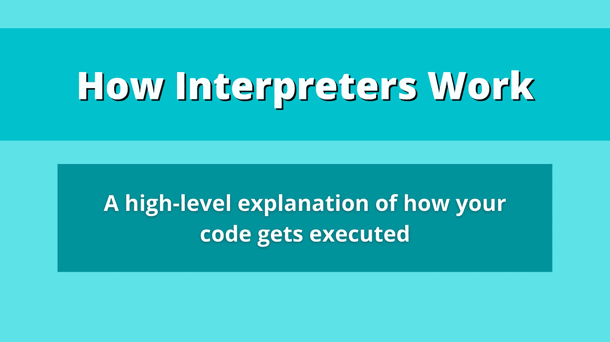
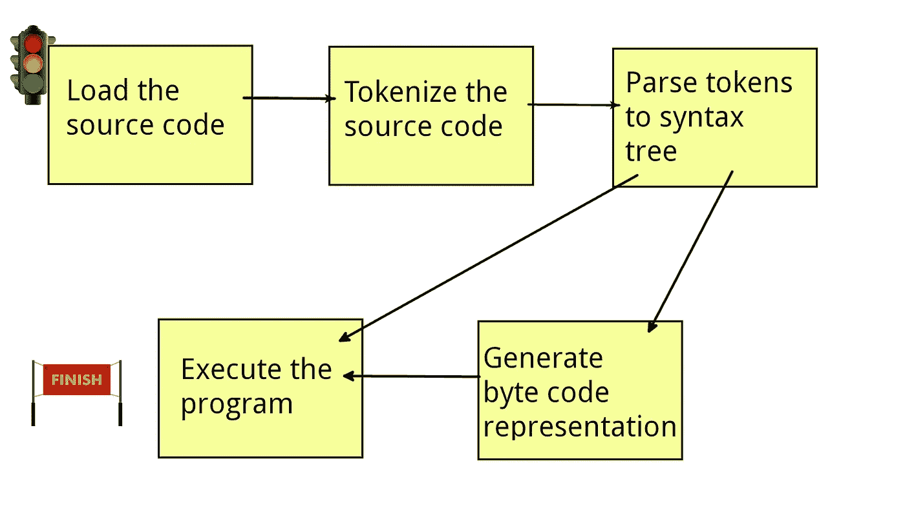
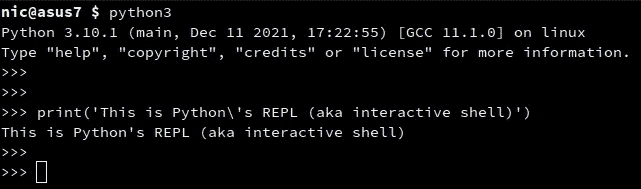
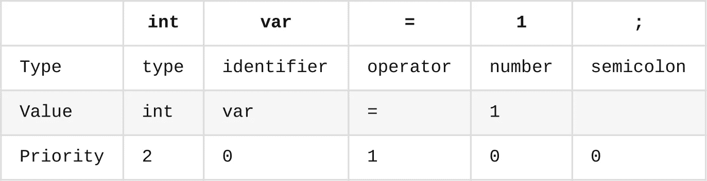
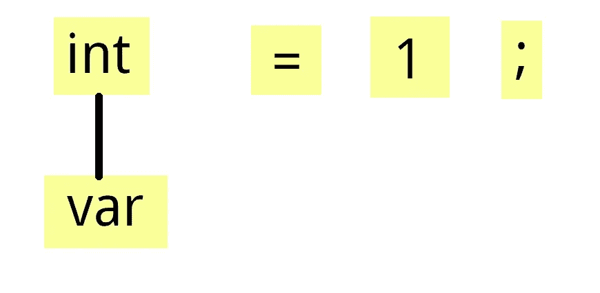
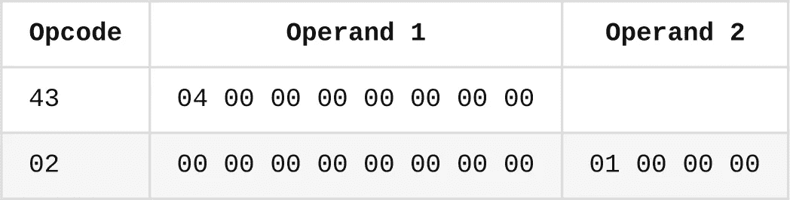
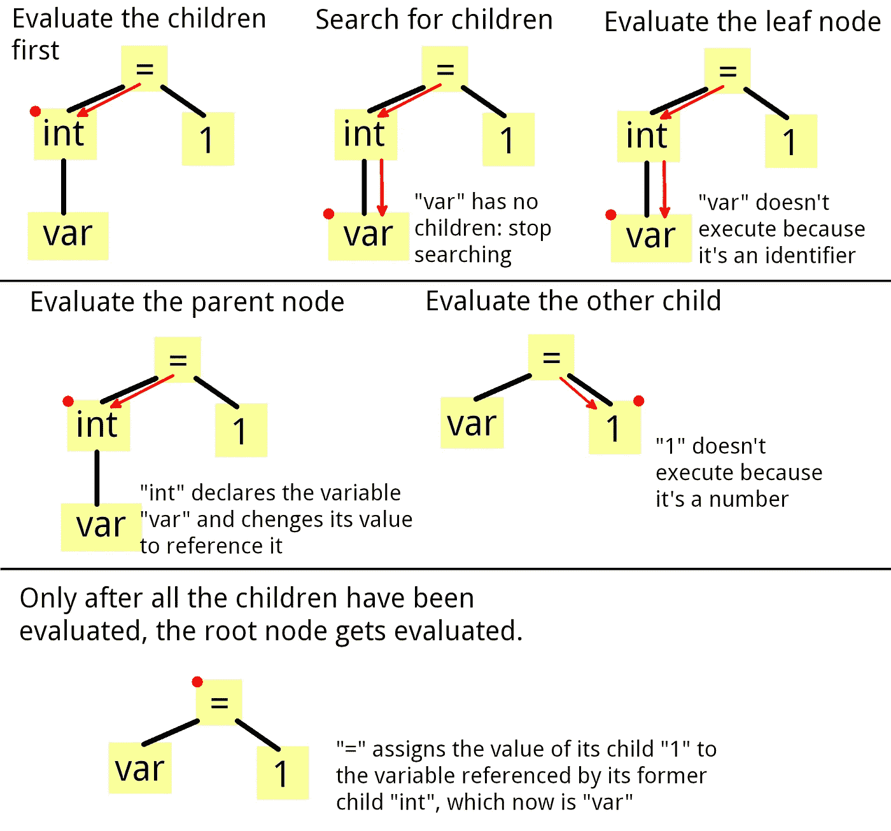

# 编程语言解释器如何执行你的代码

> 原文：<https://betterprogramming.pub/how-language-interpterers-execute-your-programs-450a6837dee4>

## 了解 Python、JavaScript 和 Java 等语言是如何工作的



作者图片

你有没有想过你的源代码是如何被执行的？有许多方法可以做到这一点，但使用口译员是最简单的选择之一。一个[解释器](https://en.wikipedia.org/wiki/Interpreter_(computing))是一个软件，它以源代码作为输入，直接执行程序中描述的操作，而不需要先编译成[机器码](https://en.wikipedia.org/wiki/Machine_code)。

解释器在现代软件开发中变得非常流行，特别是得益于像 Python 和 JavaScript 这样的语言。它们允许程序员轻松地表达概念，而不需要指定数据类型并立即运行他们的程序，而不必等待源代码被编译成 CPU 可以理解的格式。

此外，同一个程序可以在多个平台上运行，因为兼容性是由解释器自带的[虚拟机](https://en.wikipedia.org/wiki/Virtual_machine)保证的。

# 口译员如何在高水平上工作

有许多类型的解释器，从数学(又名计算器)，到 CPU，甚至是自然语言解释器。但是，它们的工作原理基本相同。将源代码翻译成[机器指令](https://en.wikipedia.org/wiki/Machine_code)的复杂任务被分成更小更简单的步骤，以链式方式一个接一个地执行:加载源代码，对源代码进行标记，将标记解析成语法树，可选地生成字节码表示，最后执行程序。



解释链。图片由作者提供，[红绿灯](https://pngtree.com/freepng/traffic-lights-quanmie_2210914.html?sol=downref&id=bef)由 artwant 提供，[完成标志](https://pngtree.com/freepng/finish-line-icon-simple-style_5254975.html?sol=downref&id=bef)由 Ylivdesig 提供，来自 [pngtree](https://pngtree.com/) **。**

在本文中，我将详细介绍每个阶段所涉及的内容。在下一篇文章中，我将展示如何用代码实现一个解释器。

# 加载源代码

这是解释的第一步，也是最简单的一步。它包括获取用户想要运行的源代码。可以通过从磁盘加载一个或多个文件，或者通过在[读取-评估-打印循环](https://en.wikipedia.org/wiki/Read%E2%80%93eval%E2%80%93print_loop)(也称为交互式 shell)中请求用户输入来获取。



Python REPL 的例子。

这个操作的输出通常是一个包含要运行的源代码的字符串，它将被传递到解释链的下一个环节。

# 将源代码符号化

[记号化](https://en.wikipedia.org/wiki/Lexical_analysis)，或词法分析，是将字符串源代码等字符序列转换成[记号](https://en.wikipedia.org/wiki/Lexical_analysis#Token)序列的过程。记号是语言中仍然有意义的最小单位，可以是单词、标点符号或运算符。

更具体地说，下面是一个标记化代码语句的示例:

```
// Source code
int var = 1;// Tokens separated by '|'
int | var | = | 1 | ;
```

令牌可以有各种属性，但它们的基本定义是:

*   一个**类型**，或者这个令牌代表什么。标记类型是由语言实现定义的，但一般来说，它们围绕着数字、字符串、标识符、运算符和关键字。

令牌的类型稍后用于解释其值。类型可以比作自然语言中的[词类](https://en.wikipedia.org/wiki/Part_of_speech)，比如副词、名字或者介词。

*   一个**值**，或者说这个令牌是什么意思。值可以是任何东西，从数字到复杂的数据结构。它们可以被认为是自然语言中一个词的意思，就像“狗”这个词确定了狗的概念一样。
*   一个**优先级**，或者何时应该评估令牌。它通常表示为一个数字，取决于令牌的类型及其在代码中的位置。

优先权可以比作你解释词义的顺序。比如你理解“快狗追可爱猫”这句话里，“快”和“可爱”这两个字分别跟“狗”和“猫”走，并没有所谓的“可爱追”，或者“快了”。

为了让这一点更清楚，让我们标记一下我之前展示的代码行。



令牌化代码语句表。

正如您所看到的，像`**var**`和`**1**`这样的标记的优先级为 0，因为它们不会被执行。否则，操作“1”会做什么？

在标记化阶段的最后，我们获得一个标记序列。由于解释器不能理解一个简单的字符串，源代码不得不逐渐采取一种更结构化的形式，每次都更接近计算机程序能够理解的形式，从而执行。

# 解析令牌

这一步是将上一步生成的标记组织成一个层次结构，称为[抽象语法树](https://en.wikipedia.org/wiki/Abstract_syntax_tree)。它是“抽象的”,因为它不代表原始语法的细节，而是源代码的高级视图。

在解析阶段，我们将需要使用令牌的优先级及其类型，以便将它们组织成树状结构。具有最高优先级的令牌首先被求值，而正如我之前提到的，零优先级意味着令牌不会被求值。

首先，让我们确定具有最高优先级的令牌:`int`。然后我们要问问自己`int`需要什么。这就是令牌类型派上用场的时候:因为`int`令牌是一个变量类型声明操作符，它需要一个变量来声明。标识符标记`var`恰好就在它旁边，所以它将被作为语法树中`int`的子元素。



" **int** "在语法树中以" **var** "为子。

每当考虑解析一个令牌时，为了不再考虑它，它的优先级被设置为 0。所以，现在`int`的优先级是 0。接下来，具有最高优先级值的令牌是`=`(为 1)，它需要两个操作数:一个值和一个用于赋值的标识符(变量)。和以前一样，令牌`=`从令牌列表中提取它的孩子。


如您所见，树开始呈现类似程序逻辑结构的形状:`**=**`标记将值`**1**` 赋给由`**int**`声明的变量`**var**`。最后一个标记`**;**`可以简单地丢弃，因为它表示代码语句的结束。

圆括号的使用通过提高它们所包含的标记的优先级来改变操作的顺序。

# 生成字节码

[字节码](https://en.wikipedia.org/wiki/Bytecode)是一种指令集形式，旨在由解释器高效执行。它由一系列字节组成，简洁地描述了程序的行为，就像机器指令一样。

从语法树生成字节代码表示是可选的，但是极大地提高了解释器的性能，因为它可以直接执行指令，而不必对代码执行任何耗时的语法或逻辑分析。

字节码的另一个优点是可重用性:您可以在程序第一次运行时生成它，然后将其存储在一个文件中。当程序第二次执行时，解释器首先查找这个文件，以避免将源代码再次标记和解析成语法树。

Java 和 Python 等流行语言使用这种方法，分别在`target`文件夹中生成`.class`文件，在`__pycache__`文件夹中生成`.pyc`文件。


Python 缓存字节码示例。

每个字节码指令分为两个主要部分:

*   Operator，或 [opcode](https://en.wikipedia.org/wiki/Opcode) ，一个 1 字节的值，标识要执行的操作，如加法。哪个操作码对应哪个操作是由解释器的架构定义的。
*   操作数，一个可变大小的字节序列，表示操作符应该对什么执行操作。

例如，语句`int var = 1;`可以编码成如下所示。请注意，这是一个虚拟示例，并不对应于任何特定的字节码规范。



“int var = 1；”的字节码示例

其中 1 字节操作码`43`对应于将给定数量的字节推入到[堆栈](https://en.wikipedia.org/wiki/Stack_(abstract_data_type))中的操作，而`04 00 00 …` 是一个 8 字节数，它指定了要推入的字节数量；记住 4 个字节是`int`数据类型的大小。

接下来，操作码`02`负责将位于指定堆栈地址的字节(`00 00 00 …`，对应于新推入的字节)设置为给定值(`01 00 00 00`)。

# 执行程序

作为最后一步，生成的程序表示被馈送到虚拟机，这是一个负责模拟物理计算机系统功能的软件，如 [JVM](https://en.wikipedia.org/wiki/Java_virtual_machine) 。

语法树和字节码都可以执行，但是它们的处理方式不同。

# 执行字节代码

这个过程相当简单:您必须将一个函数映射到每个操作码。基于该操作，VM 还加载一定数量的表示操作数的字节。然后，它执行该操作并将结果(如果有的话)存储在虚拟[寄存器](https://en.wikipedia.org/wiki/Processor_register)中，用于在[获取-解码-执行周期](https://en.wikipedia.org/wiki/Instruction_cycle)中使用的下一条指令。

这通常是首选的方法，因为它比解释语法树更有效。然而，它要求你要么从头构建一个新的 VM，要么学习现有的字节码规范，例如， [Kotlin](https://en.wikipedia.org/wiki/Kotlin_(programming_language)) 运行在 JVM 上，尽管它是为 Java 设计的。

# 执行语法树

这个过程包括递归地执行由语法树表示的操作，从叶节点开始，逐步沿分支向上，直到根节点。



语法树执行工作流。

对代码中的每一条语句重复这个过程。您可能已经注意到，除了执行字节码之外，还涉及到更多的步骤，因此这种方法要慢得多。另一方面，它通常更容易用代码实现，并且不需要太多关于 CPU 如何工作的知识。

# 结论

这是对解释器在运行源代码时所经历的步骤的高级解释。在下一篇文章中，我将介绍如何从头开始编写一个解释器。

我希望你喜欢这本书。如果你有任何问题或补充，请在评论中分享。感谢阅读！

如果你对这个领域感兴趣，我建议你看看这个关于如何编写数学解释器的指南:

[](/programming-a-calculator-to-solve-complex-numerical-expressions-75d228f37ebf) [## 编写计算器程序来解决复杂的数字表达式

### 计算器与编译器和解释器有许多共同之处。通过代码示例和算法探索细节…

better 编程. pub](/programming-a-calculator-to-solve-complex-numerical-expressions-75d228f37ebf)