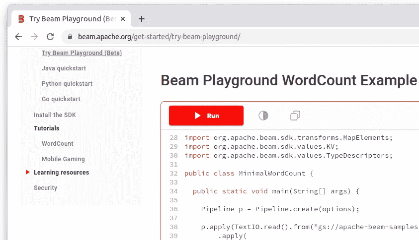
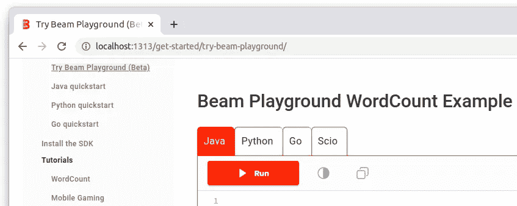
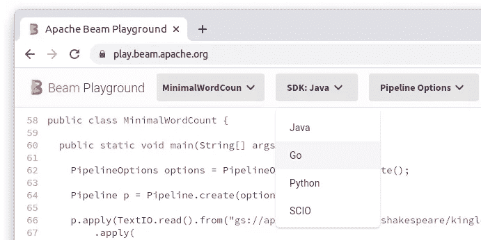
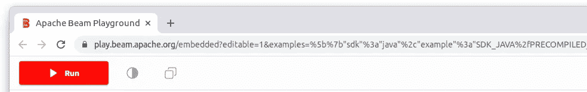
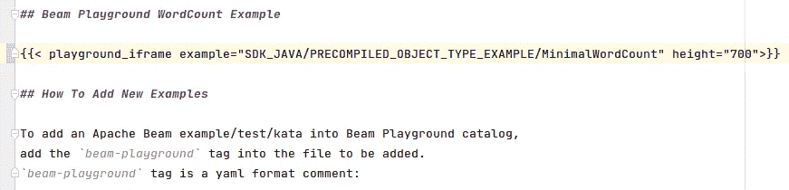
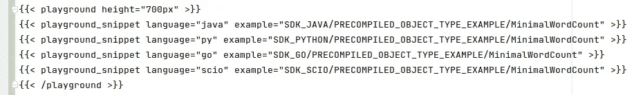
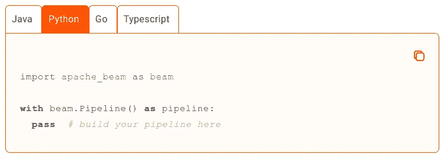
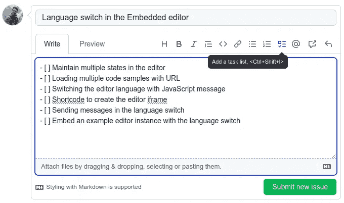
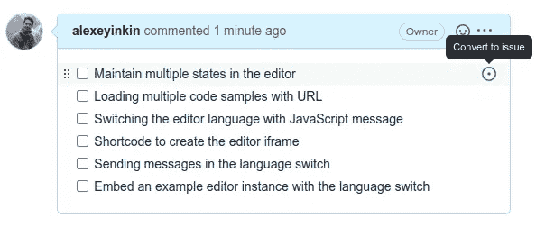
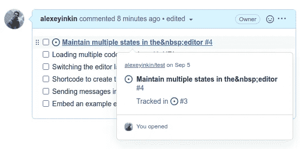

# 发行规模应该有多大？

> 原文：<https://betterprogramming.pub/how-large-or-small-should-an-issue-be-4b6b8d6226b2>

## 构成一个独立问题的 5 条规则，以及一个将 Apache Beam 任务分解成问题的例子。

由[埃斯特扬森斯](https://unsplash.com/@esteejanssens?utm_source=medium&utm_medium=referral)在 [Unsplash](https://unsplash.com?utm_source=medium&utm_medium=referral) 拍摄的照片

问题的重点是跟踪变化的进程和阶段。所以我的原则是尽可能减少问题:

*   工作，不会损坏。
*   可以用一句话概括。
*   在比代码更高的层次上改变一些东西。
*   对至少一个相关方是有价值的。
*   如果我想测试这个的话。

# 更大问题的问题

比这更大的问题会带来以下问题:

*   编码时间越长，分支就会过时。您可以将这样一个问题分成多个分支，但是这就破坏了问题的目的，即跟踪一个变更的各个阶段。
*   来自评审者的反馈被推迟。
*   评审期间的更多迭代。
*   更难合并。
*   涉及不同专业的评审人员。
*   会阻止依赖于它的工作。
*   范围太广-如果您需要稍后检查某行的历史记录，则提交消息。
*   经理更难看到状态。
*   工作因休假或病假而中断的风险。
*   部署前的挫折。

让我们来看一个变更，看看如何正确地将它分成几个问题。

# 一个变化的例子

[Apache Beam](https://beam.apache.org) 的文档嵌入了可运行的代码样本:

我们需要像这样添加一个语言开关，因为示例使用不同的语言:

这个嵌入式编辑器是一个 Flutter app，围绕它的网站是一个由 [Hugo](https://gohugo.io) 处理器从 Markdown 文件生成的静态 HTML。

# 从一个问题开始

首先，您希望所有这些工作作为一个整体是可跟踪的。于是你创建了一个类似 ***“嵌入式编辑器中的语言切换”*** 的问题。

即使在这个高层次上，你也必须决定什么是超出范围的。作为开发人员，团队需要向文档团队提供这一特性，而不是到处嵌入。所以我们决定嵌入一个更新编辑器的实例，让其他人来更新文档的其余部分。

# 高级分解

这个高层次的问题需要进行分类。在此阶段，我们决定:

*   将语言开关留在 HTML 中，因为它必须与一些现有的开关和用户设置保持一致。
*   让一个带有 Flutter 的 iframe 服务于所有语言，以避免额外的 iframe 来节省资源。
*   让外部 JavaScript 调用 iframe 上的`postMessage`命令它改变语言。

这三点可以在那一期的版面上讨论。不要急着创建这 3 个子问题，因为我们必须首先定义它们之间的边界，看看它们是否可以进一步分割。

# 低级别的问题

当高层计划达成一致时，我们定义低层问题:

## 1.在编辑器中维护多个状态

恰好编辑器也有一个非嵌入式的屏幕，有自己的语言开关。它在切换时重置内容:

所以编辑知道不同的语言。如果它能够在切换到 Java 和切换回 Java 时保留 Java 代码中的更改，这本身就是有价值的，并且是可测试的，并且有资格成为一个问题。

另一方面，如果我们只有嵌入式编辑器，这种变化不可能被很好地隔离。

## 2.使用 URL 加载多个代码示例

iframe 必须在启动时加载这四个样本。我们在 URL 中的 JSON 中传递样本 id:

这取决于前一期是否完成。这满足了所有 5 项要求，有资格单独发行。

我们还没有谈到延迟加载，因为编辑器在启动时从服务器加载所有的例子(这还处于早期阶段)。

## 3.用 JavaScript 消息切换编辑器语言

iframe 必须能够接收并处理其他浏览器窗口发送的消息。

如果没有发送消息的代码就看不到它，这又是一个什么问题呢？

它处于 JavaScript 和 Flutter 的边界。即使一个开发者两者都做了，边界本身也产生了对孤立感兴趣的各方。这些是:

*   测试人员。
*   评论者。JavaScript 和 Flutter 代码由 Apache 中的不同成员审查。评审者必须确保边界另一边的东西是稳定的，所以理想情况下它们已经被部署或者至少被合并了。此外，当一个大的 PR 更新了他们的专业知识之外的变化时，一个评论者不想要噪音。
*   DevOps。当部署更改后的网站时，Flutter 应用程序必须已经能够处理消息。所以必须早点部署。所有可部署的东西都必须是一个独立的问题，因为它将许多事情分为“之前”和“之后”。

我们能进一步讨论这个问题吗？除了改变已经计划好的 SDK，还有其他类型的消息。我们可以将消息解析器作为一个单独的问题，然后是这个特定的消息处理程序吗？

不会，因为解析器本身对任何人都没有价值，它不会在比代码更高的层次上改变任何东西。消息解析器必须总是带有解析内容的最小处理程序。

其他消息和它们的解析器肯定会单独发行。

## 4.创建编辑器 iframe 的短代码

文档维护者不嵌入 iframes。相反，他们这样写 Markdown:

突出显示的一行是所谓的“短代码”。它是 Hugo 处理器的一个宏，在 Markdown 中生成 HTML。这就是单语言编辑器如何嵌入到 Beam 文档中的。

因此，我们必须创建新的短代码，以便像这样使用:

但是我们还没有可以向交换机发送消息的标签。没有它们，结果与早期的单一语言编辑器完全不同。唯一可测试的是用给定的 URL 生成一个 iframe 来加载所有 4 个样本。

这刚好够资格单独发行。

雨果的简写代码是用一种奇怪的语言写的，这种语言会被单独审查。记住语言边界规则。

这确实是一个边缘案例。所以我们做了一个单独的问题，但是在一次公关中做了改变。这也很好。

这比一个问题有多个 PRs 要好得多。如果只是部分合并，问题的状态是什么？这是最坏的情况。

## 5.在语言开关中发送消息

在 Apache Beam 文档中，我们已经有了针对不可运行代码的语言切换:

这就是我们没有为标签单独发行的原因。

所以我们只需要进入选项卡来获取 iframe 并向它发送消息。

## 6.嵌入带有语言开关的示例编辑器实例

这个和上面是分开的。主要原因是不同的方面对这两个部分感兴趣。

*   开发人员希望合并新特性，这样分支就不会过时。
*   管理层想要决定何时何地放置这个示例可切换编辑器。

即使这样也足以将这两个问题分开。

# 将问题联系起来

低级别问题可以创建为高级别问题的子问题。编辑问题时，使用该按钮或只需输入
`- [ ]`即可添加任务列表

您会看到一个复选框列表，其中每一行都可以转换为一个单独的问题:

你给自己找了个新问题:

不是没有一个 GitHub 的错误与 

这就是了。

你曾经因为太大或太小的问题而遇到过问题吗？