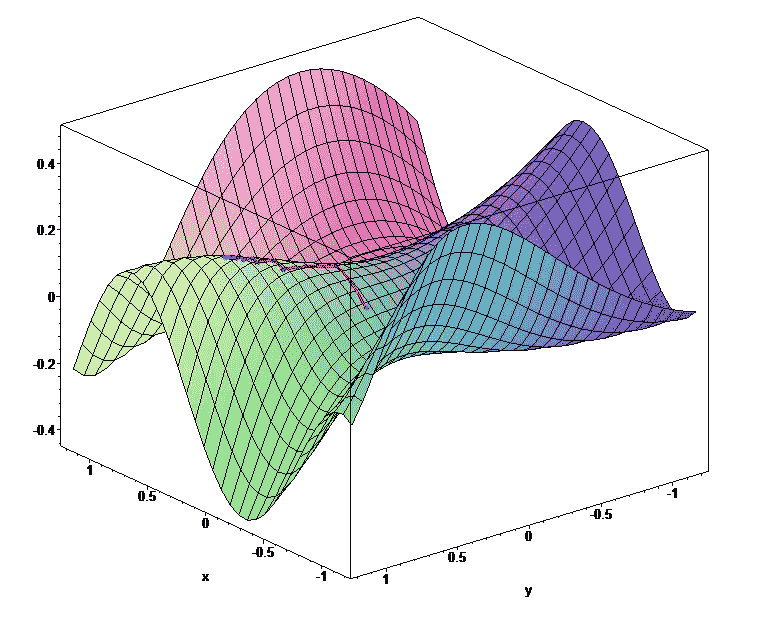

# 机器如何使用 TensorFlow 或 PyTorch 进行学习

> 原文：<https://betterprogramming.pub/how-machines-can-learn-using-tensorflow-or-pytorch-8f85cd04979d>

## 深入了解他们的思想，他们的进化

来源:https://unsplash.com/

人工智能和机器学习是最近非常热门的话题。自动驾驶汽车、实时自动翻译、语音识别等。这些只是没有机器学习就无法存在的应用中的一部分。但是机器如何学习呢？在本文中，我将向您展示这种魔力是如何发挥作用的，但我不会谈论神经网络！我将向你展示机器学习的最深处是什么。

关于机器学习最好的演讲之一是费李非的 TED 演讲。

正如李在她的演讲中所说，在早期，程序员试图通过算法来解决计算机视觉任务。这些算法寻找形状，并试图通过预编程的规则来识别事物。但是他们不能用这种方法解决。计算机视觉是一个非常复杂的问题，我们无法用算法来解决。所以，机器学习就出现了。

*如果我们不能写程序，让我们写一个代替我们写程序的程序。*

机器学习算法就是这么做的。如果我们有足够的数据，他们可以为我们编写从输入计算预期输出的算法。在图像识别的情况下，输入是图像，输出是图像内容的标签或描述。

这就是为什么李和她的团队非常努力地建立 ImageNet，这是世界上最大的标记图像数据库，拥有 1500 万张图像和 22，000 个类别。

多亏了 ImageNet，我们有了足够的数据，但是程序员是怎么用它来解决图像识别的问题的呢？这就是我应该像李一样谈论神经网络的地方，但我不会。神经网络确实受到了生物大脑的启发，但今天的变形金刚与生物模型相去甚远。

这就是为什么我认为“神经网络”这个名字会产生误导。但是什么名字会更好呢？

我最喜欢的是 Karpathy 的(AI @ Tesla) [软件 2.0](https://karpathy.medium.com/software-2-0-a64152b37c35) 。

正如 Karpathy 在这次演讲中所说，软件 1.0 是经典的软件，程序员编写代码，但在软件 2.0 的情况下，另一个软件基于大数据找到它。但是一个软件怎么能写出另一个软件呢？让我引用卡帕西的话:

> “梯度下降能比你写的代码更好。对不起。”

[梯度下降](https://en.wikipedia.org/wiki/Gradient_descent)是大多数机器学习系统使用的魔法名称。为了理解它，让我们想象一个机器学习系统。这是一个有输入和输出的黑盒子。如果系统的目的是图像识别，那么输入是像素阵列，输出是概率分布向量。

如果系统能识别猫和狗，输入是一只猫的图像，输出会像 10%狗，90%猫。所以，输入是数字，输出也是数字，黑盒的内容是一个巨大的数学表达式。黑盒从像素数据计算输出向量。

我答应讲程序写程序，现在讲数学表达。但实际上，程序是数学表达式。CPU 是由逻辑门构成的。他们使用数字的二进制表示和逻辑运算符。

任何现有的算法都可以通过这些逻辑表达式来实现，所以一个长的逻辑表达式可以表示任何可以在经典计算机上运行的程序。如你所见，经典程序也只不过是从二进制输入到二进制输出的二进制计算。

机器学习系统使用实数和运算符，而不是二进制数和运算符，但基本上，这些数学表达式也是“程序”。

> 艾伦·图灵在 1948 年写了一篇关于“B 型无组织机器”的论文。这些机器由互连的逻辑与非门构成，可以通过启用/禁用节点之间的连线来训练。在二进制代数中，NAND 是一个通用运算符，因为其他所有运算符都可以用它来表示。这些 B 型无组织机器是通用计算机，因为每种算法都可以在其上实现。
> 
> 这些 B 型机器类似于现在的神经网络，但它们是在逻辑门上实现的，就像今天的 CPU 一样，所以由这些 B 型机器实现的算法更像我们今天的算法。
> 
> 不幸的是，图灵从未发表过这篇论文，这就是为什么我们不知道他是早期神经网络的发明者。这些 B 型网络的问题是它们不能被有效地训练。

如果我们有一组输入和输出以及一个参数化的表达式，我们如何找到正确的参数，以最小的误差从输入计算输出？它有点像一个有许多电位计的黑盒子。电位计位置的每个组合都是一个程序，我们正在寻找正确的位置。

来源:https://unsplash.com/

为了解决这个问题，我们来想象一下误差函数。它看起来像一幅有山丘和山谷的风景。表达式的每一个参数都是景观的一个维度，当前点的高度就是给定参数的误差。

来源:https://en.wikipedia.org/wiki/Gradient_descent

当我们用随机数初始化这个表达式时，我们就处在了一个随机的位置。为了最小化误差，我们必须降低到最低点(代表最低误差)。问题是我们完全看不见。我们怎样才能从山上下来？

我们可以四处摸索，找到最陡的斜坡，然后去那里。但是我们如何确定一个函数的斜率呢？图中渐变来了。梯度表示函数在给定点的斜率有多陡。这就是为什么我们称这种方法为“梯度下降”

来源: [*安德烈·卡帕西斯坦福课程讲座 3*](https://www.youtube.com/watch?v=i1gGsE66b5s&t=3138s)

给定点的梯度可以通过偏导数来计算。一个函数必须满足某些条件才能求导。如果我们想使用梯度下降进行优化，我们必须使用这些类型的函数。如果函数是可导的，那么函数链也将是可导的，有一种算法方法可以计算梯度。

现在我们有了所有的知识来理解 [TensorFlow](https://www.tensorflow.org/) 和 [PyTorch](https://pytorch.org/) (两个最流行的机器学习框架)如何为我们的表达式找到正确的参数。

首先，我们来看 TensorFlow。

在 Tensorflow 中，有一个梯度注册表，通过`[RegisterGradient](https://www.tensorflow.org/api_docs/python/tf/RegisterGradient)`方法为操作符注册梯度函数。在学习阶段，每一步都要启动一个`[GradientTape](https://www.tensorflow.org/api_docs/python/tf/GradientTape)`。`GradientTape`是一种类似录像机的东西。TensorFlow 做任何操作的时候，梯度带都会记录。

在正向阶段结束后(当从输入生成输出时)，我们通过使用误差和使用注册的梯度函数计算梯度来停止在测井曲线上反向的梯度带。我们可以通过使用梯度来修改参数并重复该过程，直到我们达到最小误差。

让我们看看 Python 中的代码:

这段代码展示了我们如何在 TensorFlow 中使用梯度下降来解决最简单的问题(线性回归)。线性回归的目的是找到最接近每个点的线的参数，其中最接近意味着距离的平方和最小。

张量流使用张量运算进行计算。张量是矩阵的推广。从程序员的角度来看，张量是简单的数组。零维张量是标量，一维张量是向量，二维张量是矩阵，从第三维度看，张量就是单纯的张量。张量运算可以并行进行，以便高效运行，尤其是在 GPU 或 TPU 上。

在代码的开始，我们定义了我们的模型，这是一个线性表达式。它有两个标量参数，`W`和`b`，表达式为`y=W*x+b`。`W`的默认值为`16`， `b`为`10`。这是在我们的黑盒中，我们的代码将改变`W`和`b`以最小化错误。真实世界的模型有数百万或数十亿个参数，但这两个参数足以理解该方法。

从第 21 行到第 23 行，我们定义了随机点集。`tf.random.normal`方法用 1000 个正态分布的随机数生成一个向量，我们用它来生成直线附近的点。

第 34 行定义了损失函数。`y`和`y_pred`参数是矢量。`y_pred`是我们模型的实际产量，`y`是预期产量。square 函数计算每个矢量元素的平方，输出也是一个带有平方的矢量。`reduce_mean`函数计算元素的平均值，其结果是一个标量。这是我们想要最小化的误差本身。

梯度下降是从线 36 到线 42。这是学习发生的代码的本质。第 37 行的`with`是一个 Python 表达式。它在块的开头调用参数对象的`__enter__`方法，在块的结尾调用`__exit__`方法。

在`GradientTape`的情况下， `__enter__`方法开始记录，`__exit__` 停止记录。在程序块(第 38 行)中，我们通过`model(X)`计算模型输出和误差。在第 40 行，`GradientTape`计算参数的梯度(`dW`和`db`)，在第 41 和 42 行，修改参数。

有不同的优化策略。我们使用最简单的方法，其中梯度乘以一个固定的学习速率(`lr`)。

简单来说，梯度下降和 TensorFlow 的`GradientTape`就是这样工作的。在 TensorFlow 的网页上可以找到很多[教程。用于图像识别、强化学习等的神经网络。但是记住，总有张量运算和梯度带。](https://www.tensorflow.org/tutorials)

现在，让我们看看梯度下降在另一个大框架 PyTorch 中是如何工作的。

PyTorch 使用嵌入火炬张量的[自动签名](https://pytorch.org/tutorials/beginner/blitz/autograd_tutorial.html)系统进行梯度计算。如果张量是算子的结果，那么它包含一个指向算子和源张量的反向指针。源张量还包含反向指针等。，全运营商链条可追溯。

每个运算符都可以计算自己的梯度。当您在最后一个张量上调用 backward 方法时，它会回到链上并计算张量的梯度。

让我们看看 PyTorch 中前面的线性回归代码:

模型和损耗部分与 TensorFlow 非常相似。您会发现第 37 行和第 46 行的`train`方法的不同之处。在计算完`current_loss`张量后，我们对它调用倒推法。它递归地回到链上，计算`W`和`b`张量的梯度。

从第 41 行到第 43 行，我们修改了`W`和`b`张量。重要的是，该计算在`torch.no_grad()`块中进行。`no_grad()`方法暂时禁用运算符的梯度计算，当我们修改参数时不需要。

在`train`方法结束时，调用 zero 方法清除渐变。如果没有这一点，PyTorch 将累加梯度，这将导致奇怪的行为。代码的其他部分与 TensorFlow 非常相似。像 TensorFlow 一样，PyTorch 也有很好的教程、社区和文档。

你会发现构建任何神经网络的一切，但最重要的部分是亲笔签名的系统，这是训练的基础。

如果你想了解自动签名系统在内部是如何工作的，可以看看 Karpathy 关于反向传播的视频。在这个视频中，Karpathy 用 Python 从零开始构建了一个亲笔签名的系统。高中数学就够看懂了，如果不是数学大朋友也不是问题。

[https://www.youtube.com/watch?v=VMj-3S1tku0](https://www.youtube.com/watch?v=VMj-3S1tku0)

下一次，当你看到 DALL-E 生成的一张图片，一辆自动驾驶的汽车，或者只是想知道 Google Assistant 如何理解你说的话，你就会知道魔法是如何工作的，以及一种算法(梯度下降)是如何为我们编写这些很酷的算法的。