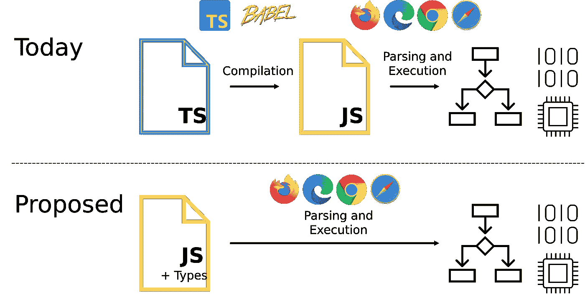
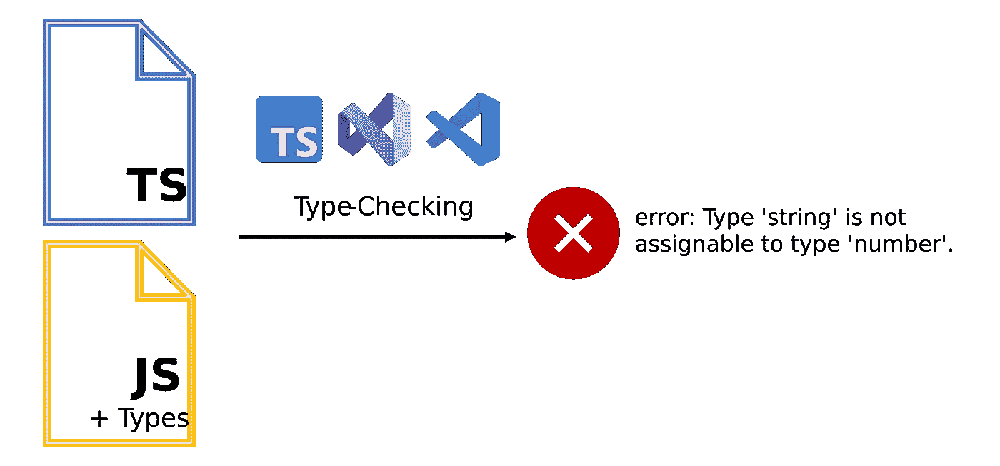

# 微软如何改变 JavaScript 和 TypeScript

> 原文：<https://betterprogramming.pub/how-microsoft-wants-to-destroy-typescript-1f1a53b18de6>

## JavaScript 新闻

## 这个提议可能会改变 JavaScript 和 TypeScript

马修·曼努埃尔在 [Unsplash](https://unsplash.com?utm_source=medium&utm_medium=referral) 上的照片

上周三，2022 年 3 月 9 日，微软[宣布](https://devblogs.microsoft.com/typescript/a-proposal-for-type-syntax-in-javascript/)他们支持一项关于 JavaScript 和 TypeScript 进一步发展的卓越提案。

到目前为止，这只是一个建议，作为所谓的[阶段 0 提案](https://github.com/tc39/proposals/blob/main/stage-0-proposals.md)，但微软已经宣布，他们希望按时向 [TC39](https://tc39.es/) (技术委员会 39)提交该提案。如果这个提议被采纳并被实施，那么这将是 JavaScript 有史以来最大的变革。

# JavaScript 的历史

如果我们回顾过去 20 年，并比较当时和现在的 web 开发，我们会注意到，尽管 JavaScript 作为一种编程语言已经有了很大的发展，但围绕 JavaScript 的生态系统已经取得了更大的进步。

这两点是相互需要的，因为一方面，JavaScript 社区在过去二十年里变得更加专业，另一方面，互联网的一个基本问题变得越来越重要。作为开发人员，您无法控制用户将使用什么浏览器。

这意味着如果用户定期更新浏览器，你只能使用 JavaScript 的现代特性。对于个人来说，这可能是现在的情况，因为现在许多浏览器在没有被要求的情况下更新自己或指示更新，但在公司中不是这样。

对软件和软件更新有严格的规定。许多公司使用过时的软件工作，或者使用过时的浏览器上网。这是一个基本问题，也影响 HTML 和 CSS，以及必须由各自的浏览器解释的编程语言，因此严重依赖。

## Transpiler 和 Bundler

作为一名 web 开发人员，您面临着必须在两种意识形态之间做出选择的问题:要么依赖现代的 JavaScript、CSS 或 HTML 特性来简化编程或带来更好的可用性等结果，要么不使用这些现代特性，因为由于过时的浏览器，它们并不适用于所有人。升级可能会给一定数量的用户带来问题。

此外，除此之外，几十年来还没有一个像样的 JavaScript 模块系统。Node.js 通过 CommonJS 获得了自己的标准，但这仅限于服务器。

浏览器很长一段时间都没有反应，这就是 bundler 和 transpiler 一起出现的原因。尽管你正在使用一种可以正常执行的 [JIT](https://en.wikipedia.org/wiki/Just-in-time_compilation) (Just-in-time)编译的编程语言，但你总是不得不处理一个有点复杂的构建过程，将源代码转换成实际代码，然后在浏览器中执行和解释。

那是大约十年前的情况。

照片由[内特·格兰特](https://unsplash.com/@nateggrant?utm_source=medium&utm_medium=referral)在 [Unsplash](https://unsplash.com?utm_source=medium&utm_medium=referral) 上拍摄

# 打字稿的兴起

此时，正好十年前，微软发明了 TypeScript。微软认为，如果你在部署之前需要一个 transpiler 来转换 JavaScript 代码，那么在这个构建过程中增加一个步骤也没什么大不了的。

作为回报，您会得到一个很好的 transpiler，它可以将现代 JavaScript 转换成普通 JavaScript。此外，TypeScript 是一个静态类型系统，它使 JavaScript 更具可伸缩性，提供了新的概念，并为在团队中高效开发 JavaScript 做出了重大贡献。

难怪 TypeScript 很快就确立了自己的地位，并成为当今企业 JavaScript 开发的标准。

现在，在过去的十年里，世界也发生了变化。不更新、不自我更新的浏览器仍然没有灭绝，但它们在今天扮演的角色比过去小得多。

这意味着，如果你只处理 [Evergreen 浏览器](https://www.techopedia.com/definition/31094/evergreen-browser)，现在没有 transpiler 也很有可能工作，并且有了 ESM (ECMAScript 模块)，现在也有了一个基于本地 JavaScript 的模块系统，可以在服务器端和客户端工作。

这意味着不再需要捆绑器，至少从技术角度来看是如此。bundler 只是优化 HTTP 请求的另一个步骤，这样就可以从服务器上加载更少的单个小文件，只有几个大文件。这是简单的，在一天结束时可以更有效地完成。

## 打字稿，一个障碍？

这意味着构建过程将逐渐变得更简单或更不相关。微软现在预计未来唯一剩下的必要工具是 TypeScript 编译器，因为 web 浏览器和其他 JavaScript 运行时环境不理解 TypeScript。

这意味着微软或者 TypeScript 突然从一个极其实用的工具变成了一个相当讨厌的东西。按照微软的说法，他们不想成为障碍，相反，他们想激励开发者。

把它分解成微软担心的结果，JavaScript 开发迟早会像 20 年前一样快速、直接和高效，因为如果不使用 TypeScript，迟早将不再需要 transpilers 等。

照片由[微软](https://devblogs.microsoft.com/typescript/a-proposal-for-type-syntax-in-javascript/)

## 浏览器的类型脚本

现在，一个显而易见的方法是要求集成 TypeScript，作为 web 浏览器和其他运行时环境中 JavaScript 的替代编程语言。理论上，这并不牵强。 [Deno](https://deno.land/) 已经在尝试以某种方式做到这一点。

Node.js 有一个 npm 包叫做 [ts-node](https://www.npmjs.com/package/ts-node) ，它采用了与 Deno 类似的方法。在构建/加载应用程序时编译到内存中，这样可能会感觉 TypeScript 立即运行，但实际上并不是这样。

此外，TypeScript 现在也已经成为一种更复杂的编程语言，对于微软来说，将 TypeScript 编译器的所有功能直接集成到普通的 web 浏览器中并不是很理想。这将是一个非常复杂的任务，需要苹果、谷歌、Mozilla 等公司的合作来整合一个新的大标准。

微软回避所有这些努力，不管这样做对不对，这是一个公开的问题，但声明是，这根本不是他们想做的。

## JSDoc 作为(以前的)中间道路

相反，现在已经考虑了一种不同的方法，这使我们最终想到了微软上周提出的建议。熟悉 TypeScript 的每个人都知道，在(a)编写普通 JavaScript 的方法和(b)完全转向 TypeScript 的方法之间有一条中间道路。

TypeScript 允许您分析 JavaScript 上的代码，您甚至可以在那里存储类型，而不必通过简单地编写适当的 [JSDoc](https://jsdoc.app/) 注释来编写 TypeScript。对于一些公司来说，这是从 TypeScript 编译器获得类型支持的方法，而不必将项目完全迁移到 TypeScript。

JSDoc 示例

最大的好处是，一方面，由于代码仍然是纯经典的 JavaScript，所以不必编译，并且通过简单地删除所有 JSDoc 注释，随时可以非常容易地脱离 TypeScript。我自己也使用过 JSDoc，但是我不得不说它更像是 TypeScript 的廉价替代品。

你必须写更多的代码，一切都有点麻烦，更复杂的输入变得几乎不可能，但总比没有类型好。

# 建议:作为注释的类型

因此，微软支持的提议是将 TypeScript 注释视为注释，因为这样你就不必再编译 Typescript 了。

类型注释和关键字(如“public”或“private”)将被视为注释，在 JavaScript 执行过程中会被忽略。这意味着您可以编写类型脚本，而无需将类型脚本编译成 JavaScript 代码。

然而，您仍然可以使用 TypeScript 编译器来触发类型检查，但是您不必编译代码来执行它。所谓的“d.ts”文件将不再需要，因为这些类型将在 JavaScript 代码中可用。

照片由[微软](https://devblogs.microsoft.com/typescript/a-proposal-for-type-syntax-in-javascript/)

因此，TypeScript 编译器将只是一个可选的插件，就像 ESLint 这样的 linter，所有类型注释在执行的代码中都是不可见的。

这也是该提案被称为“[类型评论](https://devblogs.microsoft.com/typescript/a-proposal-for-type-syntax-in-javascript/)的原因。

# 类型作为注释的缺点

当我第一次读到这个的时候，**我喜欢这个想法**，那是我希望发生的事情**。但是现在我想了一下，一遍又一遍地阅读了这个提议，我不得不承认我对此表示怀疑。理论上听起来很棒，但我看到了一些缺点。**

我们不应该忘记，TypeScript 不仅仅由函数参数的基本类型组成，我们正在谈论接口、联合类型、类型关键字、非常复杂和嵌套的类型、“as”关键字、公共/私有/受保护的关键字、泛型类型等等。

除了我们已经编写的实际注释之外，所有这些都必须被认为是 JavaScript 将来的注释。而且我也不想说这是不可能的，但是不是有两种类型的评论(单行和块评论)，你有很多不同的新类型的评论来一次性表达关键词。

所以我不得不问自己这是不是一个好方法，因为实际上，我喜欢当前的解决方案，即使它并不完美，即使它需要先编译。

此外，似乎**我们将不得不在没有**枚举的情况下编码，因为它们是值和类型的混合。这还包括命名空间、TypeScript 的 JSX 支持、参数属性等等。所以要用枚举就要编译，不用枚举就不用编译。

对于这个建议，我看不出 JavaScript 和 TypeScript 之间有真正的区别。我怀疑这是否是未来。

在我看来，这将导致混乱和一个新的 TypeScript 开发人员的双层社会。

韦斯·希克斯在 [Unsplash](https://unsplash.com?utm_source=medium&utm_medium=referral) 上的照片

# 最后的想法

在我看来，TypeScript 要么应该保持完全独立，即使你必须编译它，要么 JavaScript 得到一个可选的静态类型系统，就像 TypeScript 那样。

这意味着 **TypeScript 应该成为新的 JavaScript** ，但是微软已经排除了这种可能性。因此，我的结论是，TypeScript 不应该以这种方式进行根本性的改变，尤其是不应该以微软目前提出和支持的方式进行改变。

无论如何，我很好奇在接下来的几个月或几年里这将如何发展。

干杯！

# 来源

*   JavaScript 中类型语法的建议
*   ECMAScript 提议:作为注释的类型 (Github 存储库)