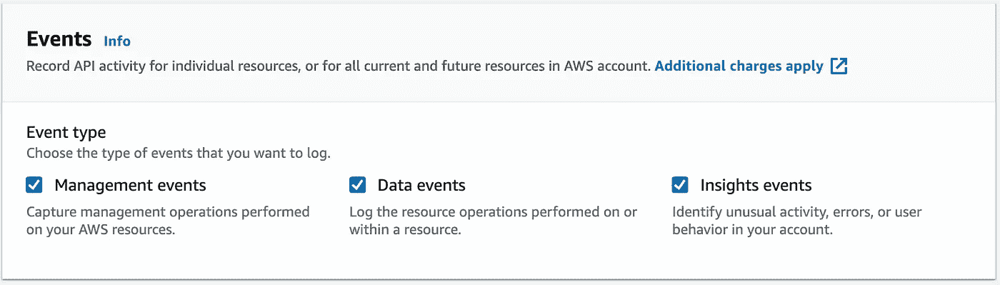
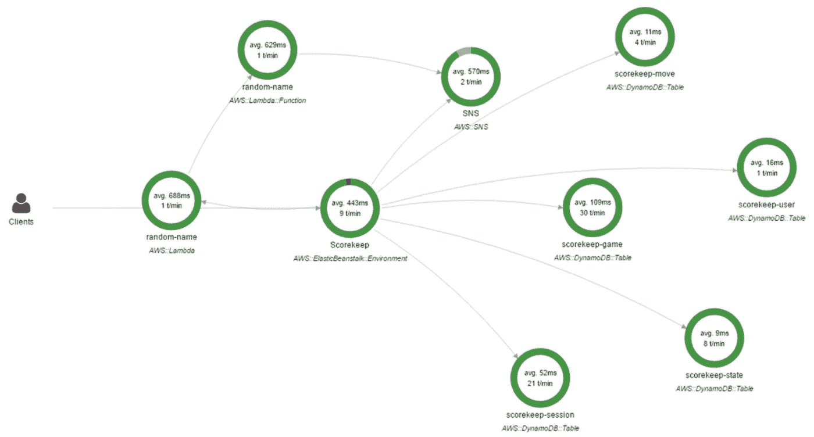

# AWS 上的监控工作原理

> 原文：<https://betterprogramming.pub/how-monitoring-works-on-aws-9549e7e865da>

## 关于云上的日志，您需要知道的一切

克里斯·利维拉尼在 [Unsplash](https://unsplash.com/s/photos/monitoring?utm_source=unsplash&utm_medium=referral&utm_content=creditCopyText) 上的照片

当软件开发人员交付他们的产品时，他们首先想到的是“快乐之路”。他们对照工作环境测试一切。在敏捷开发中，这是一个关键点。然而，也有事情进展不顺利的时候。

端点在集成环境中运行良好，但是在生产环境中会返回一个错误。或者数据库在新部署后变得不可用。或者如何确保系统在其最佳容量下工作？

如果我们考虑基于云的解决方案，必要的工具可以帮助我们。让我们探讨一下有哪些可用的，以及如何在 AWS 上应用。

# 监控和警报

AWS 提供了很好的监控选项。有一个专门的服务叫做[云观察](https://aws.amazon.com/cloudwatch/)。它包含观察解决方案健康状态的所有必要功能。

工程师开始使用 CloudWatch 的主要原因是它可以记录日志。来自不同服务的日志可以被发送到那里，然后进行分析。例如，您可以检查 Lambda 函数的执行情况以及返回的结果。当进行故障排除时，应用程序日志成为开发人员首先关注的地方。

除此之外，CloudWatch 还有一些功能正在被广泛使用。工程师可以观察各种服务的性能指标。这可以是 EC2 实例的 CPU 利用率、平均 Lambda 函数执行持续时间、数据库响应时间等等。数据以一定的间隔收集，并在图表上很好地显示出来。

当度量出现异常时会发生什么？没有人会坐在笔记本电脑前查看一百张图表。CloudWatch 允许为特定指标设置警报。当指标值超过阈值时，将触发警报。有了警报，相应的 SNS 通知将被发送出去，每个人都将被通知应用程序有问题。

此外，可以用 CloudWatch 事件构建事件总线。它作为一个桥梁工作:当某个事件发生时，连接的组件将接收它。最近这一块被提取到独立组件 EventBridge(因此得名)。它有一个类似于 CloudWatch Events 的 API，将来会取代 CloudWatch Events。

该服务与许多其他 AWS 组件很好地集成在一起，使得应用和收集重要数据变得很容易。如果您不知道，EC2 的自动缩放组特性使用 CloudWatch 来触发事件的横向扩展和纵向扩展。这证明了这项服务有多强大。

# 审计

在安全性和合规性方面，企业不会妥协。这些公司想知道谁访问了应用程序的不同部分。首先，这样做不是为了指责对方，而是要明白最终的解决方案有多可靠和安全。

AWS 有一个专门的服务: [CloudTrail](https://aws.amazon.com/cloudtrail/) 。为了更好地理解它的作用，我引用了 AWS 官方文档中的一句话。

> CloudTrail 事件帮助您回答“谁在何时何地做了什么？”

CloudTrail 跟踪所有的内部 API 调用，用附加信息丰富它们。每个事件包含详尽的用户数据、事件数据、IP 地址、时间等。这些信息足以运行合规性分析并识别系统中的安全漏洞。

CloudTrail 可以跟踪不同的事件类型

CloudTrail 不仅跟踪来自管理控制台的操作，还跟踪 AWS 服务(如 DynamoDB)上的各种操作。insights 事件将应用某种算法来识别用户帐户上是否有异常活动。所有收集的事件都保存到 S3 存储桶中。此外，所有踪迹信息都可以发送到 CloudWatch 日志和 EventBridge。

# 跟踪和调试

在某些时候，CloudWatch 的功能可能不足以调试应用程序。尤其是当我们谈到微服务架构的时候。有多个小型组件，其中一些可以是无服务器的。在这些部分没有按预期工作的情况下，我们需要有一个完整的画面。

对于这种情况，我们可以使用 AWS 的 [X 射线](https://aws.amazon.com/xray/)。有更好的跟踪和调试是一个很好的选择。您将大致了解解决方案的所有部分是如何相互连接的，以及哪些部分不是 100%健康的。

[教程](https://docs.aws.amazon.com/xray/latest/devguide/xray-console.html)中的 x 射线追踪图

这项服务不是“开箱即用”的，需要进行配置。AWS 为许多必须集成到您的解决方案中的平台提供了 SDK。作为开发人员，我们需要在一些地方添加跟踪方法来传递所需的数据。文档和教程很好地描述了所有必要的步骤。X 射线将以每个开发人员都能更好理解的方式收集和组织数据。

# 结论

软件工程师首先需要监控和调试。你的客户不在乎你有没有。然而，一旦在应用程序中遇到问题而无法检查日志，开发人员肯定会后悔。记录和监控是每个软件的基本部分。尽早整合它，你的团队成员会感激你的。编码快乐！