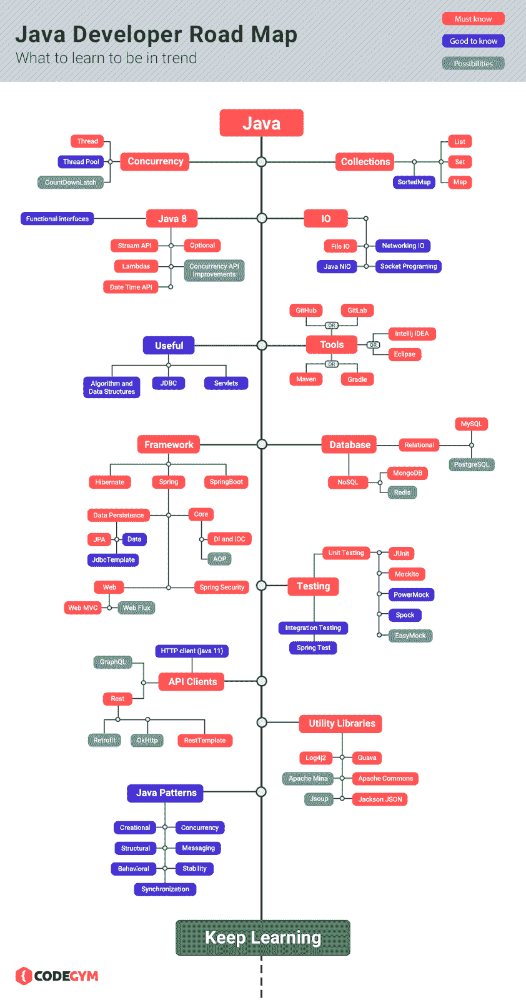
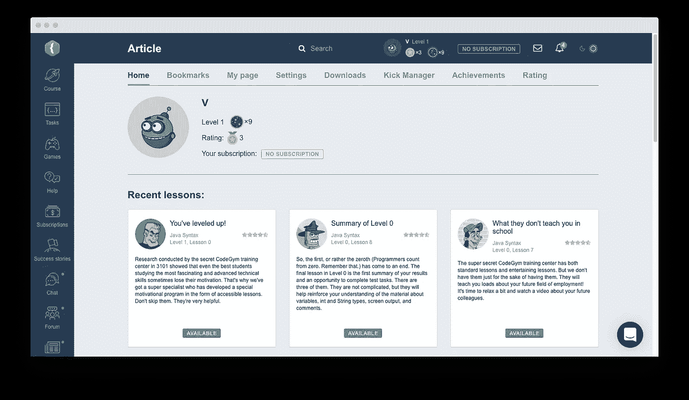
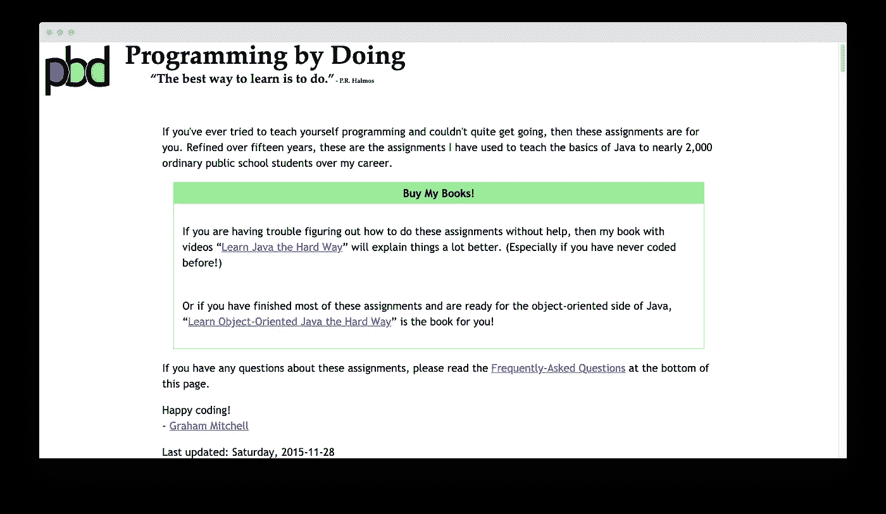
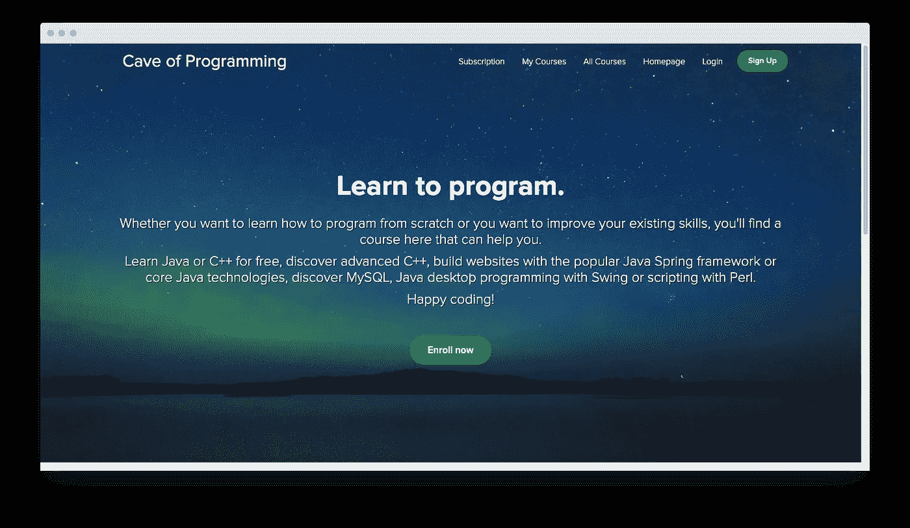

# 找工作需要懂多少 Java？

> 原文：<https://betterprogramming.pub/how-much-java-do-you-need-to-know-to-get-a-job-9273753fcb54>

## 提示:你的投资组合比“你知道什么”更重要

乔安娜·科辛斯卡在 [Unsplash](https://unsplash.com?utm_source=medium&utm_medium=referral) 上的照片

先说编程求职。众所周知，软件开发是最有前途的领域之一——然而，随着数百名开发人员学习这种语言，人们很容易对工作前景感到不安全。

今天，我将回答每个开发人员心中的一个问题——为了保持相关性，您需要知道多少？由于我从事软件开发多年，我认为换个角度对程序员新手来说更有价值。这就是我联系我的软件开发学生的原因——以下是他们的心声。

# Java 开发人员最担心的求职问题

在某些时候，我很好奇入门级开发人员在寻找他们的第一份 Java 工作时会担心什么。经过几个小时的研究和与学生的聊天，我意识到大多数程序员都有同样的担忧，比如:

*   不具备与职位描述相符的技能，或者在面试中被称为伪装者。
*   没有投资组合或案例研究来证明你的熟练程度，输给了更有经验的候选人。
*   没有工作——许多开发人员实际上担心 Java 不再流行了。
*   工资期望值过高或过低。虽然这两个问题看似天壤之别，但它们有一个共同点——不明白你的工作值多少钱。

# 开发人员从求职中学到的五课

找 Java 编程的工作压力很大。一方面，有成千上万的职位空缺——另一方面，其中许多都是顶级职位，需要对大多数入门级专业人员尚不具备的框架和辅助技术有深入的了解。

这就是为什么找到正确的开口是一条崎岖不平的道路，有很多犯错的空间。好消息是，你不必自己做这些。为了让你更容易精通 Java 并找到高薪工作，我的学生分享了他们的求职经验。

# 第一课。努力学习你的英语

Andres 是我来自墨西哥的 Java 学生。拥有大学学位和多年非技术领域的职业发展经验，他对自己的人际交往能力和展示自己的能力很有信心。他的 Java 编码技能令人印象深刻——Andres 知道如何设计和维护基本但功能正常的移动应用程序，并且他有使用 Spring、Maven 和 Hibernate 的实践经验。

帕特里克·帕金斯在 [Unsplash](http://unsplash.com) 上的照片

然而，找工作对他来说并不容易，因为他努力学习英语。

> “有一次我接到一家欧洲大型游戏开发公司的电话。我用基本英语解释说，用不同的语言工作对我来说是一个挑战。不管怎样，人事经理安排了一次面试。简直是一场灾难！我几乎不能理解团队领导在说什么——我非常确定我的理论是错误的，不是因为我不知道答案——而是糟糕的语言知识和焦虑让我付出了代价。
> 
> 当然，我可以满足于国内或西班牙的报价，但我不想限制我的范围。这就是为什么我认真对待学习英语，使用像 Duolingo，Anki cards 和 Italki 这样的工具。我需要时间来适应使用这种语言，但这种变化的影响是巨大的。我在面试中相当自信，毫不费力地得到了一份初级 Java 开发人员的工作。"

# 第二课。不要学习太多的 Java

Java 是一种复杂的语言——你需要学习它的语法，知道如何处理数据库，精通框架，理解并发性的概念，关注移动和 web 开发……这个清单可以一直列下去。我的一些编程学生很难从学习转向找工作——Ashley 就是其中之一。

照片由[émile Perron](https://unsplash.com/@emilep?utm_source=unsplash&utm_medium=referral&utm_content=creditCopyText)在 [Unsplash](http://unsplash.com) 拍摄

> “只有回想起来，我才明白冒名顶替综合症和完美主义是我花这么长时间找工作的主要原因。有一段时间，我学了三年多的 Java，但从未发过一份简历。这种语言让我着迷——这就是为什么在获得了对语法、数据库处理和框架的基本理解之后，我没有停下来。我学习了模式和算法，深入参与了并发性——所有这些都不需要找工作。
> 
> 最终，我创建了一个 LinkedIn 账户，分享了我的 GitHub 的链接，并描述了我的技能——我的收件箱爆炸了。招聘人员主动向我提供我不知道自己配得上的工作机会。不用说，我得根据自己的条件选择开场。一切都很好——然而，我经常想为什么我不早点开始找工作。这样，我会有更多的工作经验，最终会成为一名更好的专业人士。"

# 第三课。你需要一个投资组合，但你不需要工作项目来建立一个

工作对获得更多经验很重要，但找一份没有经验的工作是每个大学毕业生或自学者最终都会面临的难题。Java 开发人员对这个问题并不陌生，因为缺少投资组合确实妨碍了我的一些学生。其中一个人，索伦，分享了他的故事:

> “我很早就开始找工作，因为我对自己的技能很有信心。然而，现实比我预想的更快地打击了我——事实证明，如果你没有投资组合样本来支持你的专业知识，人事经理不会看你的简历并安排面试。
> 
> 经过一两个星期的沉默，我意识到我的问题是什么。所以我修改了求职信，提到我很乐意为公司完成一项测试任务。资深开发人员可能认为这是浪费时间，但对我来说，这是一个双赢的决定。在最好的情况下，我会有一份工作，而最坏的情况是我得到更多的投资组合样本。"

# 第四课。忘记建立关系网

如果你下定决心，甚至一个 Reddit 社区也能成为一个强大的求职平台。同样，像“招聘”页面这样显而易见的目的地往往是一个死胡同，因为成百上千的候选人用它来发送简历。

我的一个学生 Arnold 现在是一名中级 Java 开发人员，他使用了这个策略来建立关系网:

> “当我需要找工作时，我会找到一家公司最不知名的社交媒体渠道，或者直接联系人力资源。在第一种情况下，如果没有其他人通过 Twitter 联系你的未来雇主，你的信息肯定会脱颖而出，引起注意。直接找到招聘经理的联系人更难，需要更多的研究(我个人用 hunter.io 接触不同公司的人。
> 
> 职业或工作板？我不喜欢这些。他们被候选人迷住了。记住，找工作的首要规则是脱颖而出——这意味着避免成为人群中的一员，并寻找创造性的方式来联系。"

# 第五课。你应该做模拟面试

如果你有找工作相关的焦虑，做面试准备真的有帮助。这样，你就可以主动解决问题，成为一名更好的开发人员，而不是盲目地强调和破坏你的就业机会。

[乔丹·怀特菲尔德](https://unsplash.com/photos/sm3Ub_IJKQg)在 [Unsplash](http://unsplash.com) 上的照片

即使你认为没有事先准备你会过得很好，事实是，在工作面试中，总是有足够的空间给你惊喜。我的 Java 学生 Eve 仍然有一些关于她找工作的趣闻。

> “我过去常常模拟准备面试，认为如果你足够优秀，员工会看到的。然而，当我收到关于三种经典 SQL 形式的问题，需要快速引用死锁示例等等时，这种乐趣就结束了。起初，我试图想出一些东西，最终，开始承认我的知识差距。现在有效的 Java 是我的首选资源之一，我在每次面试前都会做一个简短的准备。这无疑提高了我的信心，也提高了面试的整体成功率。"

# 找工作需要懂多少 Java？

要想知道自己是否准备好成为一名初级 Java 开发人员，了解入门级专家应该了解的知识是很有帮助的。就我个人而言，我把所有初级职位分为三类:初级、体面的初级和自信的初级。第一种类型的机会是雇主愿意教你，只要你对语言有基本的理解，不介意你犯错误。

第二种类型的机会是让你自己处理范围狭窄的任务——这些任务通常是具体的和重复的，但你需要自主地处理它们。

最后，自信且收入相对较高的初级人员应该已经掌握了足够的 Java 知识，知道如何使用这种语言来改进项目的功能和性能，并创建提供流畅用户体验的解决方案。

## **入门级大三应该知道的 Java 概念:**

*   基本的 OOP 原则——抽象、封装、继承、多态等等。
*   坚实的原则及其应用于 Java 的方式。
*   知道如何管理接口、类和对象，理解这些元素之间的区别。
*   对对象方法及其主要应用的深入了解。
*   集合和异常的层次结构。
*   多线程基础，理解线程和进程的概念。
*   对 lambdas、streams 和函数接口的肤浅掌握。

## **有经验的大三学生应该知道的 Java 概念:**

*   对栈和堆栈有基本的了解——速度、内存消耗、结构、垃圾收集器(体面的命令)。
*   集合，使用 HashMap 和 TreeMap 处理空语句。
*   处理泛型，使用抽象类构造函数，“是-A”继承。
*   方法，包装类，哈希代码，等于，装箱拆箱。
*   基本多线程概念，了解如何创建安全线程。
*   异常处理。

## **自信的大三学生应该知道的 Java 概念:**

*   对 NIO 和 I/O 有基本的了解。
*   数据和期间处理。
*   更深入地理解多线程，处理主要的并发类，理解同步围绕哪些元素。
*   理解主要的垃圾收集器策略。
*   异常的继承。
*   在哪里可以找到运行时类和方法的信息。

# 面向 Java 编程学习者的顶级资源

作为一名初学 Java 的程序员，您应该花一些时间创建一个学习资源栈，以支持您完成学习曲线的每一步。以下是我最喜欢的帮助初学者掌握编程语言的资源:

## 平台:

*   code gym——我推荐给学生的第一个工具。作为一个纯 Java 的学习平台，它比其他平台更深入地接近语言。该平台结合了比特大小的理论讲座和实践测验。有超过 1，200 个练习题，涵盖了 Java 核心、并发和多线程、API 和框架。

*   [边做边编程](https://programmingbydoing.com/)是 Java 学习者的另一个不错的平台。虽然它不是非常实用，但是这个资源包含了关于 Java 和其他相关主题(设计模式和 OOP)的全面教程。为了将对主要语言概念的理论理解付诸实践，学生可以在每堂课结束时完成五个实际作业。

*   [编程之洞](https://caveofprogramming.com/)——一个托管数百个 Java 教程的平台，作者是 John Purcell(软件开发领域的顶尖专家之一)。它一定会给你一个坚实的语言理论的掌握。

## 书籍:

*   [头先 Java](https://www.amazon.com/Head-First-Java-Kathy-Sierra/dp/0596009208) 。
*   [有效 Java](https://www.amazon.com/Effective-Java-Joshua-Bloch/dp/0134685997) 。
*   [一天学会 Java，学好](https://www.amazon.com/Java-Beginners-Hands-Project-Project-ebook/dp/B01LZOCVN9)。
*   [思考 Java:如何像计算机科学家一样思考](https://greenteapress.com/wp/think-java/)。
*   [Java:完全参考指南(第 11 版)](https://www.amazon.com/Java-Complete-Reference-Eleventh/dp/1260440230)。

# 结论

乍一看，找一份 Java 工作似乎完全取决于编程语言的熟练程度。然而，还有更多。通过努力提高你的英语技能(如果你来自一个非英语国家)，建立一个坚实的投资组合，并为面试做好充分准备，你会使求职变得容易得多。