# 获得第一份工作需要学习多少 Java？

> 原文：<https://betterprogramming.pub/how-much-java-do-you-need-to-learn-to-get-your-first-job-476b06db68b7>

## 从爪哇学徒到爪哇绝地

[史丹利戴](https://unsplash.com/@stanleydai?utm_source=unsplash&utm_medium=referral&utm_content=creditCopyText)在 [Unsplash](https://unsplash.com/?utm_source=unsplash&utm_medium=referral&utm_content=creditCopyText) 上的照片

一个潜在的 Java 初学者需要知道什么才能得到第一份工作，甚至有资格获得一个好公司的实习生职位？什么工具可以帮助 Java 程序员达到更高的水平？你应该学习哪些技术，哪些最好推迟？

这些问题没有标准答案，就像没有一个行动计划绝对适合所有人一样。一些公司在努力发展，不断引入新技术，测试新版本语言的能力，而另一些公司则固执地坚持旧版本。还有中间选项，也许这是其中的大部分。

我经常被问到这个问题，所以我决定写一篇文章来回答这个问题。此外，它不仅对那些亲自问我的人有用，而且对每个已经决定(或没有以任何方式决定)将他们的生活与 Java 编程联系起来的人也有用。

# 我用了哪些资料来回答文章的主要问题？

为了尽可能完整地回答文章的主要问题，我依赖于:

*   我自己作为一名高级 Java 开发人员采访了许多潜在的 Java 初学者的经历
*   我当导师的经历(或者说，我学生的经历)
*   CodeGym Portal 对其校友进行的一项调查的结果
*   互联网论坛的一些回答

# 首先:核心 Java 是必须的

*核心 Java* 通常指编程语言的基本基础。它包含以下组件。

## Java 语法

*   类、变量和方法
*   原始数据类型
*   用线串
*   基本运算符
*   基本结构:循环、分支

Java 语法是这种语言的一种基础知识。学生通过做来学习，就像小孩子学习阅读和写作一样。这里最难的概念是编程原理，比如循环和分支。对于绝对的初学者来说，它们可能很难，但是通常在编写了一些任务之后，未来的程序员会开始对它们有所了解。

92.4%的程序员在获得 Java 开发人员或 Java 实习生的第一份工作之前，对 Java 语法的了解已经达到了很好或很好的水平。那另外的 7.6%呢？他们在中级水平上了解它，并且足够幸运地得到了一个培训机会。然而，这纯粹是运气。每个申请人都必须精通 Java 语法，谢天谢地，掌握起来又快又容易。

## 面向对象编程

Java 和 OOP 几乎是同义词，因为这种编程语言中的一切都是对象。

如果你习惯于过程化编程，那么一开始用对象风格重新安排和思考可能会很棘手。然而，其实 OOP 并没有那么难。而且，这是一个非常美好的概念。重要的是要编写大量代码，同时考虑如何构建对象层次结构。

OOP 的主要子主题是类继承、接口实现、数据和行为的抽象、数据和类实现的封装、多态和虚方法。

大多数(80.3%)找到第一份 Java 相关工作的人都非常了解 OOP 原则，并且一直在使用它们。

然而“好的知识”有时会有不同的定义，这取决于你的经验。“我了解了 OOP，并使用了继承和封装。我以为我很了解它，但我意识到我以前似乎知道一些东西，但不了解其中的细微差别。作为一个大项目的 Java 实习生，我对抽象层次和如何使用它们有了真正深刻的理解，”Andy 说，他现在是一家国际外包公司的 Java 初级员工。

根据 CodeGym 门户网站的调查，78.8%的 Java 大三学生和培训生在工作中非常经常地使用 OOP，12.1%偶尔使用，7.6%的培训生很少使用(通常他们与单元测试和不同的小任务一起工作)。

## 集合框架

代表一个单元的一组单个对象是一个*集合*。Java 为不同的集合提供了一个集合框架。集合基于流行的数据结构:列表、规则的和连接的、集合、散列映射等等。因此，在学习集合的同时，最好也能对数据结构有更多的了解。

**主要副主题:**

*   `List`
*   `Set`
*   `Map`
*   `ArrayList`
*   `LinkedList`
*   `Queue`
*   `Deque`
*   `HashSet`、`HashMap`、`HashTable`
*   `TreeSet`，`TreeMap`

学习集合的主要困难是弄清楚它们如何工作以及何时使用哪种结构。它来自实践。此外，在实际工作中的众多结构中，只有少数是经常使用的。作为教程，重新创建您自己版本的集合会很有用。几乎所有(96.9%)的 Java 大三学生和实习生在第一份工作中都使用了 collection framework，80.3%的受访者在获得第一份工作 offer 之前就已经知道了处于良好或优秀水平的 collection。

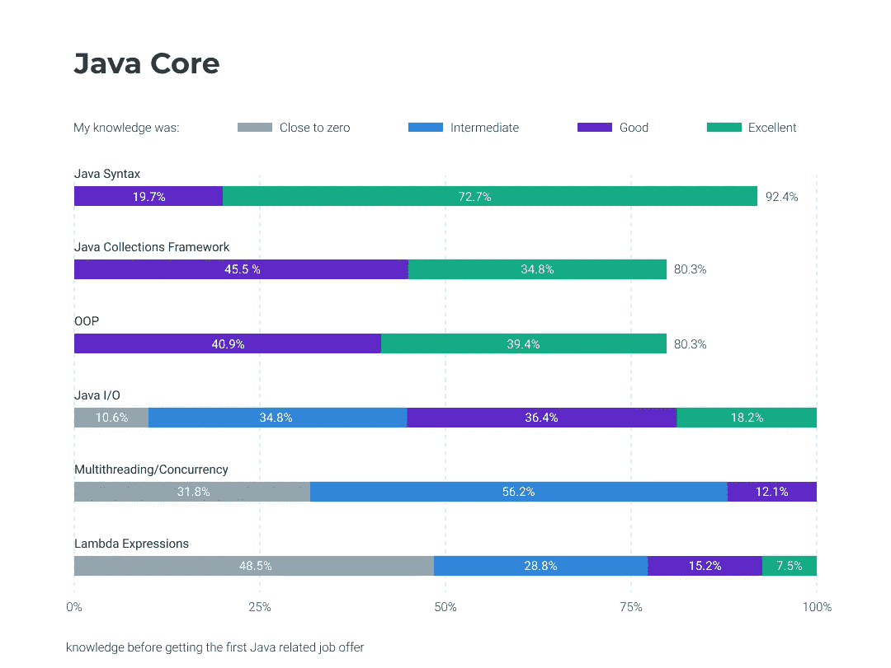

## 异常处理

异常是程序执行时可能出现的异常情况。所有异常类都是`java.lang.Exception`类的子类型。异常处理机制大大简化了程序中的 bug 捕获过程。通常，学生很早就开始使用异常，这个话题绝对值得你关注。

**主要副主题:**

*   异常处理机制
*   尝试-捕捉-最终
*   扔，扔
*   Java 中异常的层次结构
*   已检查/未检查的异常
*   错误和异常的区别
*   无法到达的 catch 块错误
*   手动异常抛出

每个 Java 培训生和 Java 初级人员在工作中都会用到异常，面试官经常会问关于这种机制的问题。

## Java 输入/输出流

Java 使用*流*执行输入和输出操作。流是一种连续的数据流。在 Java 程序中，你需要经常读写数据。对于新手来说不是最容易的话题，有时候在新手的工作中也不会经常用到(这真的要看他们从事的项目)。好吧，在获得第一份 Java 初级/见习工作的人中，有 22.7%的人说他们经常使用 I/O 流，31.8%的人偶尔使用，25.8%的人很少使用。所以不到 20%的人在他们作为 Java 开发人员的第一年里根本没有使用过它们。

**主要副主题:**

*   字节流(`FileInputStream`、`FileOutputStream`)
*   字符流(`FileReader`、`FileWriter`)
*   标准流(`System.in`、`System.out`)

## Java 多线程/并发

在这里，我们得到了最高级的核心 Java 主题。几乎所有的学生在理解和使用多线程方面都有困难，但是后来，当他们在处理不同线程的艺术中达到禅境时，程序员开始理解这种技术在 Java 中实现得有多好，以及它可以有多有效。

尽管如此，如果对你来说很难，多线程是你一开始不需要深究的话题。因此，只有 12.1%的受访者指出，他们在第一次提出之前对该主题有较好的了解，而 31.8%的人承认他们对该主题一无所知。大多数(56.2%)被调查者表示，他们在开始时对多线程“有所了解”。因此，多线程可以成为你在 Java 初级面试中的竞争优势。深入研究或获得初步想法取决于你。解决一些编码问题，关注其他话题。

**主要副主题:**

*   线程的生命周期(新的、可运行的、等待的、定时等待的、终止的)
*   守护进程
*   线程同步
*   处理线程死锁
*   线程操作
*   `Wait`、`notify`、`notifyAll`
*   中断线程
*   `Sleep`、`yield`、`join`

在作为 Java 实习生或初级开发人员工作的第一年，9.1%经常使用多线程，36.4%偶尔使用，而 39.4%很少使用。

## λ表达式

Java lambda 表达式出现在 Java 8 中，但是初学者往往会忽略这个方便的工具。Lambdas 扩展了 Java，使得函数式编程概念在这种语言中可用。lambda 表达式是一个不属于任何类也可以创建的函数，你可以把它作为一个对象传递或者按需执行。只有 22.7%的受访者在第一份工作之前就很了解兰姆达斯，而 48.5%的人认为他们对这个话题的了解“接近于零”。同时，超过 85%的新程序员说他们在工作的第一年使用了 lambda 表达式。

主要副主题:

*   单一方法接口
*   匿名接口实现
*   λ型推理
*   λ参数
*   λ函数体
*   从 lambda 表达式返回值
*   作为对象的 Lambdas
*   可变捕获
*   作为 lambdas 的方法引用

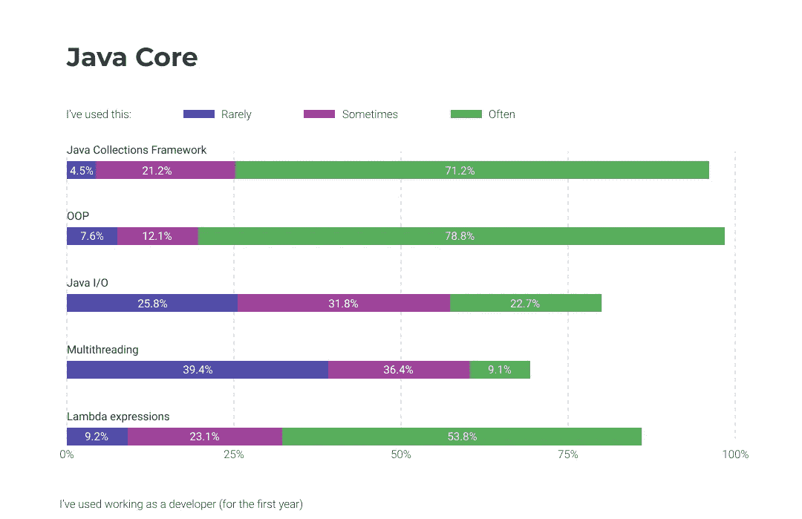

因此，我们可以说，对于任何潜在的 Java 初学者，甚至是初学者来说，核心 Java 知识都是必须的。当然，如果你完全了解所有的主题，多线程和 lambda 表达式稍微差一些，你就可以得到一个 offer。但是，这些话题可以成为你找工作时的竞争优势。尽管如此，你很可能需要同时使用这两者。

在我的实践中，我遇到了一些只知道基本概念——Java 语法和 OOP 的人。大多数情况下，他们成为 Java 培训生，但有时我会遇到一些几乎没有 Java 初级技能的人。一方面，他们很幸运:他们实现了成为程序员的梦想，可以直接从工作任务中学习。另一方面，雇主很快意识到他们的技能水平较弱，在很长一段时间内，他们接受同一类型的单调任务，这往往令人沮丧。我给这类程序员的建议是，成长得更快，直到你厌倦了这一切。解决实际问题，阅读——然后进入下一阶段。

## 从哪里学习核心 Java 主题

CodeGym 是我最喜欢的致力于核心 Java 的在线课程之一。您可以在这里找到所有核心 Java 主题(目前除了 lambdas)和 1200 多个练习。

jenkov.com 的 Lambda 表达式有一个很好的教程，在那里你可以找到你需要知道的关于 Lambda 的一切。

CodeCademy 上的 Java。CodeCademy 是最著名的实践学习平台之一。在本课程中，您可以找到大多数核心 Java 主题。

# 算法和数据结构:有问题

学习任何编程语言最有争议的问题之一是学生是否应该学习标准的排序和搜索算法。一方坚持认为，所有高效的算法早就被编写出来并包含在库中。因此，任何人都可以使用它们。

他们的反对者确信，自己编写算法是对程序员思维的极好锻炼，此外，这也是对学生思维能力的测试。我更可能属于后者，特别是考虑到在 Java 初级面试中，他们经常被要求写一个或另一个算法，有时甚至是在一张纸上。虽然算法知识与 Java 知识本身并不相关，但我建议所有未来的程序员都从事这方面的工作。它不会是多余的。

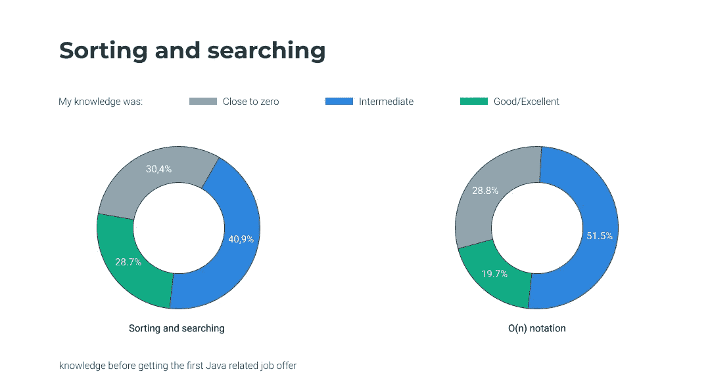

另一件事是，在程序员的实际工作中，你很可能不需要冒泡排序算法之类的东西。更重要的是知道在哪个库中可以找到标准算法。在调查中，69.6%的学生声称在收到第一份工作邀请之前，他们知道并以良好和平均的水平编写排序和搜索算法。

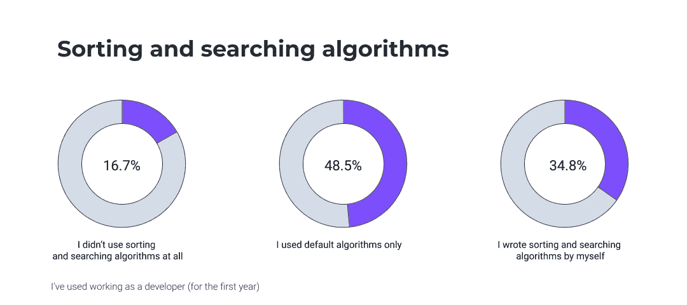

当我们谈到 Java 集合时，我们已经谈到了数据结构的主题。同样，我认为有必要了解他们的架构，以便知道在哪里使用什么，以及为什么使用。因此，我经常要求我的学生为这个或那个数据结构编写自己的类。

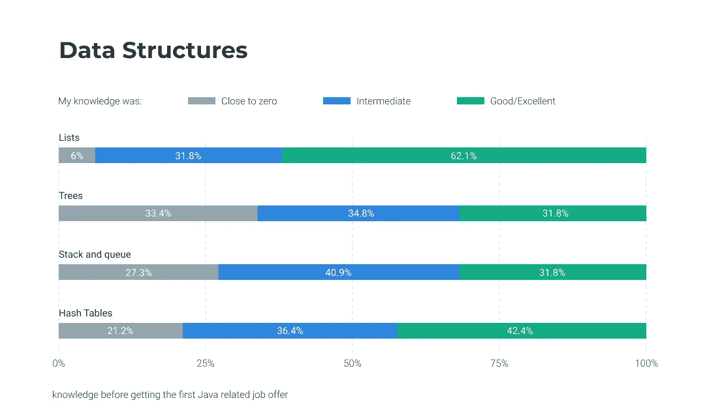

同样，在工作中，每个人通常都使用标准的数据结构，而不是全部。

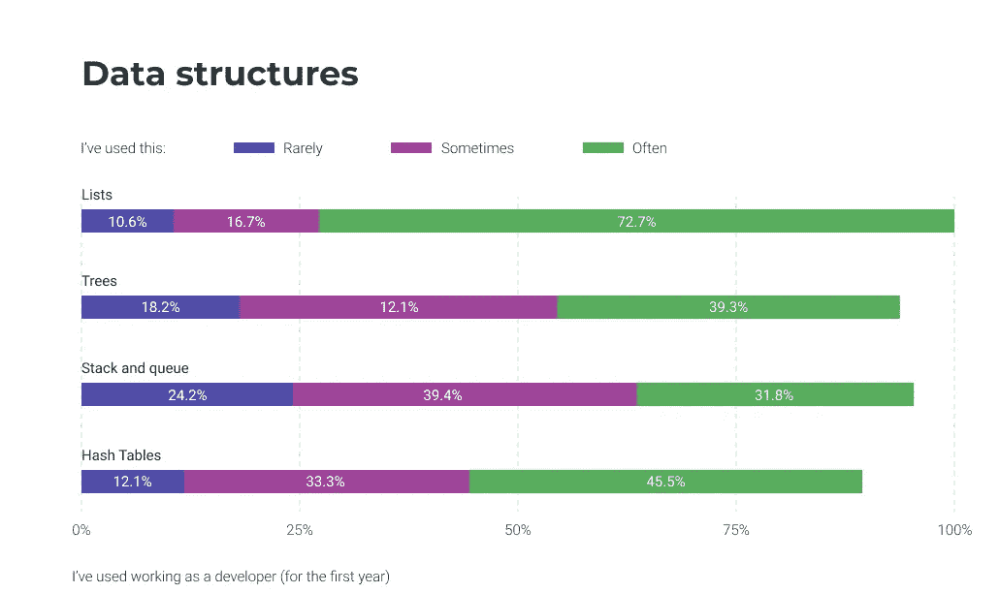

# 哪里学算法和数据结构

首先，你可能会找到一本好书，比如罗伯特·塞奇威克和凯文·韦恩的《T2 算法》。同样，这些作者在 Coursera 上有一个[在线课程。这是我的最爱之一，它使用 Java。](https://www.coursera.org/learn/algorithms-part1)

GeeksForGeeks 是一个巨大的在线社区，在这里你可以找到很多关于算法的讲座和练习。

# 单元测试

每个优秀的程序员都可以测试代码，不仅仅是他们自己的代码，所以学习如何为你的代码编写单元测试。有时新手忽视单元测试，更喜欢`System.out.println`验证类型(如果你已经尝试过写代码，你会明白我的意思)。请记住，单元测试比使用控制台输出进行检查有用得多。单元测试也是公司通常信任新开发人员编写的第一件事。根据调查，57.5%的受访者在第一次成功的 Java 相关面试之前使用 JUnit，超过 83%的人在第一个工作年已经使用过单元测试。

## 在哪里学习单元测试

好吧，找到一个教程(例如这个[视频教程](https://www.youtube.com/watch?v=2E3WqYupx7c&list=PLqq-6Pq4lTTa4ad5JISViSb2FVG8Vwa4o)或者这个[文本教程](https://www.tutorialspoint.com/junit/index.htm))，然后为你所有的代码创建测试！

# 实用程序库和有用的组件

一些雇主希望未来的程序员知道一些有助于他们工作的工具和库。

*   Servlets 是扩展服务器功能的 Java 软件组件。
*   JDBC 是 Java 应用程序和数据库之间交互的独立于平台的标准。JDBC 是作为 Java SE(标准版)中包含的 java.sql 包实现的。
*   log4j 是最著名的消息日志库。它允许您用 Java 代码编写库调用，然后在不改变已经编写的代码的情况下灵活地定制它。
*   杰克逊/JSON。JSON (JavaScript Object Notation)是一种极其流行的开放标准文件格式和数据交换格式，而 Jackson 是一种用于 Java 的高性能 JSON 处理器。

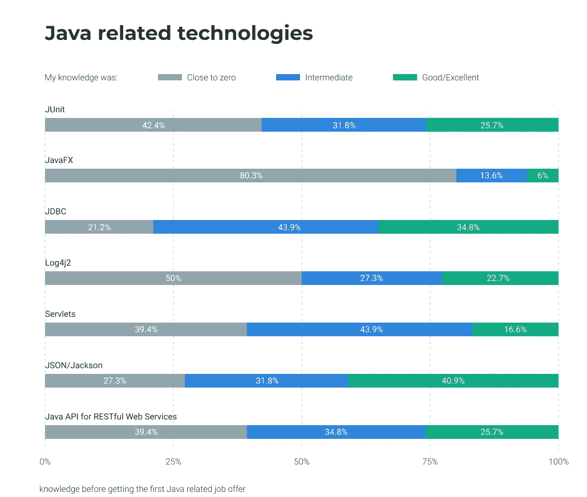

超过一半的受访者在获得第一份与 Java 相关的工作之前就已经知道了这些技术。所有新人在工作中都使用过 JSON/Jackson，大多数人使用 JDBC (84.8%)或 log4j2 (83.3%)。三分之二的被调查者在第一年的 Java 初级和培训期间使用过 servlets。

*   Guava 是一套开源的 Java 通用库，主要由 Google 工程师开发。
*   Apache Commons 是一个巨大的 Apache 项目，专注于可重用 Java 组件的各个方面。

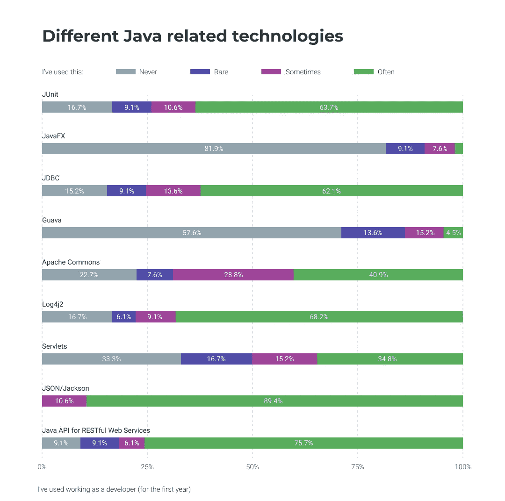

在学习的时候，我建议你花时间学习 log4j、JSON、JDBC(以及 SQL 和数据库工具)。然而，列表和库中的其他技术也很有用。

## 从哪里学习实用程序库和有用的组件

*   在[tutorial point](https://www.tutorialspoint.com/log4j/index.htm)上关于 log4j 的文字教程或者在 [Udemy](https://www.udemy.com/course/apache-log4j-tutorial/) 上的视频课程
*   CodeGym 的课程中有一些 JSON、log4j、JDBC 主题和练习。
*   edureca 上的 Java servlet

# 春天/冬眠

前一段时间，没有人要求大三学生具备框架知识，更不用说实习生了。然而，时代在变，如果你不了解这些技术，一些公司不会涉足其中。尽管有可能，但学会自己和他们一起工作是非常困难的。但是，在这种情况下，我会建议找课程，和导师一起做。

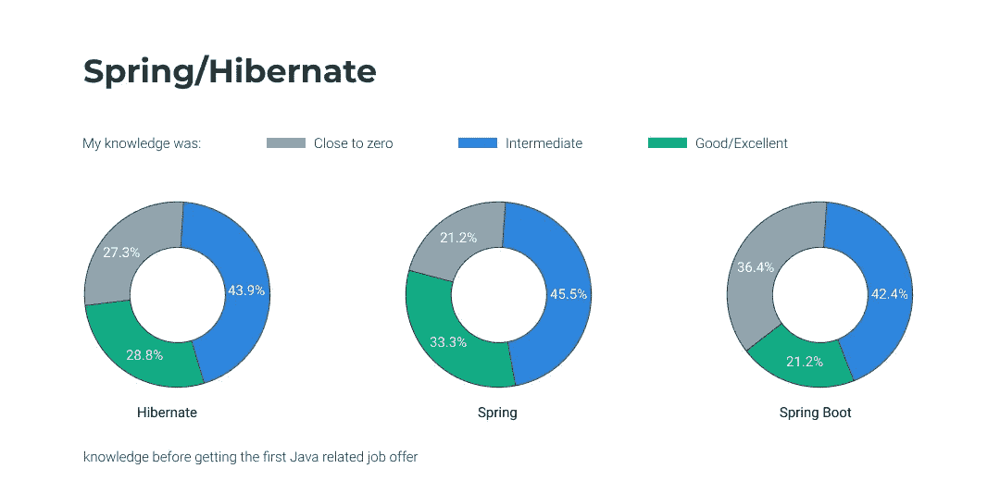

*   Spring——33.3%的受访者认为他们对 Spring 的了解“很好或非常好”，而 21.2%的人对这个框架一无所知。
*   Spring Boot——42.4%的受访者知道 Spring Boot(良好或优秀水平)，36.4%的受访者不知道。
*   Hibernate——43.9%的人对 Hibernate 有很好或很好的了解，而 27.3%的人从未尝试过。
*   RESTful Web 服务的 Java API——90.9%的人在工作时使用它。

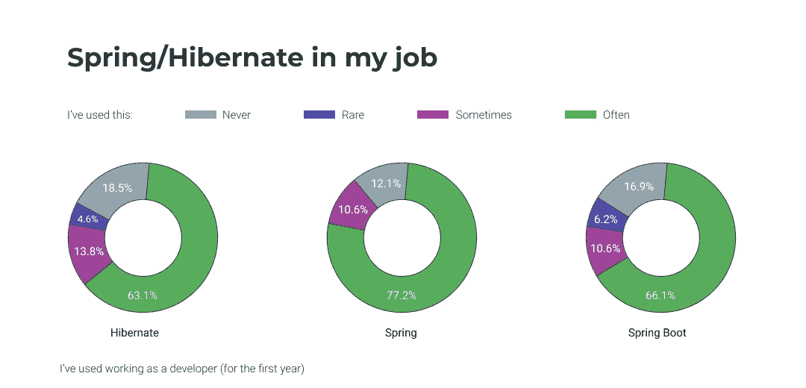

## 去哪里学春/冬

正如我之前说过的，学习 Spring 和 Hibernate 的最好方法是找一个小团队和一个导师一起学习课程，但这并不总是可能的。我发现了一些学习它们的有趣资源。

[巴东春季教程](https://www.baeldung.com/spring-tutorial)

[春季实战任务](https://kciray8.github.io/KciTasks/App/src/)

spring.io 上的 [Spring 教程](https://spring.io/guides)和 [spring boot guide](https://spring.io/guides/gs/spring-boot/)

[冬眠和春季](https://www.udemy.com/course/spring-hibernate-tutorial/)月日

Udemy 上的 RESTful API

# 设计和架构模式以及编程原则

设计模式是解决某些特定问题的成熟解决方案。如果你不认识他们，你会让你未来的雇主头疼。花时间阅读关于模式的内容，并在实践中应用它们。架构模式也是如此，比如 MVC。我总是让我的学生用 MVC 设计一些程序。它变得更加困难，但是在那之后，他们知道如何使用它。

此外，根据 KISS、DRY 和 SOLID 原则，阅读简单易读的代码也是有益的。老实说，它们很容易理解，但在实践中使用它们需要时间。这就是为什么，当我面试初级职位的申请人时，我从不要求申请人对这些原则有扎实的知识，意识到它们来自实践。

## 在哪里学习和阅读模式和原则

[重构大师](https://refactoring.guru/design-patterns/java)

[固，亲，干，YAGNI](https://mohitkhare.me/blog/solid-dry-kiss-yagni/)

# 构建自动化工具、应用服务器和非 Java

大多数 IT 专业人员都应该掌握一些技术和技能。它们与 Java 没有直接关系，但我仍然会提到它们—在初级阶段学习它们并不困难。此外，最好在你开始工作之前做这件事，因为那时你就没有时间做这些了。

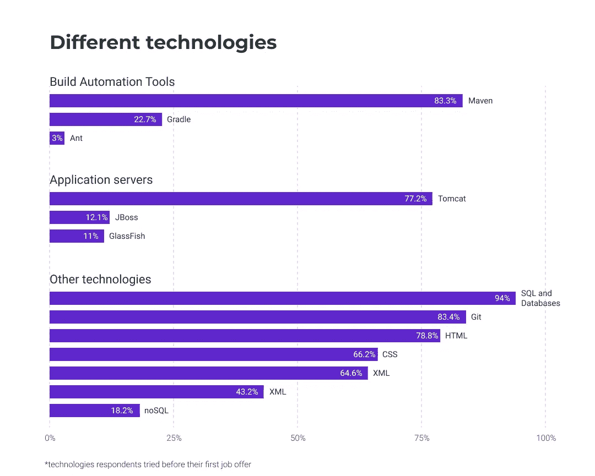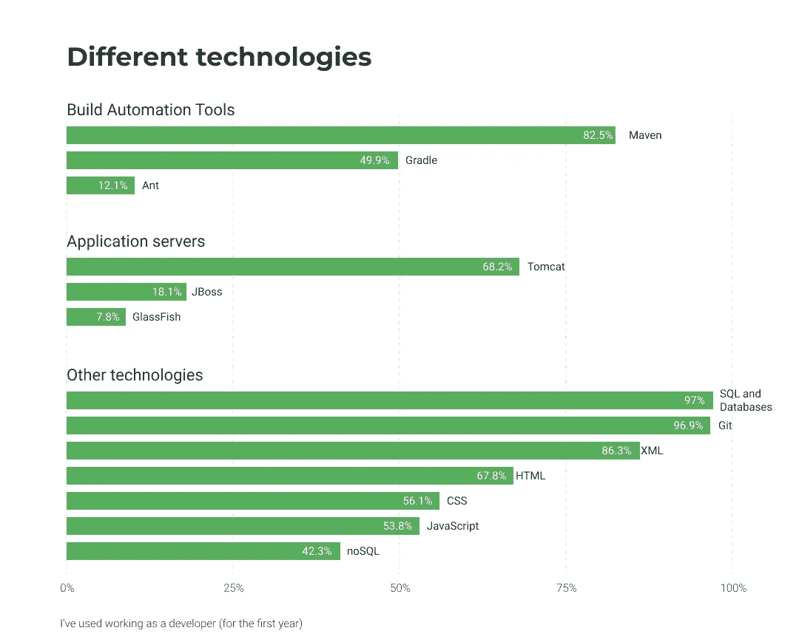

## 从哪里学习构建自动化工具、应用服务器和非 Java

[研究生教程和指南](https://gradle.org/guides/)

[5 分钟后的 Maven](https://maven.apache.org/guides/getting-started/maven-in-five-minutes.html)

[Tomcat 7 简介](https://tomcat.apache.org/tomcat-7.0-doc/appdev/introduction.html)

[JBoss](https://docs.jboss.org/jbossas/jboss4guide/r4/html/ch01.html)

w3schools 上的 [SQL](https://www.w3schools.com/sql/) ， [JavaScript](https://www.w3schools.com/js/js_exercises.asp) ， [HTML](https://www.w3schools.com/html/html_exercises.asp) ， [CSS](https://www.w3schools.com/css/css_exercises.asp)

# 结论

嗯…看起来有点吓人，不是吗？另一方面，如果你热爱编程，对技术感兴趣，并决心成为一名程序员，那么就没有必要害怕。一步一步来，练习，学习，愿原力与你同在。路会被行走的人掌握。