# 使用 HTML 快捷方式可以节省多少时间？

> 原文：<https://betterprogramming.pub/how-much-time-can-you-save-with-html-shortcuts-5357a32756d7>

## 编码

## 使用这些快捷工具节省时间和手指

照片由 [Sonja Langford](https://unsplash.com/@sonjalangford?utm_source=unsplash&utm_medium=referral&utm_content=creditCopyText) 在 [Unsplash](https://unsplash.com/s/photos/time-saving?utm_source=unsplash&utm_medium=referral&utm_content=creditCopyText) 上拍摄

你用快捷键`!` `【 tab 】`打出一个 HTML 基本结构，节省了 120 秒。

为 HTML 使用快捷方式是我工作流程中不可或缺的一部分，以至于我并没有真正考虑它节省了多少时间，或者它如何降低手指抽筋的可能性(我有时会抽筋)。

很长一段时间，我认为这些快捷方式是 Visual Code Studio 编辑器的一部分。我最近才知道他们来自埃米特 T21，VSC 已经把他们包括在内了。如果你没有使用 VSC，你可以在你的代码编辑器中使用 Emmet。

我希望这篇文章能让你对使用快捷方式感兴趣，如果你还没有这样做的话。如果你已经在使用它们，了解一下你每天节省了多少时间是很好的。

# HTML 模板

快捷:`!` `【 tab 】`

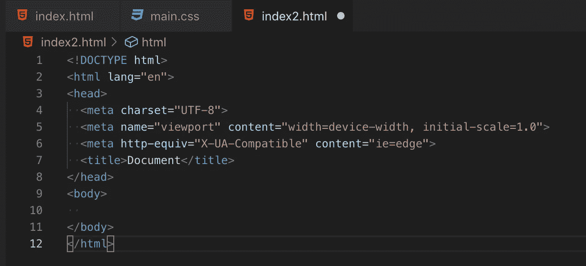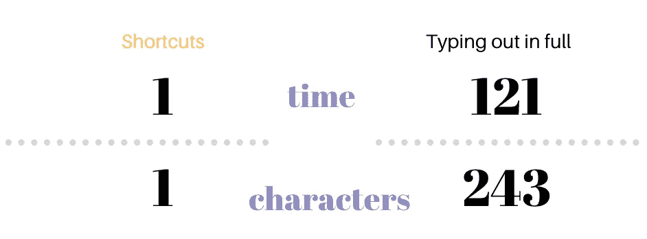

节省时间: 120 秒

# HTML 元素

让我们从创建一些嵌套有子元素的普通 HTML 元素开始:

1.使用`>`操作符嵌套元素。

2.使用`*`重复元素。

快捷方式:`hdr>ul>li*3` `【 tab 】`

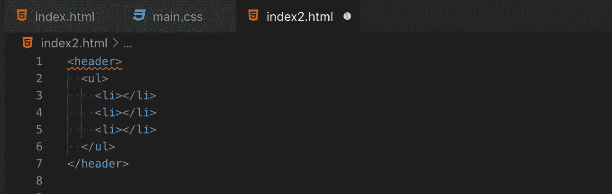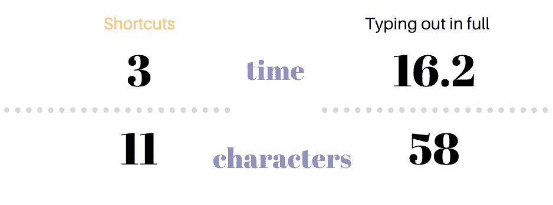

节省的时间: 8 秒

3.使用`+`创建同级元素，它们是同一层上彼此相邻的元素。

4.使用`^`向上爬一层，并改变下列元素应该出现的上下文。你可以使用一个以上的`^`向上爬 1 级以上。

快捷键:`div+div>p>span+em^bq` `【 tab 】`

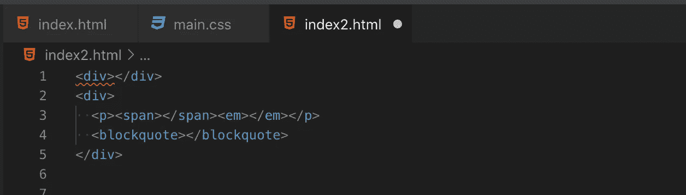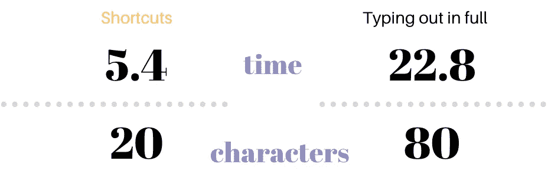

节省时间: 17.4 秒

5.使用`*()*`将元素组合在一起。

快捷方式:`div>(header>ul>li*2>a)+footer>p` `【 tab 】`

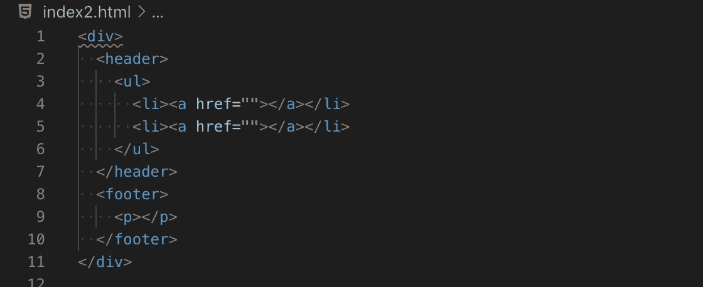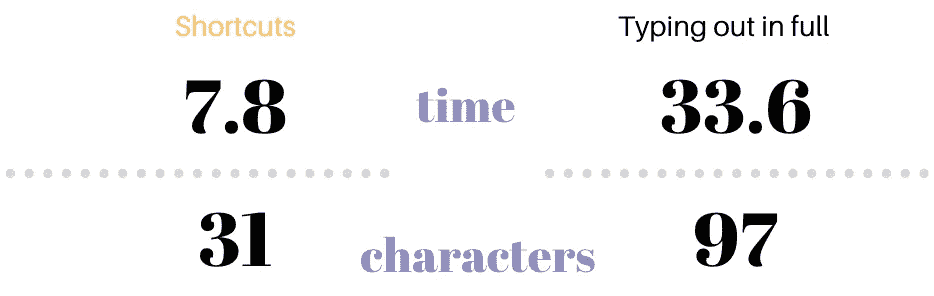

**节省时间:** 25.8 秒

# HTML 属性

给元素命名怎么样？

6.使用`elem#id`和`elem.class`符号创建带有 id 名或类名的元素。

7.使用`elem.class.class2`添加一个以上的类名。

快捷方式:`div#header+div.page+div#footer.class1.class2.class3` `【 tab 】`

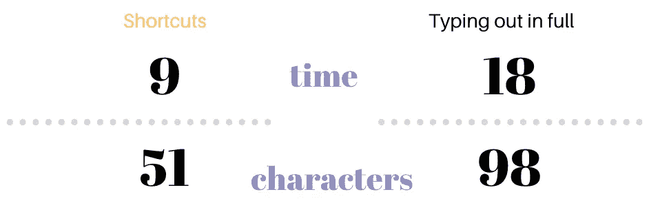

节省时间:9 秒

8.使用$为重复的元素生成数字。

快捷方式:`ul>li.item$*5` `【 tab 】`

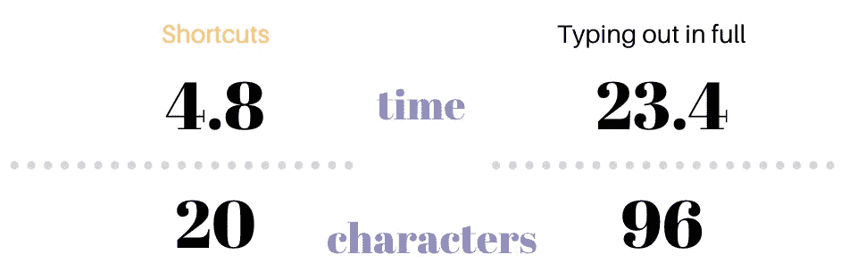

**节省时间** : 18.6 秒

# 文本

最后，内容的最后一个重要捷径…

9.使用{}添加文本。

快捷方式:`hdr>ul>li*3#nav$>{nav-item$}` `【 tab 】`

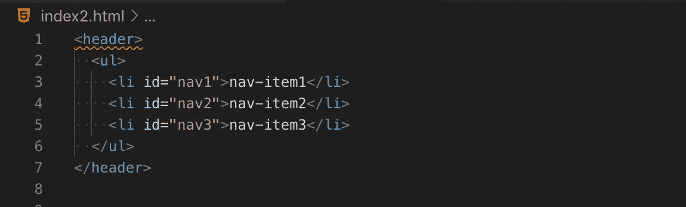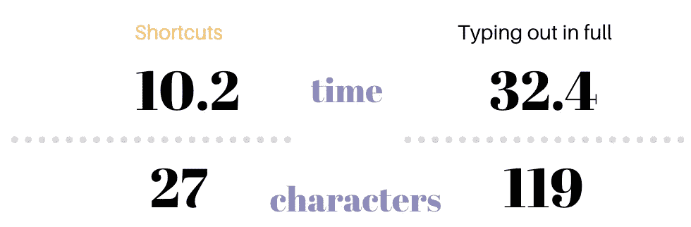

**节省时间:** 22.2 秒

快捷方式可以节省时间(和手指)，但也可能浪费时间，因为你要花更多的时间考虑如何为复杂的结构创建正确的快捷方式。它们最适合不复杂的结构。

最后，我在这里列出的节省时间只是一个估计。你可能会花更多的时间把快捷方式放在一起，而花更少的时间输入完整的文本，因为你可以复制和粘贴一些代码。

记住这一点:节省了大约 120 秒…这可能是让`git-commit`第一个避免`deconflict`工作的区别。