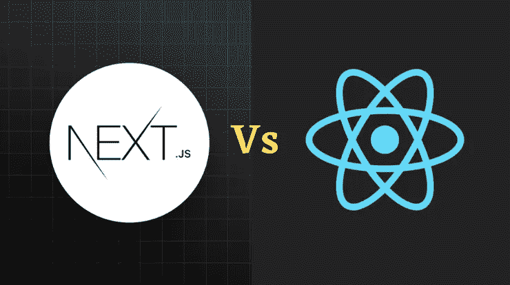
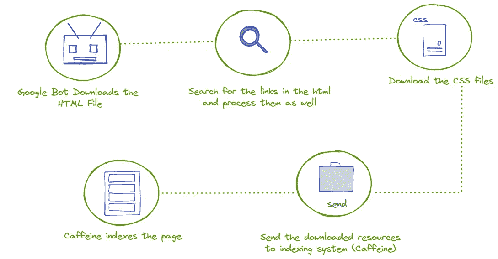
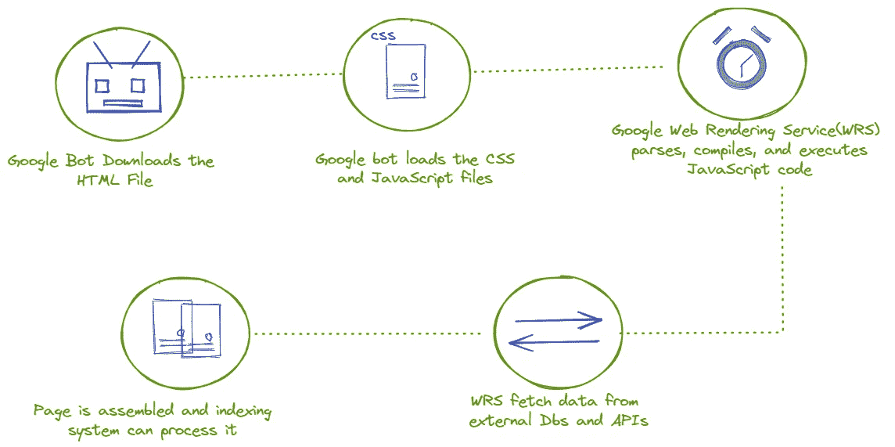
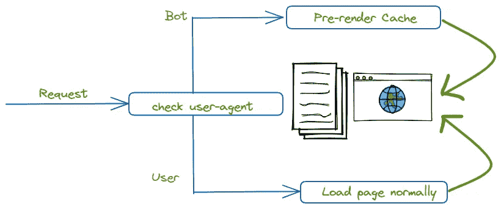
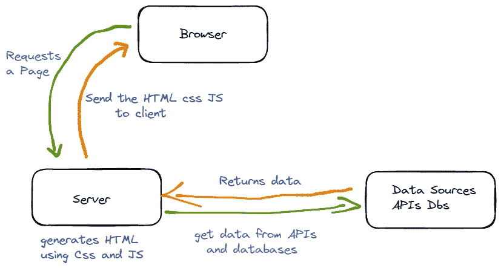

# Next.js Vs React.js

> 原文：<https://betterprogramming.pub/how-next-js-can-solve-the-limitations-of-your-react-app-c3f69a796242>

## React 适合每个 web app 吗？



Next.js vs React

React 已经成为 web 开发中蓬勃发展的技术之一。在脸书的支持下，react 已经成为目前最受欢迎的 web 应用程序开发库。React 提供了流畅的用户体验，反应迅速，可以快速构建和测试。

除了所有这些优点，在使用现代 js 框架(如 Vue、React、Angular)构建产品时，还需要考虑一些主要问题。我们将在本文中深入讨论这些因素。

[](https://levelup.gitconnected.com/node-js-vs-net-core-the-winner-5ba06efb4c35) [## Node.js vs .NET Core 谁更胜一筹？

### 是的，我们有一个赢家

levelup.gitconnected.com](https://levelup.gitconnected.com/node-js-vs-net-core-the-winner-5ba06efb4c35) 

# 背景

在商业中使用技术的唯一目的是增加利润。可能一目了然。在每个行业使用技术的最终目标是增加利润。可以通过提高效率、获得更多客户和降低成本来增加利润。

假设你为一家公司创建了一个网站/Web 应用程序，并将其托管在 Web 上。网站的最终目标应该是增加公司的利润。这可以通过提高公司产品或服务在互联网上的知名度来实现。更多的潜在客户将能够看到公司提供的产品或服务。

在互联网的世界里，顾客之旅几乎是从谷歌开始的。谷歌获得了总搜索请求的 90%以上。根据 StatCounter 的数据，谷歌拥有整个搜索引擎市场 92.16%的份额。因此，必须努力优化我们的网页内容，以在谷歌搜索排名。

让你的产品服务出现在前 3-5 个谷歌搜索结果上是非常重要的。出现在搜索结果中的前五个链接获得最多的点击。

# 在谷歌上的排名


斯蒂芬·菲利普斯-Hostreviews.co.uk 在 [Unsplash](https://unsplash.com?utm_source=medium&utm_medium=referral) 上的照片

很明显，如果你真的需要增加产品/服务的利润，让你的网络应用出现在前五个谷歌搜索结果中是至关重要的。这可以通过优化你的产品来适应谷歌搜索来实现。换句话说，开发一个 SEO 友好的应用程序。SEO 代表**搜索引擎优化。**

[](https://javascript.plainenglish.io/beginners-guide-to-javascript-callbacks-d8195be73dc5) [## JavaScript 回调初学者指南

### 通过真实的项目代码样本学习回调的 A-Z。

javascript.plainenglish.io](https://javascript.plainenglish.io/beginners-guide-to-javascript-callbacks-d8195be73dc5) 

“搜索”引擎优化是指增加你从谷歌等搜索引擎获得的网络流量。否则，它只是优化您的网站的方法，以正确的关键字在谷歌搜索结果中排名靠前。

对于企业主来说，如果需要获得更多的客户，考虑 SEO 是至关重要的。当选择一个技术栈来开发你的 web 应用时，考虑一个 SEO 优化的技术栈是有益的和关键的。它可以决定你的创业或 web 应用的成功。

# 谷歌搜索如何工作


由[本杰明达达](https://unsplash.com/@dadaben_?utm_source=medium&utm_medium=referral)在 [Unsplash](https://unsplash.com?utm_source=medium&utm_medium=referral) 上拍摄的照片

在选择 **React.js 和 Next.js** 在 SEO 方面的优劣之前，我们应该对 Google 搜索的工作原理有一个清晰的认识。谷歌使用机器人/爬虫对你的网页进行排名。当你将网页上传到互联网后，谷歌机器人会在你的网站上爬行并识别新的网页。它还浏览内容并分析质量。

无论如何，您需要一些页面不在 Google 结果中显示，因此您可以将它们添加到一个名为 `robot.txt`的单独文件中。

阅读完页面后，Google 爬虫做的下一步是索引页面。谷歌机器人分析内容并理解页面内的内容。谷歌爬虫通读标题、副标题和链接来识别这个页面是关于什么的。然后谷歌机器人将结果存储在一个巨大的谷歌数据库中。谷歌有一个单独的系统叫做`caffeine` 来对这些存储的数据进行排名。

在每次搜索中，谷歌都会根据排名反馈相关页面。这就是谷歌搜索的工作方式。有不同的算法和排名因素影响谷歌排名。我们不打算在这篇文章中讨论它们，因为我觉得这超出了我们的上下文。

使用 React 创建的应用程序的主要问题在于谷歌索引和排名。

# JS 单页应用程序(spa)的问题

spa 是使用 JavaScript 创建的。并且网页最初作为 JS 页面被加载。让我们看看 js 页面在 google 索引方面最常见的问题。

## 由于加载时间慢，索引过程复杂

首先，我们来比较一下 Google 搜索引擎 bots 是如何索引 HTML 和 JS 页面的。谷歌机器人是为了理解 HTML 页面内容而开发的。当机器人试图理解 HTML 和 JS 网页时，会有很大的不同

## 机器人如何索引 HTML 页面



谷歌机器人可以使用 HTML 文档轻松快速地执行这些任务。在上面的方法中，没有从客户端发送 API 调用来填充网站。当谷歌机器人请求时，内容已经被填充。

## 机器人如何索引 JS 页面？



使用 JavaScript，你可以看到事情很复杂。在添加到索引队列之前，需要下载链接并填充 HTML 文件。调用 AP 从数据库获取数据等等。这个过程需要时间，而且用这种方法索引 js 页面更慢。这种缓慢的加载时间与爬行预算产生了冲突，导致混乱。

## 更多的加载时间消耗了爬行预算

爬行预算是谷歌搜索引擎机器人在五秒钟内可以爬行的最大页面数量(通常每个脚本五秒钟)。用 JS 开发的网站需要五秒多的时间来加载和完成所有的脚本。谷歌搜索机器人只等待五秒钟，就离开了网站，没有索引。由于这种长时间的等待，大多数 JS 页面在 Google 搜索中没有被索引。索引过程也会变得复杂。

下面是爬虫加载 React 页面时首先看到的一种页面:

您可以看到页面内容是空的。它只有一个 id 为`root`的标签`dive` 。单页面应用程序需要浏览器运行 js 包并用内容填充页面。与此同时，谷歌机器人等待五秒钟，离开时认为这是一个空网站。

## JavaScript 代码错误

js 代码中的一个错误就可以停止页面呈现，导致一个空的 web 页面。JS 解析器不能容忍错误，丢失一个字符就会弹出语法错误并停止执行。因此，大多数 js 代码错误都以 Google bot 的空白页面告终。

## 单页应用程序的问题

在 SPA 这个术语中，你可以理解使用 react 等现代框架创建的站点只有一个页面。在单个页面中，相关内容是动态加载的。这一页作为一个单一的界面来传递内容，它只加载一次。由于这种方法，spa 速度很快，并提供了良好的用户体验。

但问题是 SEO 机器人不能一次看到所有的内容。这种缺乏可见性也是由于 js 页面的加载时间较长造成的。这是水疗中心面临的一个重大限制。一旦机器人访问页面，它是空的，因此大量的内容对机器人是不可见的。而谷歌甚至不知道你的内容存在于互联网上。这种情况会导致谷歌排名下降。

# 如何让你的网站对谷歌友好

预渲染和服务器端渲染是让你的网络应用对谷歌更加友好的一些主要方法。我们将讨论每种方法的优缺点。

# 预渲染

预渲染程序为谷歌机器人进行渲染。一旦请求来自一个机器人，预渲染获取一个已经为机器人渲染的 HTML 页面。当谷歌机器人不能按时自己完成渲染时，这很有用。仅当请求来自机器人时，才会获取预先呈现的页面。如果是来自用户，那么渲染会照常在客户端进行。

一种流行的预渲染服务是使用 prerender.io 这样的服务。它拦截所有请求，如果请求来自机器人，则获取已经渲染的 HTML 页面。



预渲染

预渲染者有他们自己的优点和缺点。

## 预渲染方法的优点

*   容易实现。
*   可以将现代 JS 页面转换为静态 HTML，并在需要时将其提取给 SEO 机器人。
*   支持几乎所有新的 JS 和 web 功能和模式。
*   需要很少的修改或不需要修改。
*   具有较轻的服务器负载。

## 预渲染方法的缺点

*   预渲染服务不是免费的。
*   预呈现不适合频繁更改的数据。
*   您必须在每次页面内容更改时重新创建预先呈现的页面

# 服务器端渲染

首先，让我们了解一下服务器端和客户端渲染的区别。

客户端渲染意味着最初浏览器得到的是一个内容较少的页面或一个空白页面。然后，JS 代码使用 API 下载数据，并用内容填充页面。这需要更少的时间，所以这些步骤发生得很快，我们可以立即看到完整的内容页面。但是这些步骤对于谷歌搜索引擎优化机器人来说还不够快。

客户端呈现对 SEO 不友好，因为 bot 最初总是获得一个空页面或数据较少的页面，这不足以索引页面。

使用服务器端渲染，所有繁重的工作都在服务器端完成。在将文件发送到客户端之前，会呈现 JS、调用 API 并填充数据内容。

通过服务器端呈现，SEO bot 获得呈现的包含所有内容的 HTML 页面。由于这个原因，服务器端呈现的页面在 google 中的索引更高。

因此，在 react 中创建 SEO 友好页面的最简单方法是使用服务器端呈现方法。为了轻松地进行服务器端渲染，我们使用了 **Next.js.** **Next.js** 在 react 应用中添加了一个额外的层，允许服务器端渲染。

# Next.js


Next.js 是一个构建在 React 之上的 JavaScript 框架，它允许为您的应用程序提供服务器端呈现。Next.js 能够进行自动代码分割和热代码重载。当客户端发出请求时，Next.js 可以创建一个 HTML 页面。

## NextJS 中的服务器端呈现



Next.js 中服务器端呈现的工作方式

1.  Next.js 服务器从客户端获得一个请求，并使用 URL 地址将其与相关的页面组件进行匹配
2.  该组件使用 API 和数据库请求几个数据。服务器会一直等待，直到数据被提取到页面。
3.  Next.js 应用程序基于接收到的数据和现有的 React 组件生成 HTML 和 CSS 页面
4.  服务器为前端发送一个完整的带有 CSS 和 JS 的 HTML 页面

# 使用 Next.js 优化您的网站 SEO

Next.js 提供了一套在开发应用时使用的 SEO 优化技术。

## 使网站可以被搜索引擎优化机器人抓取

Next.js 提供了两个选项来生成可抓取的内容。我们可以在每个请求上呈现站点，并提供 HTML 站点。在这种方法中，数据被正确地更新。TTFB(到达第一个字节的时间)较慢，但您的数据总是最新的。

或者，您可以使用静态生成，在构建时创建 HTML 内容，存储在 CDN 中并立即提供。这种方法在性能上是高效的，但是内容可能不是最新的。

因此，我的方法是在内容不经常更新的页面上使用这种静态生成，如联系我们关于我们的页面。

下面是在 next.js 中预渲染你的网站的步骤。你必须以下面的方式更新`next.config.js`并使用`npm run export`命令运行。

`next.config.js`

这将创建一个名为`out`的文件夹，并在其中存储静态页面。

## `Adding Meta Tags`

谷歌算法在对内容进行排名时会寻找不同的因素。元标签也是一个这样的因素。谷歌爬虫通过查看元标签来识别里面的内容。

这里有一个例子:如果你的元标签有一个词叫做移动开发，谷歌机器人会理解这个内容与移动开发有关。Next.js 可以自动添加你的大部分元数据。您也可以编辑`index.js`文件中的`meta` 标签。

## 创建站点地图

对于 SEO 来说，站点地图是一个至关重要的文件。SEO 机器人使用站点地图在你的 web 应用程序中找到新的页面。当涉及到 SEO 时，站点地图总是更可取的。

构建站点地图有几种方法。我们可以使用免费服务，也可以使用付费服务。但是 next.js 有自己的包来生成站点地图。我们可以使用`nextjs-sitemap-generate`包来自动完成所有的任务。这个包可以生成一个合适的站点地图，并在必要时毫不费力地更新它

使用 npm 和以下命令安装软件包:

```
npm i nextjs-sitemap-generator
```

并将以下代码添加到您的配置代码中:

这将在您的外部文件夹中生成一个名为`sitemap.xml`的站点地图。您应该使用谷歌搜索控制台手动向谷歌提供网站地图。只有在那之后谷歌才会承认。

所以这些是 next.js 可以帮助你的应用绕过 React.js 的限制的方法。

# 结论

我同意 React 在用户体验和速度方面有很大的潜力。但是 React 在搜索引擎优化方面有严重的缺陷。

通过这篇文章，您了解了 React 页面带来的一些主要问题。

您可以使用 Next.js 等现代解决方案来克服这些缺点。如果您正在构建一个内容驱动的 web 应用程序，使用 Next.js 是一个不错的方法。