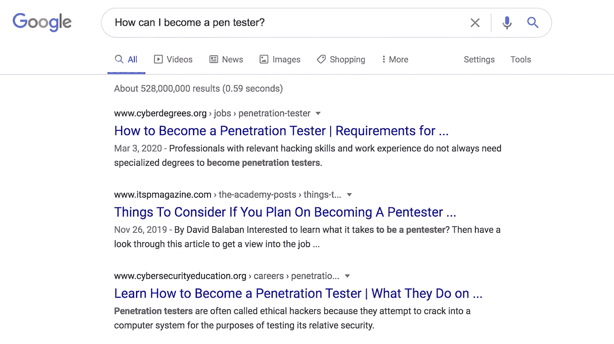

# 如何(不)在网上提问

> 原文：<https://betterprogramming.pub/how-not-to-ask-questions-on-the-internet-72dd30e273a7>

## 让人们最终回答你的技术问题的策略

由 [Rohit 农民](https://unsplash.com/@rohitfarmer?utm_source=medium&utm_medium=referral)在 [Unsplash](https://unsplash.com?utm_source=medium&utm_medium=referral) 拍摄的照片。

你有没有在网上(Twitter，Reddit，Stack Overflow)问了一个问题，结果却被完全忽略？

最近，我通过电子邮件和 Twitter DMs 收到了许多关于网络安全的问题。老实说，我很抱歉忽略了其中的一些。不幸的事实是，网上有很多人问技术问题，回答问题的人少得多。归根结底，根本没有足够的时间来详细回答每个问题。

然而，你可以做一些事情来帮助人们在互联网上帮助你。这是一个关于如何提出更好的问题的 PSA。

# 在你问之前

首先，在你问之前，考虑一下这个问题是否值得问！有两种问题你应该*而不是*问:

1.  已经回答的问题
2.  你可以试着自己回答的问题

这个问题在别的地方已经被回答了吗？这个问题可以通过简单的谷歌搜索来回答吗？如果是这样的话，你就不用再转贴这个问题了，这样可以节省很多时间。例如，这里有几个你不应该在网上问的问题，因为它们可以通过快速的谷歌搜索得到答案:

*   怎样才能成为 pentester/开发者/黑客？
*   如何在我的电脑上安装 Python？
*   我如何找到一个网站的 JavaScript 源代码？

你可以在互联网上找到大量的博客文章、网页和指南来回答这些问题。很有可能，你会在那里找到能回答你具体问题的东西。

问之前做好调查！毕竟，没有人喜欢在网上被当作人肉谷歌搜索引擎。

接下来考虑一下自己的问题能不能回答。属于这一类别的问题包括:

*   我遇到了这个错误。我该如何解决？
*   这段代码有什么问题？
*   没有 Z 怎么用 Y 语言实现 X？

有时候，如果你更长时间地坚持这个问题，这些问题是可以避免的。学习一项新技能、构建一个软件或调试一个脚本从来都不是一帆风顺的。但是你会通过奋斗和自己解决问题学到最多。你可以在用尽你能想到的所有可能的解决方法后再问！

# 如何提问

现在是时候提出要求了。一旦你确定提问是必要的，你如何让人们愿意回答你的问题？

三言两语，轻松帮到你。假设你想发布这个问题:“救命！我在 Python 拿到了一个`KeyError`。我该怎么办？”

考虑一下回答你的问题需要什么。回答者必须弄清楚:

*   你想在你的项目中完成什么
*   为什么你得到了`KeyError`
*   您尝试过哪些解决方案

回答者将不得不做出假设，并提出许多后续问题。那会占用很多时间和耐心！而且会导致大部分人干脆选择不回答你的问题！

为了帮助别人帮助你，你必须学会问更好的问题。目标是减少理解和回答你的问题所需的时间。

详细解释一下你的问题。你想完成什么？你试过什么？是什么绊倒了你？例如，这是一个更好的问题:

> 在我的 Python 程序中，我试图确定字典中是否存在键值对。这是代码:

> 但是，当我输入一个字典里没有的“键”时，程序会给我一个`KeyError`。我注意到当关键字不在字典中时会发生这种情况。但我的问题是，我应该如何处理这个问题，以便当输入一个未知的“键”时，程序不会停止执行？有没有一种优雅的方式来做到这一点？

你的问题越深思熟虑和详细，别人就越容易帮助你。

综上所述，态度要好，要体贴，要容易帮到你。你越容易提供帮助，就越有更多的人愿意参与进来回答你的问题！