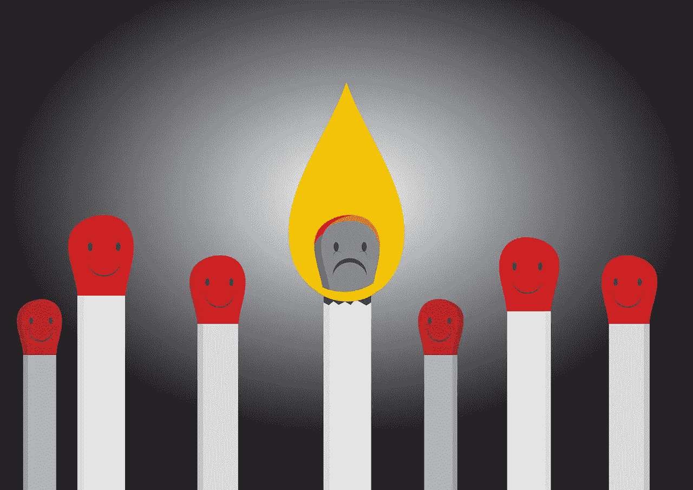
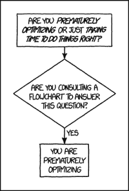

# 如何不精疲力尽:软件开发者指南

> 原文：<https://betterprogramming.pub/how-not-to-burnout-a-guide-for-software-developers-1c89851a2347>

## 缺乏活力、愤世嫉俗和生产力下降是倦怠的常见症状

图片来自 [Pixabay](https://pixabay.com/?utm_source=link-attribution&utm_medium=referral&utm_campaign=image&utm_content=2326686) 的 [succo](https://pixabay.com/users/succo-96729/?utm_source=link-attribution&utm_medium=referral&utm_campaign=image&utm_content=2326686)

疫情改变了我们的工作方式。虽然在这种病毒出现之前很久，开发人员的倦怠就已经是一个问题，但远程工作只会恶化我们的工作与生活的平衡，而且我们的心理健康现在比以往任何时候都需要更多的关注。

# 什么是职业倦怠？

在我们继续讨论如何避免精疲力尽之前，准确理解什么是精疲力尽是很重要的。

来自 [Pixabay](https://pixabay.com/?utm_source=link-attribution&utm_medium=referral&utm_campaign=image&utm_content=2566491) 的[佩吉和马尔科·拉赫曼-安克](https://pixabay.com/users/peggy_marco-1553824/?utm_source=link-attribution&utm_medium=referral&utm_campaign=image&utm_content=2566491)的图片

人们称之为倦怠的有几种不同的东西(比如情绪倦怠)，但是我们将特别关注软件开发人员的职业倦怠。职业倦怠是一个复杂的系统性问题，一般有以下症状:

*   在工作中变得愤世嫉俗或过分挑剔
*   没有明显原因的缺乏精力和注意力
*   拖延你曾经热衷于做的事情
*   恐惧、冷漠和失控的感觉
*   降低生产率
*   轻微焦虑

这些是最初的症状。如果不加控制，倦怠会导致以下长期后果:

*   持续的疲劳和压力
*   严重焦虑
*   失眠/睡眠时间表受到影响
*   愤怒的爆发
*   心脏问题/高血压
*   免疫功能降低
*   临床抑郁

# 进展如何？

心理学家赫伯特·弗罗伊登伯格和盖尔·诺斯这样定义职业倦怠的 12 个阶段:

1.  **强迫观念**。你无休止地试图证明自己，这慢慢耗尽了你的精力。
2.  **“再努力点。”**您无法关闭。你会以牺牲其他事情为代价来工作。
3.  **忽视需求。你在以牺牲个人和/或身体需求为代价工作，比如疲惫。**
4.  **冷漠**。工作质量开始下降，你开始寻找责任。
5.  **价值观的死亡**。亲朋好友搬到后台，价值观歪斜，兴趣爱好无关紧要，工作为主。
6.  **沮丧、侵略、玩世不恭**。当你开始否认生活中的明显问题时，责任就转移到了所有事情上——和所有人身上。你经常被激怒，对周围的人不满意。
7.  **情感枯竭和逃避义务**。你把自己隔绝在大部分社交之外，想办法少干点活。可能会依赖酒精和药物来缓解压力。
8.  **“我变成什么了？”你正在经历奇怪的行为变化，你的朋友和家人开始担心。然而，你仍然不承认你对自己的不适负有责任。**
9.  **“别管我。”**又称*人格解体*。你对自己失去了信心，认为自己几乎无法改变自己的生活。
10.  **内心空虚**。你感到内心空虚，不再有希望和梦想。有些人可能用酒精、毒品或性来填补空虚。
11.  谁在乎呢？抑郁发作，感觉不确定、失落、疲惫。
12.  **倦怠综合征。**身心全面崩溃。需要全面的医疗护理。

注意这是现实的简化模型，步骤会因人而异。但是总的向下螺旋趋势总是一样的。

# 什么原因导致倦怠？

职业倦怠综合症是一种复杂的疾病，需要系统地滥用工作/生活平衡。

高工作量是职业倦怠最明显的原因之一。如果你总是有紧迫的或不切实际的最后期限，压力将会持续，疲惫将会显现。

完美主义。我们，程序员，倾向于沉迷于我们工作的每一个细节。虽然一定程度的完美主义是有益的(苹果就是一个活生生的例子)，但你必须知道在哪里停下来。问题是没有什么是真正完美的，只有对应用程序来说足够好。这个特殊的概念在软件开发中被称为*过早优化*，你可以使用这个方便的图表来帮助你([链接到这个图表](https://xkcd.com/1691/)):

**乏味**。如果你一直在用同样的产品、人员和工具工作，很容易就会变成机器人。如果你在工作中找不到令人兴奋的部分，它会很快变得非常无聊。

**混乱**。沉闷是完全缺乏变化，而混乱是另一个极端。如果你的目标和实现目标的方法每天都在变化，你很难让你的工作有条理。工作场所不稳定就像每天无聊、可怕的工作一样有害。

**缺乏反馈**。如果你整天写代码，甚至不知道它是否能进入生产，你会很快诉诸于你的行为无关紧要的谬论。对于我们人类来说，在工作中得到认可是非常重要的。没有这种认识，我们的产品质量会在你不知不觉中下降。

**工作/生活** **平衡**。如果你把所有的精力都花在工作上，你就没有精力花在自己、家人和朋友身上了。由于人类是群居动物，无法孤立生存，这将对你的心理健康产生灾难性的影响。

# 如何防止倦怠？

既然我们已经讨论了什么是职业倦怠，它是如何发展的，是什么导致了它，我们可以谈谈在它的早期阶段避免倦怠的策略。

不仅仅是你的工作。如果你对自己的职业生活过于认同，可能很难保持健康的工作/生活平衡。仅仅因为你喜欢你做的事情并不意味着你需要一直做下去。

**摆脱冒名顶替综合症**。如果你不相信自己，不断地证明自己的能力，压力永远不会消失。只有当你接受了你作为开发人员的价值，你才能有效地为你的项目提供价值。

**知道什么时候停下来。从长远来看，要想最有效，你必须知道什么时候停止工作，休息一下。这必须在你完全耗尽精力之前发生。如果用 1-10 分来衡量，你应该在 8-9 分的时候停下来。不是 10。**

**切换任务。在大多数情况下，当你在一个任务/项目上长时间工作时，你会精疲力尽。当思考同样的事情时，人类的大脑不可能长时间高效工作。如果你遇到一个你不知道如何解决的错误或问题，忘掉它，做些别的事情:散步、锻炼、给你爱的人打电话、洗澡等等。很有可能，当你回来的时候，你已经休息好了，并且已经想出了解决方案！**

**与你的主管沟通。永远记住，你的上司和你一样对你的工作效率感兴趣，甚至更感兴趣，并且愿意倾听你的担忧。如果你认为你的工作场所在某种程度上限制了你的能力，一定要向你的经理提出来。很多时候，主管给你不合理的工作量只是因为你一直接受它们。**

有一个严格的时间表，并坚持下去。时间表取决于你工作的公司(或客户)的类型，以及你的团队。但是为了确保你不会精疲力尽，要有一个清晰的时间表，什么时候工作，什么时候不工作。不工作包括不写代码，不查邮件，不回短信，甚至**都不想工作**。一旦你让工作进入你的私人生活，你就失去了私人生活。反过来也是正确的——当你工作的时候，你应该把你的个人生活留在家里(打个比方),否则你会丢掉你的工作。

# 如何看待持续的倦怠

以上所有这些肯定会有助于防止倦怠或处理一个小问题。然而，如果你认为你已经陷得更深了(大约第 6-12 阶段),就需要采取更多的侵入性措施:

**拜访治疗师**。好吧，听我说完。我知道很明显，而且贵，*好的*也很少。然而，这是最有效的方法。如果费用是一个问题，调查一下你从你的工作场所或任何其他医疗保险(例如，从你的学习地点)中得到什么样的好处(如果有的话)。很多时候，它会包括一个治疗师的索赔。即使只对一次访问有好处，这也应该是考虑的第一选择。

**休假**。如果距离上次休假还有一段时间，这种等待可能会导致问题。我知道现在度假没什么好做的，但不一定要去旅行。假期就是要改变你周围的环境，跳出常规。向你的主管解释你的情况，并要求休假(如果目前休假是不可能的，即使是一天也足够了)。在你休息的过程中，反思你的感受，想想到底什么需要改变。

**找新工作**。如果你认为你的工作场所不允许你充分发挥你的潜力，而且你在那里工作不开心，换工作可能正合你意。当你付出你所有的一切时——这仍然不够——你就没什么可做的了。

治疗倦怠最重要的一步是向自己承认，事实上，你已经筋疲力尽了。这要求你把工作的重心转移到自己身上。

# 资源

对于那些对职业倦怠感兴趣的人，这里有一些额外的资源:

*   [倦怠自我评估工具](https://www.psychologytoday.com/intl/tests/career/burnout-test-service-fields)
*   亚历山德拉·米歇尔的《倦怠与大脑》