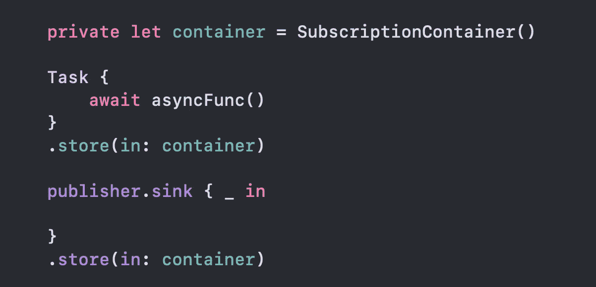

# 如何不疯狂地使用各种框架编写 iOS 异步代码

> 原文：<https://betterprogramming.pub/how-not-to-go-crazy-writing-ios-asynchronous-code-1afe6aa8fecf>

## 组合、异步/等待等等

在使用现代移动应用程序时，我们经常使用异步代码，这非常棘手。

Swift 团队成员尽最大努力让我们的生活更轻松；因此，自 2021 年起，我们可以使用新的基于`[async/await](https://developer.apple.com/news/?id=2o3euotz)` [的并发](https://developer.apple.com/news/?id=2o3euotz)。如果我们没有另一个不太老的工具，这就不是 iOS 编程了。

因此，我们将[联合收割机](https://developer.apple.com/documentation/combine)框架打包到我们的武器库中。异步操作和数据流的简单组合对程序员来说是必不可少的，所以在我们听说 Combine 和 Swift Concurrency 正在计划中之前，社区就推出了 [RxSwift](https://github.com/ReactiveX/RxSwift) 。

如您所见，有许多框架可以用于组合并发方法。我们经常最终在一个项目中使用所有这些工具。我的情况也是如此。曾经，我从联合收割机的`Publisher`中接收数据，并在 Swift 的`Task`中执行异步操作。

使用 Combine 时，我们需要持有一个强引用来持续接收`Publisher`的发射。任务完全不同。不管你是否持有参考，它们都会运行。所以，我们需要保留一个，在需要的时候取消一个任务，然后释放它。听起来很熟悉？我打赌是的。

如果你用过 RxSwift，你肯定记得`DisposeBag`。联合收割机使用与`Set<AnyCancallable>`类似的方法。那么，为什么不创造一个袋子来帮助存储任务和可取消的任务呢？

让我们从创建 API 开始，它将允许我们向这样的 sack 添加我们的异步魔术:

既然我们知道了 API 的样子，让我们创建我们可以使用的`SubscriptionContainer`。

这很容易，多亏了`AnyCancellable`行为。根据文档:*一个* `[*AnyCancellable*](https://developer.apple.com/documentation/combine/anycancellable)` *实例在反初始化时自动调用* `[*cancel()*](https://developer.apple.com/documentation/combine/cancellable/cancel())` *。*

用法如下所示:

现在，观察发布者将采取相同的行动，容器释放将取消任务。请注意，编译器使捕获对`self`的强引用变得容易，因为它是隐式添加的。

在使用上述`SubscriptionContainer`的同时，考虑弱攻`self`。

自然，扩展它以存储 RxSwift 订阅可以很容易地添加。