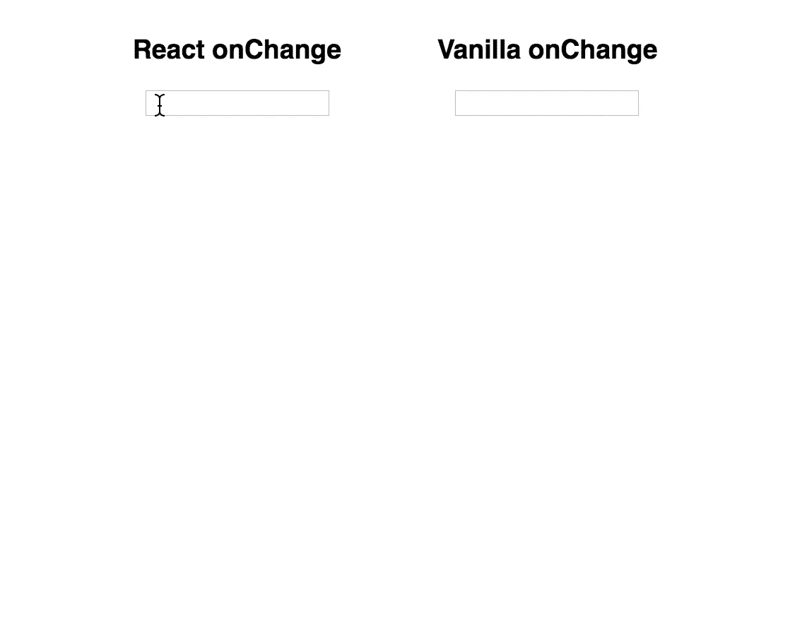
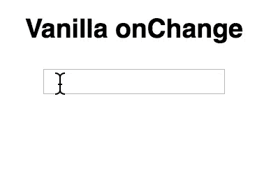
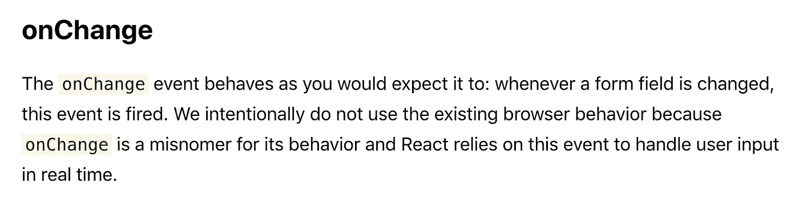
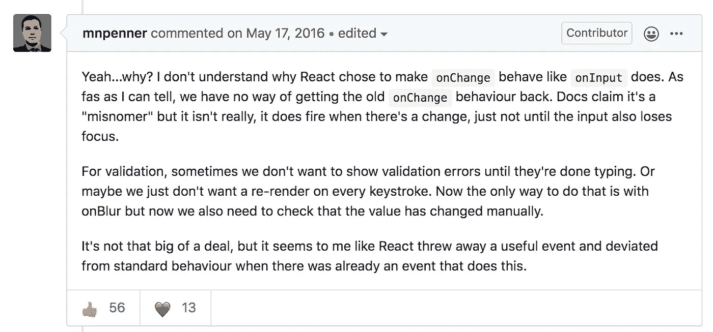
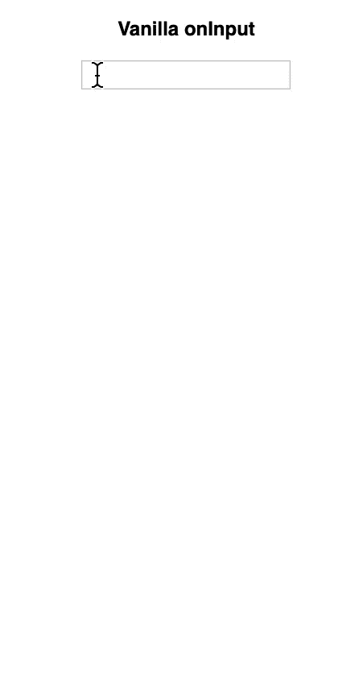

# React 和普通 JavaScript 在 onChange 上的区别

> 原文：<https://betterprogramming.pub/how-onchange-differs-between-react-and-vanilla-javascript-90b56d6a340a>

## 重要的区别，这样你就不会在你的应用中引入错误


照片由 [Franck V.](https://unsplash.com/@franckinjapan?utm_source=unsplash&utm_medium=referral&utm_content=creditCopyText) 在 [Unsplash](https://unsplash.com/s/photos/differences?utm_source=unsplash&utm_medium=referral&utm_content=creditCopyText) 上拍摄

许多人在他们的项目中使用 React。它是世界上最流行和最著名的 JavaScript 框架之一，我认为它的声誉至少还会持续几年。

但是世界上没有完美，不管它是什么。React 也是那些不完美的产品之一。意思是，React 是基于 JavaScript 的。因此，它支持 JavaScript 中几乎所有的特性。

但是，我在 React 里发现了一件相当诡异的事情，让我思考:“为什么会这样？”这就是我在这篇帖子里要讲的——`onChange`，JavaScript DOM 事件方法。

# 阅读前

1.  您应该知道 React 以及如何用 JavaScript 处理事件处理程序。如果你不太了解它们，请先阅读相关文档。
2.  对于一些人来说，这可能是一个太容易的话题。但是，对于 React、Vue 或其他 JavaScript 框架是他们使用名为 JavaScript 的武器的第一个战场的人来说，比如初级 web 开发人员(有时也包括高级开发人员)，这可能是一个非常有趣的话题。

# 如何将事件处理程序挂在 React JSX 元素上

首先，让我们看看如何处理输入标签上的事件处理程序。通常，在 React 中，您可以使用`onChange`来检测用户键盘交互。

```
<input type="text" onChange={e => {
  cb(e.target.value);
}} />
```

这很简单。`onChange`给了你一个`Event`对象，它包含了`target`对象，你可以用它来获得输入值。您需要注册处理数据的回调函数。

那么，香草 JS 怎么样？

如您所见，事件回调已经通过`addEventListener`注册。

# 有什么不同？

主要区别是他们的结果不同。看看这个。



React 的`onChange`会持续跟踪每一次击键的每一个输入值，而 Vanilla 的`onChange`则不能。更奇怪的是，它甚至不能捕捉任何击键。

下面的方法都不会有所不同。

对此我满脑子都是好奇。所以，我读了 MDN 的文件。它告诉我:

> "当元素在其值被更改但未提交后失去焦点时."



最后，在我单击不同的 DOM 元素后检测到该值，这意味着输入失去焦点。但是，为什么这与 React 不同呢？

# React 已经解释了这一点

我当时想:“哦，真的吗？”当我注意到 React 已经在他们的官方文档页面上提到了这一点。



[https://reactjs.org/docs/dom-elements.html#onchange](https://reactjs.org/docs/dom-elements.html#onchange)

据此，React 开发者认为 Vanilla JavaScript 的`onChange`并不是人们对其命名所期望的最佳名称。因为人们可能期望`onChange`应该检测输入的每一个变化。

但是，我觉得好像少了点什么。感觉什么都没了。然后，我在 GitHub 上找到了一个我觉得描述了我的意思的评论。



这个密码就是他的意思。

这个看起来挺乱的，没必要吧？但是我们有更好更简洁的方法吗？

遗憾的是，没有。因为 React 已经覆盖了原来的`onChange`，所以在普通 JavaScript 中使用`onChange`的唯一方法是通过使用`addEventListener`绑定回调函数，或者将其直接绑定到元素。

# 香草可以像 React 一样工作吗？

是的，绝对的。这其实是极其容易的。你需要做的就是用`onInput`代替`onChange`。

```
input.addEventListener('input', yourCallback);<Or>input.oninput = yourCallback;
```



正如您所猜测的，普通 JavaScript 中的`onInput`与 React 中的`onChange`工作原理相同。W3Schools 对`onInput`和`onChange`的区别描述如下。

> 不同之处在于 onInput 事件在元素的值更改后立即发生，而 onChange 事件在内容更改后元素失去焦点时发生。
> 
> 另一个区别是 onChange 事件也作用于<select>元素。</select>

# 结论

React 已经覆盖了 Vanilla JavaScript 的`onChange`事件方法，所以如果您像 React 那样使用`onChange`,就不能期望 Vanilla 会有同样的行为。但是，我不知道 React 所决定的是否可怕。

我想，大多数时候，你不需要香草味的`onChange`。但是如果你知道它们有什么不同就好了——也许对准备工作面试也有好处。

这里有一个简短的对比例子，说明`onChange`和`onInput`在 React 和 Vanilla 上的区别。

# 资源

*   [onChange — MDN](https://developer.mozilla.org/en-US/docs/Web/API/HTMLElement/change_event)
*   [React 文档中的 DOM 元素](https://reactjs.org/docs/dom-elements.html#onchange)
*   [记录 React 的 onChange 与 onInput 的关系](https://github.com/facebook/react/issues/3964#)
*   [onInput — W3Schools](https://www.w3schools.com/jsref/event_oninput.asp)