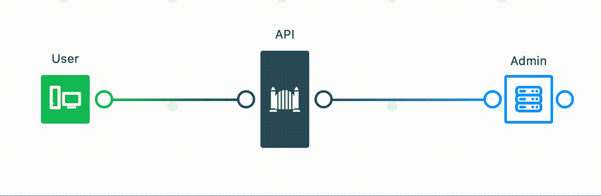
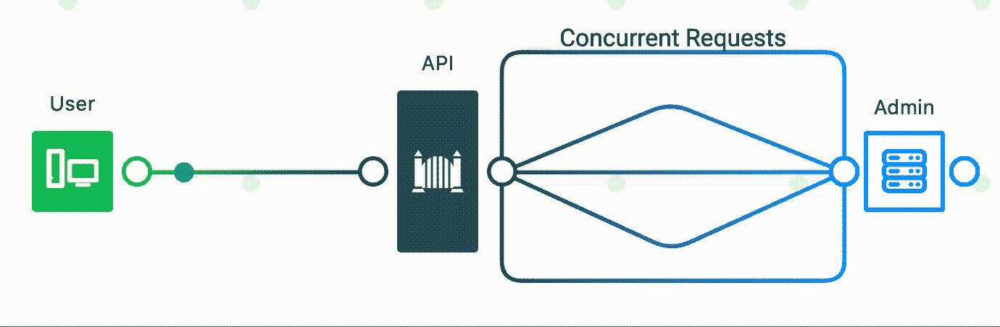
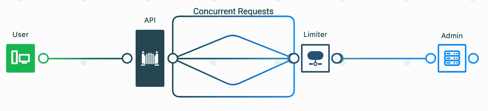

# 一个流氓用户是如何破坏我们的 API 的

> 原文：<https://betterprogramming.pub/how-one-rogue-user-took-down-our-api-aa44c976b3a5>

## 以及如何防止它发生在你身上


乌萨马·阿扎姆在 [Unsplash](https://unsplash.com?utm_source=medium&utm_medium=referral) 上的照片

那是 12 月一个阴沉的早晨的凌晨 1 点，在假期代码冻结的前夕，我的团队收到了这一页。我们收到警报，我们的 CDN 产品的 API 正在经历一次影响我们所有用户的部分中断。

如果你是一名软件工程师，阅读这段介绍可能会让你心悸。你不是唯一一个。

对于任何不知道的读者来说，CDN 代表[内容交付网络](https://en.wikipedia.org/wiki/Content_delivery_network)，它们对电子商务至关重要。它们允许网站缓存频繁访问的资产，如图片、视频或 JavaScript 文件，以提高网站的性能并避免停机。

像亚马逊[这样的网站每分钟都会损失几十万美元](https://www.upguard.com/blog/the-cost-of-downtime-at-the-worlds-biggest-online-retailer)它的不可用，在假日季节损失甚至更多。作为一家 CDN 提供商，我们的客户依靠我们的产品取得成功。

听说我们的 API 在假期开始前几乎无法使用，这是一个值得关注的问题。我们心跳加速，深吸一口气，开始工作。


由 [Max Duzij](https://unsplash.com/@max_duz?utm_source=medium&utm_medium=referral) 在 [Unsplash](https://unsplash.com?utm_source=medium&utm_medium=referral) 上拍摄的照片

带着布满血丝的眼睛和双份浓缩咖啡，我们开始调查我们的 API 灾难从何而来。我们注意到的第一件事是错误源自清除端点。这个端点允许我们的用户从他们的 CDN 缓存中刷新任何和所有项目。

在正常情况下，该端点会收到大量流量。然而，这天晚上，交通流量激增。但是最可怕和有趣的是，几乎所有的 API 请求都来自同一个用户。他们是零号病人。

但是，正如你将会看到的，这并不像指责这个流氓用户并宣称他们是我们所有麻烦的根源那么简单。事实上，他们仅仅是局势失控的催化剂。

真正的罪魁祸首是我们对用户的假设。为了真正理解我的团队是如何陷入这种境地的，了解我们的 API 是如何设计和构建的非常重要。

# 我们如何构建 API

通常，如果用户希望定期更新其 CDN 中的项目，他们会为其缓存设置一个短的到期时间或[**【TTL】**](https://www.cloudflare.com/learning/cdn/glossary/time-to-live-ttl/)**。但是有时用户需要立即清除他们的陈旧资产。这就是这个端点的目的。**

**CDN 的设置类似于文件系统，所以我们的 API 接受了一组将被清除的文件路径。例如:**

```
[
  "/assets/javascript/app.js",
  "/assets/stylesheets/main.css",
  "/assets/images/cat.jpg"
]
```

**然后，我们的 API 会将这个请求向下游转发给执行实际清除的 CDN 管理服务。**

****

**图片来源:作者—用[系统化器](https://honzaap.github.io/Systemizer/)制作的图表**

**不幸的是，我们的管理服务一次只接受一个文件路径。因此，对于用户想要清除的每个文件，我们会向管理服务发出一个单独的请求。**

**正如您所猜测的，为每个文件发出一个单独的请求不是很有效。如果用户想要刷新数千个文件，就会产生数千个请求。使用并发性有助于解决延迟问题，但是多线程也有它自己的问题。**

**幸运的是，管理服务支持指定一个目录，并使用一个`*`通配符递归地清除该目录下的所有文件。因此，用户可以用以下内容替换上面的示例请求:**

```
[
  “/assets/*”
]
```

**这项功能对所有参与者来说都是双赢的。通配符使我们的 API 更加高效、高性能和用户友好。它减少了我们向管理服务发出的请求数量。**

**在发布时，该 API 大受欢迎。我们的用户对它很满意，尤其是 Purge endpoint，它有很多用处。虽然使用是可管理的，但我们确保我们的 API 和下游服务都有适当的速率限制，以便在出现流量高峰时进行节流。**

**幸运的是，由于通配符特性和刷新 CDN 缓存不经常发生的事实，速率限制很少生效。我们的大多数用户都遵循了预测的使用模式。**

**大多数，但不是全部。**

# **找到根本原因**

**事实上，我们知道是一个用户产生了所有的流量，这就更容易找到问题的根源。当我们调查他们提出的请求时，我们很快意识到了这个问题。我们在设计设想中犯了一个严重的错误。**

**和大多数 API 一样，我们的 API 遵循幂律分布。这意味着我们的绝大多数用户几乎没有接触过它或随便使用它。这些是我们为其量身定制的用户。**

**然而，我们忽略了一小部分用户。超级用户。这些人在短时间内连续不断地说了很多 API。**

**虽然超级用户本身不是问题，但这个有问题的用户没有注意到通配符特性。他们在每个请求中包含了数千个文件，这导致我们的 API 产生并触发了数千个并发请求。他们每分钟都会发送几次这样的请求。**

****

**图片来源:作者—用[系统化器](https://honzaap.github.io/Systemizer/)制作的图表**

**还记得我说过的*“多线程会带来一系列的问题吗？”*其中一个问题是洪水泛滥、狗群堆积，对我们来说，还有不堪重负的下游服务。我们的 API 是 HTTP 请求的加特林枪。当我们检查我们的日志，发现几乎所有对管理服务的调用都因 [429 太多请求](https://developer.mozilla.org/en-US/docs/Web/HTTP/Status/429)错误而失败时，这一点得到了证实。**

**需要注意的一点是，CDN 管理服务负责所有的管理任务，而不仅仅是刷新缓存。因此，当管理员的速率限制被触发时，所有的管理操作都将失败。这将导致所有端点都失败。一个[吵闹邻居](https://en.wikipedia.org/wiki/Cloud_computing_issues#Performance_interference_and_noisy_neighbors)的缩影。**

**之所以不是完全中断，是因为一旦速率限制窗口到期，一些请求将会成功，直到速率限制不可避免地再次被触发。**

**但这种情况很快就会改变。**

# **越来越糟**

**队员们暂时松了一口气。我们已经发现了问题。但这只是成功的一半。**

**距离代码冻结只有几个小时了，这意味着我们只有几个小时的时间来尽快安装补丁，否则又会增加一层繁琐的程序。与此同时，我们不想胡乱拼凑一个不成熟的解决方案，那只会让情况变得更糟。所以我们开始讨论我们的选择。**

**但我们的手很快被迫。**

**我们不知道的是，CDN 管理服务经历了一段非常糟糕的时期。它没有准备好处理我们发送给他们的爆炸性流量，我们正徘徊在他们自己完全中断的边缘。我们的 API 服务无意中变成了一个攻击媒介，并在我们的道路上做任何事情。**

****

**照片由 [Unsplash](https://unsplash.com?utm_source=medium&utm_medium=referral) 上的 [israel palacio](https://unsplash.com/@othentikisra?utm_source=medium&utm_medium=referral) 拍摄**

**看不到任何结束迹象，负责管理服务的团队做了他们认为最好的选择:他们撤销了我们的 API 令牌。**

**这有两个立竿见影的效果。它切断了我们对他们服务的访问，从而修复了他们的中断。但这也将我们服务最初的部分中断变成了全面的全球中断，因为现在*我们所有的 API 请求都开始失败。***

# **灾难恢复**

**没过多久，用户投诉就来了，状态页面也更新了，提醒用户注意这种情况。当团队意识到我们的情况恶化时，我们立即进入灾难恢复模式。**

**我们做的第一件事是为管理服务创建一个新的 API 令牌，并更新我们的部署配置。**

**但是有一个问题:这个新的 API 令牌的速率限制比以前的低。就在片刻之前，我们又开始看到**太多请求**错误。**

****

**照片由[大卫·普帕扎](https://unsplash.com/@dav420?utm_source=medium&utm_medium=referral)在 [Unsplash](https://unsplash.com?utm_source=medium&utm_medium=referral) 上拍摄**

**所以我们做的是撤销一些我们自己的。我们暂时将这个令人讨厌的用户从我们的 API 中列入黑名单。虽然这不是一个理想的解决方案，但它是目前最快、最简单的解决方案——尤其是在我们面临代码冻结的情况下。但是我们不想让用户陷入困境，所以我们的支持团队就如何绕过临时禁令展开了讨论。**

**但最后，成功了。**

**黑名单平息了我们的停电。我们的指标很快恢复正常，我们看到所有的清除请求都进入了正常的节奏。我们松了一口气。**

**我们也知道这个补丁不是永久的。我们需要一个长期的解决方案。整晚我们第一次有时间停下来思考。我们意识到我们还有时间做一个永久性的修复。**

**经过深思熟虑，我们的一个团队成员专门为清除端点设计了一个定制的客户端速率限制器。它限制了可以创建的线程和请求的数量。即使用户没有超出我们外部 API 的速率限制，如果他们的请求超过了下游的速率限制，他们也会受到限制。**

**它的限速器会一路减速。**

****

**图片来源:作者—用[系统化器](https://honzaap.github.io/Systemizer/)制作的图表**

**经过一些健全的检查和测试，它上线了。**

**有了这个补丁，我们能够恢复曾经的流氓用户的 API 特权，就到此为止了。我们都确保第二天休假。**

**这样就结束了一个流氓用户如何拿走我们的 API 的故事。天哪，它给了我一些有价值的教训。**

**每当您构建一个 API 时，您通常会在头脑中有一个用户将如何使用您的 API 的特定用例。这就是我们所说的“快乐之路”**

**当你设计你的 API 时，记住这条快乐的道路，你将最终忽略发展的边缘情况。**

**一个开发团队不可能找出你的服务中所有不同的错误，但是成千上万的用户可以。只需要一个人利用弱点。虽然我们热情的用户是导致龙卷风的蝴蝶翅膀，但它是由我们自己的坏假设帮助和教唆的。**

**幸运的是，有一些策略和工具可以用来缓解这些情况。如果你幸运的话，你有一个致力于捕捉 bug 的质量保证团队。你听说过[一个 QA 测试员走进酒吧](https://jokes.one/joke/a-qa-tester-walks-into-a-bar-and-orders-a-beer)的故事吗？**

**即使你有一个 QA 团队——尤其是如果你没有——自动化加载、端到端和模糊测试也将有助于捕捉那些棘手的 bug。我会推荐阅读马丁·福勒关于 [*实战测试金字塔*](https://martinfowler.com/articles/practical-test-pyramid.html) *的文章。***

**最后，API 就像电锯一样。它们是旨在增强用户能力的强大工具。但是这种力量需要有必要的安全措施。如果没有它们，你的用户可能会对他们自己和你造成不必要的伤害。**

**[*订阅我的个人资料*](https://medium.com/subscribe/@SunnyB) *如果你想在我上传新故事时得到通知。***