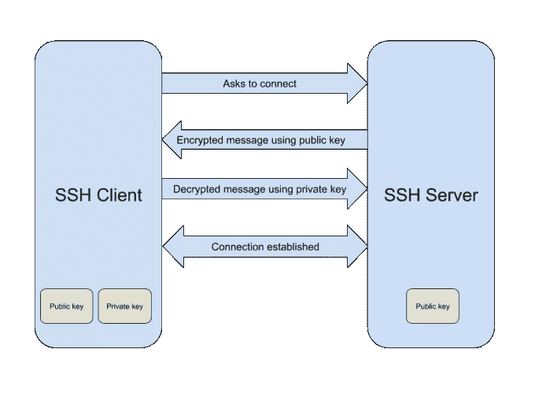

# 无密码 SSH 登录的工作原理

> 原文：<https://betterprogramming.pub/how-passwordless-ssh-login-works-711cb9af235>

## 安全是我的激情


本·加勒特在 [Unsplash](https://unsplash.com/s/photos/gate?utm_source=unsplash&utm_medium=referral&utm_content=creditCopyText) 上的照片

[SSH](https://www.ssh.com/ssh/) (安全外壳)是一个用于远程管理 Linux 系统的协议。显然，它是安全的，但是如果我告诉你，你可以通过禁用密码使它更加安全呢？

# 无密码？

是的，你没听错:无密码。使用它，您可以运行:

```
user@client:$ ssh user@server
// connecting
[user@server](https://everyday.codes/cdn-cgi/l/email-protection):$
```

当然，这很方便。但这不仅仅是为了方便和安全:一个绝对需要它的任务是自动化。如果您想要您的脚本(部署、维护等。)要执行任何与 SSH 相关的任务，您需要启用它。

但是你可能想知道它怎么可能是安全的。没有什么比一个长密码更能保护你了？理论上，是的。在实际操作中，真的很容易泄露密码，忘记密码，在其他地方使用密码，或者使用容易被黑客攻击的常用密码。

而无密码则可以免疫各种攻击，只要你自己的系统没有被攻破或者你的攻击者没有量子计算机。公平地说，当我们得到量子计算机时，没有什么是安全的，所以让我们暂时忽略它。

# 它是如何工作的？

首先，你必须理解什么是公钥/私钥。私钥是非常长的随机位流(最常用的是 2，048 位)。私钥是保密的，永远不会离开客户端(您的 PC)。公钥是另一种比特流，它是私钥的派生物。也就是说，您可以从私钥生成唯一的公钥，但不能从公钥获得私钥:这是一个单向过程。

把它想象成人类的指纹。指纹可以用来(在某种程度上)唯一地识别人类，但是你不能仅仅根据他们的指纹来再造一个人。因此，您的公钥对每个人都可用，并且存储在客户机和服务器上。

但是，你为什么需要这双鞋呢？我不会在这里讨论高等数学，也没有必要。不过，你需要明白的是，这些配对有一个独特的特征。使用公钥，您可以加密(或签名)任何消息，只有使用私钥才能解密。换句话说，任何拥有你的公钥的人都可以给你发送只有你能阅读的加密信息。

听起来很酷，不是吗？而且，不限于 SSH。这一原则在我们周围的许多应用中使用，包括 HTTPS、FTPS、PGP(电子邮件加密)和许多其他应用。

因此，如果 SSH 服务器保存了您的公钥(这很重要)，它可以像这样认证您:

1.  使用您的公钥加密消息，并将其发送给客户端。
2.  客户端使用自己的私钥解密消息，并将其发送回去。
3.  服务器确保消息被正确解密，如果是，则验证用户。



图片由作者提供

最终，您仍然使用一个密码，只是一个更复杂的密码(稍后会详细介绍)。

# 如何设置无密码 SSH

首先，您必须创建一个公钥/私钥对。在我们这样做之前，让我们首先确保您没有覆盖任何现有的。

```
$ ls ~/.ssh
```

如果在输出中看到任何`id_rsa.pub`文件，跳到下一步。如果没有，或者如果您看到一个错误，您将需要生成一个密钥对。为此，请运行:

```
$ ssh-keygen
```

根据您的发行版，这个工具可能包含也可能不包含。如果没有，就用你选择的软件包管理器来安装它。`ssh-keygen`会问你一些事情:

*   要保存的文件名—保留默认值。
*   密码短语—这可用于通过密码保护私钥。这将帮助您以便利和自动化为代价实现最高的安全性。留空表示无密码，或输入一个密码。

完成后，您的公钥将保存在`~/.ssh/id_rsa.pub`中，您可以继续下一步。

# 将公钥复制到 SSH 服务器

这里有许多方法。最简单的方法是使用`ssh-copy-id`工具。如果没有安装，使用您选择的软件包管理器安装它，或者继续第二种方法。一旦可用，您可以像这样使用该工具:

```
$ ssh-copy-id -i ~/.ssh/id_rsa.pub user@server
```

分别用用户名和主机替换`user`和`server`。然后会提示您在服务器上输入密码，就像常规的 SSH 连接一样。完成后，该工具会将您的公钥复制到服务器，SSH 无密码认证现在可以工作了！

如果您的系统上没有`ssh-copy-id`,还有另一种方法，只使用内置命令。首先，确保服务器上存在`.ssh`文件夹:

```
$ ssh user@server mkdir -p .ssh
```

这将在远程服务器上执行`mkdir -p .ssh`。`-p` argument 的意思是如果不存在就去创造，这正是我们想要的。创建文件夹后，您可以像这样上传您的密钥:

```
$ cat ~/.ssh/id_rsa.pub | ssh user@server 'cat >> .ssh/authorized_keys'
```

这个命令将获取`~/.ssh/id_rsa.pub`的内容，并通过管道将它们发送到在服务器上执行的命令`cat >> .ssh/authorized_keys`。在其中，`cat`将把密钥转发给`.ssh/authorized_keys`文件。如果不存在，将创建它，如果存在，将在它后面追加一行。就是它了——您现在可以开始使用无密码 SSH 登录了！

# 禁用密码登录

尽管您已经启用了无密码登录，但仍然不安全。为了真正安全，您需要完全禁用密码登录。

小心行事。如果禁用密码并丢失私钥，您将无法登录。一个好的做法是打印出您的私钥，并将其存储在某个安全的地方。

为此，打开并编辑`/etc/ssh/sshd_config`,并进行以下更改:

```
ChallengeResponseAuthentication no
```

这将禁用质询响应。

```
PasswordAuthentication no
```

这将禁用密码。

```
UsePAM no
```

这将禁用 PAM(可插拔身份验证模块)。

```
PermitRootLogin no
```

这将禁止以`root`身份登录(确保您在`sudoers`组中！)

完成后，通过运行以下命令重新加载配置:

```
$ systemctl reload ssh
```

如果不起作用，用`sshd`替换`ssh`(在 CentOS/RHEL/Fedora 上)。就是这样，您的 SSH 连接非常安全！

# 结束语

感谢您的阅读，希望您喜欢这篇文章。

# 资源

*   `man ssh`
*   [深入探讨端到端加密](https://ssd.eff.org/en/module/deep-dive-end-end-encryption-how-do-public-key-encryption-systems-work)
*   [Linux 中的用户管理讲解](https://levelup.gitconnected.com/user-management-in-linux-explained-825b8a518abc)