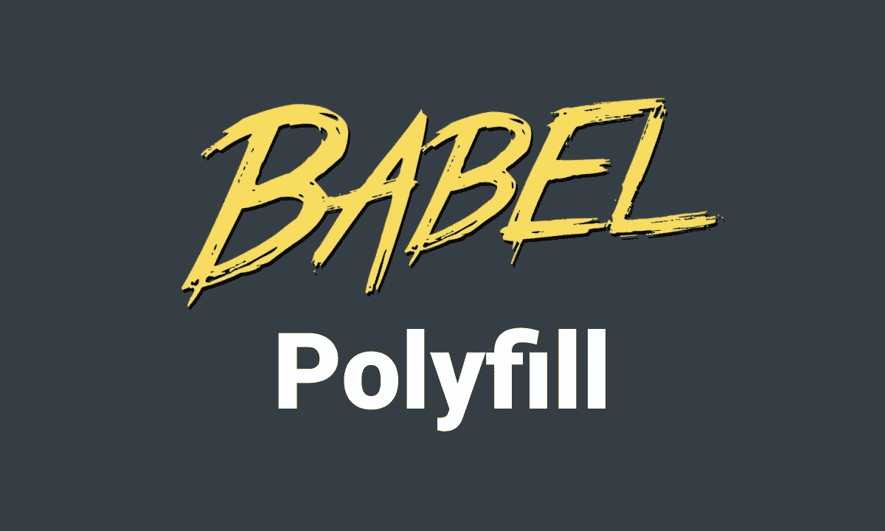
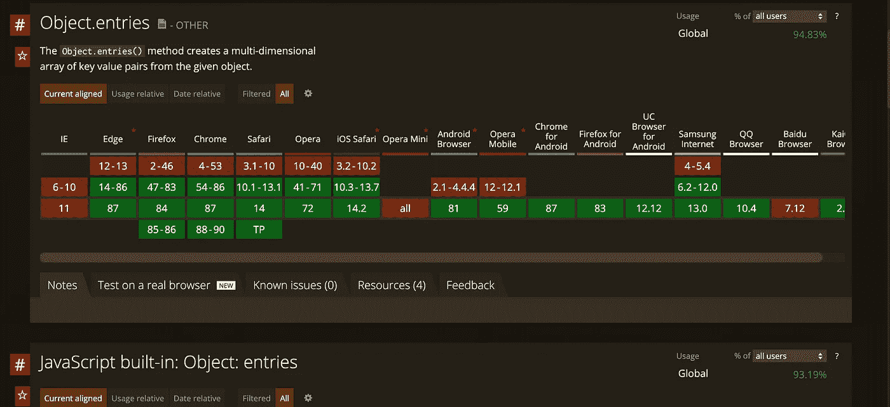

# Polyfill 如何在巴别塔中工作

> 原文：<https://betterprogramming.pub/how-polyfill-works-in-babel-b8cfbbc8351f>

## 了解 polyfill 如何在您的 Babel 配置中工作



巴别塔和波利菲尔

在前端开发中，Babel 和 polyfill 已经不可或缺。然而，有些人认为它们是黑箱化的象征，很难知道它们在构建过程中是如何工作的，以及它们之间的差异。

在这篇文章中，我将带你了解 polyfill 在巴别塔结构中是如何工作的。

# 回购示例

下面是 GitHub 上的示例代码库:

[](https://github.com/manakuro/babel-polyfill-example) [## mana kuro/babel-poly fill-示例

### 此时您不能执行该操作。您已使用另一个标签页或窗口登录。您已在另一个选项卡中注销，或者…

github.com](https://github.com/manakuro/babel-polyfill-example) 

# 属国

我们将在本文中使用这些依赖关系。

*   `@babel/cli@7.12.10`
*   `@babel/core@7.12.10`
*   `@babel/preset-env@7.12.11`
*   `core-js-compat@3.8.1`

# 概观

```
1\. [What's Babel?](#59a5)
2\. [What's a polyfill?](#d0ad)
3\. [What are the differences between Babel and a polyfill?](#6117)
4\. [The process of injecting a polyfill in Babel](#a759)
5\. [Does Babel handle all polyfills?](#45d3)
6\. [Why does IE11 crash in your app?](#065d)
7\. [Conclusion](#1f36)
```

# 巴别塔是什么？

Babel 是一个工具，可以将现代 JavaScript 的语法(ECMAScript 2015 和更高版本)转换为 IE 等旧浏览器的兼容版本(ES5)。

巴别塔基本可以处理这些事情:

*   将语法转换成 ES5
*   将聚合填充特征自动注入代码
*   传输文件打字稿
*   更多

所以当你写 ES6+代码的时候:

```
const test = [1,2,3,4,5]test.map(t => t * 2)
```

巴别塔是这样转换语法的:

你可以看到`const`被转换为`var`，箭头函数被转换为`function`语句。

这就是为什么我们可以在我们的代码库中使用任何现代 JavaScript。

# **什么是聚合填充物？**

一个 *polyfill* 是一段代码，它允许你在不支持现代 Web APIs 功能的旧浏览器上使用这种功能。

下面举个例子:`Object.entries`在 IE11 和其他浏览器中不可用。



因此可以使用 polyfill 来提供允许这些浏览器中的功能的代码片段[。](https://github.com/es-shims/Object.entries/blob/main/implementation.js)

用于`Object.entries`的实际代码如下:

对象.条目

基本上，如果你想包含一个多填充特征，你必须手动添加片段或使用 [Polyfill.io](https://polyfill.io/v3/) ，它自动包含用户访问的给定浏览器中所需的所有多填充。

# 巴别塔和聚划算有什么区别？

为了避免混淆，让我们弄清楚 Babel 和 polyfills 各自可以涵盖哪些内容。

Babel 唯一能做的就是把 ES6+语法转换成 ES5，如果没有任何插件的话。

polyfills 能做的就是注入一段代码来支持 web APIs。

如果您在脚本中编写`Object.entries`并将其转换，您将看到结果:

```
"use strict";var test = [1, 2, 3, 4, 5];Object.entries([]);
```

你可以看到`Object.entries`没有被转换。

它需要被填充，因为它不是一个语法，而是一个 API。如果 IE11 继续这样下去，你会遇到一个错误说`Object doesn't support property or method 'entries'`。

为了避免这种情况，您必须包含一个聚合填充，如下所示:

在运行`Object.entries`之前，聚合填充覆盖了特征。

所以无论你使用的是语法还是 API 都是 Babel 和 polyfills 的区别。

# 在巴别塔中注入聚合填料的过程

我说过，Babel 可以用来把 ES6+代码转换成 ES5。

除此之外，Babal 还可用于在转化过程中注入聚合填料。

这就是巴别塔如何添加聚合填料:

1.  搜索目标浏览器。
2.  将目标浏览器映射到[核心 js](https://www.npmjs.com/package/core-js?activeTab=versions) 。
3.  注射聚合填充物。

## 搜索目标浏览器

首先，Babel 寻找需要填充在配置文件中的目标浏览器，如`.babelrc`、`.babelrc.json`、`package.json`或`babel.config.js`。

所以如果你支持 IE11，你得这样写:

. babelrc.json

`useBuiltIns: usage`是一个选项，允许根据项目中使用的文件注入聚合填充。

## 将目标浏览器映射到核心 js

core-js 是一个提供一组多填充特性的库。

Babel 使用 [core-js-compact](https://github.com/zloirock/core-js/tree/v3.8.1/packages/core-js-compat) 并将其映射到目标浏览器，以便提供必要的 polyfill 特性。

所以当你瞄准 IE11 时，它会映射 IE11 并提供 IE11 不支持的 polyfill 代码。

## 注射聚合填充物

最后，Babel 根据映射注入一个 polyfill。

让我们来看一些例子。

如果你的目标是 IE11 并使用 core-js@3，你需要把它写在`.babelrc`中:

像这样转换代码:

```
const test = [1,2,3,4,5]Object.entries(test)
```

你会看到结果:

可以发现那里收录了`Object.entries`的片段。

如果你的目标是最新的 Chrome 版本…

…您将看到输出中没有聚合填充代码:

这是因为 Chrome 原生支持`Object.entries`。不需要多填。

# Babel 处理所有聚合填充吗？

Babel 并没有涵盖所有的 polyfills。

Babel 基本上支持目前的 ECMAScript 和 Web APIs 的部分内容。

事实上，core-js 在文件[中说:](https://github.com/zloirock/core-js)

> “JavaScript 的模块化标准库。包括对 2021 年前[ECMAScript](https://github.com/zloirock/core-js#ecmascript):[承诺](https://github.com/zloirock/core-js#ecmascript-promise)，[符号](https://github.com/zloirock/core-js#ecmascript-symbol)，[集合](https://github.com/zloirock/core-js#ecmascript-collections)，迭代器，[类型化数组](https://github.com/zloirock/core-js#ecmascript-typed-arrays)，许多其他特性， [ECMAScript 提案](https://github.com/zloirock/core-js#ecmascript-proposals)，[一些跨平台 WHATWG / W3C 特性和提案](https://github.com/zloirock/core-js#web-standards)如`[URL](https://github.com/zloirock/core-js#url-and-urlsearchparams)`。您可以只加载必需的功能，也可以在不污染全局命名空间的情况下使用它。

因此，如果您想使用最新的 Web APIs 之一，如[交叉点观察器 API](https://developer.mozilla.org/en-US/docs/Web/API/Intersection_Observer_API) ，您需要手动包含 [polyfill](https://github.com/w3c/IntersectionObserver/tree/master/polyfill) 。

# 为什么 IE11 会在你的 App 里崩溃？

IE11 在你的应用中崩溃的原因是:

*   编译的代码包括 ES6 特性
*   编译的代码没有正确填充

如果您在 IE11 中遇到错误，您需要确保:

*   目标浏览器是正确的
*   core-js 版本是最新的
*   包括必要的多填充物

# 结论

就是这样！我们已经介绍了聚合填充在巴别塔中是如何工作的。

希望对你理解他们有帮助。

[](https://github.com/manakuro/babel-polyfill-example) [## mana kuro/babel-poly fill-示例

### 此时您不能执行该操作。您已使用另一个标签页或窗口登录。您已在另一个选项卡中注销，或者…

github.com](https://github.com/manakuro/babel-polyfill-example)