# 质数如何保证互联网安全

> 原文：<https://betterprogramming.pub/how-prime-numbers-keep-the-internet-secure-680cc1743133>

## 以及为什么没有他们生活会不一样

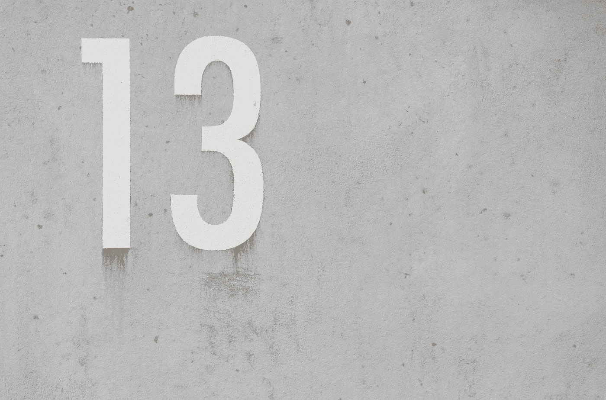

帕斯卡尔·迈耶在 [Unsplash](https://unsplash.com?utm_source=medium&utm_medium=referral) 上的照片

不管你是否知道，你每天都在使用质数。你在浏览器的地址栏中看到那个锁形符号了吗？看起来像这样的那个:


图片来源:作者

那个锁意味着你此刻正在使用质数。那是因为互联网使用质数。事实上，质数已经根深蒂固地融入了我们的日常生活，如果没有它们，世界将会大不相同。我们仍然亲自处理所有的银行业务，用现金购买一切。忘了短信吧，因为我们还是笔友。

那么是什么让质数如此特别呢？

首先，它们是独特的。没有任何数字组合可以相乘得到一个质数。

其次，每个数字都可以分解成它的质数。例如，10 可以分解为:

```
10 = 2 * 5
```

最后，虽然普通人可能无法看到这个数字并立即发现它是否是质数…

```
9307398526401816703683197763617206082269079617576835286211259044095385462270542532346398139788788003092515521098292832872130802035097419307557532476688659
```

… [对电脑来说相对简单。](https://www.wolframalpha.com/input/?i=Is+9307398526401816703683197763617206082269079617576835286211259044095385462270542532346398139788788003092515521098292832872130802035097419307557532476688659+a+prime+number%3F)你可能在过去编写过自己的素性检查器，类似于这个…

…并且知道许多检查质数的传统方法很慢。但是有更先进的方法，如[米勒-拉宾素性测试](https://en.wikipedia.org/wiki/Miller%E2%80%93Rabin_primality_test)，使它非常快。

正是由于所有这些原因，质数是加密的完美工具！


照片由[克里斯·帕纳斯](https://unsplash.com/@chrispanas?utm_source=medium&utm_medium=referral)在 [Unsplash](https://unsplash.com?utm_source=medium&utm_medium=referral) 上拍摄

# 加密

对于那些不知道的人来说，*加密*是将信息转换成不可读格式的行为，称为*密码*。解密是将密码还原成原始信息的相反过程。

换句话说，加密使我们能够保持信息的私密性，防止信息落入那些可能出于恶意目的使用信息的人手中。这就是它成为现代互联网基石的原因。

如果没有加密，我将无法做我在网上做的大多数事情，例如购买食品杂货、偿还债务或给朋友发消息——至少不安全。加密可以防止黑客窃取我的银行信息和窥探我的私人谈话。

不仅仅是互联网使用加密，许多现代设备也使用加密，如电脑、智能手机，甚至智能冰箱。他们都使用加密技术。总之，加密在任何地方都很重要。

但是加密是如何工作的呢？

加密算法使用密钥来加密和解密数据。如何使用这些密钥取决于加密的类型，其中有两种:*对称*和*非对称。*两者都有不同的用例。

## 对称加密

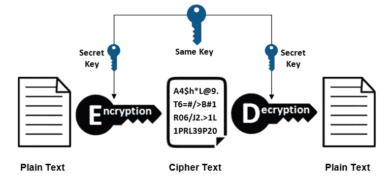

对称加密。图片来源:Ons Jallouli via [研究之门](https://www.researchgate.net/figure/Symmetric-encryption-primitive_fig1_321123382)。

*对称加密*因加密和解密使用相同的密钥而得名。由于加密和解密都使用一个密钥，对称加密非常快，但也很脆弱。密钥必须始终保密，并且只能在可信方之间共享。

因此，对称加密的主要用途之一是保护静态数据的安全。这意味着对计算机、数据库或物联网设备等设备进行加密。如果你还记得发生在苹果和联邦调查局之间的[闹剧——那是一场关于 iPhone 加密的战斗。](https://en.wikipedia.org/wiki/FBI%E2%80%93Apple_encryption_dispute)

虽然对称加密运行良好，但它有一个固有的缺陷。为了让多方通过对称加密进行编码通信，他们必须提前就密钥达成一致。在互联网的环境中，你每天要与世界另一端的数百台服务器通信，这是不可能的。

这就是非对称加密的用武之地。

## 不对称加密

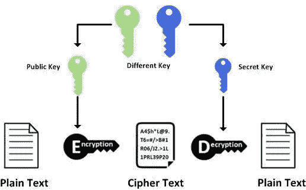

不对称加密。图片来源:Ons Jallouli via[research gate](https://www.researchgate.net/figure/Symmetric-encryption-primitive_fig1_321123382)。

不对称加密使用两个密钥，一个用于加密，一个用于解密。这是因为这些键是相互补充的。当它们一起使用时，它们会互相抵消——就像补色在白色中互相抵消一样。

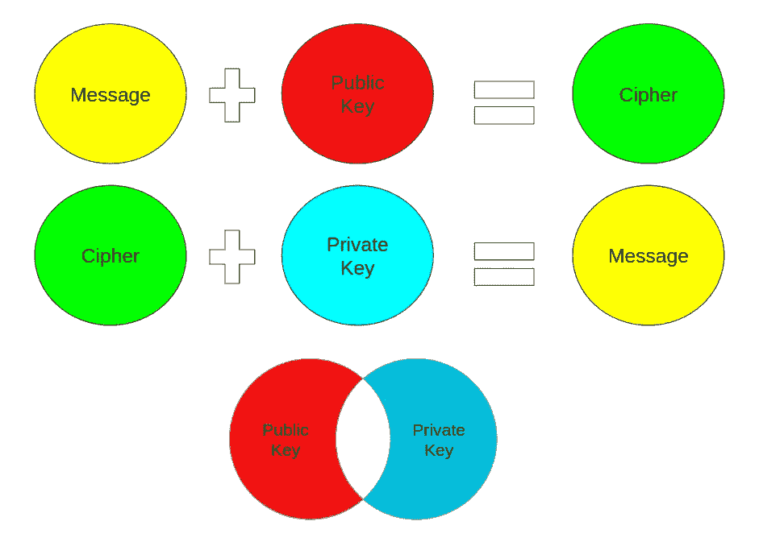

图片来源:作者(更正:密码应该是橙色的)

用于加密的密钥被称为*公钥。*正如你可能猜到的，与任何人共享这个密钥都是安全的。

另一方面，解密密钥被称为*私有密钥*，因为它必须保持私有。只有私钥持有者才能解密用公钥加密的密码。即使恶意用户截取了密文，他们也只会看到乱码。

这使得非对称加密成为共享敏感数据的理想工具。不仅如此，由于私钥应该只由一个实体拥有，所以它也适用于身份验证。这正是它在 [TLS 握手](https://www.thesslstore.com/blog/explaining-ssl-handshake/#the-tls-handshake-authentication)中的用法。

# 活板门

不对称加密如此重要的原因之一是因为它作为 [*陷门函数*](https://en.wikipedia.org/wiki/Trapdoor_function) *工作。*

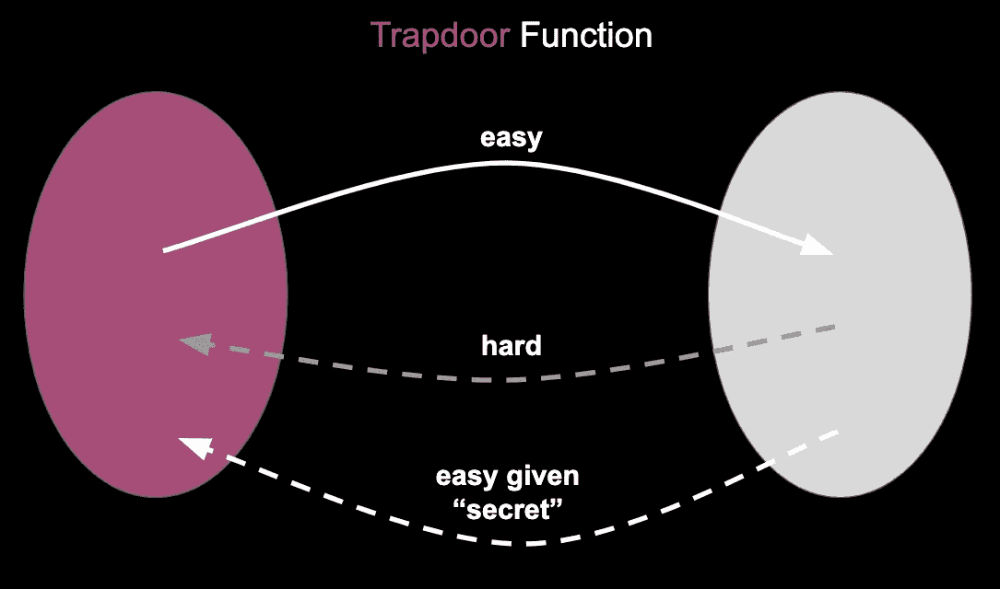

图片来源:作者

这意味着朝一个方向执行非常简单，但很难逆转——除非你有特殊的信息，也就是所谓的*暗门*或*秘密。*

在非对称加密的环境中，加密数据非常简单，但仅使用公钥解密数据却非常困难。有了私钥，事情又变得简单了。

但是并不是所有的非对称加密算法都是一样的。反转陷门函数的费力程度决定了算法的安全性。为了了解非对称加密到底有多安全，让我们探索一下当今最流行的算法之一: [RSA](https://en.wikipedia.org/wiki/RSA_(cryptosystem)) 。

# RSA 加密

RSA 于 1977 年由三位密码学家发明:罗恩·里维斯特、阿迪·萨莫尔和伦纳德·阿德曼——因此得名。自其诞生以来，它已经传播到地球的几乎每一个角落。

如果你曾经使用过[安全外壳(SSH](https://en.wikipedia.org/wiki/Secure_Shell) ) …

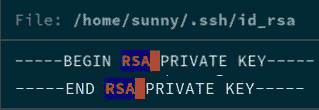

SSH 私有密钥示例。图片鸣谢:作者。

…或者 [GNU 隐私卫士(GPG)](https://en.wikipedia.org/wiki/GNU_Privacy_Guard) …

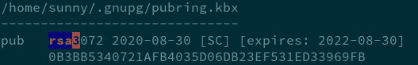

GPG 键示例。图片鸣谢:作者。

…这要感谢 RSA。然而，它最出名的用途是在 [TLS](https://en.wikipedia.org/wiki/Transport_Layer_Security) 和【HTTPS】中防止 [*中间人*](https://en.wikipedia.org/wiki/Man-in-the-middle_attack) 攻击。

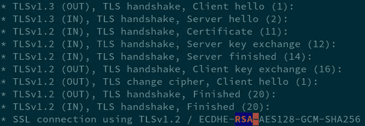

TLS 握手中的 RSA。图片鸣谢:作者。

虽然 RSA 已有近半个世纪的历史，但它是世界上最常用的非对称加密算法之一。它的无处不在证明了它的安全性。

但是为什么这么安全呢？简短的回答:质数。长回答？这需要一些数学知识。但是最好的答案是我们自己尝试打破它。

# 破解 RSA

场景是这样的:我们是试图冒充 Medium 服务器的黑客。我们想拦截所有前往媒体网站的流量，以窃取用户凭证并勒索他们的数据。

使用 Wireshark，我们能够获得 Medium 的 RSA 公钥和网站证书的副本。

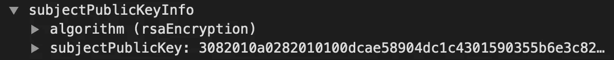

Wireshark 中显示的 Medium 的 RSA 公钥。图片鸣谢:作者。

但是为了冒充 Medium 并欺骗用户连接到我们的钓鱼服务器，我们需要私钥。幸运的是，并没有失去一切。

有一点我没有提到，RSA 密钥只是数字。RSA 私钥只是一个数字，我们称之为 **d** 。公钥由两个数字组成， **e** 和 **N** 。而 **N** 是另外两个数的乘积， **p** 和 **q** 。

我知道，有很多数字要追踪。但我们需要关注的只是最后两个数字， **p** 和 **q** 。因为根据 [RSA 的密钥生成算法](https://en.wikipedia.org/wiki/RSA_(cryptosystem)#Key_generation)，如果我们知道 **e** 、 **p** 和 **q** 、我们就可以重新创建私钥。

“嗯，完美，”有人可能会说。“既然有了公钥，就知道了 **e** 和 **N** 。而既然我们知道了 **N** ，我们只需要把它拆开就可以得到 **p** 和 **q** 。这能有多难？”

没那么快，我刚刚虚构出来问问题的人——**p**和 **q** 是*质数*数。喘息！

我之前提到过，检测生成素数和检查它们是否是素数对于计算机来说相对简单。然而，不简单的是 [*质因数分解*](https://en.wikipedia.org/wiki/Integer_factorization#Prime_decomposition) *。*

你可能会问，有多难？

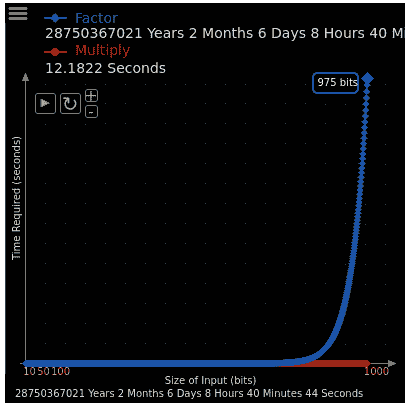

**非常**辛苦。图片鸣谢:作者。

RSA 通常使用 1024、2048 或 4096 位长的数字。正如你在上面的图表中看到的，只需要几秒到几分钟就可以创造出 **N** ，但是要把它分解却需要几百万到几十亿年。

原因是——对于一般的非量子计算机来说——没有快速的方法将一个数分解成它的质数。我们知道的最好的方法之一是[数字字段筛选](https://mathworld.wolfram.com/NumberFieldSieve.html)，但即使这样，对于这样的数字，也需要一段时间:

```
12647218591793774062037539860814590913847656969568852342569985866826731647633698490555162899129013020883082990527279827064849704038819915244363097120031062841681483530795022535252488366169730386558454292994968234214045666016756933262308367238453012386845278265898125397947728757013541963782671274800429212175737617916738370351721854897974375037404102868790995317383226110430324268401945063200233204784127599950729869495397377610047121343931821194220803396259107891220452870079636709770538139479748696178546655932056530040495898965404702415803790560056325250086900175615221136804225865647753477561884491932551643726743
```

虽然这不是不可能的，但努力的程度是天文数字，不值得。等到我们能生成灵媒的私人密钥时，我们早就死了。

长话短说，质数很难破解。这就是他们保持互联网安全的方法。

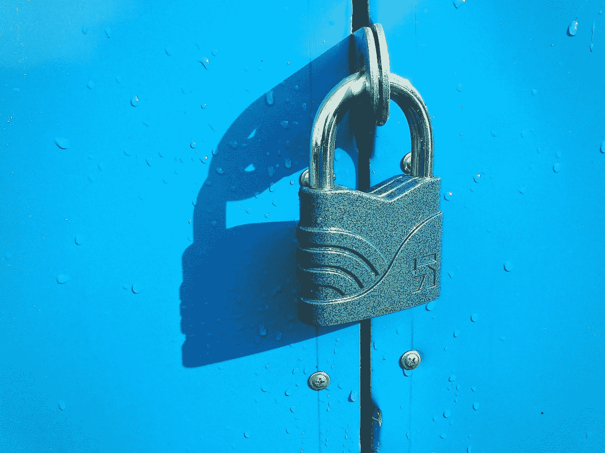

[马克西姆·日古列夫](https://unsplash.com/@jemjoyrussia?utm_source=medium&utm_medium=referral)在 [Unsplash](https://unsplash.com?utm_source=medium&utm_medium=referral) 上的照片

# 离别的思绪

作为一名软件开发人员，我经常被互联网上各种不同的活动部件所吓倒。这感觉像是一个神奇而令人困惑的地方。因此，我通常觉得自己不知道它是如何工作的，也不知道自己在做什么。

但是，每当我对我日常使用的系统有所了解时，这个世界就变得不那么混乱和神奇了。我希望这篇文章也能帮助你揭开互联网的神秘面纱。

如果您想在我上传新故事时得到通知，请订阅我的个人资料。