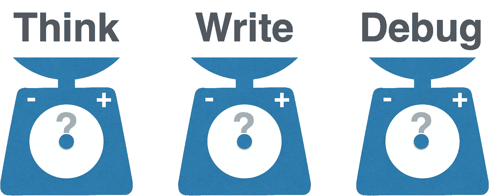
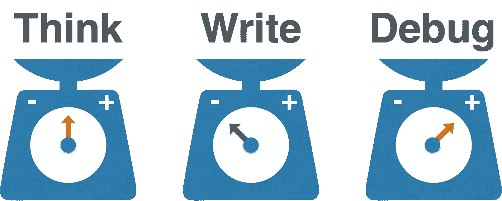
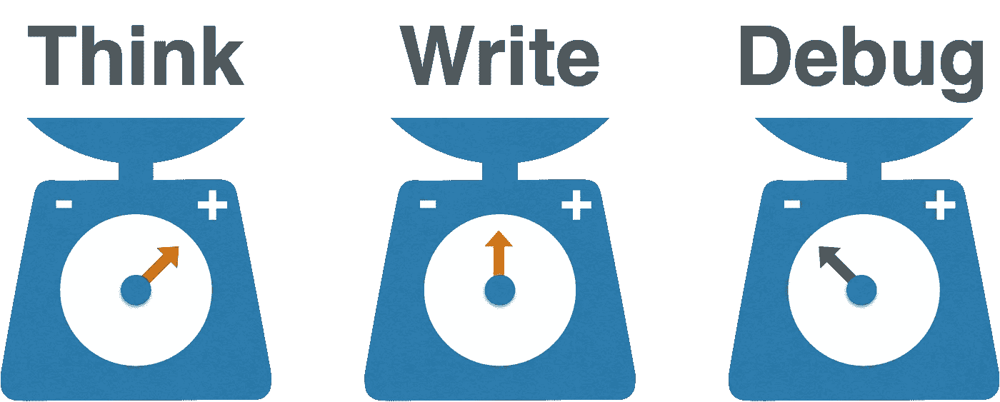

# 程序员如何浪费金钱

> 原文：<https://betterprogramming.pub/how-programmers-waste-time-1efd6427b26e>

## 程序员一意识到这一点就承认了

你认为程序员在哪里花的时间更多？

让我们做一个小练习。假设你是一名程序员，正在开发软件。你认为你在哪里花的时间更多？你会花更多的时间思考吗？你花更多的时间写作吗？或者，你花更多的时间调试？

我在几个观众面前问了好几年，快十年了；答案总是一样的:写作，有时，思考。人们，包括程序员，通常认为他们花更多的时间在写作上。尽管，他们承认他们应该花更多的时间去思考。让我们回顾一下到底发生了什么。

# 典型的程序员

人们通常认为程序员花在写作上的时间更多。很好理解，程序员大部分时间都在屏幕前。但是阅读，不是写作。让我们来看看事实:更快的打字员的速度是每分钟 150 个字，尽管一个中等的打字员每分钟写 35 个字。看起来不算多，但是代码也不会高速增长。一段 400 行的代码可能包含 1000 个单词，需要 30 分钟。写它不是瓶颈。

程序员真的会花很多时间考虑特性。梳理和计划会议是思考的一部分。他们需要正确理解功能，以创建合适的解决方案。程序员还需要检查代码，寻找添加新代码的最佳方式。更重要的是，程序员也在寻找让代码经得起未来考验的最佳方式。

调试是被忽视的一大问题。程序员通常将调试视为编码后的一个步骤，而不是编码的一部分。但是，直到它们按预期工作，功能才算完成。而且调试非常慢。

如果你让任何一个程序员想想花在调试上的时间，他们会意识到这是大部分时间。因此，毫无疑问，程序员花更多的时间调试，一些思考，几乎什么都不写。

大多数程序员是如何浪费时间调试的。

# 敏捷程序员

敏捷方法需要代码的不断变化和更新。程序员不能对代码进行未来验证，因为它违反了简单性原则。程序员还需要增加工作软件的数量，但这意味着对每个变化都要测试。这很耗时。这就是为什么大多数敏捷实践，包括程序员如何工作——而不是 Scrum——也包括测试。

[敏捷](https://www.agilealliance.org/glossary/unit-test)中的测试与瀑布不同。它在编码之前，它是关于功能的，而不是关于代码的。像 TDD 这样的技术是强烈推荐的:因为它们保证了测试的正确质量。正确的测试改变了程序员的工作方式，以及他们规划编码的方式。

写代码比测试花的时间多一点，除了代码，程序员还要写测试。但是它有一个意想不到的优势:[测试就是文档](https://drpicox.medium.com/why-you-should-start-writing-tests-as-they-were-documentation-73a356df3523)。

调试几乎消失。通过测试，程序员不需要打开应用程序并手动运行它。使用小块编码的测试，所有的问题都会在编码时出现，因此，程序员知道失败的确切原因，避免了调试的需要。在最坏的情况下，你可以撤销并[重新考虑一遍](http://wiki.c2.com/?DeveloperTest)。

思考在这里需要很大的努力。很多没有经验的程序员可能会说自动测试需要很多时间，这是对的，但这是因为它迫使你思考。通过适当的测试，您需要在编码之前更好地理解特性，这减少了意外错误的数量，并避免了由于程序员和业务之间的误解而导致的后续返工。

所以是的，对于测试来说，思考占用了大部分时间。但没错，也加快了整体速度。

对于测试，思考需要更多的时间。

# 浪费金钱

调试是浪费钱。这是一种成本效益较低的编程活动:耗时、费力且不可预测。相反，思考是高效的:它减少了交付代码的总时间，并致力于正确完成正确的功能。

如果你看到一个程序员重复运行应用程序，他是在浪费时间。所以如果你想浪费时间，避免做自动测试，或者在程序员已经完成代码之后，在最后做。这是最好的保证，你将结束代码维护成本高，无数的错误和返工。

你的团队在浪费钱吗？尽可能避免手动运行应用程序，并使用代码前测试来更好地思考。