# Python 如何懒惰地评估基于布尔的表达式

> 原文：<https://betterprogramming.pub/how-python-lazily-evaluates-boolean-based-expressions-fc9d55d20d8d>

## 蟒蛇皮下的一瞥

*惰性评估*是许多编程语言在运行时帮助优化性能的一个概念。

在它的核心，惰性计算意味着一个对象在需要的时候被计算，而不是在创建的时候。在 Python 中，惰性求值的一个简洁特性是如何计算基于逻辑运算符的条件。例如，假设我创建了一个名为`boolean_result`的布尔变量，它的值是两个函数的`or`操作符的结果，这两个函数都返回布尔值。

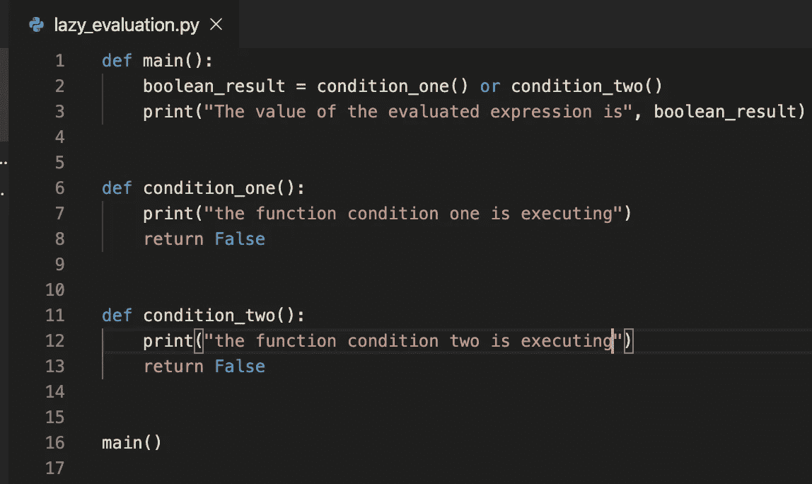

创建一个变量，其值是返回布尔值的两个函数的结果或运算符

如果我运行这个，输出将如下。

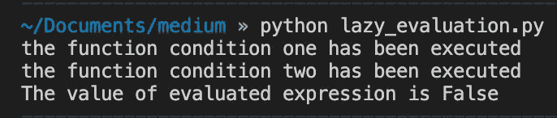

运行前面代码的输出

原因是为了让一个`or`条件计算为`True`,`or`两边的表达式都必须返回`True`。因为函数`condition_one()`返回`False`，所以执行函数`condition_two()`来检查返回什么值。结果，两个函数都被执行，变量`boolean_value`的值为`False`。

现在让我们看看当我们更改第 8 行并使函数`condition_one()`返回`True`时会发生什么。所以如果我们做出改变:

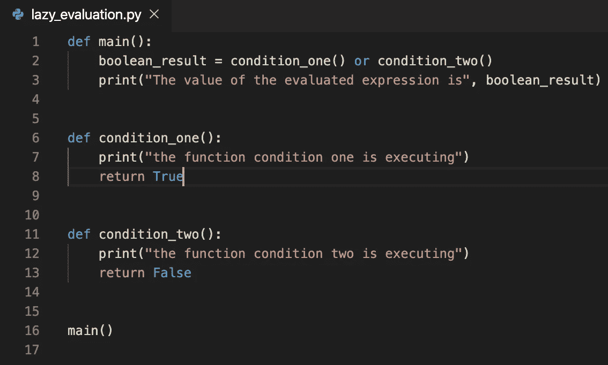

注意 condition_one()中的第 8 行返回 True

运行之后，输出将是:

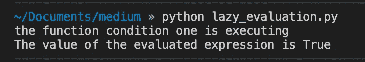

只打印 condition_one()的输出

这很酷，因为只执行了功能`condition_one()`，而没有执行`condition_two()`。发生这种情况是因为函数`condition_one()`返回`True`，并且对于基于`or`的逻辑表达式，无论`condition_two() returns`是什么，结果评估值将总是`True`。Python 足够聪明，知道这一点，所以它不运行`condition_two()`，而是懒洋洋地将结果值评估为`True`。

尽管这两个函数都只打印出一行，但是您可以想象在真实的工作环境中，这两个函数会充满业务逻辑，并且每一个都需要几秒钟(如果不是几分钟的话)才能执行。

因此，可以用来优化`or` / `and`表达式的一个很酷的技巧是首先列出计算开销较小的函数，因为表达式是按从左到右的顺序计算的。如果该函数为使用`and`逻辑运算符的表达式返回一个`False`,或者为使用`or`逻辑运算符的表达式返回一个`True`,那么就没有理由对表达式的其余部分求值，从而节省了时间和计算能力。

虽然上面的例子只是由`or`组合在一起的两个表达式，但一个非常夸张的例子可能是:

运行时，将产生以下输出:

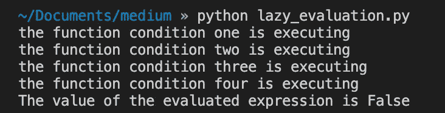

如果我们将`condition_one()`中的第 9 行改为返回`True`，我们会得到:

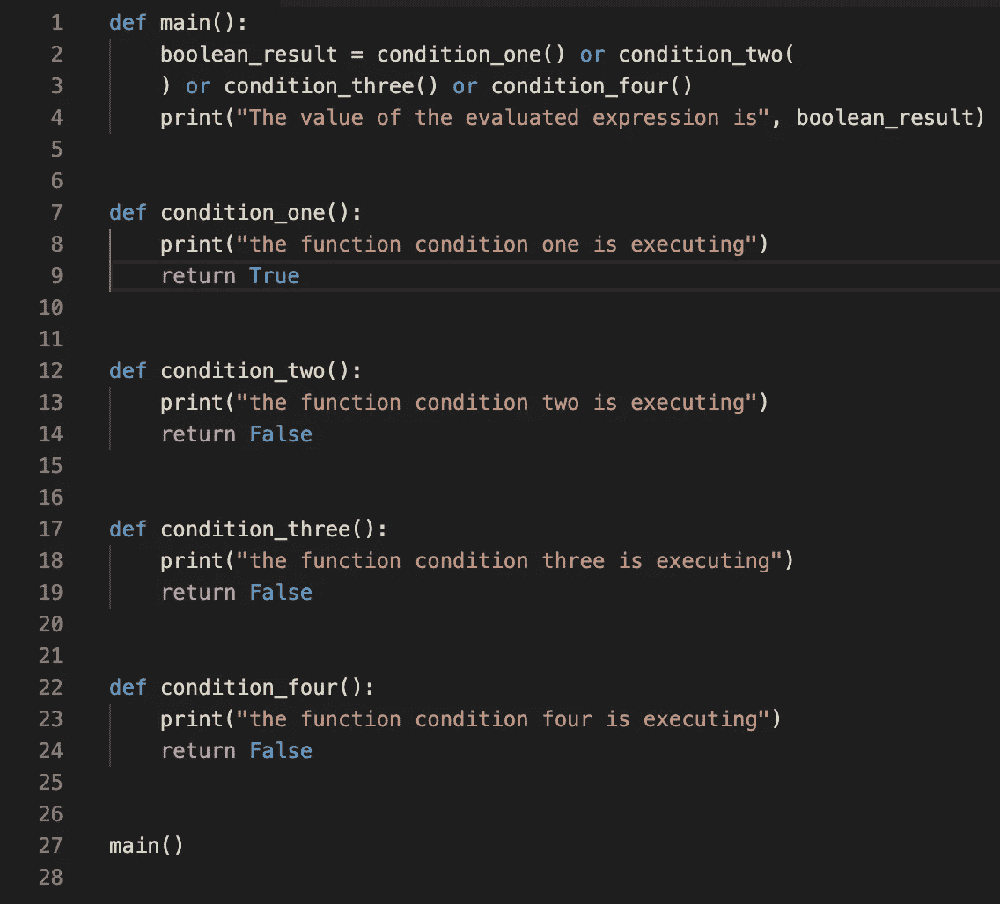

输出将是:

很酷，对吧？

# 实际例子

Python 条件的延迟求值的这种实现的另一个用途是用于错误检查。举个例子，假设我给你一个表示井字游戏棋盘的类(一个 3x3 的矩阵)。我预先填充了一些单元格，以便更容易地测试我们将要创建的方法，因为我不会实现整个游戏。

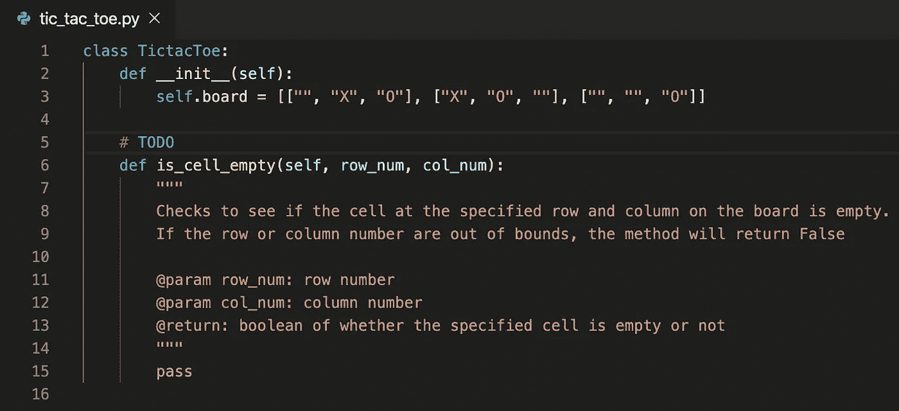

假设我想让你写一个名为`is_cell_empty(row_num, col_num)`的方法，它接受两个参数，即行号和列号，并检查棋盘上的那个点是否为玩家下一步棋的位置空着。

您可以假设一个单元格有三个值:空字符串`“”`、`“X”`或`“O”`。请记住，行号和列号可能会超出界限，即检查第七行第七列的单元格。在这种情况下，让我们假设我们应该返回`False`,因为那个单元格无论如何都不会是空的。为了简单起见，让我们假设这个助手方法将在一个不同的方法中使用，以实际创建一个有效的井字游戏。

解决这个问题的一种方法是写下如下内容:

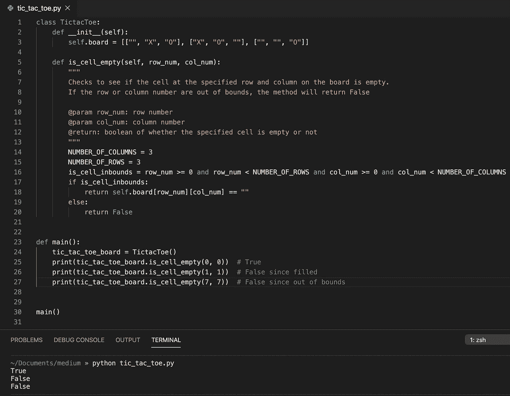

现在这一切都很好，但是因为条件中的表达式是按照它们出现的顺序计算的，我们可以将`is_cell_empty()`重构为:

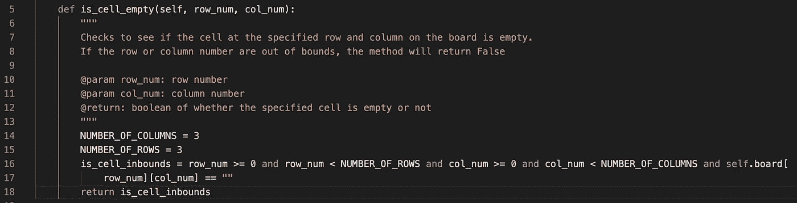

我们仍然会得到相同的输出，因为如果前四个条件都评估为`True`，我们知道`row_num`和`col_num`都必须在 0 和 2 之间。这使我们可以立即使用这些值来索引游戏板，而不用担心索引错误，因为条件是按从左到右的顺序计算的。

现在，如果我们把最后一个条件放在第一位，比如…

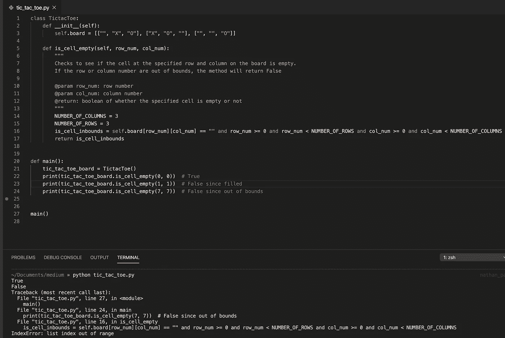

…如果指定的单元格在边界内，它会工作，但是如果它们不在边界内(比如当我们检查第七行第七列的单元格时)，我们会得到一个越界错误。

就像我之前说的，这是因为 Python 按照条件出现的顺序从左到右计算条件(我们假设没有括号)。

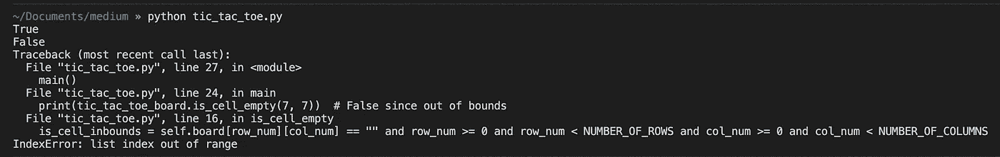

在技术访谈期间，当实现广度优先和深度优先的基于搜索矩阵的解决方案时，我使用过在索引之前进行越界检查的技巧。

不仅 Python 懒惰地评估基于操作符的逻辑表达式，JavaScript 也是如此。我希望这篇文章对你们有用！