# 反冲如何让我对 React 中状态管理的未来感到兴奋

> 原文：<https://betterprogramming.pub/how-recoil-js-got-me-excited-about-the-future-of-state-management-in-react-f07ce57af681>

## 反冲入门


归属:由 pikisuperstar 创建的背景向量—[www.freepik.com](http://www.freepik.com/)

围绕前端开发，尤其是 React 前端开发的领域每天都变得越来越令人兴奋。
大约一个月前，脸书软件工程师 Dave McCabe 开源了 React 的新状态管理库。

没错，伙计们，这个新的家伙叫做[后座力](https://recoiljs.org)。它是直接从 React 的厨房出来的，看起来它会留在这里。很刺激，对吧？

如果你是一个反应过激的人，你可能已经听说过它，甚至尝试过一点。对于那些还没有，让我给你一些快速的琐事:

*   反冲是一个 React 的状态管理库。
*   它仍然被认为是实验性的(不是生产就绪)。当前版本是 0.0.8。
*   它基于 React 的所有最新产品，如[钩子](https://reactjs.org/docs/hooks-intro.html)和[悬念](https://reactjs.org/docs/concurrent-mode-suspense.html)，甚至还准备好支持并发模式(至少根据文档来看是这样的)。
*   这个库很小，很快，而且基本上没有样板文件。

我希望我现在已经引起你的注意了。好了，闲聊够了，让我们看看整个大惊小怪是怎么回事，并检查它是如何工作的。

# 首先，设置

当然，第一步是安装库。

```
npm i recoil
```

或者

```
yarn add recoil
```

正如我已经提到的，反冲被开发成无样板文件，并且非常容易上手。请看:

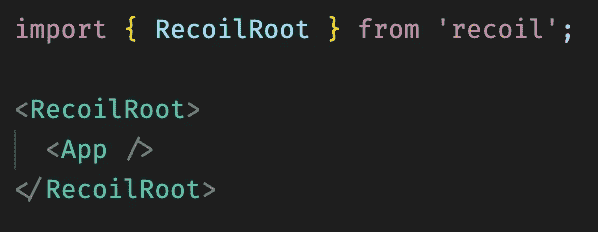

反冲设置

这就是在您的项目中设置和启动它是多么容易。

在这个例子中，我已经向你展示了设置反冲的最常见的方法，这是在你的应用程序的根组件中，所以全局状态将在你的应用程序的任何地方可用。但是你可以选择用`<RecoilRoot>`只包装应用程序的一部分，并且只在你需要的地方使用全局状态。很酷，对吧？

基本上，这就是你需要知道的关于设置的所有内容，所以下一站:原子。

一切都从单个原子开始。我喜欢反冲让我在开发过程中使用所有的化学和宇宙隐喻。这只会让一切听起来更酷。

是的，对，原子…

# 什么是原子？

原子基本上是保存你的状态的东西，是你定义并赋予你初始状态的单元。您可以显式地订阅组件来监听 atom 状态的任何变化。一旦你这样做了，你的组件将在每次状态更新时重新呈现。一旦您使用反冲钩子从您的原子状态中读取或写入，就会发生对原子的订阅。

如何创建原子:

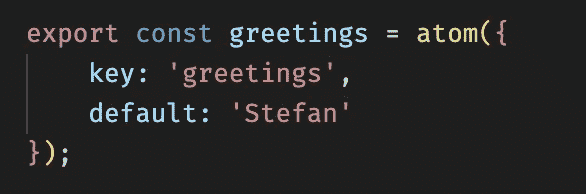

简单的原子例子

如你所见，这真的很简单。我们有一个惟一的键用于状态的持久化，并区分应用程序可能具有的多个 atom 状态，还有一个默认值，顺便说一下，它是可选的。

当然，原子可能有更复杂的结构。默认值可以保存一组不同类型的值，甚至可以保存一个返回动态数据的异步函数，但稍后会详细介绍。

# 我们如何在组件中使用原子？

别担心，制造一个原子就像制造一个原子一样容易。谢天谢地，反冲有一套很好的预定义钩子，如果需要的话，可以让我们读写原子。
以下是你可能会用到的最常见挂钩的快速列表:

*   `useRecoilState(state`)，它是`React.useState()`的孪生兄弟——您有状态值和一个覆盖您当前状态的设置器。
*   `useRecoilValue(state` —使用这个钩子，你只接收你所在州的当前值。使用这个钩子的组件自动订阅状态的任何变化。
*   `useSetRecoilState(state)` —顾名思义，这个钩子只用于更新状态值，而不读取它。

好了，够干理论了。我们来看几个例子。

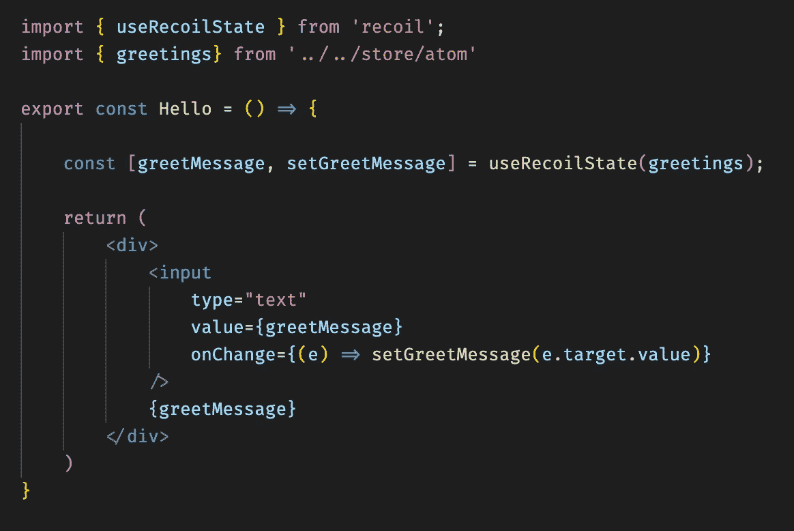

useRecoilState 示例

正如我已经提到的，`useRecoilState`的用法和`React.useState()`一样。我相信你们很多人已经知道它是如何运作的了。在这个例子中，`greetMessage`保存了原子的当前状态，我们只能读取，而使用`setGreetMessage`，我们可以更新状态的值。

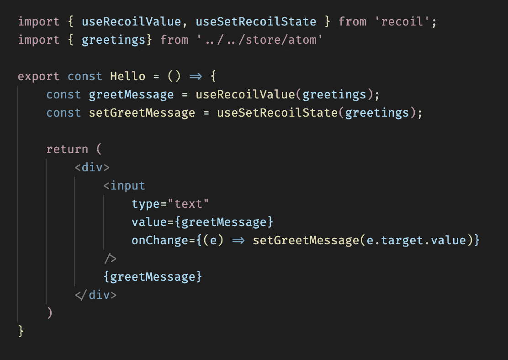

useRecoilValue 和 useSetRecoilState 示例

正如你所看到的，反冲提供的下两个钩子，`useRecoilValue`和`useSetRecoilState`，是`useRecoilState`的一种析构版本。

使用`useRecoilValue`，我们接收原子的当前状态，并将其赋给`greetMessage`变量。在这里提到`/`是一个只读变量可能会更好，这意味着我们不能以任何方式覆盖它。为了做到这一点，我们需要`/`钩子，在它的帮助下，我们可以覆盖或改变状态。

我想在这里补充一点，反冲对我们改变原子现有状态的方式是非常严格的。这只能以几种明确定义的方式发生，其中一种你已经看到了，在反冲钩的帮助下。在我们讨论选择器的时候，我还想给你们展示另一种方式。

为了清楚起见，我想指出的是，在官方页面上记录了另外四个反冲钩，但是由于我到目前为止还没有使用过它们，所以我没有在示例中包括它们中的任何一个。更多信息请参考[文件](https://recoiljs.org/docs/api-reference/core/useResetRecoilState)。

是时候看看这个难题的最后一个主要部分了:选择器。

# 什么是选择器？

根据文件:

> *"选择器*代表一个功能，或反冲中的派生状态。你可以把它们想象成一个没有副作用的‘纯函数’，对于一组给定的依赖值，它总是返回相同的值。”

当我第一次阅读选择器的定义时，它并没有马上给我留下印象，但是当我玩了一会儿后，它变得更清楚了，选择器是一种辅助功能，你可以用它来导出/计算你的当前状态，甚至在你需要的时候改变它。

一如既往，我觉得举个例子会让事情更容易理解。

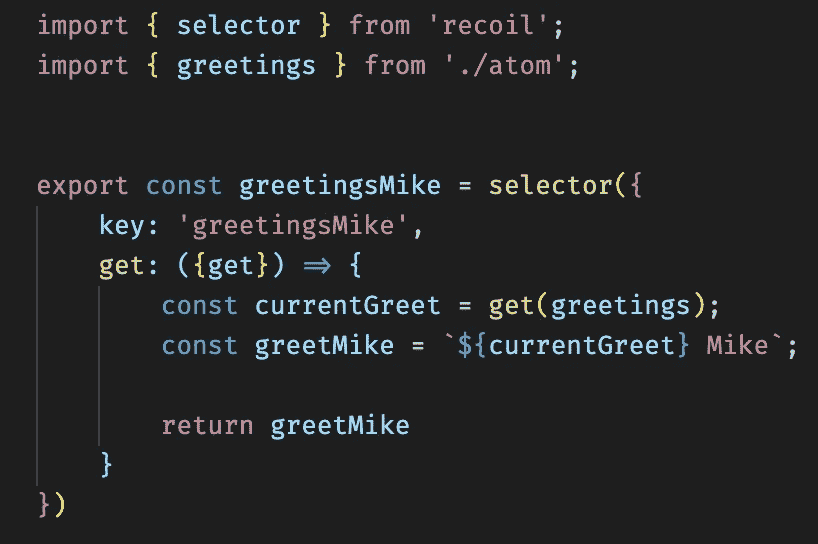

简单选择器示例

好吧，那我们这里有什么？让我们从上到下阅读文件:

*   首先，我们从反冲导入选择器。
*   然后，我们导入原子`greetings`持有的当前状态。
*   然后我们定义我们的选择器`greetingsMike`并用它做一些魔术。

乍一看，选择器有点像原子。我们有一个键，它也应该是一个惟一的值，但是这里我们有一个 getter，而不是缺省值。从示例中可以看出，getter 用于获取`greetings`原子的当前状态。我们使用当前状态的结果来返回一个新的问候；在这种情况下，返回值将是字符串“Hello Mike”

# 如何在我们的组件中使用选择器

选择器利用了我们在 atom 上使用的同一套反冲钩。正如你将看到的，它在我们的组件中的使用方式与原子相似。

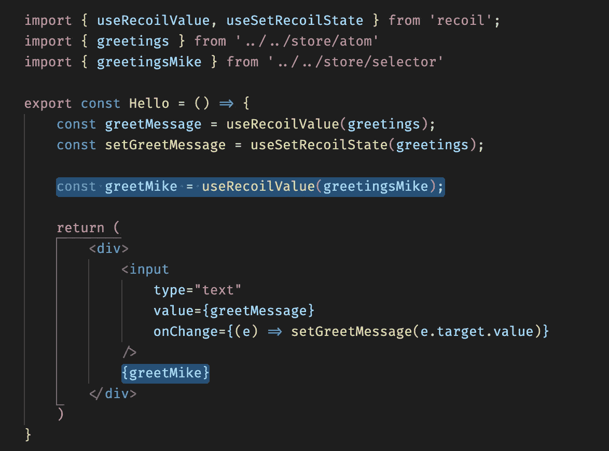

简单选择器示例

除了之前在`<Hello>`组件中的内容之外，
现在我们导入新创建的选择器并投入使用。当我们看到这个组件的输出时，我们将看到一个输入字段，默认值为 Hello，问候消息为“Hello Mike”

每次我们改变输入字段的值时，问候消息文本也会改变，因为在我们的选择器中，我们通过 getter 读取当前状态，还记得吗？

# 如何通过选择器覆盖和改变状态

实际上，这很简单。这里有一个例子:

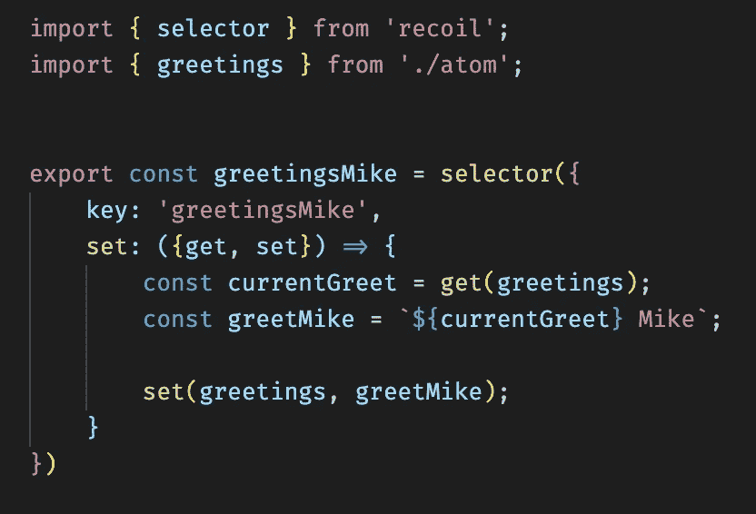

简单选择器示例

同样，我们有相同的选择器设置，唯一的区别是，这次我们没有使用 getter，而是使用了选择器的其他内置功能:setter。

你会注意到我们在这里不仅析构了 setter，还析构了我们一分钟前用过的 getter。原因是我们仍然需要原子持有的当前状态，因此我们可以相应地读取和更新它。

在本例中，我们使用 getter 做了与上例完全相同的事情，但是这次我们使用 set 方法直接改变状态。

你可以看到，为了做到这一点，我们作为第一个参数传递保存我们状态的原子，作为第二个参数，传递我们希望作为状态的更新的 greet 版本。

厉害！最后但同样重要的是，我将向您展示一些原子和选择器的异步示例。

# 原子和选择器的异步示例

实际上，在下面的例子中，您会注意到原子和选择器中的异步回调看起来非常相似。

这次我将使用我最近参与的另一个示例项目:一个简单的应用程序，它接受用户输入并从该输入中获取 Giphys。

这里有一个`CodeSandbox` [链接](https://codesandbox.io/s/giphy-search-no-api-key-tv4o2)到这个项目，可以查看和使用。

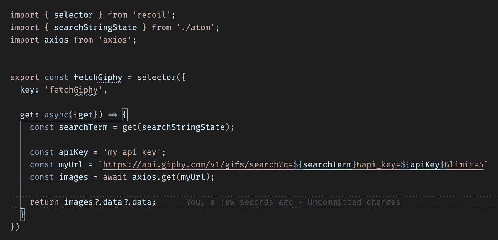

异步选择器示例

快速浏览文件:

*   首先，我们导入我们的`searchStringState` atom，正如您可能已经猜到的，它保存用户输入的搜索字符串。
*   接下来，我们使用的 getter 位于获取 Giphys 的异步回调函数中。
*   最后一步，我们返回 API 调用的结果。

这是呈现提取的 Giphys 的组件的样子:

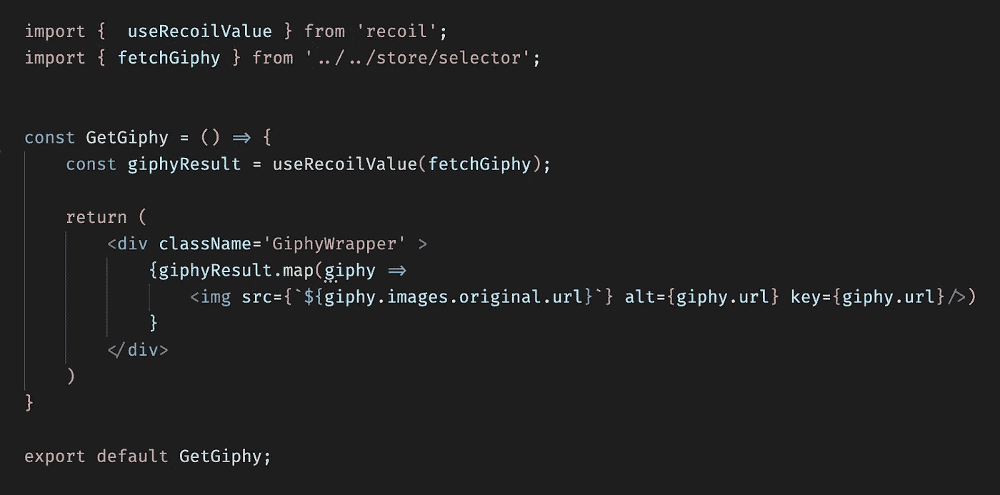

异步选择器示例

正如我所承诺的，这个概念非常简单易懂。在上面的例子中只有一个问题:如果我们现在尝试渲染`GetGiphy`组件，我们将会看到下面的输出:

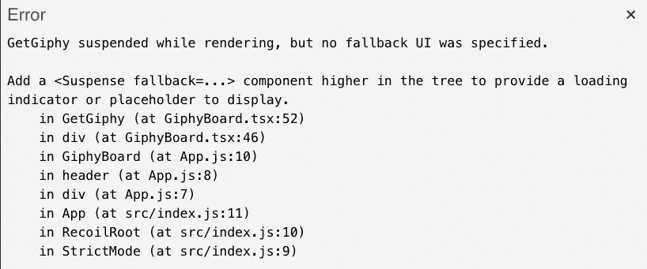

暂停错误信息

当我们在选择器或 atom 中使用异步回调时，使用它们的父组件应该用一个悬念回退元素包装。多酷啊！在这里，我们可以清楚地看到，反冲实际上已经在使用 React 的最新功能，这些功能已经深入集成到库中。

下面是我们如何利用 atom，它异步获取一些资源。

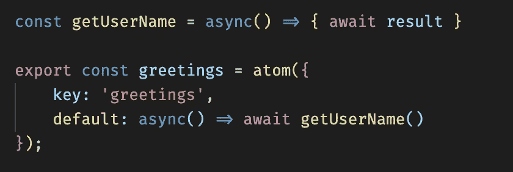

异步原子

# 关于反冲的最后的话和想法

我花在玩反冲的时间产生了一个小游戏
，我称之为 Brain-teaser，这是一个概念验证应用程序，我试图快速测试反冲到底能做什么。

你可以在 [Github](https://github.com/Squiff88/BrainTeaser) 上随意检查和使用它，或者在这里试用部署版本[。](https://stoic-wiles-a05a55.netlify.app/)

我目前的最好成绩是 20 秒——试着打破它！

到目前为止，我尽量避免与我们周围的其他状态管理库进行任何直接的比较。我的观点是，根据不同的用例，不同的库可能比其他库有优势，有几个可供选择是很好的。

到目前为止，我真正喜欢反冲的是它感觉非常快，很容易上手，对我来说最重要的是，它真的经过了微调，为 React 量身定制。我可以很容易地将反冲视为[语境 AP](https://reactjs.org/docs/context.html) I 和 [Redux](https://redux.js.org/) 之间的一线希望。

与 Redux 相比，学习曲线相对适中，更不用说随后的所有设置和样板文件，但仍然感觉它可以很好地处理更大和更复杂的应用程序，这通常是与上下文 API 的斗争。

总的来说，这个图书馆给人的感觉还是很年轻，文档也不是很全面——它们甚至到处都不见了。尽管如此，我对反冲感觉非常积极，我期待着看到这个项目将如何随着时间的推移而发展。

我这边就这样。祝编码愉快！