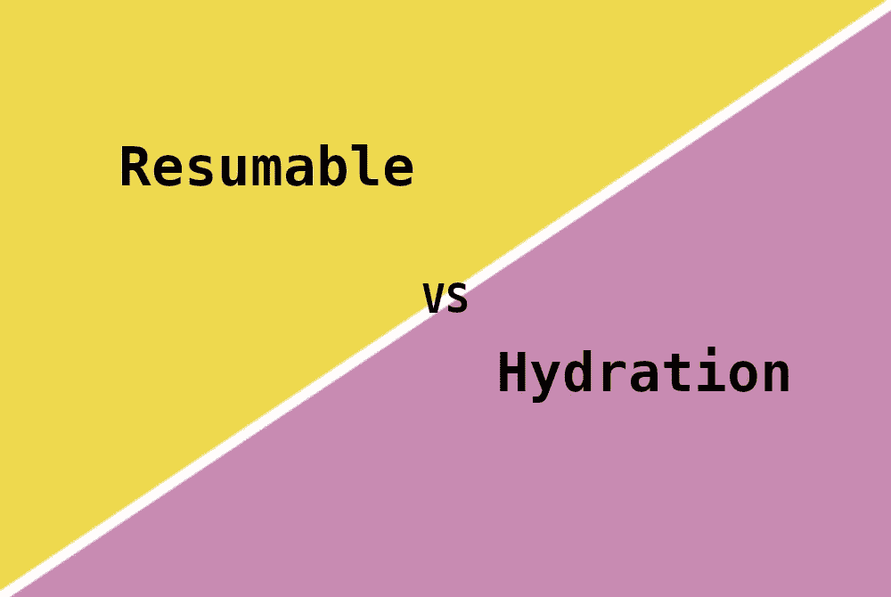
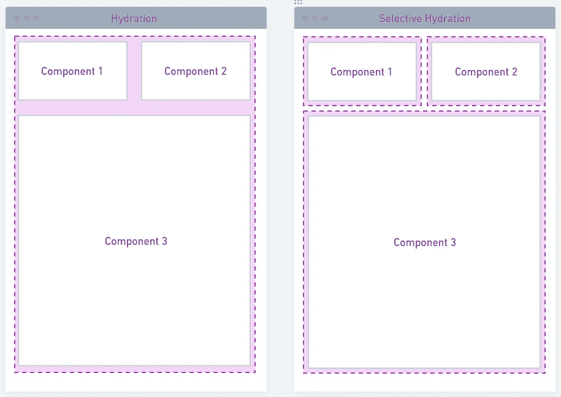
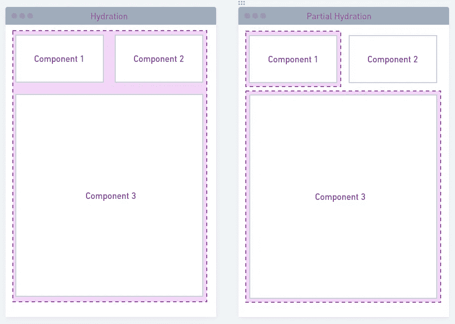

# 服务器端渲染:可恢复性如何战胜水合作用

> 原文：<https://betterprogramming.pub/how-resumable-beats-hydration-f845bfebc31e>

## 可恢复性 vs 水合作用——一场不公平的战争？



作者图片

在服务器端呈现中，服务器根据用户的请求和呈现页面所需的任何数据，动态生成网页的 HTML。然后，这个 HTML 被传送到客户端的 web 浏览器，它会像使用传统的客户端呈现方法一样呈现页面。

这只是第一步。服务器呈现的页面需要具有交互性。水合作用是恢复互动性的唯一方法。经过多年的改进，现在我们有一些不同的水合技术可以使用。

最近，我们看到一个概念被应用到 SSR:可持续性。长期以来，它一直用于操作系统级别的长期运行任务，甚至用于下载。但是，它如何应用于 SSR 呢？它的优点是什么？怎么能开始玩呢？

在这篇文章中，我们将检查什么是最新的 SSR 水合技术，它们与 is 相比如何，以及 SSR 可恢复技术如何。

# SSR 现代掺水技术

SSR 水合技术不是银弹。尽管它通过发布服务器渲染的 HTML 提升了`First Contentful Paint`和`Largest Contentful Paint`指标，但它仍然需要下载、解析和执行大量的 JavaScript。

这对`Time To Interactive`指标产生了影响。当页面对点击没有反应时，它变得令人沮丧。补水怎么对抗？有各种各样的:

## 1.选择性水合

这是`React 18`通过选择性水合功能解决的问题之一。现在 HTML 可以流式传输，而不仅仅是转储`renderToString`方法的结果。怎么会？通过使用以下新 API:

```
// opting to streaming HTML
import { pipeToNodeWritable } from ‘react’;
```

组件可以在服务器端使用`lazy-loaded`，并通过使用它们的`Suspense`特性来发布最少的 JavaScript。

此外，当用户与非水合组分交互时，它将被优先化。多亏了并发模式，这一切才成为可能。



作者的完全水合与选择性水合方案

## 2.部分水合

这是一个概念，其中并不是所有的成分总是水合的。有些成分可能对补水没有任何好处，那么为什么要这样做呢？这与杰森·米勒的想法`Island Architecture`产生了共鸣。它在很大程度上是由`Astro`元框架实现的。

`React Server Components`是`React`团队对此事的看法。这些组件将运送任何 JavaScript 代码，甚至被水合，除非在那里呈现一个`Client Component`。只有在这种情况下，才会发布一些 JavaScript。像`NextJs`或`Gatsby`这样的框架在这个特性上投入了大量资金。



作者的完全水合与部分水合方案

## 3.渐进水合

当构建 web 应用程序时，我们总是能够区分关键组件和不太重要的组件。我们可以有条件地呈现那些我们发现能带来更多价值的。这个概念是在 Google I/O 2019 上推出的。

例如，我们可以延迟视口之外的组件的执行。很像`lazy-loading`本地支持的浏览器技术。

# 如何恢复击败他们所有人

这些年来，水合过程已经用上面提到的技术进行了改进。然而，它的缺点总是一样的:仅仅是重新呈现已经在服务器上构建的树就需要大量的 JavaScript。如何才能摆脱这种多余的瓶颈？

`Resumable`概念似乎是完美的解决方案。它减少了对水合作用的需求，因此浏览器不需要下载大量的 JavaScript。这怎么可能？产生的 SSR HTML 包含必要信息的序列化，以立即恢复其在浏览器上的执行。很可爱，不是吗？

让我们看看下面的图表，它展示了浏览器需要做的工作是多么少。


来自 qwik.builder.io 的水合作用与可恢复性说明

使用`Resumable`概念的主要玩家是`Qwik`。它如何序列化整个应用服务器端的执行？通过解决四个主要问题:

*   **Listeners:** 它将延迟加载的事件监听器序列化并生成到 DOM 中。每个处理程序都被序列化到自己的块中。`Qwikloader`设置一个全局事件监听器来按需下载每个块。
    它负责函数闭包、DOM 引用、承诺、映射、集合和 URL 对象序列化。开发人员需要记住一些限制，比如流的序列化。

```
<button on:click="./chunk.js#handler_symbol">click me</button>
```

*   **组件树:**在 SSR/SSG 时间，Qwik 收集并序列化关于组件和商店以及订阅的关系的信息。这将使它能够在需要时更新/重新呈现相关组件。因为所有的成分边界现在都被传输，所以不需要任何水合过程。这是如何实现的？大多通过 HTML `<!-- comments -->`
*   **应用状态:** Qwik 提供了一个状态管理实现。应用程序状态将与 HTML 响应一起序列化为类型为`qwik/json`的`<script />`。
*   **特定于客户端的代码:**既然没有水化，那么特定于客户端的代码什么时候运行？有一个`useClientEffect$`抽象。这将在组件可见时运行 JavaScript 回调。

简而言之，`Qwik`的主要优势在于它能够序列化服务器上的执行，因此可以在客户机上继续执行。然后，它能够通过只下载相关的 JavaScript 逐步使应用程序具有交互性。最初，在客户端，我们只需要内联的`QwikLoader`的代码，权重在`1kb`左右。

无论应用程序有多复杂，这都将使初始应用程序的执行速度快如闪电。这就是为什么它被称为第一个`O(1)`页面加载时间框架的原因。


作者的 Qwik 执行模式

交付更少的 JavaScript 代码不仅更好，因为我们使用的带宽更少。这也意味着我们需要更少的耗电客户端，因为需要解析和执行的代码会更少。我们也不会在客户可能需要的代码上浪费 CPU 周期。细粒度的延迟加载意味着我们将只执行客户端需要的 JavaScript 代码。

这也意味着应用程序将变得越来越具有交互性。随着用户与应用程序的交互越来越多，将会下载更多的代码。

团队的实现令人着迷，并将改变我们编写 web 应用程序的方式。然而，这并不是免费的。我们将不得不转向更加以中心为中心的方法。我们也将被锁定在一个供应商，不得不使用他们的状态和路由方法。

# 包裹

事实证明，速度是设计网站时的一个关键因素。时间就是金钱。有一些指标显示了页面加载时很少的`100ms`增量对客户转化的影响。

减少 JavaScript 代码似乎是最有效的技术。最新的水合技术已经考虑到了这个目标。我们还在一些最流行的元框架上看到了 JavaScript 减少的趋势，比如`NextJs`。

这种可恢复的战略似乎已经落地并持续下去。当我们看到它如何成熟时，我们肯定会看到它的采用率如何飙升。这只是开始。有更多的优化可以与它结合，作为慢速网络的预取。

目前，Qwik 几乎还没有达到 Beta 里程碑。然而，由于预计只有少数突破性的变化，因此值得考虑将其用于生产。