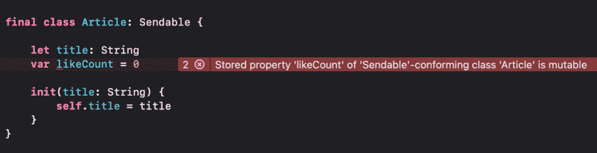
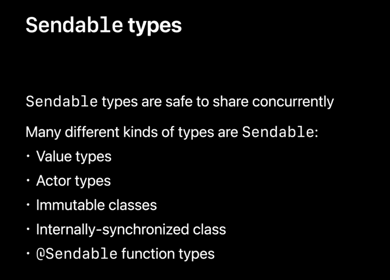
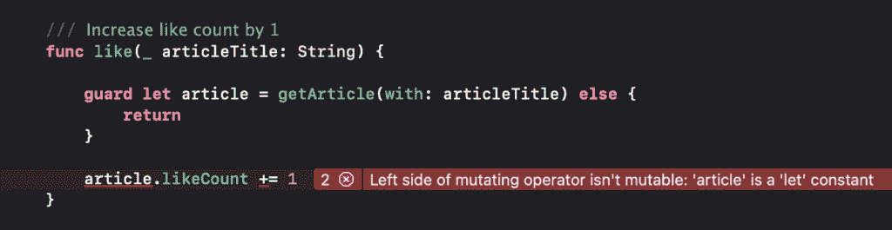
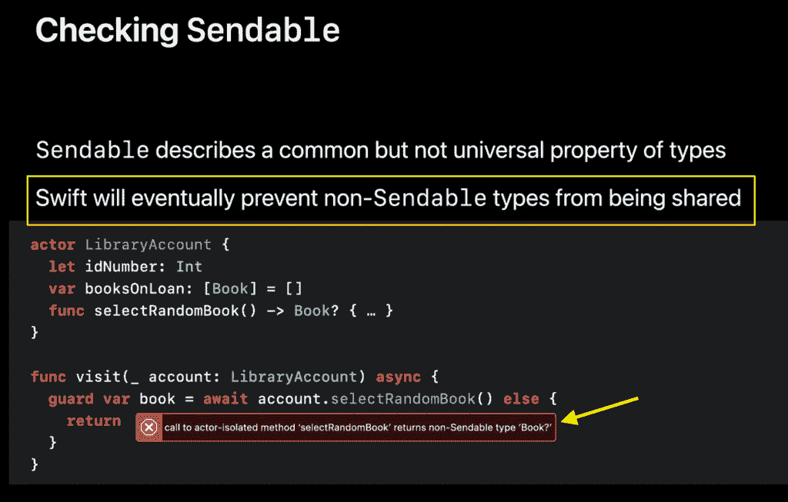

# Sendable 如何帮助防止 iOS 中的数据竞争

> 原文：<https://betterprogramming.pub/how-sendable-can-help-prevent-data-races-in-ios-85887497c3b4>

## 快速浏览一下可发送协议

照片由 [Daria Nepriakhina](https://unsplash.com/@epicantus?utm_source=medium&utm_medium=referral) 在 [Unsplash](https://unsplash.com?utm_source=medium&utm_medium=referral) 拍摄

在我之前的[文章](https://swiftsenpai.com/swift/actor-prevent-data-race/)中，您了解到了参与者可以通过确保其可变状态的互斥来帮助我们防止数据竞争。只要我们在访问参与者内部的可变状态，这个陈述就是正确的。如果可变状态可以在参与者之外访问，数据竞争仍然会发生！

在本文中，让我们探索这种数据竞争是如何发生的，以及`Sendable`协议如何帮助防止这种情况。除此之外，我们还将看看苹果公司将为`Sendable`带来的未来改进，以应对这种情况。

那么，事不宜迟，我们开始吧！

# 将数据传递给参与者时会出现数据竞争

假设我们有一个`Article`类，它有一个`likeCount`变量来记录文章从读者那里获得的点赞数。下面是起始代码:

我们还有一个`ArticleManager`演员，负责管理一系列文章:

注意，`ArticleManager` actor 有一个增加特定文章的`likeCount`的`like(_:)`函数，和一个根据给定文章标题返回文章的`getArticle(with:)`函数。

由于`getArticle(with:)`函数的存在，`ArticleManager`的文章现在可以在 actor 之外访问。换句话说，参与者的可变状态现在可以在参与者之外更新，从而产生了潜在的数据竞争。

现在，考虑以下位于 actor 外部的`dislike(_:)`函数:

由于我们现在正在减少(改变)actor 之外的文章点赞数，如果我们试图同时运行 actor 的`like(_:)`和上面的`dislike(_:)`函数，就会发生数据竞争！

在上面的代码中，我们创建了 3000 个子任务来喜欢一篇文章，同时创建了 1000 个子任务来不喜欢同一篇文章。最后，即使我们能够得到输出“`👍🏻 Like count: 2000`”，Xcode thread sanitizer 仍然会显示一个线程问题，表明数据竞争确实发生了。

## 专业提示:

您可以通过导航到产品>方案>编辑方案…来启用线程杀毒器。然后，在编辑方案对话框中选择运行>诊断>选中线程杀毒器复选框。

既然您已经看到了在角色之外改变角色状态会导致数据竞争，那么我们该如何防止这种情况发生呢？

# 通过添加一致性检查可发送性

`Sendable`是 Swift 5.5 中与 async/await 和 actors 一起引入的新协议。一个`Sendable`类型的人的价值观可以被不同的角色分享。如果我们将一个值从一个地方复制到另一个地方，并且两个地方都可以安全地修改该值的副本，而不会互相干扰，那么该类型被认为是一个`Sendable`类型。要了解更多，你可以看看这个 [WWDC 视频](https://developer.apple.com/videos/play/wwdc2021/10133/?time=1112)。

回到我们的示例代码，为了避免在`ArticleManager`之外对文章进行变异时出现数据竞争，我们必须使`Article`类型符合`Sendable`协议。让我们用下面的代码来做这件事:

在这个阶段，编译器将开始抱怨“*‘Sendable’的存储属性‘like count’——符合类‘Article’是可变的。”*

这个错误意味着如果我们想让`Article`类型成为`Sendable`，我们就不能有一个可变的存储属性(`likeCount`)。这是因为与可变的存储属性同时共享引用类型是不安全的，它会产生潜在的数据竞争。

对于我们的例子，我们肯定不能使`likeCount`为常数，那么我们还有什么其他选择呢？根据苹果公司的说法，有许多不同种类的类型可以发送。

我们的一个选择是将`Article`改为值类型。

这一次，`Article`结构没有给我们任何编译器错误，但是我们在示例代码的其他地方得到了多个编译器错误。

修复所有这些编译器错误确实需要大量的代码修改，但这肯定是可行的。因此，我将把这作为一个练习留给你。如果你确实遇到了困难，可以在这里找到解决方案[。](https://github.com/LeeKahSeng/SwiftSenpai-Swift-Concurrency/blob/main/SwiftSenpai-Swift-Concurrency/Sendable%20Demo/SendableDemoViewController.swift)

从上面的例子可以看出，符合`Sendable`协议并不会自动使一种数据类型可发送。然而，它确实执行了我们需要遵守的规则，以便不意外地产生潜在的数据竞争。因此，下一次当您处理 actors 时，请确保所有可共享的可变状态都符合`Sendable`协议。

# 预期的未来改进

在 WWDC，苹果提到，在未来，Swift 编译器将阻止我们共享不可发送的类型。如果我们试图访问一个 actor 不可发送状态，我们将得到如下所示的编译器错误:

截至 Swift 5.5，这种检查仍然不可用，苹果公司也没有关于这种检查何时可用的信息。现在，我们能做的最好的事情是，每当一个 actor 中有可共享的类型时，注意并始终遵守`Sendable`协议。

# 包扎

在我们的`ArticleManager`例子中，防止数据竞争的最好方法无疑是将整个`dislike(_:)`函数移到`ArticleManager`中。出于演示的目的，我特意使用了`Sendable`方法，以便您可以更好地理解`Sendable`协议如何帮助防止参与者之外的数据竞争。

在撰写本文时，Swift 工程团队仍在积极改进`Sendable`检查。如果您有任何想要分享的观点或想法，请务必在 [Swift 论坛](https://forums.swift.org/t/improving-sendable/52377)上联系他们。

最后但同样重要的是，您可以在这里获得完整的示例代码[。](https://github.com/LeeKahSeng/SwiftSenpai-Swift-Concurrency)

感谢阅读。更多关于 iOS 开发和 Swift 的文章，欢迎在 [Twitter](https://twitter.com/Lee_Kah_Seng) 关注我。