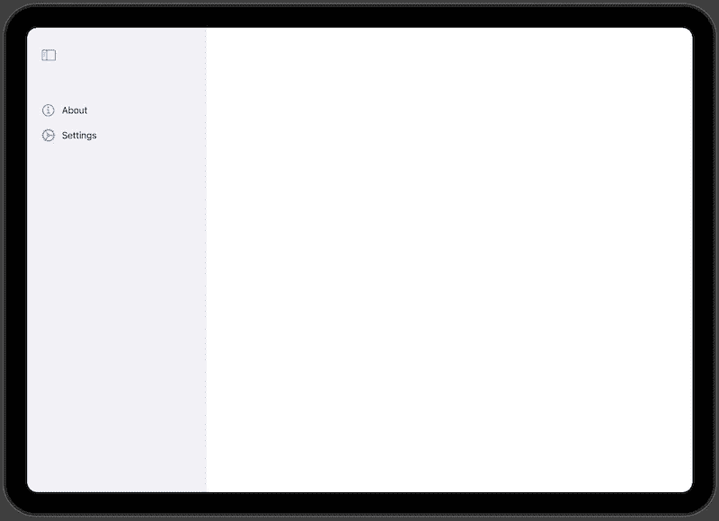
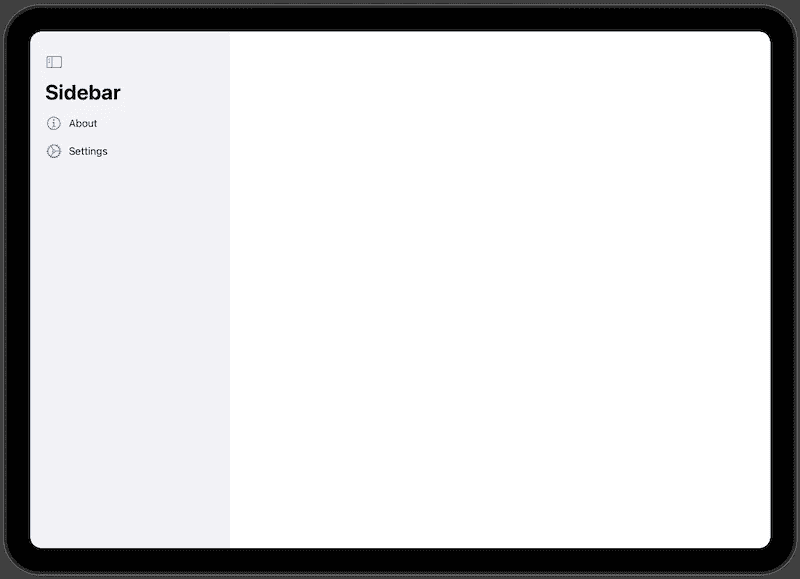
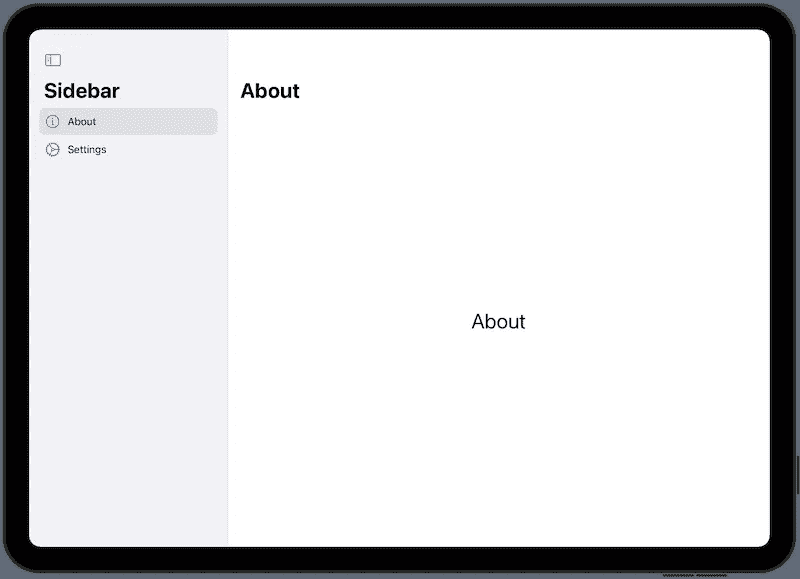
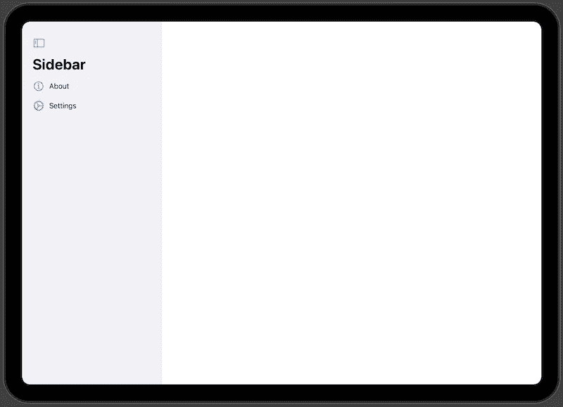
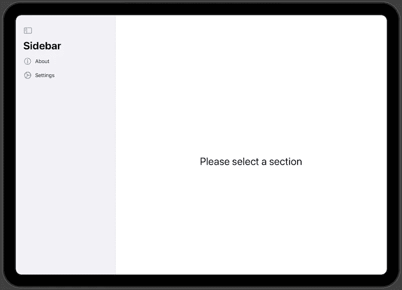
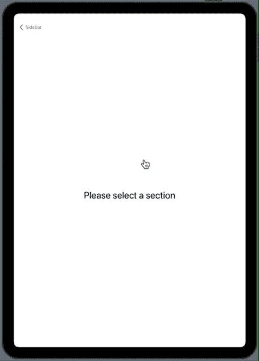
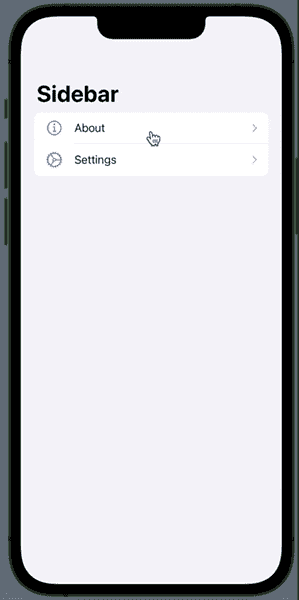

# 侧边栏如何在带有 SwiftUI 的 iPadOS 上工作

> 原文：<https://betterprogramming.pub/how-sidebar-works-on-ipad-with-swiftui-1d37301636ac>

## 为您的 iPadOS 应用程序实现导航


图片由 [Taras Shypka](https://unsplash.com/@bugsster) 在 [Unsplash](https://unsplash.com/?utm_source=medium&utm_medium=referral) 上拍摄。

从 iPadOS 14 开始，苹果重新设计了 iPad 侧边栏，使其更容易在应用程序中导航。它在[人机界面指南](https://developer.apple.com/design/human-interface-guidelines/ios/bars/sidebars/)中有所解释，并且已经在照片、文件、笔记、日历等常用应用中使用。

在本文中，让我们看看如何使用 SwiftUI 为 iPadOS 构建一个侧边栏。目前，侧边栏元素仅适用于横屏模式下的 iPads。

# 创建边栏

为了用 SwiftUI 为 iPad 创建一个侧边栏，我们需要创建一个`List`视图，在那里我们将拥有所有的部分并将其包装在一个`NavigationView`中。在列表中，我们需要为每个部分添加一个`Label`元素。

这里最关键的一步是告诉 SwiftUI 列表应该呈现为侧栏列表类型。为此，我们需要将列表样式设置为`SidebarListStyle`。

```
NavigationView {
  List {
    Label("About", systemImage: "info.circle")
    Label("Settings", systemImage: "gear")
  }
  .listStyle(SidebarListStyle())
}
```



现在我们有了侧边栏，让我们添加一个表示全局名称的标题。开发者通常会选择放置应用程序名称，或者，例如，苹果笔记应用程序有文件夹来表示侧边栏的内容。

```
NavigationView {
  List {
    Label("About", systemImage: "info.circle")
    Label("Settings", systemImage: "gear")
  }
  .listStyle(SidebarListStyle())
  .navigationTitle("Sidebar")
}
```



# 侧边栏中的导航

现在我们有了侧边栏，让我们在用户点击该部分后实现事件导航。为此，我们需要将`Label`包装在`NavigationLink`中，并提供一个目的地 SwiftUI 视图。

例如，如果我们在应用程序中添加“关于”部分，它可能是这样的:

```
NavigationLink {
  AboutView()
} label: {
  Label("About", systemImage: "info.circle")
}
```



# 默认主屏幕

当用户启动应用程序时，他们会看到一个空视图，直到他们从侧边栏中选择一些内容。



为了避免这种误导行为，我们应该告诉 SwiftUI 布局引擎呈现一个默认的或者称之为主屏幕。诀窍是在`NavigationView`中添加另一个视图，当应用程序首次启动时，它将成为默认屏幕。

```
NavigationView {
  List {
    // ...
  }
  .listStyle(SidebarListStyle())
  .navigationTitle("Sidebar")

  Text("Please select section")
    .font(.largeTitle)
}
```

一个好的主屏幕应该是仪表板、常用功能或类似的功能。



# iPhone 和 iPad 肖像模式

我们只看了它在 iPad 上的横向模式。但是在人像模式或者 iPhone 上呢？

## iPad 纵向模式

目前，iPad 上的侧边栏以纵向模式呈现在屏幕之外。为了显示它，我们需要按下后退按钮或者从设备的左侧滑动。



苹果手机

在 iPhone 上，侧边栏呈现为带有导航列表的默认主屏幕。



通常，这不是我们想要的，所以在这种情况下，我们可能需要考虑在 iPad 尺寸的设备上改变它。这超出了本文的范围。

# TL；速度三角形定位法(dead reckoning)

侧边栏是将应用程序的不同部分划分为 iPad 应用程序的一个很好的方式。目前，它在 iPad 上以横向模式呈现，部分以纵向模式呈现。

在添加了应用程序部分的列表后，我们应该记得提供一个默认的主屏幕。否则，我们的用户将会看到一个空屏幕。苹果已经在他们的应用程序和 macOS 中实现了这种方法。

# 链接

*   [样本代码](https://github.com/fassko/SwiftUISidebar)
*   [人机界面指南——侧栏](https://developer.apple.com/design/human-interface-guidelines/ios/bars/sidebars/)
*   [侧边栏官方文档](https://developer.apple.com/documentation/swiftui/sidebarliststyle)
*   [了解如何为 iOS、iPadOS 和 macOS 创建侧边栏导航](https://designcode.io/swiftui-handbook-sidebar)
*   [swift ui 中的侧边栏导航](https://swiftwithmajid.com/2020/07/21/sidebar-navigation-in-swiftui/)
*   [如何在 SwiftUI macOS 应用中显示和隐藏侧边栏](https://sarunw.com/posts/how-to-toggle-sidebar-in-macos/)
*   [https://better programming . pub/using-sidebar-in-swift ui-without-a-navigation view-94f 4181 c09b](/using-sidebar-in-swiftui-without-a-navigationview-94f4181c09b)
*   [如何在 SwiftUI 中制作侧边栏菜单](https://dev.to/tprezioso/how-to-make-a-sidebar-menu-in-swiftui-ejl)
*   [在 SwiftUI 中实现三栏导航](https://serialcoder.dev/text-tutorials/swiftui/implementing-three-column-navigation-in-swiftui/)