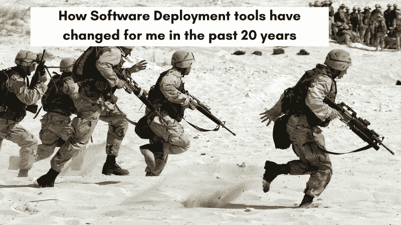
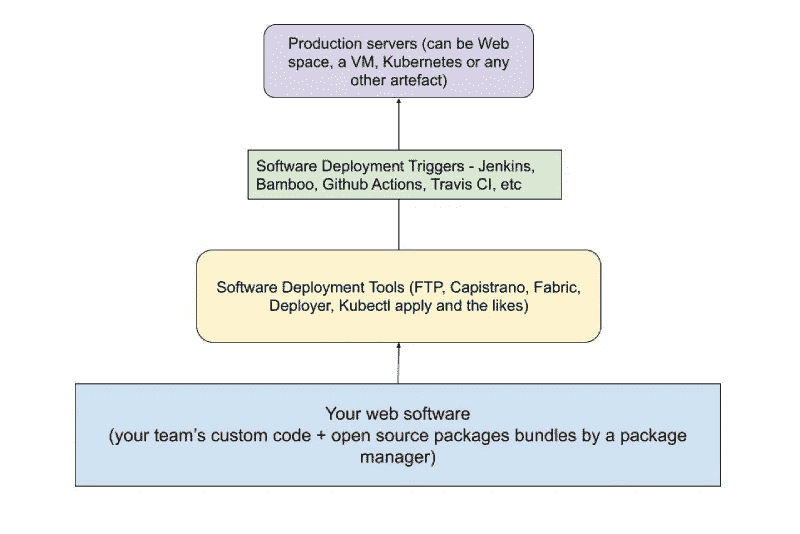
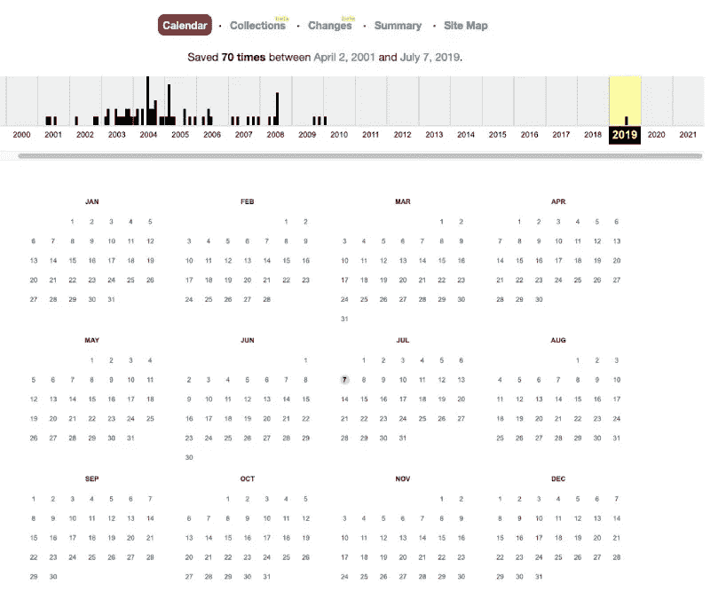
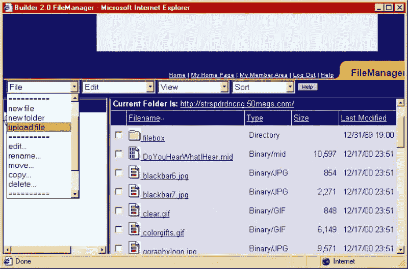
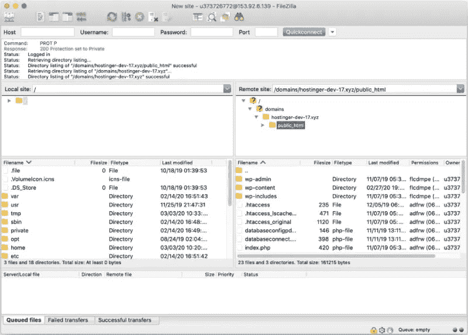
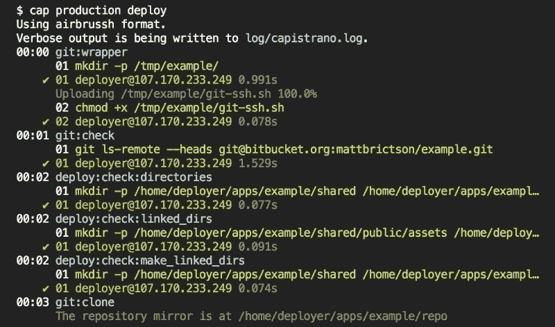
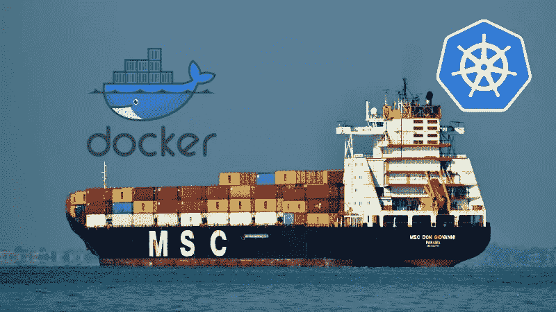
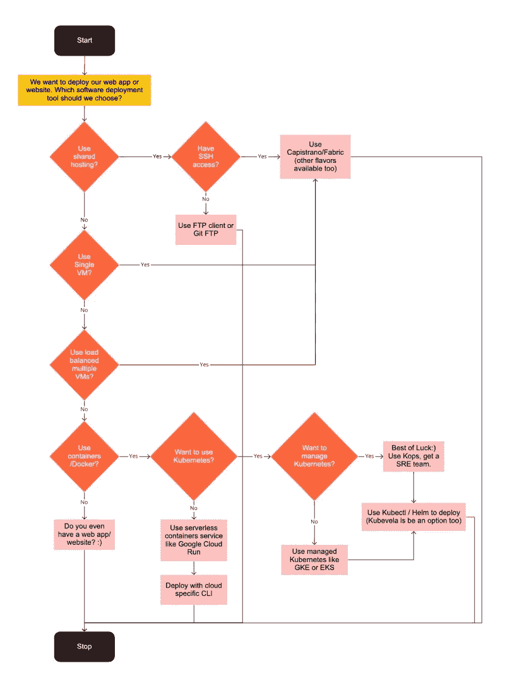

# 软件部署工具在过去 20 年中发生了怎样的变化

> 原文：<https://betterprogramming.pub/how-software-deployment-tools-have-changed-in-the-past-20-years-7ac24723704a>

## 在过去的 20 年里，我使用了各种各样的软件部署工具。从 FTP 到使用聊天机器人在 Kubernetes 上部署 Docker 容器，我想我已经看到了大部分。在本帖中，我将带你踏上从 2001 年到 2022 年的 web 软件部署工具之旅，让我们开始吧！

什么是软件部署工具？

在过去的 8-10 年中，软件部署工具也作为部署自动化工具得到了普及。

> 基本上，任何帮助您获得软件的第一个版本或软件用户可用的后续更改的软件都是软件部署工具。

在这篇文章中，我将重点介绍可以部署任何形式的 web 软件的部署软件，无论是网站还是 web 应用程序。我不会讨论桌面软件或者像 Windows 98 这样的操作系统是如何在 CD 上获得的。

让我试着解释一下什么是软件部署工具，什么是触发层。软件部署工具是用来部署一个软件(主要是 web 软件)的工具。例如，Capistrano、Fabric、Docker run、Kubectl apply 等。这些工具运行的触发层是像 Jenkins、Bamboo、Github actions 这样的软件。让我们把事情搞清楚。我想在下面清楚地说明这种区别:

如你所见，我们将讨论上图中的黄色部分，而不是绿色部分。那么，我是如何开始将一个网站部署到一个免费的网络主机上的呢？在 21 世纪初，它还不是“云”。我认为[自动化部署](https://geshan.com.np/blog/2015/10/4-pillars-of-a-solid-software-application-and-tools-to-support-it/#automated-deployment)是坚实的软件开发的支柱。

此外，我不会提到基础设施供应和基础设施作为代码工具，如 Ansible、Puppet、Salt 和 Terraform。它们属于不用于 web 软件部署自动化的另一类工具。

# 我的网络之旅是什么时候开始的？

回到 1999-2000 年，那时人们还没有电子邮件地址，我在免费的网站主机上运行网站。那是[拨号上网](https://en.wikipedia.org/wiki/Dial-up_Internet_access)的时代。

> 正是 33.6k 和 56k [调制解调器](https://en.wikipedia.org/wiki/Modem)的时代，使得[这种](https://www.youtube.com/watch?v=gsNaR6FRuO0)声音使用电话线连接互联网。如今拥有 5G 手机的年轻人永远不会知道我们当时拥有的互联网的价值。

我查看了 Archive.org T2，找到了一个我在 2000 年左右部署的网站。当然，我不会因为分享这个网站而感到尴尬，但我可以告诉你，它有[字幕标签](https://developer.mozilla.org/en-US/docs/Web/HTML/Element/marquee)、gif、几个 [Java 小程序](https://en.wikipedia.org/wiki/Java_applet)和页面计数器。以下是上述匿名网站[archive.org](https://archive.org/)的截图。

当然，这是一个包含一些 HTML、JavaScript 和 CSS 的静态站点。它是从 web 界面或可靠的文件传输协议(FTP)客户端部署的。

# 第一个软件部署工具—2000 年至 2008 年的 web 界面和 FTP

我第一次接触部署工具是一个叫做文件管理器的 web 界面。那时，我有一堆 HTML 文件，它们带有不太好的 CSS 和 Javascript，在我们的奔腾或 II 桌面上运行。因为那台机器更像是一台家用机器，而我是它的用户之一。

> 无论如何，21 年前我像一个脚本小子一样建立了这个令人惊叹的网站，并想把它放到网上。

我在 33.6 kbps 连接上的最佳赌注是用名为`File Manager`的网络界面上传。当时的文件管理器如下图所示:

请注意“Internet Explorer ”,这是当时唯一流行的浏览器。在使用文件管理器几个月后，我偶然发现了文件传输协议(FTP)软件。

FTP 曾经是一个先进的东西。

> 我在 2000 年到 2008 年间使用过 Core FTP、Cute FTP 和 FileZilla FTP 客户端。如果你问我 FTP 是不是自动化部署，我的回答是“不是”。

像往常一样，当我不得不部署更改时，我会谨慎行事，将几乎整个网站复制一遍。

我清楚地记得在我 2007 年实习的第一份工作中，我使用 fireFTP 和 Filezilla 将 Drupal 文件复制到服务器上。即使在我 2008 年的第二份工作中，我也曾使用 SVN 和 FileZilla 为我当时开发的一个 web 应用程序将 PHP 文件复制到服务器上。

> 大概在 2008 年底，我/我们在 YIPL 开始使用 Git 的时候。这是 SVN 所需要的改变，Git 仍然令人惊叹。

如果当时存在的话，我应该谷歌一下，找到类似于 [Git FTP](https://github.com/git-ftp/git-ftp) 的东西。这就把我们带到了软件部署工具的下一个阶段。

# SSH、Git pull 作为软件部署工具 2008–2011

因此，大约在 2008 年第四季度，我加入了我们共同创立的公司[青年创新公司](https://younginnovations.com.np/)。那时我们是 Git 的超级早期采用者。记住，Github 始于 2008 年，直到 2010 年才流行起来。在 2008-2010 年，我们使用 [Gitosis](https://wiki.archlinux.org/index.php/gitosis) 在我们的团队中用 SSH 公钥配置 Git 访问。所以，我很清楚 Git 和 Github 的区别。

我们曾经通过 SSH 连接到我们的服务器，我们的部署流程更像这样:

1.  使用 SSH 密钥在没有密码的情况下进入生产服务器
2.  转到正确的文件夹
3.  确保 master 上有最新的更改，然后在网站文件夹上执行`git pull origin master`
4.  根据需要重启服务器(就我记忆所及，它曾经是 Apache，因为我们那时主要做 PHP 开发)。

这工作得很好，我要说它比使用 FTP 工作得好得多，因为你不需要记住哪些文件要复制，这个过程基本上没问题，除非你面临 git 冲突之类的东西。回顾过去，我会编写一个 [Fabric](http://www.fabfile.org/) 脚本，作为一个原子任务来完成，如果有任何失败，它就会停止部署。

> 看起来很多其他开发者甚至在 2018 年也在做这个 git pull 的事情，打开了。git [安全漏洞](https://www.zdnet.com/article/almost-400k-websites-risk-hacking-data-theft-via-open-git-repos-researcher-warns/)。

无论如何，这是我们一直部署到 2010 年的方法，但我不建议任何人在 2021 年就这么做。

# 你好，卡皮斯特拉诺，大约 2012 年至 2015 年

2012 年，我搬到了一个新的国家，加入了阿联酋的一家时尚电子商务初创公司— [Namshi](https://en-ae.namshi.com/) 。我第一次看到一个合适的自动化部署工具在运行。它不是 Capistrano，它是一个定制的 CLI 工具，有选择的步骤，git 分支或标记可以实时部署。后来，我们在 2013 年将 [Capistrano](https://capistranorb.com/) 用于我们在 Symfony2 中构建的[面向服务架构](https://en.wikipedia.org/wiki/Service-oriented_architecture)“SOA”组件之一。老实说，与 FTP 或登录到服务器并运行`git pull`甚至这个定制工具相比，我真的很喜欢我们用 Capistrano 部署的方式。这是一个单一命令部署，没有选择，没有中断，可以原子部署到任何环境转移或生产。

卡皮斯特拉诺固执己见，但它有[的特征](https://github.com/capistrano/capistrano/blob/master/README.md#features)排序。

> 新版本建立在一个新的文件夹中，当它准备好获得流量时，符号链接将指向最新版本。之后，服务器将被重新加载/重启。如此简单却如此有效。

我们可以将 git 分支或标签部署到多个阶段；主要是分期和直播。这是项目根目录上的一个命令，等待几分钟，然后就完成了。回滚很快，所有 ACL 都由 SSH 密钥管理。

即使现在，如果您有 1 到 10 台虚拟机，并且想要部署一个 web 应用程序，我也会说 Capistrano 是您的最佳选择。Ruby 和 PHP 还有其他风格，但 Capistrano 引入的基本部署思想保持不变。

Capistrano 是安全部署 web 软件的先驱，最大限度地减少或消除了停机时间。许多其他软件部署工具也追随了 Capistrano 的脚步，如 [Mina](https://github.com/mina-deploy/mina) 、 [deployer](https://deployer.org/) 等。另一个不那么固执己见的部署工具是 [Fabric](http://www.fabfile.org/) 。它是用 Python 写的。此时，我们已经为我们构建的应用编写了测试，并且在 Travis 上有一个良好的持续集成(CI)过程。[连续输送](https://geshan.com.np/blog/2017/08/adopt-a-painless-continuous-delivery-culture/) (CD)部分主要是在盖帽展开时完成的。

我们愉快地使用了 Capistrano 3-4 年，然后在 2015 年加入了 Docker。它颠覆了人们对 web 软件开发和部署的看法。我还是会说，最好的软件部署工具是符合你需求的。大约在 2015 年，我写了几个 fabric 脚本来自动部署 CMS，比如用于 YIPL 的 Drupal。这对他们也很有帮助。然后我们都偶然发现了 [Docker](https://www.docker.com/) 。

# Docker 是 2016 年的发展方向

Docker 是一个范式的转变，我们可能是中东和北非地区第一批使用它的团队之一。

为了清楚起见，Docker 本身并不是一个自动化部署工具。它是一个软件打包软件，可以让您在从开发到生产的所有环境中一致地运行您的软件，从而创建一个“通用”奇偶校验。反过来，由于构建和部署/运行过程是分离的，这也使得软件部署更加容易。了解更多关于为什么你应该[在开发中使用 Docker](https://geshan.com.np/blog/2018/10/why-use-docker-3-reasons-from-a-development-perspective/)以及在过去的几年里它如何[改变了软件工程](https://geshan.com.np/blog/2018/11/4-ways-docker-changed-the-way-software-engineers-work-in-past-half-decade/)。

我记得我们在 Docker 上运行的应用不到 5 个。我不清楚具体情况，但我想我们是在做码头拉货和码头跑货，因为少于 10 个集装箱。

请记住，向您的工作流添加容器确实会在 CI/CD 流程中添加更多的层和复杂性。将需要有一个像 DockerHub，AWS ECR，或谷歌容器注册的容器注册。在部署和运行映像之前，需要一个构建器来构建映像。过一段时间，当运行的容器数量增加时，你将需要一个像 Kubernetes 这样的容器编排器。

在推进部署触发器方面，我们在 Hipchat/Slack 上用 Hubot 编写了一个聊天机器人，它可以在 AWS 虚拟机上运行`cap deploy`或`kubectl apply`或`helm install`。这使得部署变得更加容易。

后来我们开始全面使用 Kubernetes。

# 现在是 2016-2021 年

我记得 2016 年是一个转折点。我们的高级 DevOps 工程师做了一次内部谈话，向技术团队介绍 Kubernetes。除了库伯内特斯的力量之外，它没有什么意义。

我们在 AWS 上，我相信 Kubernetes 当时是由 [Kops](https://github.com/kubernetes/kops) 管理的，没有 [AWS EKS](https://aws.amazon.com/eks/) ，我想 GKE 最近才开始。我们用 Kubernetes 工件部署应用程序。我们很快转移到 Helm 来部署我们所有的应用程序。即使是用 Capistrano 和其他遗留工具部署的旧应用程序也已经用 Kubernetes 进行了 dockerized 和部署。我们也在我们的开发机器上使用 Minikube。

部署过程非常顺利。将更改推送到 git，等待 docker 构建通过，并使用聊天机器人进行部署。我们有 [Roger](https://github.com/namshi/roger) 我们自己的开源 docker builder，后来我们在 Google cloud build 上构建 docker 映像，并使用 [Helm](https://helm.sh/) 和 Helm charts 使用`helm install`部署在自我管理的 Kubernetes 上。最终，南西在 2019 年搬到了 GCP。

后来当我在 2018 年年中加入一家新公司时，我们正在使用 Kubernetes，并回到`kubectl apply`来部署事情。用 Kubernetes 运行，用 Kubectl 部署的容器，从 2018 年开始就是我现在习惯的样子。

# 快速回顾

总结一下我在过去 20 年中使用的软件部署工具:

*   2001–2008—Web 界面和文件传输协议(FTP)客户端
*   2009–2011—SSH 和 git 拉:)
*   2012–2015—Capistrano 和一些结构脚本
*   2016–2021—kube CTL 申请 Docker 和 Kubernetes，2016–2018 年间担任部分掌舵人

如果你看到这种趋势，FTP 已经使用了 7 年或更长时间，Kubeclt 正在慢慢超越它。这只是一个时间问题，Kubectl 将被使用最长时间，因为我不认为它会很快改变。

# 如何选择你的软件部署工具？

到目前为止，我已经写了足够多的关于软件部署工具和自动化部署工具在过去 20 年中的变化。如果你想在 2021 年为你的团队选择一个软件部署工具，下面是一个非常简单的流程图，应该可以帮助你:

您也可以查看[大图](https://geshan.com.np/images/software-deployment-tools/09choose-deployment-tool-full.jpg)。

# 结论

[部署不是发布](https://geshan.com.np/blog/2018/10/deployment-is-not-release/)，始终将技术任务的部署与业务操作的发布分开。这是主要的一点，如果你在代码中使用一个完整的特性标志 SAAS 或者只是一个 if-else 来做这件事，这取决于你。

> 在 2021 年，如果你的团队使用 FTP/Capistrano 来部署 web 软件，并且业务每月收入数千美元，那么你的团队比使用 Docker 容器、Kubernetes 等每月消耗数千美元的“现代”团队要好得多。

目标是赚钱和让客户满意，软件和软件部署工具只是实现这一目标的手段。选择有助于你实现商业目标的东西，而不是最新的时尚。部署愉快！