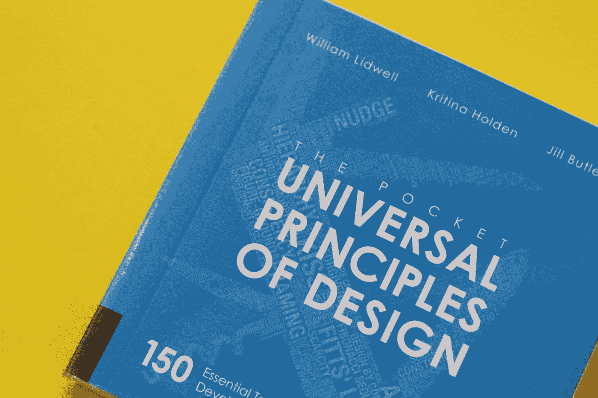
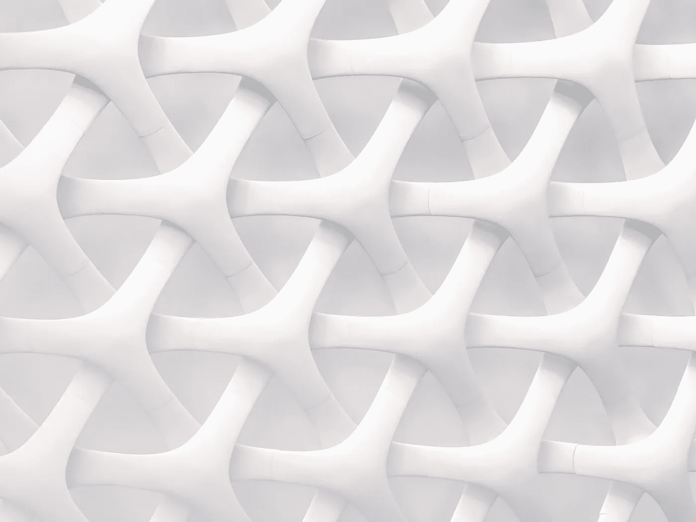

# 如何保持稳固——软件原则与模式

> 原文：<https://betterprogramming.pub/how-solid-remains-solid-software-principles-vs-patterns-c77c623a628b>

## 简单明了

Artem Kniaz 在 [Unsplash](https://unsplash.com/?utm_source=unsplash&utm_medium=referral&utm_content=creditCopyText) 上拍摄的照片

上次，我们讨论了依赖倒置&和依赖注入之间的[差异。两者都是重要的概念，可以帮助我们构建更好的软件。然而，一个关键的区别是依赖注入是一种模式，而依赖倒置是一种原则。](/straightforward-simple-dependency-inversion-vs-dependency-injection-7d8c0d0ed28e)

今天我们将讨论为什么这是一个重要的区别。

# 什么是原则？

原则是根本真理。它们是人们建立更复杂的系统和理论的基础。说到创造新事物，原则是至关重要的。它们让我们能够[实现指数级的结果](https://fs.blog/first-principles/)，通过新的和以前没有想到的方式连接这些点。原则是世界不断变化的解药，这种变化似乎正在加速。
原则的例子可以在生活的各个领域找到:

*   在软件工程中，我们有[坚实的设计原则](https://en.wikipedia.org/wiki/SOLID)。
*   在心理学中，我们有[快乐原则](https://en.wikipedia.org/wiki/Pleasure_principle_(psychology))。
*   在物理学中，我们有[运动原理](https://en.wikipedia.org/wiki/Newton%27s_laws_of_motion)。

照片由[丹清除](https://unsplash.com/@danclear?utm_source=unsplash&utm_medium=referral&utm_content=creditCopyText)上的 [Unsplash](https://unsplash.com/s/photos/principle?utm_source=unsplash&utm_medium=referral&utm_content=creditCopyText)

# 什么是模式？

简单地说，模式是以可预测的方式重复自身的东西。
我们的大脑非常善于识别模式。不仅如此，通过使用归纳思维，他们善于预测这些模式意味着什么。
模式的例子也可以在生活的各个领域找到:

*   在软件工程中，我们有[设计模式](https://en.wikipedia.org/wiki/Software_design_pattern)。
*   在时装业，我们有[图案作为模板](https://en.wikipedia.org/wiki/Pattern_(sewing))。
*   在自然界中，我们有对称、分形等[视觉模式](https://en.wikipedia.org/wiki/Patterns_in_nature)。

照片由 [JJ 英](https://unsplash.com/@jjying?utm_source=unsplash&utm_medium=referral&utm_content=creditCopyText)在 [Unsplash](https://unsplash.com/s/photos/pattern?utm_source=unsplash&utm_medium=referral&utm_content=creditCopyText) 上拍摄

# 为什么你应该依靠原则

我们都在寻找可以依赖的稳定的东西，一些超越背景和不断变化的技术的潜在真理。好了，别再看了，原则正是我们所需要的。

人类对食物的需求是一个原则。(除了[呼吸者](https://en.wikipedia.org/wiki/Inedia)，他们声称靠空气和阳光生存)。你可以相信这是一条公理，只要人类还是人类，它就不会改变。

相比之下，人类对披萨的需求是一种模式。如果你走在年轻人中间，尤其是年轻的软件工程师，这几乎就像是一个原则——披萨很棒，它肯定是人类的基本需求。然而，就像其他模式一样，我们对比萨饼的普遍喜爱也是受环境影响的。如果你在节食，比萨饼很快就会变成一种反模式——无论如何都要避免。

# 软件工程原理

在软件工程的世界里，当设计软件时，我们也有原则作为我们的路标。

以依赖倒置为例。这是[坚实](https://en.wikipedia.org/wiki/SOLID)的 5 个核心原则的一部分。简而言之——这意味着我们应该依赖抽象，而不是具体的实现。这个原则帮助我们设计健壮的可维护软件。没有上下文会迫使我们更喜欢具体的实现而不是抽象，因为使用抽象的成本可以忽略不计，而具体实现的成本可能是无限的。

# 软件工程中的模式

软件工程的世界也充满了模式，其中一些被认为是“不好的”，我们倾向于称之为“反模式”，其中最令人难忘的是可怕的“意大利面条代码”。而有些被认为是“好的”，我们简单地称它们为“设计模式”。

反模式被认为是糟糕的实践，是通向无尽麻烦和错误的道路，是没有经验的工程师的标志。无论如何都要避免它们。它们仍然被认为是模式，因为它们的发生是可以预测的，特别是对于没有经验的工程师。在“意大利面条式代码”的例子中，它只是思维混乱的一种表现，当试图在没有事先计划或经验的情况下解决问题时，这种情况往往会自然发生。

设计模式被认为是很好的实践——使用我们作为软件工程师的集体经验来寻找常见问题的优雅解决方案。问题是，有时甚至“好”模式也可能被误用，潜在地将它们变成反模式。

# 设计模式——好的、坏的和可能的

卡罗琳·霍尔在 [Unsplash](https://unsplash.com/s/photos/maybe?utm_source=unsplash&utm_medium=referral&utm_content=creditCopyText) 上的照片

有很多设计模式的例子，但是根据经验，一个好的设计模式根植于设计原则。
例如，依赖注入是一个伟大的设计模式，它允许我们将创建和使用分开。它减少了耦合，改进了测试，并且植根于设计原则——它是依赖倒置原则的实现。

然而，有些模式并没有被普遍接受，主要是因为它们没有深深植根于设计原则中。例如，让我们来看看单例模式。大多数人认为它是一种有用的设计模式。它用于只需要一个类实例的情况，拥有多个实例是有害的。当我们想要为一个缓存、一个配置文件或一个记录器创建一个单独的实例时，这种模式非常方便。

然而，有些人认为它是一种反模式。一个常见的说法是，模式违反了单一责任原则(实线中的 S ),因为它控制了它的生命周期，并在自身上强制执行单一实例行为。在我看来，这并不准确，因为实例控制与功能是正交的，而 SRP 指的是功能。更合理的说法是，单例违反了依赖倒置原则，因为您依赖于具体的实现——通过具体的静态方法访问单例，而不是依赖抽象。这导致了紧密耦合，这使得我们的代码更难维护，如果发生变化，更容易出现错误。这并不是说单例模式本质上是不好的，但是如果它看起来违反了原则，那么在实现它之前你应该小心。

# 我们今天学到了什么

在软件工程中，就像在生活中一样，我们有模式和原则。发现模式并使用它们来解决常见的问题是非常有益的。然而，没有深深扎根于原则的模式可能会变成反模式——导致比它们解决的问题更多的问题。

下次你发现自己在学习一个新的设计模式，或者甚至想要实现一个现有的模式时，问问自己——这个模式植根于可靠的(双关语)设计原则吗？或者，它可能会导致不可预见的问题吗？

我希望这篇文章对你有用，在下一次之前，保持它简单明了！