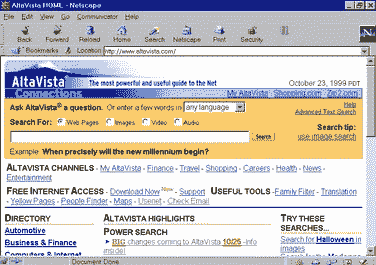

# 静态网站如何随着时间的推移转变为网络应用

> 原文：<https://betterprogramming.pub/how-static-websites-transformed-into-web-applications-over-time-23ed4903183>

## 过去几十年来 web 开发的发展简史，以及我作为一名年轻的开发人员是如何经历的


由 [Cottonbro](https://www.pexels.com/@cottonbro) 在[像素](https://www.pexels.com/photo/man-in-white-crew-neck-shirt-wearing-black-framed-eyeglasses-5474025/)上拍摄的照片。

我记得当我还是个小男孩的时候，我第一次用拨号上网的确切位置。那一定是在 1993 年左右 HTML 最初发布的那一年。

*互联网是全新的。*

只有少数网站可以使用我的语言，我记得我访问了我们国家最大的足球队的网站。我很惊讶，意识到我正在看的内容来自其他地方。当我还年轻的时候，我就明白这有可能变得巨大。

我当时不知道自己有多正确，互联网后来成为了我职业生涯的基础:

[](/my-everyday-struggles-as-a-senior-developer-34e8393de1a8) [## 作为一名高级开发人员，我每天都在挣扎

### 一个有经验的开发人员的职业生涯并不总是充满阳光和玫瑰

better 编程. pub](/my-everyday-struggles-as-a-senior-developer-34e8393de1a8) 

显然，我看的内容非常简单。它是静态的，几乎没有应用任何样式，而且下载要花很长时间。那个时候，我们当中没有耐心的人是不会浏览网站的。但我很着迷，现在也是。

那些日子的网站 HTML 文件的一个小集合——在我看来已经转变为技术奇迹:由大量技术、框架和基于云的解决方案驱动的具有无限可能性的动态 web 解决方案。

但这不是一夜之间发生的。

网站和 web 应用的区别是什么？在过去的几十年里，这种进步是如何发生的？

我相信每个(有抱负的)web 开发人员至少应该对这种发展有一个简单的了解。在这篇文章中，我将告诉你 web 技术是如何进步的，我是如何经历的。

让我们来看看！

# HTML (1993 年)

引子里的小男孩(也就是我)很快开始自己创建网站。我学习了 HTML，可以在屏幕上呈现内容。但是它非常有限。

想象一下，你所能做的就是打开一个像 Word 这样的文本编辑器，写一些文本，并添加一些标题。很公平，也许还有一两张照片。你甚至可以在那时变得有点疯狂，添加[水平线](https://developer.mozilla.org/en-US/docs/Web/HTML/Element/hr)或[闪烁文本](https://developer.mozilla.org/en-US/docs/Web/HTML/Element/blink)。然后，您可以将该文档保存为 HTML 文件，并手动上传到服务器。如果您有多个文件，您可以通过向页面添加锚元素来确保用户可以在它们之间导航。这几乎是你唯一可以增加的互动:

```
<a href="about.html">about</a>
```

我很快意识到，当您将文档保存为 HTML 文件时，可以查看由文本编辑器生成的 HTML 代码，并且可以直接操作这些代码。我体内的程序员就是这样诞生的。

那是在 1994 年左右，我(以及当时的其他 web 开发人员)非常希望能够给我的文档添加更多样式。他们需要看起来更好。幸运的是，CSS 就在眼前。


照片由[凯拉·霍泽尔](https://unsplash.com/@keilahoetzel?utm_source=medium&utm_medium=referral)在 [Unsplash](https://unsplash.com?utm_source=medium&utm_medium=referral) 拍摄。

# CSS (1996 年)

突然间，我们可以设计元素了。到处都出现了颜色和边框……看起来很可怕。当时没有人是网页设计师，人们(包括我自己)对自己在做什么一无所知。

想象一下，从今天起，把所有好看的网站都拿走，剥去它们的造型，让一群小孩子用几桶颜料和小刷子自由地给它们上色。那时候互联网就是这个样子。太可怕了。

另一方面，这也是一种进步。颜色和创意总比没有造型好，不管它看起来怎么样。随着时间的推移，每个人都变得越来越擅长。图像也开始成为一件大事。它们无处不在(例如作为背景和按钮)。

像 Photoshop 和 Fireworks 这样的程序甚至可以让你创建完整的网站，方法是绘制它们，然后将它们分割成一大组小图像，这些小图像可以用作 DIV 元素的背景。他们会吐出生成的 HTML，其样式可以正确定位图像，但我必须说结果仍然很糟糕。

然而，我更关注接下来会发生什么——其他人也一样。

# JavaScript (1995 年)

在谈论这项真正改变了网络的技术之前，我想提一下，当时还不可能用谷歌搜索解决方案。在 1997 年谷歌搜索出现之前，最流行的搜索引擎是 AltaVista:



在谷歌之前，有 AltaVista(来源:[维基百科](https://en.wikipedia.org/wiki/AltaVista#/media/File:Altavista-1999.png))

但是关于网络开发，几乎没有什么内容可找。你只能靠自己了。阅读书籍和查看其他网站的源代码是学习的唯一途径。如果你还没有意识到的话，我们现在已经被这个[信息时代](https://en.wikipedia.org/wiki/Information_Age)宠坏了！

我就不说 JavaScript 的全部历史了。也许可以说，在 2004 年 Mozilla 发布 Firefox 浏览器之后，事情开始加速(尽管事实上 JavaScript 在 1995 年左右就已经出现了)，JavaScript 获得了牵引力。

JavaScript 使得网站的交互性和动态性成为可能，有一件事尤其加速了这一过程:从网页中远程获取数据，而无需重新加载页面。这种现象被称为 AJAX(感谢[杰西·詹姆斯·加勒特](https://en.wikipedia.org/wiki/Jesse_James_Garrett))，你们当中那些已经走了一段时间的人可能对这个术语很熟悉。

# JavaScript 库(2006)

流行的库如 jQuery、Prototype 和 MooTools 出现了，网络慢慢地但肯定地变得交互式。数据可以随时获取，DOM 可以随时操纵。可能性是无限的。

但是有一个问题:所有的大玩家(比如谷歌、微软和雅虎)都有自己的 JavaScript 愿景。幸运的是，他们决定在奥斯陆见面——离我家不远。结果是 ECMAScript(第五版):一个于 2009 年发布的 JavaScript 标准。

很长一段时间，jQuery 是使用 JavaScript 的黄金标准。如果您是一名 web 开发人员，那么您很有可能在代码中使用 jQuery。它成为了自己的生态系统。历史上有一段时间，我认为自己是一个 jQuery 忍者。

但是开发者想要的越来越多。他们开始编写如此复杂的 JavaScript 代码(使用或不使用 jQuery ),并创建了如此高度互动的网站，以至于很难编写整洁有序的代码。

所以是时候让框架登场了。

# JavaScript 框架(2010)

框架开始一个接一个地出现。每个人都想分一杯羹，每个人都知道什么是最好的。大约在 2010 年，AngularJS 出现了，随后很快出现了一些框架，这些框架在随后的几年里也变得很受欢迎:React (2013)，Vue.js (2014)，以及一个名为 AngularJS 的完整重写版本(2016)。

所有的问题都解决了，每个人都很开心，对吗？

不完全是。

您可以用这些框架创建的 SPAs(单页应用程序)很快变得臃肿和笨重。另一个问题是搜索引擎优化:搜索引擎不理解这些应用程序(除非你采取预防措施，否则它们仍然在努力索引它们)。考虑到由于较大的包大小而导致的较长的加载时间，社区不得不提出替代的开发方法。

# 静态网站生成(2015)

像 React 这样的框架使得基于组件的开发成为可能，在这一点上仍然非常流行。所以我们看到了两个基于 React 的静态站点生成器的出现:Gatsby (2015)和 Next.js (2016)。

开发周期与您使用由 CRA (Create React App)等工具创建的样板代码非常相似，但有一个显著的区别:当您构建(最终确定)项目时，会生成静态 HTML 和 CSS(这是对实际情况的简化，因为还有大量动态特性，但出于本文的考虑，它将成立)，并且您可以在您的服务器上部署它。

至此，我们又回到了起点:我们再次部署静态 HTML 和 CSS 文件！我们回到了 1995 年…


照片由 Flickr 上的流行文化极客网络拍摄。

# 最后的想法

正如您所读到的，开发人员和社区永远不会满意。他们会一直寻找更好的解决方案。有时候，创新是被接受的。其他时候，我们兜了一圈又回到起点。我不相信我们会永远幸福和满足。毕竟我们都是不同的:

[](/5-different-software-developer-personalities-that-ive-met-so-far-13784f3a8d4a) [## 到目前为止，我遇到了 5 种不同的软件开发人员

### 在工作场所有这么多种类的软件开发人员。以下是一些有趣的描述

better 编程. pub](/5-different-software-developer-personalities-that-ive-met-so-far-13784f3a8d4a) 

我意识到我在这篇文章中没有写太多关于服务器端动态站点生成的内容。有很多语言，如 ASP、Go、PHP 和 Python，允许开发人员生成动态网站。

但是这个话题应该有自己的文章。

感谢您的宝贵时间！