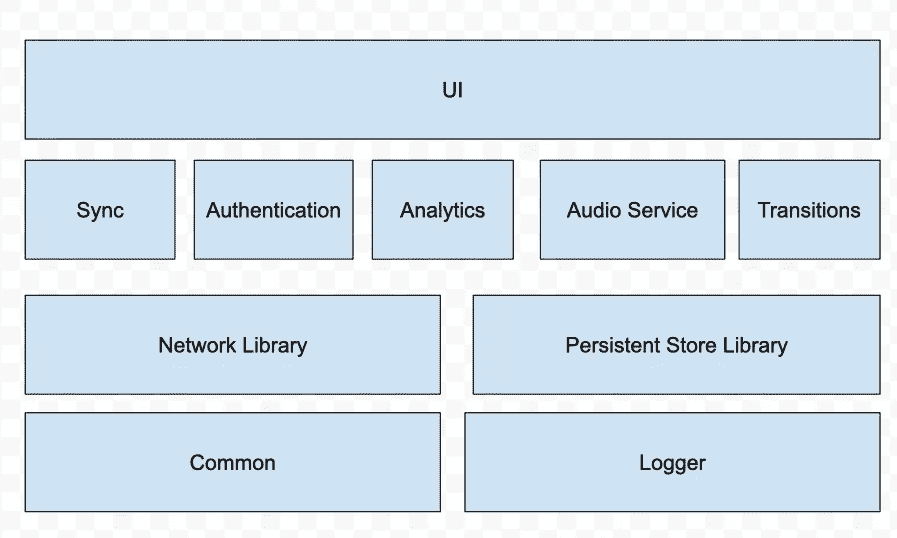
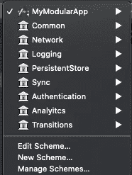
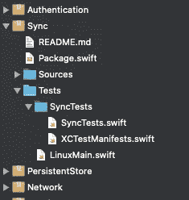
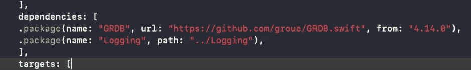

# Swift 软件包如何改变我构建应用的方式

> 原文：<https://betterprogramming.pub/how-swift-packages-changed-the-way-i-build-appsintroduction-fb4ade0f1cec>

## 在应用中创建包几乎和添加新文件夹一样简单

[马丁](https://unsplash.com/@mrtnpro?utm_source=unsplash&utm_medium=referral&utm_content=creditCopyText)在 [Unsplash](https://unsplash.com/s/photos/bricks?utm_source=unsplash&utm_medium=referral&utm_content=creditCopyText) 上的照片

# 介绍

尽管我们已经有依赖管理器好几年了，但是有了 [Swift 包管理器](https://swift.org/package-manager/) (SPM)，在你的应用中创建包就像添加新文件夹一样简单。将项目的一部分转换成包不仅仅是一种很好地组织代码的方法；它实际上改变了你工作和设计应用的方式。

这一切都始于我不得不将一个现有的大项目和一个功能移植到一个专用的应用程序。由于这个特性是基于底层代码的，比如网络、持久存储、分析和日志，我认为最好检查一下如何将这些部分转换成模块。

我计划:

*   将所有这些代码复制到新的应用程序中
*   在 Swift 包中组织代码
*   将这些包放回“母亲”应用程序中实现
*   将包放在 GitHub 中它们自己的仓库中，并共享代码

我知道在应用程序之间共享代码是一种长期维护它们的好方法。我没有意识到的是，即使没有把那些包放到 GitHub 上并共享，使用模块(包/Pods，无论你想怎么称呼它)也会给你的应用带来额外的价值。

# 玩乐高

大多数标准的 iOS 应用程序都是基于一个大的代码库和一些第三方库构建的。将代码组织成包会改变这一切。它让你的应用开发过程感觉像是在玩乐高积木。要不要一个基础一样但是 UI 不一样的 app？没问题，容易设置。您希望 today 小部件利用您创建的优秀日志记录机制吗？小菜一碟。一切都是模块化的，易于维护。

请看下图:

图片来源:作者

除了 UI，所有其他组件实际上都是包。该图还反映了它们之间的依赖关系。记录器和一些捆绑到公共库中的帮助方法是项目的底层。它们不依赖于任何东西，但是其他包需要它们。因此，我们有一个网络和持久存储包，它们需要公共模块和日志模块才能工作。

然后我们转向同步，这显然需要网络和持久存储，以及其他模块。

如果你在生活中建立了一个或两个应用程序，这个图表并不新鲜。大多数应用程序实际上都是这样构建的，但是是分组的。有了模块，就更清晰透明了。

# 模块使你的层界面更加清晰

因为你的应用程序的每个部分都是一个模块，构建模块的过程迫使你真正计划和设计它们之间的接口。你需要做出重要的设计决策，你需要决定哪些功能是公共的——哦，最后，它在你的应用程序内部有意义！—以及依赖关系是什么。通过查看上图，您可以看到您无法将分析包导入到持久性存储库中。我不确定这是否可能，但肯定这不是最佳实践。

实际上，不画图表，很难定义依赖关系，所以我们也赢得了…一个图表？

# 你现在有几个小问题，而不是大问题

这是动态编程的一部分。每个人都知道解决一个小问题比解决一个大问题容易。将你的应用拆分成小的模块可以让你更容易解决代码中的问题。

实际上你的 app 可以处于连编译都没有的状态(！)，并且您仍然可以处理特定的模块，编译它，编写测试，并进行任何您想要的修改。现在你的项目是由 SDK 构建的，你需要在你的应用程序的哪个部分工作也很清楚。

# 现在编译这么快，简直可笑

你知道当你做一个小的改变，然后你等待 30-40 秒来编译你的项目吗？嗯，那些日子(差不多)已经过去了。

正如我刚才提到的，你可以编译一个特定的模块，天啊，它太快了，你要再做一次，以确保确实发生了什么。编译特定的模块很容易:只需从“方案”弹出式菜单中选择它:

我不认为我需要解释为什么编译时间对你作为开发人员的日常生活有重大影响。再也回不去了。

# 现在测试一切都很简单，甚至是你的 Apple Watch 扩展

而这是上一点的延续:分离的好处不仅仅是编译时间，还有测试。

每个模块都有自己的测试:

事实上，测试位于执行代码的正下方，加上快速编译，鼓励你向你的应用程序(模块)添加大量的测试。见鬼，有时候这是检查你的模块工作的唯一方法，因为在很多情况下，你甚至在你的应用程序没有编译的时候就这么做了。

此外，这是测试苹果手表的唯一方法，通过它的模块。

实际的应用程序测试呢？现在你已经有了独立的模块，正在内部测试，你可以开始做一些叫做*集成测试*，也就是测试你的模块如何一起工作。

请记住，当您与另一个应用程序共享您的包时，它的测试也会随之进行。所以这是你可以保存的另一个东西，新应用的一些测试。

# 是的，共享代码很容易

毕竟，Swift 包的主要目的是在项目间共享代码。查看清单文件中的依赖关系:

你看到了吗？您可以将依赖项定义为本地包，或者从 Git 下载。您只需将您的包上传到 GitHub，更改清单，就大功告成了！

# SPM (Swift 包管理器)有其缺点

SPM 仍然有它的缺点:

*   您不能将任何资源文件添加到您的包中，甚至是 Xib 文件。这意味着必须从代码中构建 UI，并且基于核心数据构建持久存储库可能是一个问题，因为核心数据需要利用模型文件(尽管您可以以某种方式绕过它)。Swift 5.3 计划解决这一问题。
*   一个 Swift 包可以依赖于另一个 Swift 包，而不是 Pods 或您的应用程序代码。问题是，并不是所有的基本框架都支持 SPM，所以您需要使用委托或闭包来解决这个问题。

如果这些对您来说是大问题，还有其他创建 Swift 包裹的方法。

# 摘要

Swift Package Manager 还有一段路要走，要像 CocoaPods 或 T2 迦太基一样可用和有功能。但是 Xcode 11 让它变得如此简单，以至于不使用它没有任何意义。我写的一些东西也适用于椰子和迦太基；毕竟，原则是不变的。无论你使用什么，总是推荐用模块来构建你的应用程序

感谢阅读！