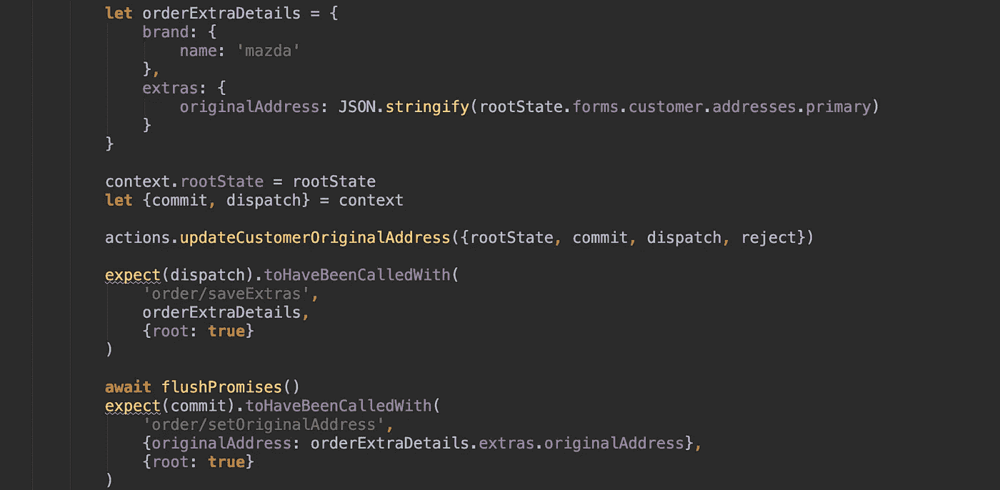
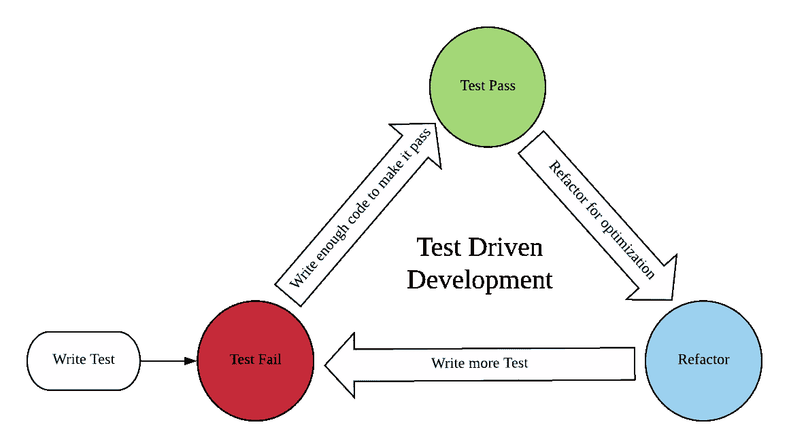

# TDD 如何改变我进行软件开发的方式

> 原文：<https://betterprogramming.pub/how-tdd-changed-the-way-i-approach-software-development-38509263f9ec>

## *先解决问题，* ***然后写测试，*** *然后写代码*



我已经写了五年的产品级代码，参加过大大小小的软件团队，也参与过一些个人项目。在这篇文章中，我想描述我在开始实践 TDD 之前和之后的软件开发经历。我曾经信奉“*先解决问题，再写代码”，*但是一年的 TDD 把我的信念变成了“*先解决问题，* ***再写测试，*** *再写代码”。有一个大型的开发社区在实践 TDD，我希望我能激励开发人员加入我们，开始实践 TDD，并学习一种新的方式来编写更干净、易于调试、变更-失败安全、测试驱动的代码。*

# 我是如何编码的

在 TDD 之前，我的大部分开发工作如下:

1.  团队收到一份吉拉门票的清单。
2.  团队在没有任何测试的情况下实现分配的任务**，并通过验证代码是否满足任务的验收标准来执行开发人员测试。**
3.  拉请求要经过代码审查。
4.  PR 被合并，然后 QA 将执行手动/自动化测试。
5.  有几轮错误修复和 QA 测试。
6.  代码被转移到生产中。

根据我的经验，我可以说，当团队没有围绕他们编写的代码的良好的、编写良好的测试套件时，任务的平均生产时间会随着代码库的增加而增加。有一些原则，比如可靠的设计，可以帮助你保持你的代码更少的[耦合](https://en.wikipedia.org/wiki/Coupling_(computer_programming))和更多的[内聚](https://en.wikipedia.org/wiki/Cohesion_(computer_science))，但是最终，如果没有一个好的测试套件，添加新的产品特性和维护当前特性的复杂性将会以一个微小的速度增加，并且在某个时刻，最终会使开发/发布过程变得非常缓慢。

这就是软件开发中“慢就是快”的说法失败的地方，因为如果没有一个好的测试套件，随着代码库规模的增加，检查整个代码库中任何更改的影响都变得非常困难和麻烦。这些影响可能被 QA 工程师忽略，并可能泄漏到生产环境中。如果 QA 工程师确实发现了开发人员遗漏的影响，那么修复的平均时间会增加，并且会增加几轮测试。

# TDD 来救援了

> **“测试驱动开发** ( **TDD** )是一个[软件开发过程](https://en.wikipedia.org/wiki/Software_development_process)，它依赖于一个非常短的开发周期的重复:需求被转化为非常具体的[测试用例](https://en.wikipedia.org/wiki/Test_case)，然后软件被改进以通过测试。”

我们来看一个例子，假设一个开发人员被分配了一个修补程序，他必须将日期格式从`‘*MMM DD, YYYY HH: mm A*’`(2019 年 8 月 10 日 08:30 PM)更改为“`MMM DD, YYYY`”(2019 年 8 月 10 日)。这些格式来自 [moment.js](https://momentjs.com/docs/#/displaying/) docs。

开发人员发现日期是由函数`formatShortDate` 格式化的，如下所示:

```
**export const** formatShortDate = (value) => {**if** (_.isEmpty(value)) **return** '' **return** moment.utc(value).local().format('MMM DD, YYYY HH:mm A')
}
```

开发人员将其更改为:

```
**export const** formatShortDate = (value) => {**if** (_.isEmpty(value)) **return** '' **return** moment.utc(value).local().format('**MMM DD, YYYY**')
}
```

这种改变只有一行，所以它被部署到生产环境中并修复了这个问题。部署之后，显示用户每天上午 9:00-下午 6:00 日程的另一个组件现在被破坏，用户看到的是没有时间的日期。因此需要另一个修补程序。


如果有一个好的测试套件集成到部署管道中，那么它会发现修补程序破坏了另一个组件，并且会被停止。损坏的组件可以在部署修补程序之前先修复。

针对上述功能的一个非常基本的单元测试如下所示:

可以捕获损坏组件(我认为该组件是 Vue 组件)的测试用例可以是:

当开发人员将格式从`'MMM DD, YYYY HH: mm A'` 更改为`'MMM DD, YYYY'`时，上面编写的两个测试用例都将失败，开发人员将知道该更改破坏了`UserScheduleWidget` 组件，然后可以采取必要的纠正措施。

# TDD 生命周期



**TDD 生命周期**

1.  **红色**:先写测试用例，让它失败。
2.  绿色:写足够的代码使测试通过。
3.  **重构:**对当前测试进行代码优化。

在这之后，添加更多的测试来增加代码覆盖率和处理更多的情况。理想情况下，如果您的代码覆盖率超过 90%,那么您的代码就被认为是变更失效安全的。

# **我学到的东西**

## **TDD 有助于减少开发时间**

你可以争辩说，如果我们写的测试代码多于实现代码，那么开发时间是如何减少的。嗯，企业项目不是六个月的项目，代码库随着新功能的增加而不断发展，随着每个功能的 bug 百分比的增加，生产一个功能的平均时间也不断增加。这就是 TDD 有助于保持上述两个指标受控或几乎恒定的地方。因此，这种测试优先的策略最初可能会导致开发时间减少 10–20 %,但在项目的后期阶段(通常在一年后)获得的好处是，有助于减少未来的开发时间，并有助于保持项目代码的低复杂性。

## **TDD 让我成为更好的开发人员**

在编写任何实现代码之前，您必须首先为它编写一个单元测试。单元测试是孤立工作的，你模仿外部依赖。给定一些输入，被测试的代码单元应该产生一些已知的输出。如果有，就通过了。否则，测试失败。编写可测试单元代码的这一方面帮助我理解了如何将大的组件分解成小的可测试代码单元，这是软件组合和解耦的重要部分。如果您正在编写 action，您应该能够在不呈现组件的情况下首先对其进行单元测试。如果您正在编写一个 UI 组件，那么您应该能够首先对它进行单元测试，而不需要在浏览器中实际加载 UI 组件，TDD 可以帮助您实现这一点。因此，这种测试优先的策略有助于您成为更好的开发人员。

## **TDD 帮你调试更快**

当您编写一个测试来驱动实际实现的代码时，那么只有当代码符合测试中的断言时，测试才会通过。如果您更改了实现，那么测试中的断言将会失败。因此，通过了解哪些测试失败了，您可以很容易地深入到错误的代码，并继续进行修复。没有 TDD，调试变得很痛苦，您必须花费大量时间使用标准的调试方法，例如在开发人员工具中设置断点或者将 console.log 添加到代码中。因此，TDD 帮助您轻松调试。

# TLDR

这个测试优先策略改变了我写代码的方式。现在，我首先考虑可以驱动我正在处理的任务的实际实现的测试。这种改变确实需要一段时间，但是它可以帮助您编写可管理的、可测试的和防变更失败的代码。如果你是一个没有实践 TDD 的开发人员，我希望这篇文章能激励你去阅读更多关于它的内容，并亲自尝试一下。如果你坚持一段时间，你也会看到你对待软件开发方式的不同。

如果你喜欢这首曲子，我希望你能按下拍手按钮👏因此其他人可能会偶然发现它

确保贵族阶层不断壮大是学者的职责。——**——*阿萨婆吠陀***